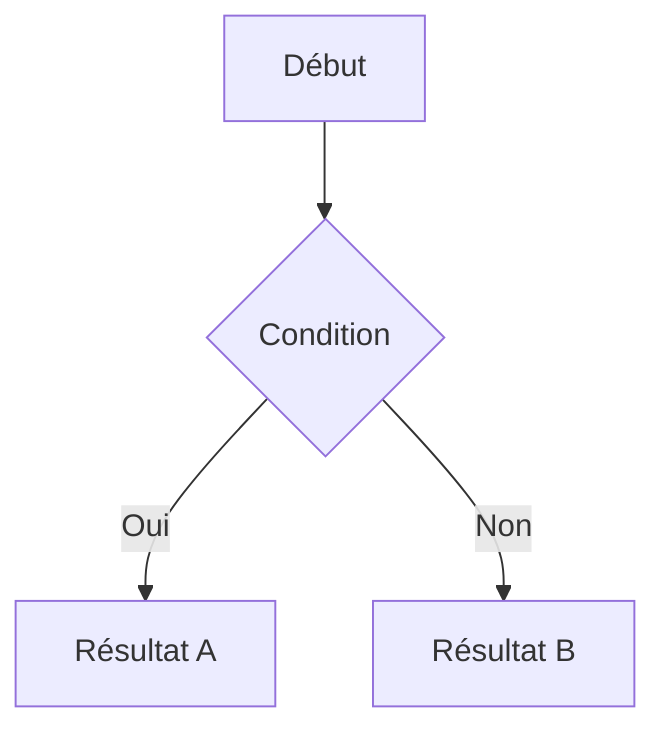

# Syntaxe MkDocs Material — Référence Rapide

## Extensions activées dans ce projet

Ce projet utilise `mkdocs-material` avec les extensions suivantes (voir `mkdocs.yml`) :

| Extension | Syntaxe | Usage |
|-----------|---------|-------|
| `admonition` | `!!! type` | Blocs d'avertissement/conseil |
| `pymdownx.tabbed` | `=== "Tab"` | Contenu à onglets |
| `pymdownx.superfences` | ` ```mermaid ` | Diagrammes Mermaid + code |
| `pymdownx.details` | `??? type` | Sections repliables |
| `pymdownx.keys` | `++ctrl+s++` | Raccourcis clavier |
| `pymdownx.emoji` | `:material-github:` | Icônes Material/FontAwesome |
| `attr_list` | `{ .classe }` | Attributs HTML sur éléments |
| `md_in_html` | `<div markdown>` | Markdown dans HTML |

## Admonitions

Syntaxe complète avec les types valides pour ce projet :

```markdown
!!! note "Titre optionnel"
    Contenu de la note. L'indentation est obligatoire (4 espaces).

!!! tip "Astuce"
    Conseil pratique.

!!! info "Information"
    Note informative.

!!! warning "Attention"
    Point de vigilance.

!!! danger "Danger"
    Risque critique à signaler.

!!! example "Exemple concret"
    Démonstration pratique.

!!! question "À retenir"
    Question ou récapitulatif.

!!! success "Bonne pratique"
    Ce qu'il faut faire.

!!! failure "Mauvaise pratique"
    Ce qu'il ne faut pas faire.
```

### Sections repliables (details)

```markdown
??? tip "Contenu facultatif — cliquer pour déplier"
    Ce contenu est masqué par défaut.

???+ warning "Déplié par défaut"
    Ce contenu est visible dès le chargement.
```

## Onglets (Tabbed content)

Toujours utiliser pour les comparaisons IntelliJ / VS Code :

```markdown
=== "IntelliJ IDEA"
    Contenu spécifique IntelliJ.

=== "Visual Studio Code"
    Contenu spécifique VS Code.
```

Règles :
- Indentation obligatoire sous chaque onglet (4 espaces)
- Les onglets séquentiels dans un document sont indépendants
- Les labels doivent être cohérents sur toute la page ("IntelliJ IDEA" et "Visual Studio Code" — pas d'abréviations)

## Badges CSS personnalisés

Classes disponibles dans `docs/stylesheets/extra.css` :

```html
<!-- Niveau de difficulté -->
<span class="badge-beginner">Débutant</span>
<span class="badge-intermediate">Intermédiaire</span>
<span class="badge-expert">Expert</span>

<!-- IDE concerné -->
<span class="badge-vscode">VS Code</span>
<span class="badge-intellij">IntelliJ</span>
```

Placer ces badges **immédiatement après le titre H1**, sur une ligne dédiée, avant tout autre contenu.

## Diagrammes Mermaid

```markdown

```

Types de diagrammes courants dans ce projet :
- `graph TD` — graphe de haut en bas
- `graph LR` — graphe de gauche à droite
- `sequenceDiagram` — diagrammes de séquence
- `flowchart` — alias de graph

## Raccourcis clavier

```markdown
++ctrl+shift+p++    → Palette de commandes
++tab++             → Accepter suggestion
++alt+backslash++   → Déclencher suggestion
```

## Icônes Material

Utiliser la syntaxe `:material-nom:` ou `:fontawesome-brands-nom:` :

```markdown
:material-github:           → Icône GitHub
:material-lightning-bolt:   → Éclair (vitesse)
:material-brain:            → Cerveau (IA)
:material-shield-check:     → Bouclier (sécurité)
:material-code-tags:        → Balises code
:fontawesome-brands-github: → Logo GitHub FA
```

## Tableaux

Format standard avec alignement :

```markdown
| Critère | IntelliJ | VS Code |
|---------|:--------:|:-------:|
| Valeur  | Oui      | Non     |
```

Centrer `:---:` pour les valeurs booléennes/comparatifs. Aligner à gauche par défaut pour le texte.

## Liens boutons (page d'accueil)

```markdown
[Texte du bouton](chemin/vers/page.md){ .md-button .md-button--primary }
[Bouton secondaire](chemin/vers/page.md){ .md-button }
```

## Style des liens — visibilité et accessibilité

Les **liens de contenu** sont stylisés pour être **clairement visibles** sans agresser la vue. Le style est défini dans `docs/stylesheets/extra.v2.css` :

### Aparence des liens

- **Couleur** : bleu soutenu (thème clair) ou bleu prononcé (thème sombre)
- **Pas de soulignement permanent** pour rester sobre
- **Soulignement au survol et au focus clavier** pour clarifier l'interaction
- **Focus ring visible** pour l'accessibilité clavier

### Raison du style

Les liens doivent être :
1. **Distincts du texte normal** — couleur plus foncée et saturée
2. **Discrets en repos** — pas de surcharge visuelle
3. **Clairs à l'interaction** — soulignement et retours visuels
4. **Accessibles** — focus clavier évident, contraste WCAG AA

### Ne pas modifier

🚫 **Ne pas changer les couleurs ou le style des liens** à la main dans le Markdown. Le style global est centralisé dans la feuille CSS pour garantir la cohérence sur tout le site.

Si tu remarques que les liens ne sont **pas assez visibles** ou trop visuellement intrusifs, **modifie seulement** les variables CSS dans `docs/stylesheets/extra.v2.css` :

```css
[data-md-color-scheme="default"] {
  --doc-link-color: #0052cc;        /* couleur du lien */
  --doc-link-hover-color: #003fa8;  /* couleur au survol */
  --doc-link-visited-color: #5a3a7d; /* couleur visitée */
}
```

C'est à jour maintenant pour toutes les pages ! 🎨

## Ancres et liens internes

```markdown
[Lien vers une section](#nom-de-la-section)
[Lien vers une page](../chapitre-2-parametrage/index.md)
[Lien absolu depuis docs/](chapitre-3-contexte/concepts.md)
```

## Structure standard d'une page de documentation

```markdown
# Titre de la Page

<span class="badge-beginner">Débutant</span> <span class="badge-vscode">VS Code</span>

## Introduction courte (2-3 phrases max)

Texte d'introduction.

---

## Première section

Contenu...

!!! tip "Conseil pratique"
    ...

---

## Deuxième section

=== "IntelliJ IDEA"
    ...

=== "Visual Studio Code"
    ...

---

## Résumé / Points clés

- Point 1
- Point 2
```
