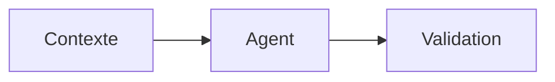

# MkDocs Material — conventions du projet

Avant d'utiliser une extension, vérifier `mkdocs.yml` : c'est la source de vérité sur la configuration active.

## Structure minimale

```markdown
# Titre de la page

<span class="badge-intermediate">Intermédiaire</span>

Introduction courte.

---

## Section

Contenu.
```

Les badges sont optionnels lorsqu'ils n'apportent aucune information utile.

## Admonitions

```markdown
!!! tip "Astuce"
    Conseil actionnable.

!!! info "Information"
    Contexte utile.

!!! warning "Attention"
    Point de vigilance.

!!! danger "Danger"
    Risque important.

!!! example "Exemple"
    Exemple concret.
```

Pour une section repliable :

```markdown
??? tip "Détails"
    Contenu masqué par défaut.
```

Ne pas transformer chaque paragraphe en admonition.

## Onglets

Utiliser les onglets lorsque deux procédures sont réellement parallèles :

```markdown
=== "IntelliJ IDEA"
    Procédure IntelliJ.

=== "Visual Studio Code"
    Procédure VS Code.
```

Le dépôt n'impose plus une comparaison IntelliJ/VS Code à toutes les pages : un workflow Claude CLI, MCP ou CI peut être documenté sans onglet IDE.

## Code

Toujours indiquer le langage quand il est connu :

````markdown
```json
{
  "example": true
}
```
````

Pour les commandes Claude Code, Git ou MkDocs, préférer un bloc `bash`, `powershell` ou `text` selon le contenu.

## Mermaid

````markdown

```mermaid
graph LR
    A[Contexte] --> B[Agent]
    B --> C[Validation]
```
````

Un diagramme doit clarifier une relation ou un workflow ; ne pas dupliquer visuellement une liste triviale.

## Badges disponibles

```html
<span class="badge-beginner">Débutant</span>
<span class="badge-intermediate">Intermédiaire</span>
<span class="badge-expert">Expert</span>
<span class="badge-vscode">VS Code</span>
<span class="badge-intellij">IntelliJ</span>
<span class="badge-cli">CLI</span>
```

Vérifier les classes réellement définies dans les feuilles CSS avant d'en introduire une nouvelle.

## Liens internes

```markdown
[Page voisine](../chapitre-4-contexte/index.md)
[Section de la page](#section-de-la-page)
```

Après toute modification de chemin/titre :

```bash
python -m mkdocs build --strict
python scripts/validate-links.py
```

Le validateur contrôle aussi les fragments `#anchor` générés.

## Images

```markdown

```

Suivre `CONTRIBUTING-SCREENSHOTS.md` pour les captures. Ne pas présenter une capture ancienne comme interface actuelle sans contexte.

## Styles

Le style global appartient aux fichiers sous `docs/stylesheets/`. Ne pas introduire de style inline pour contourner la feuille globale sans raison documentée.

## Claude et Copilot

La syntaxe MkDocs est indépendante de l'assistant. Dans les exemples de contenu, utiliser Claude Code comme parcours principal pour les pages génériques et réserver les exemples Copilot aux pages/sections explicitement identifiées comme références Copilot.
