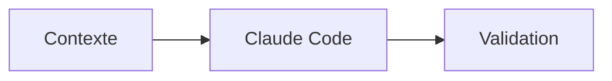

# Syntaxe MkDocs Material — référence du projet

Toujours vérifier `mkdocs.yml` avant d'utiliser une extension : cette page résume les patterns courants mais la configuration du site reste la source de vérité.

## Admonitions

```markdown
!!! tip "Astuce"
    Conseil actionnable.

!!! warning "Attention"
    Point de vigilance.
```

## Onglets

```markdown
=== "IntelliJ IDEA"
    Contenu JetBrains.

=== "Visual Studio Code"
    Contenu VS Code.
```

À utiliser uniquement quand les procédures diffèrent réellement.

## Code

````markdown
```python
print("exemple")
```
````

Spécifier le langage quand il est connu.

## Mermaid

````markdown

````

## Badges disponibles

```html
<span class="badge-beginner">Débutant</span>
<span class="badge-intermediate">Intermédiaire</span>
<span class="badge-expert">Expert</span>
<span class="badge-vscode">VS Code</span>
<span class="badge-intellij">IntelliJ</span>
<span class="badge-cli">CLI</span>
```

Vérifier la feuille CSS avant d'introduire une nouvelle classe.

## Liens

```markdown
[Contexte & personnalisation](../../../chapitre-4-contexte/index.md)
[Section locale](#section-locale)
```

Les chemins exacts dépendent du fichier courant : ne recopier aucun exemple sans vérifier sa profondeur.

## Images

```markdown

```

Respecter `CONTRIBUTING-SCREENSHOTS.md`.

## Validation

```bash
python -m mkdocs build --strict
python scripts/validate-links.py
```

Le validateur vérifie les chemins et ancres HTML internes du site généré.
