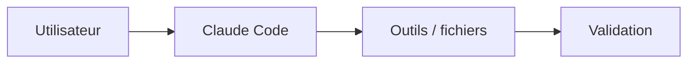

# Patterns de documentation — exemples

## Page Claude Code générique

```markdown
# Nom de la fonctionnalité

<span class="badge-intermediate">Intermédiaire</span>

Description de l'objectif utilisateur.

---

## Fonctionnement

Explication factuelle et durable.



---

## Configuration

```json
{
  "example": true
}
```

---

## Vérification

Décrire une preuve reproductible : commande, test, build ou état UI observé.

---

## Limites

!!! warning "À vérifier selon version"
    Documenter ici les limites réellement confirmées.
```

## Page de référence Copilot

Une page dédiée à Copilot peut rester centrée sur Copilot, mais doit le dire clairement et éviter d'être utilisée comme modèle universel pour les pages génériques.

```markdown
# GitHub Copilot — [Sujet]

Cette page est une référence Copilot conservée dans un dépôt Claude-first.

## Procédure

...

## Équivalent / différence Claude Code

Lien vers la page Claude pertinente lorsque cela aide la migration.
```

## Comparaison IDE

Utiliser seulement lorsque l'IDE change réellement la procédure :

```markdown
=== "IntelliJ IDEA"
    Procédure observée dans JetBrains.

=== "Visual Studio Code"
    Procédure observée dans VS Code.
```

Ne déclarer aucun IDE « meilleur » ou « plus sûr » par défaut ; comparer des fonctions et surfaces de contrôle vérifiables.

## Tutoriel

Un tutoriel doit fournir : prérequis, étapes reproductibles, résultat attendu et vérification finale. Éviter les estimations de durée universelles.

```markdown
# Tutoriel — Objectif

## Prérequis

- Élément nécessaire

## Étape 1 — Action

...

## Vérification finale

```bash
commande-de-verification
```
```

## Cas d'usage langage/framework

Pour Java, Python, Node.js, React, etc. : partir du problème de développement, montrer le contexte fourni à Claude Code, la modification attendue et surtout la validation (tests/lint/build). Ne présenter un exemple Copilot que s'il apporte une comparaison explicite ou si la page est dédiée à Copilot.

## Sources

Pour tout comportement produit/version-sensible, terminer par des sources officielles pertinentes et une date de consultation lorsque cela apporte de la traçabilité.
