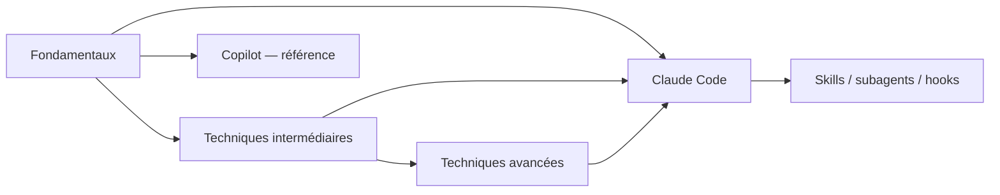

# Copilot — archives : Prompt Engineering

Extraits déplacés du parcours principal le **3 octobre 2026**. Les affirmations, exemples et dates de vérification sont ceux des pages d’origine ; ils ne constituent pas une nouvelle validation des fonctionnalités Copilot. Les passages comparatifs peuvent aussi citer Claude afin de conserver leur sens.

## Accueil { #page-chapitre-5-prompt-engineering-index }

Origine : [chapitre-5-prompt-engineering/index.md](../../chapitre-5-prompt-engineering/index.md).

<!-- Extrait original : chapitre-5-prompt-engineering/index.md:7 ; paragraphe -->

Les principes restent génériques aux LLM, mais ce dépôt les applique désormais en priorité à **Claude Code** : travail agentique sur un dépôt, contexte explicite, planification, vérification, skills et subagents. La page GitHub Copilot reste conservée comme référence spécifique.

<!-- Extrait original : chapitre-5-prompt-engineering/index.md:139 ; diagramme -->

<!-- Extrait original : chapitre-5-prompt-engineering/index.md:152 ; section dédiée -->

#### Références Copilot en annexe

Ces pages se trouvent dans **Annexe**, à la fin du menu de gauche.

- :material-github: **[Prompting avec GitHub Copilot — référence](../../chapitre-5-prompt-engineering/avec-copilot.md)**

    Débutant Intermédiaire

    Page conservée pour les complétions, Chat, instructions et workflows Copilot.

---

## Fondamentaux { #page-chapitre-5-prompt-engineering-fondamentaux }

Origine : [chapitre-5-prompt-engineering/fondamentaux.md](../../chapitre-5-prompt-engineering/fondamentaux.md).

<!-- Extrait original : chapitre-5-prompt-engineering/fondamentaux.md:5 ; paragraphe -->

Le prompt engineering consiste à donner à un modèle les **bonnes instructions, le bon contexte et un moyen de vérifier le résultat**. Dans ce dépôt, les exemples pratiques utilisent d'abord **Claude Code**, mais les principes restent valables pour Copilot et les autres assistants.

---

## Prochaine étape

Poursuivez avec **[Machine Learning](chapitre-6-machine-learning.md)**, la page suivante dans le menu.
