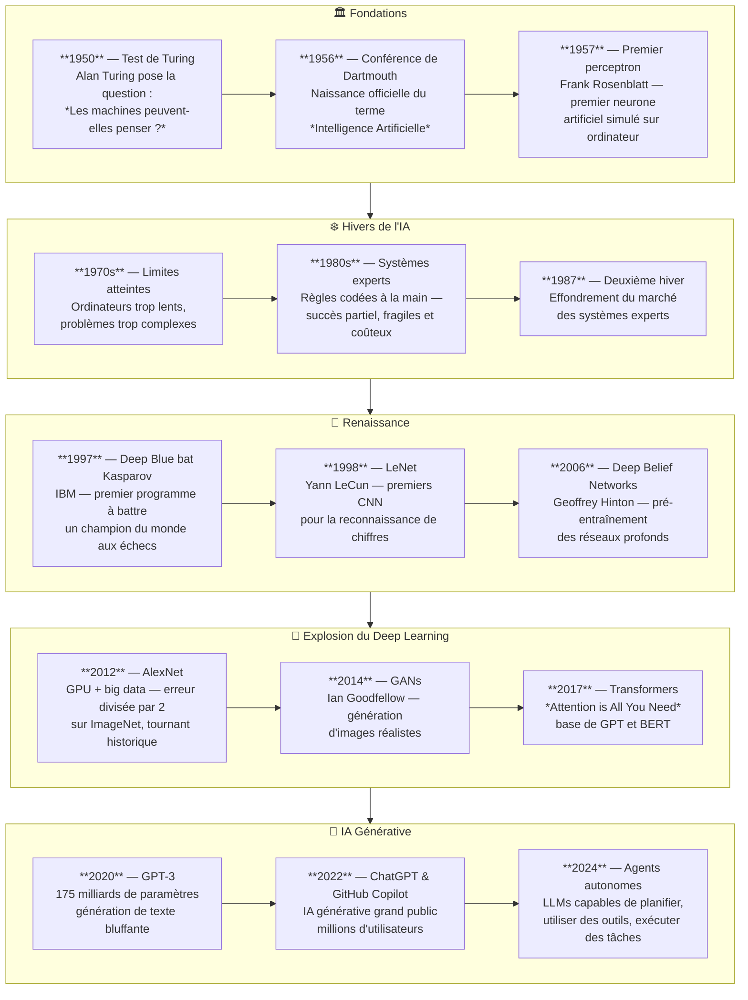

# Copilot — archives : Machine Learning

Extraits déplacés du parcours principal le **3 octobre 2026**. Les affirmations, exemples et dates de vérification sont ceux des pages d’origine ; ils ne constituent pas une nouvelle validation des fonctionnalités Copilot. Les passages comparatifs peuvent aussi citer Claude afin de conserver leur sens.

## Accueil { #page-chapitre-6-machine-learning-index }

Origine : [chapitre-6-machine-learning/index.md](../../chapitre-6-machine-learning/index.md).

<!-- Extrait original : chapitre-6-machine-learning/index.md:7 ; paragraphe -->

GitHub Copilot n'est pas retiré : son ancien workflow ML reste disponible comme **référence** pour les équipes qui l'utilisent encore ou qui y reviendraient plus tard.

<!-- Extrait original : chapitre-6-machine-learning/index.md:115 ; section dédiée -->

#### Copilot reste documenté

La page [Copilot pour le workflow ML](../../chapitre-6-machine-learning/copilot-workflow-ml.md) reste disponible et ne doit pas être supprimée. Elle sert de référence historique, comparative et opérationnelle si l'environnement Copilot redevient pertinent.

---

<!-- Extrait original : chapitre-6-machine-learning/index.md:127 ; section dédiée -->

#### Références Copilot en annexe

Ces pages se trouvent dans **Annexe**, à la fin du menu de gauche.

- :material-layers: **[Deep Learning](../../chapitre-6-machine-learning/deep-learning.md)**

    Réseaux de neurones, TensorFlow/Keras/PyTorch et validation des expériences.

- :material-github: **[Workflow ML avec Copilot — référence](../../chapitre-6-machine-learning/copilot-workflow-ml.md)**

    Ancien parcours Copilot conservé volontairement.

---

## Concepts Fondamentaux { #page-chapitre-6-machine-learning-concepts-fondamentaux }

Origine : [chapitre-6-machine-learning/concepts-fondamentaux.md](../../chapitre-6-machine-learning/concepts-fondamentaux.md).

<!-- Extrait original : chapitre-6-machine-learning/concepts-fondamentaux.md:35 ; diagramme -->

<!-- Extrait original : chapitre-6-machine-learning/concepts-fondamentaux.md:215 ; exemple ou liste -->

- [GitHub Copilot for data science](https://docs.github.com/en/copilot/using-github-copilot/using-github-copilot-for-data-science) - consulté le 2026-06-20

## Algorithmes Courants { #page-chapitre-6-machine-learning-algorithmes-courants }

Origine : [chapitre-6-machine-learning/algorithmes-courants.md](../../chapitre-6-machine-learning/algorithmes-courants.md).

<!-- Extrait original : chapitre-6-machine-learning/algorithmes-courants.md:218 ; encadré -->

!!! tip "Utiliser Copilot pour choisir"
    Décrivez votre problème à Copilot Chat : *"J'ai 10 000 observations avec 50 features numériques et je veux prédire une catégorie parmi 5. Quel algorithme sklearn recommandes-tu ?"* — Copilot suggère généralement Random Forest ou XGBoost avec justification.

<!-- Extrait original : chapitre-6-machine-learning/algorithmes-courants.md:226 ; exemple ou liste -->

- [GitHub Copilot for data science](https://docs.github.com/en/copilot/using-github-copilot/using-github-copilot-for-data-science) - consulté le 2026-06-20

## Claude Code pour le ML { #page-chapitre-6-machine-learning-claude-workflow-ml }

Origine : [chapitre-6-machine-learning/claude-workflow-ml.md](../../chapitre-6-machine-learning/claude-workflow-ml.md).

<!-- Extrait original : chapitre-6-machine-learning/claude-workflow-ml.md:211 ; paragraphe -->

Pour une expérience très centrée sur l'édition de cellules dans l'IDE, la page [Workflow ML avec Copilot](../../chapitre-6-machine-learning/copilot-workflow-ml.md) reste conservée comme référence.

<!-- Extrait original : chapitre-6-machine-learning/claude-workflow-ml.md:252 ; section dédiée -->

#### Référence Copilot conservée

La page **[Copilot pour le workflow ML](../../chapitre-6-machine-learning/copilot-workflow-ml.md)** n'est pas supprimée. Elle documente l'ancien parcours principal et reste utile si l'équipe revient à GitHub Copilot ou utilise les deux outils.

---

## Python & Data Science { #page-chapitre-6-machine-learning-python-data-science }

Origine : [chapitre-6-machine-learning/python-data-science.md](../../chapitre-6-machine-learning/python-data-science.md).

<!-- Extrait original : chapitre-6-machine-learning/python-data-science.md:246 ; section dédiée -->

#### Copilot

Les exemples historiques Copilot restent disponibles dans [Copilot pour le workflow ML](../../chapitre-6-machine-learning/copilot-workflow-ml.md). Ils ne sont pas supprimés : cette documentation reste utile pour comparaison ou retour futur à Copilot.

---

## Notebooks Jupyter { #page-chapitre-6-machine-learning-notebooks-jupyter }

Origine : [chapitre-6-machine-learning/notebooks-jupyter.md](../../chapitre-13-outils-economies/jupyter.md).

<!-- Extrait original : chapitre-6-machine-learning/notebooks-jupyter.md:7 ; encadré -->

!!! info "Copilot reste documenté"
    GitHub Copilot conserve une expérience notebook très intégrée dans VS Code. Une section dédiée en bas de page résume ce workflow ; elle est conservée comme référence.

<!-- Extrait original : chapitre-6-machine-learning/notebooks-jupyter.md:171 ; section dédiée -->

#### Référence GitHub Copilot

Copilot reste pertinent pour un workflow très centré sur la complétion **cellule par cellule** dans VS Code avec l'extension Jupyter. Les principes historiques restent valables :

- suggestions inline dans les cellules de code ;
- chat IDE ;
- génération à partir d'une cellule Markdown ou d'un commentaire ;
- commandes et contexte propres à l'intégration Copilot/VS Code.

Cette capacité est conservée dans la documentation car elle peut redevenir utile si l'équipe réactive Copilot. Le parcours principal du dépôt reste cependant Claude Code.

---

## MLOps & Déploiement { #page-chapitre-6-machine-learning-mlops-deploiement }

Origine : [chapitre-6-machine-learning/mlops-deploiement.md](../../chapitre-6-machine-learning/mlops-deploiement.md).

<!-- Extrait original : chapitre-6-machine-learning/mlops-deploiement.md:217 ; section dédiée -->

#### Copilot

Les anciens exemples Copilot/GitHub Actions ne sont pas supprimés du dépôt lorsque leur contenu reste utile. Le parcours principal est désormais Claude Code ; Copilot reste une référence secondaire et pourra être réévalué si son modèle de coût ou ses capacités changent.

---

## Comparaison Écosystèmes ML { #page-chapitre-6-machine-learning-comparaison-ecosystemes-ml }

Origine : [chapitre-6-machine-learning/comparaison-ecosystemes-ml.md](../../chapitre-6-machine-learning/comparaison-ecosystemes-ml.md).

<!-- Extrait original : chapitre-6-machine-learning/comparaison-ecosystemes-ml.md:5 ; paragraphe -->

Python, R et Julia peuvent tous être pertinents en Machine Learning et calcul scientifique. Le choix ne doit pas reposer sur des étoiles de « popularité », un supposé score Copilot ou des affirmations générales de performance : comparez les besoins du projet.

<!-- Extrait original : chapitre-6-machine-learning/comparaison-ecosystemes-ml.md:123 ; section dédiée -->

#### Copilot — référence

Les anciennes notes « support Copilot ⭐⭐⭐⭐⭐ » ont été supprimées car elles n'étaient pas basées sur un benchmark reproductible. Copilot reste documenté comme outil séparé dans les chapitres de référence.

---

## Comparaison des Outils { #page-chapitre-6-machine-learning-comparaison-outils }

Origine : [chapitre-6-machine-learning/comparaison-outils.md](../../chapitre-13-outils-economies/frameworks-ml.md).

<!-- Extrait original : chapitre-6-machine-learning/comparaison-outils.md:5 ; paragraphe -->

Le choix d'un outil dépend du type de problème, du code existant, du runtime de production et de l'équipe. Les anciennes notes en étoiles et « support Copilot » ont été retirés : elles ne mesuraient rien de reproductible.

<!-- Extrait original : chapitre-6-machine-learning/comparaison-outils.md:134 ; section dédiée -->

#### Copilot — référence

Le fait qu'un outil possède beaucoup d'exemples publics ne permet pas de conclure à un « support Copilot 5/5 ». Ces scores ont été supprimés. Les usages Copilot restent couverts par les pages dédiées.

---

---

## Prochaine étape

Poursuivez avec **[Deep Learning & Réseaux de Neurones](chapitre-8-deep-learning.md)**, la page suivante dans le menu.
