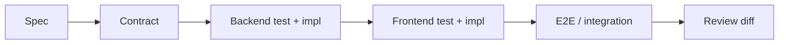

# Node.js & React — workflow full-stack avec Claude Code

Un dépôt full-stack gagne à garder les contextes **frontend** et **backend** explicites tout en partageant les contrats utiles. Claude Code peut naviguer entre les deux, mais il doit éviter de mélanger leurs commandes, dépendances et règles.

---

## Structure recommandée

```text
repo/
├── CLAUDE.md
├── backend/
│   ├── CLAUDE.md
│   ├── package.json
│   └── src/
├── frontend/
│   ├── CLAUDE.md
│   ├── package.json
│   └── src/
└── shared/
    └── contracts/
```

Le fichier racine contient les invariants communs ; chaque sous-projet documente ses commandes et conventions spécifiques.

---

## 1. Cartographier les frontières

Avant une feature full-stack :

```text
Lis la structure du repo.
Identifie :
- point d'entrée backend ;
- client API frontend ;
- schéma/contrat partagé ;
- validation runtime ;
- tests backend/frontend/E2E ;
- commandes de chaque workspace.
Ne modifie rien avant d'avoir montré le flux actuel.
```

---

## 2. Contrat d'abord

Pour une nouvelle propriété API :

```text
1. définis le changement de contrat ;
2. mets à jour validation backend ;
3. mets à jour types/client frontend ;
4. ajoute tests contractuels ;
5. implémente UI ;
6. exécute tests des deux côtés.
```

Si le projet génère les types depuis OpenAPI/GraphQL/schema, utilisez cette source de vérité au lieu de dupliquer manuellement les interfaces.

Un type TypeScript partagé n'effectue aucune validation HTTP : ses annotations sont effacées à l'exécution. Vérifiez le schéma runtime côté serveur et, selon les exigences du client, les réponses reçues côté frontend. Un type généré peut être à jour alors que le serveur déployé ne l'est pas encore : testez aussi la compatibilité entre versions.

---

## 3. Ne pas partager ce qui ne doit pas l'être

Le dossier `shared/` est utile pour des contrats réellement communs, mais évitez d'y placer :

- logique métier backend ;
- secrets/config serveur ;
- dépendances UI ;
- objets ORM directement exposés au frontend.

Un contrat stable ne signifie pas que toutes les couches doivent utiliser le même type interne.

---

## 4. Workflow feature



Exemple :

```text
Ajoute l'affichage du statut de livraison.
Commence par identifier le contrat API existant.
Propose le changement minimal du contrat et ses impacts.
Implémente backend puis frontend en deux étapes validées séparément.
Termine avec le test d'intégration/E2E existant le plus proche.
```

---

## 5. Workspaces et package managers

Si le repo utilise npm/pnpm/yarn workspaces, Claude doit :

- utiliser le package manager présent ;
- conserver le lockfile unique ;
- exécuter les scripts avec le filtre/workspace approprié ;
- éviter d'installer une dépendance frontend à la racine si elle n'est utilisée que par une app.

---

## 6. Tests ciblés

Backend : route/service/DB selon le changement.

Frontend : composant/hook/client API.

Full-stack : E2E uniquement lorsque le contrat ou le flux utilisateur le justifie.

```text
Exécute d'abord les tests backend ciblés et le typecheck.
Puis les tests frontend ciblés et le typecheck.
Ne lance la suite E2E qu'une fois ces niveaux verts.
```

---

## 7. Environnements et URLs

Ne hardcodez pas l'URL backend dans les composants. Utilisez la configuration du projet et distinguez :

- développement local ;
- tests ;
- preview ;
- production.

Les variables exposées au bundle frontend ne doivent jamais contenir de secrets.

---

## 8. Authentification

Une modification auth touche souvent les deux côtés :

- cookie/token ;
- CORS/CSRF ;
- refresh/session ;
- routes protégées ;
- état utilisateur ;
- tests autorisé/refusé.

Demandez un plan avant modification et vérifiez la documentation officielle actuelle du mécanisme d'authentification utilisé.

---

## 9. Subagents

Pour un gros monorepo, deux explorations indépendantes peuvent être utiles :

- subagent backend : flux API/persistence ;
- subagent frontend : consommateurs et UI.

Le contexte principal synthétise ensuite le contrat et le plan. Ne laissez pas deux agents modifier simultanément le même contrat partagé sans coordination.

---

## Sources

- [TypeScript — effacement des types à l'exécution](https://www.typescriptlang.org/docs/handbook/2/basic-types.html#erased-types) — vérifié le 2026-10-03

- [Claude Code — common workflows](https://code.claude.com/docs/en/common-workflows) — consulté le 2026-09-28
- [Anthropic — Effective context engineering for AI agents](https://www.anthropic.com/engineering/effective-context-engineering-for-ai-agents) — consulté le 2026-09-28

---

## Référence en annexe

[Copilot — archive de ce chapitre](../appendices/copilot/chapitre-10-cas-usage.md#page-chapitre-10-cas-usage-nodejs-react).

## Prochaine étape

Poursuivez avec **[Node.js & Express](nodejs-express.md)**, la page suivante dans le menu.
