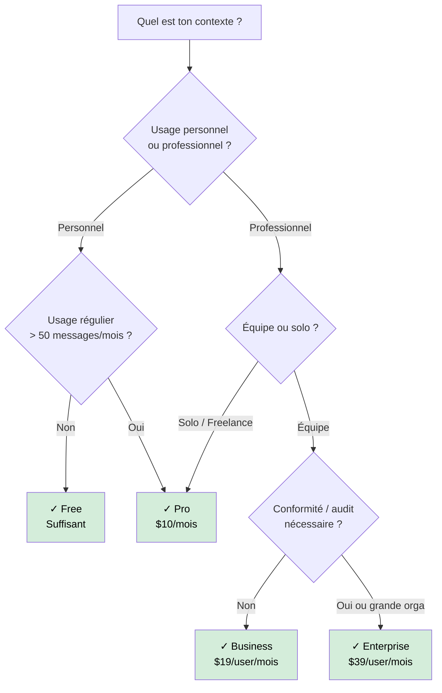

# Les abonnements GitHub Copilot

Débutant

GitHub Copilot propose quatre formules d'abonnement. Le bon choix dépend du profil (individuel ou organisation), du volume d'usage, et des besoins d'administration.

---

## Comparatif des plans

| Fonctionnalité | Free | Pro | Business | Enterprise |
|----------------|------|-----|----------|------------|
| **Prix** | Gratuit | $10/mois | $19/user/mois | $39/user/mois |
| **Complétions inline** | 2 000/mois | Illimitées | Illimitées | Illimitées |
| **Messages chat** | 50/mois | Illimités | Illimités | Illimités |
| **Premium requests** | 50/mois | 300/mois | 300/user/mois | 300/user/mois |
| **Modèles disponibles** | Standard | Standard + Premium | Standard + Premium | Standard + Premium |
| **Agent Mode** | Limité | ✓ | ✓ | ✓ |
| **Copilot Edits** | ✓ (limité) | ✓ | ✓ | ✓ |
| **Politique d'exclusion de fichiers** | — | — | ✓ | ✓ |
| **Gestion centralisée des licences** | — | — | ✓ | ✓ |
| **Audit logs** | — | — | ✓ | ✓ |
| **Copilot Chat dans GitHub.com** | — | — | — | ✓ |
| **Personnalisation au niveau organisation** | — | — | Partiel | ✓ |
| **Modèles fine-tunés (custom models)** | — | — | — | Sur demande |
| **Support SLA** | Communauté | Standard | Standard | Priority |

---

## Plan Free — Pour commencer sans risque

!!! info "Disponible depuis décembre 2024"
    Le plan Free remplace l'ancienne période d'essai. Il est permanent, sans carte bancaire.

**Idéal pour :**
- Découverte de Copilot
- Projets personnels à usage occasionnel
- Étudiants (au-delà du pack GitHub Education)

**Limites à connaître :**
- 2 000 complétions et 50 messages de chat par mois — le compteur repart à zéro chaque mois
- Pas d'accès aux modèles premium (Claude 3.5, o1) sauf dans les 50 premium requests incluses
- Suspend automatiquement quand les quotas sont épuisés

---

## Plan Pro — L'essentiel pour un développeur solo

**Idéal pour :** développeurs individuels avec un usage régulier, freelances, side-projects intensifs.

**Ce que ça change par rapport au Free :**
- Complétions et chat illimités
- 300 premium requests/mois — suffisant pour un usage quotidien raisonné
- Accès complet à Agent Mode et Copilot Edits

!!! tip "GitHub Education"
    Les étudiants et enseignants éligibles obtiennent Pro **gratuitement** via le [GitHub Student Developer Pack](https://education.github.com/pack).

---

## Plan Business — Pour les équipes

**Idéal pour :** équipes de développement en entreprise (PME, scale-up), nécessitant un contrôle centralisé.

**Fonctionnalités clés au-delà de Pro :**
- Licences gérées par l'organisation (attribution, révocation)
- Politique d'exclusion de fichiers : empêcher Copilot d'accéder à certains fichiers (secrets, données sensibles)
- Audit logs : qui utilise Copilot, quand, quels modèles
- Désactivation des suggestions de code correspondant à du code public (duplication filter)

!!! warning "Facturation à l'utilisateur actif"
    Business est facturé par siège actif. Un développeur qui n'utilise pas Copilot un mois donné peut ne pas être facturé selon la politique GitHub en vigueur — vérifier les CGU.

---

## Plan Enterprise — Pour les grandes organisations

**Idéal pour :** grandes entreprises, secteurs réglementés (banque, santé, défense), organisations avec des exigences de conformité.

**Fonctionnalités exclusives :**
- **Copilot Chat dans GitHub.com** : analyse de PR, résumés de code, questions sur les issues directement dans l'interface GitHub
- **Personnalisation profonde** : instructions au niveau de l'organisation
- **Custom models** : possibilité de fine-tuner Copilot sur le code interne (sur demande)
- **Conformité et résidentialité des données** selon les contrats Entreprise

---

## Quel plan choisir ?

---

## Ce que les plans ne couvrent pas

- Les API Copilot pour intégrations tierces (facturation séparée)
- L'usage de Copilot Extensions de third-parties (peuvent avoir leur propre facturation)
- Les modèles via GitHub Models dans les Codespaces (quota séparé)
