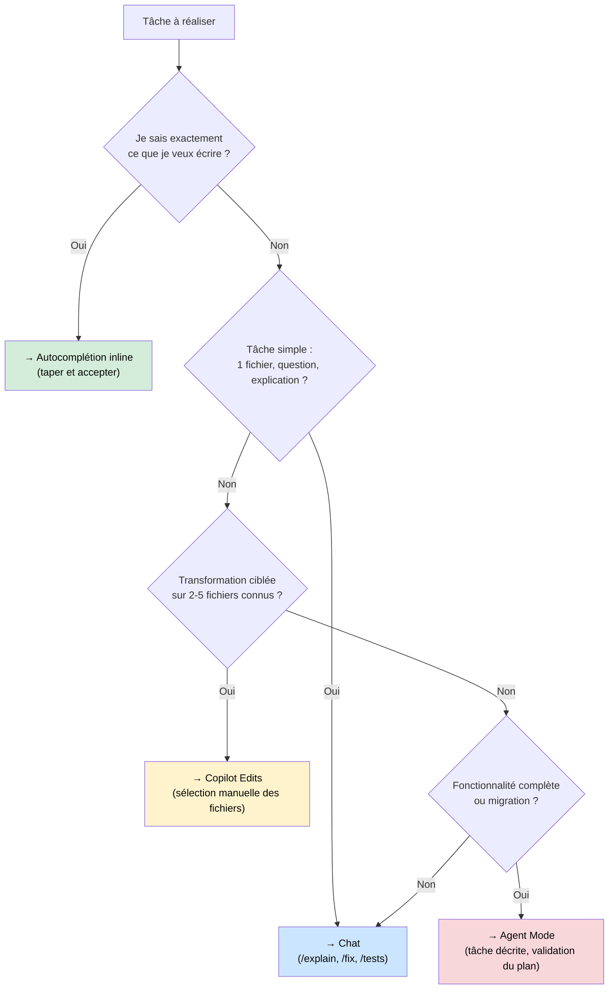

# Quand utiliser quel mode ?

Intermédiaire
Expert

GitHub Copilot propose quatre modes d'interaction, chacun avec un niveau de puissance, de coût et d'autonomie différent. Utiliser le bon mode selon la tâche est la décision la plus impactante pour équilibrer productivité et consommation de requêtes.

---

## Vue d'ensemble des modes

| Mode | Déclenchement | Autonomie | Coût | Meilleur pour |
|------|--------------|-----------|------|---------------|
| **Inline / Autocomplétion** | Automatique en tapant | Aucune | Très faible | Code répétitif, patterns connus |
| **Chat (Ask)** | Manuel, panneau dédié | Faible | Modéré | Exploration, questions, explications |
| **Edits** | Manuel, sélection | Modérée | Modéré | Refactoring ciblé, transformations |
| **Agent** | Manuel, tâche décrite | Haute | Élevé | Fonctionnalités complètes, migration |

---

## Mode Inline — Autocomplétion

**Nature :** suggestions en temps réel dans l'éditeur pendant la frappe (ghost text).

**Coût :** nul sur les plans payants — utilise le modèle standard.

**Quand l'utiliser :**
- Implémenter un pattern déjà présent dans le projet
- Écrire du boilerplate (getters, constructeurs, interfaces)
- Compléter des imports, des switch/case, des queries SQL connues
- Taper rapidement quand on sait exactement ce qu'on veut

**Quand ne pas l'utiliser :**
- Quand la logique est ambiguë — Copilot devinera mal
- Pour des décisions d'architecture
- Quand le fichier courant n'a pas assez de contexte

!!! tip "Signal d'efficacité"
    Si les suggestions inline sont souvent pertinentes, votre code est bien structuré et bien nommé. Si elles sont souvent à côté, c'est un signal sur la qualité du contexte local.

---

## Mode Chat (Ask)

**Nature :** conversation en langage naturel dans un panneau dédié.

**Coût :** modéré — 1 message = 1 requête (standard ou premium selon le modèle choisi).

=== ":material-microsoft-visual-studio-code: VS Code"

    Panneau Copilot Chat (`Ctrl+Alt+I`) avec les participants `@workspace`, `@vscode`, `@terminal` et les variables `#file`, `#selection`, `#codebase`.

=== ":simple-intellijidea: IntelliJ IDEA"

    Fenêtre **GitHub Copilot Chat** (vue dédiée) avec support des fichiers référencés manuellement.

**Quand l'utiliser :**
- Comprendre un code existant (`/explain`)
- Corriger un bug avec contexte (`/fix`)
- Générer des tests (`/tests`)
- Poser des questions sur l'architecture ou les choix de design
- Explorer des alternatives avant d'implémenter

**Slash commands utiles :**

| Commande | Action |
|----------|--------|
| `/explain` | Explique le code sélectionné ou référencé |
| `/fix` | Propose une correction pour l'erreur/bug courant |
| `/tests` | Génère des tests unitaires pour le code sélectionné |
| `/doc` | Génère la documentation (JSDoc, Javadoc...) |
| `/new` | Crée un nouveau fichier ou projet |

---

## Mode Edits

**Nature :** transformation du code sur une sélection ou un ensemble de fichiers définis manuellement.

**Coût :** modéré à élevé selon le nombre de fichiers — 1–3 premium requests pour un edit multi-fichiers.

**Quand l'utiliser :**
- Refactoriser un fichier complet
- Renommer et adapter un concept dans 2–4 fichiers
- Convertir un format (ex. : JS → TS, callbacks → async/await)
- Appliquer un pattern de façon cohérente sur des fichiers ciblés

**Quand ne pas l'utiliser :**
- Pour des modifications qui touchent 10+ fichiers → préférer Agent Mode
- Pour une simple correction d'une ligne → Chat ou autocomplétion plus rapide

!!! example "Exemple d'usage typique"
    Sélectionner `UserController.ts` et `UserService.ts` → Edits → "Remplace les callbacks par des Promises avec async/await. Conserve la gestion d'erreurs existante."

---

## Mode Agent

**Nature :** mode autonome où Copilot planifie, exécute des tool calls (lecture, écriture, recherche), et itère jusqu'à complétion d'une tâche complexe.

**Coût :** élevé — chaque tool call avec un modèle premium compte. Une tâche agent typique = 5–20 premium requests.

**Quand l'utiliser :**
- Créer une fonctionnalité complète de bout en bout (API + service + tests + types)
- Migrer un module entier vers une nouvelle technologie
- Implémenter un ticket JIRA / GitHub Issue complet
- Générer un scaffold de projet avec structure de dossiers

**Quand ne pas l'utiliser :**
- Pour des modifications single-file → Edits est plus précis et moins coûteux
- Pour des explorations ou des questions → Chat
- Quand le périmètre est flou → définir le scope avant de lancer l'agent

!!! warning "Vérifier avant de valider"
    L'Agent Mode peut créer, modifier et supprimer des fichiers. Toujours vérifier le plan avant de cliquer "Accept All" — notamment sur les lignes supprimées.

---

## Arbre de décision

---

## Comparatif de coût sur un exemple concret

**Tâche :** "Ajouter la validation de l'email dans le UserService."

| Mode utilisé | Requêtes consommées | Temps | Qualité |
|-------------|---------------------|-------|---------|
| Autocomplétion | 0 | 2 min | Bonne si pattern connu |
| Chat + /fix | 1 | 3 min | Très bonne |
| Edits (UserService seul) | 1 | 2 min | Très bonne |
| Agent Mode | 5–10 | 5 min | Très bonne... pour rien de plus |

!!! danger "Anti-pattern"
    Lancer Agent Mode par défaut sur toutes les tâches parce que "c'est plus rapide à formuler" — c'est le principal vecteur de gaspillage de premium requests.
