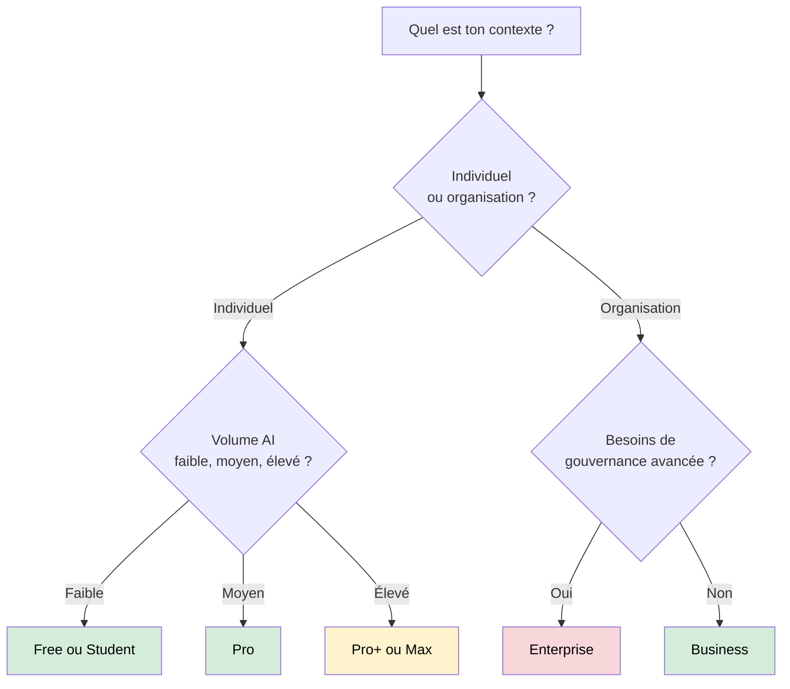

# Les abonnements GitHub Copilot

Débutant

Le choix d'un plan Copilot se fait maintenant avec une logique claire: **prix de licence + allocation AI Credits + politique de dépassement**.

!!! info "Référence de cette page"
    Valeurs revérifiées le **1 juin 2026** sur la documentation officielle GitHub Copilot.

---

## Vue rapide des plans

| Plan | Prix | Allocation AI Credits | Remarques clés |
|------|------|------------------------|----------------|
| Free | Gratuit | Incluse (limitée) | 2000 completions/mois, modèles sélectionnés |
| Student | Gratuit (éligible) | Incluse (limitée) | Completions illimitées, modèles sélectionnés |
| Pro | 10 USD/mois | 1500 (1000 base + 500 flex) | Individuel, usage régulier |
| Pro+ | 39 USD/mois | 7000 (3900 base + 3100 flex) | Individuel intensif |
| Max | 100 USD/mois | 20000 (10000 base + 10000 flex) | Très gros volume |
| Business | 19 USD/utilisateur/mois | 1900 par siège (poolé) | Gouvernance organisation |
| Enterprise | 39 USD/utilisateur/mois | 3900 par siège (poolé) | Gouvernance avancée |

!!! note "Période promotionnelle 2026 (orga/enterprise existants)"
    Pour les clients existants, GitHub annonce des montants inclus plus élevés sur la fenêtre de transition (juin à septembre 2026).

---

## Ce qui est facturé en AI Credits

Fonctionnalités facturées:

- Copilot Chat
- Copilot CLI
- Copilot cloud agent
- Copilot Spaces
- Spark
- Agents tiers

Fonctionnalités non facturées en AI Credits:

- Code completions
- Next edit suggestions

---

## Individuels: comment lire Pro, Pro+, Max

### Pro

- Point d'entrée pour usage quotidien
- 1500 AI Credits inclus (base + flex)
- Convient pour chat fréquent et tâches de développement standard

### Pro+

- Plus de marge sur tâches complexes et agentiques
- 7000 AI Credits inclus
- Adapté aux usages multi-projets et modèles plus coûteux

### Max

- Cible power users à fort volume
- 20000 AI Credits inclus
- Utile si l'usage avancé est quotidien et soutenu

---

## Organisations: logique de pool

Pour Business et Enterprise:

- chaque siège contribue à un **pool partagé**
- un utilisateur lourd peut consommer plus, compensé par des utilisateurs légers
- ajout de sièges en cours de cycle: le pool augmente immédiatement
- retrait de sièges en cours de cycle: effet au cycle suivant

!!! tip "Lecture finance"
    En organisation, le coût réel est: licences + éventuelle consommation additionnelle (si autorisée).

---

## Dépassement et contrôle budgétaire

### Individuels

- soit budget additionnel
- soit attente du prochain cycle

### Organisations / entreprises

- si usage additionnel autorisé: facturation continue
- si usage additionnel bloqué: blocage des fonctionnalités consommatrices d'AI Credits

Important:

- Pas de fallback automatique vers un modèle moins cher quand un budget bloque l'usage.

---

## Quel plan choisir ?

---

## Sources officielles

- [Plans for GitHub Copilot](https://docs.github.com/en/copilot/about-github-copilot/plans-for-github-copilot) - consulté le 2026-06-01
- [Usage-based billing for individuals](https://docs.github.com/en/copilot/concepts/billing/usage-based-billing-for-individuals) - consulté le 2026-06-01
- [About billing for organizations and enterprises](https://docs.github.com/en/copilot/concepts/billing/organizations-and-enterprises) - consulté le 2026-06-01
- [Usage-based billing for organizations and enterprises](https://docs.github.com/en/copilot/concepts/billing/usage-based-billing-for-organizations-and-enterprises) - consulté le 2026-06-01

---

## Prochaine étape

**[Leviers d'économie](leviers-economie.md)** : stratégies concrètes pour réduire la consommation d'AI Credits sans réduire la qualité de sortie.

Concepts clés couverts :

- **Choix de modèle par tâche** — aligner coût et complexité
- **Réduction des tokens** — moins de contexte inutile
- **Budgets et garde-fous** — éviter les dépassements
- **Pilotage des usages** — décisions basées sur les métriques
