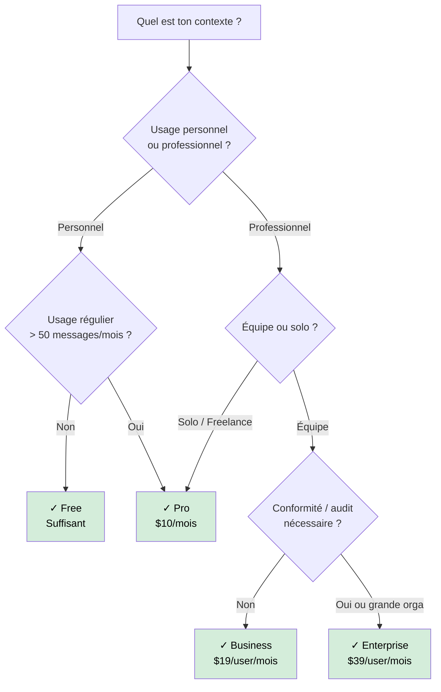

# Les abonnements GitHub Copilot

Débutant

GitHub Copilot propose quatre formules d'abonnement. Le bon choix dépend du profil (individuel ou organisation), du volume d'usage, et des besoins d'administration.

!!! info "Référence de cette page"
    Valeurs vérifiées le **4 mai 2026** sur la documentation officielle GitHub Copilot.
    À partir du **1er juin 2026**, GitHub introduit la facturation **usage-based** avec **AI Credits**. Les plans et prix restent, mais la logique de consommation évolue.

---

## Comparatif des plans

| Fonctionnalité | Free | Pro | Pro+ | Business | Enterprise |
|----------------|------|-----|------|----------|------------|
| **Prix** | Gratuit | $10/mois | $39/mois | $19/user/mois | $39/user/mois |
| **Complétions inline** | 2 000/mois | Illimitées | Illimitées | Illimitées | Illimitées |
| **Messages chat avec modèles inclus** | 50/mois | Illimités | Illimités | Illimités | Illimités |
| **Premium requests incluses** | 50/mois | 300/mois | 1 500/mois | 300/user/mois | 1 000/user/mois |
| **Achat de capacité additionnelle** | Non | Oui | Oui | Oui | Oui |
| **Agent mode (IDE)** | Oui | Oui | Oui | Oui | Oui |
| **Copilot cloud agent** | Non | Oui | Oui | Oui | Oui |
| **Copilot Chat dans GitHub** | Oui | Oui | Oui | Oui | Oui |
| **Exclusion de fichiers / content exclusion (orga)** | Non | Non | Non | Oui | Oui |
| **Gestion centralisée des licences** | Non | Non | Non | Oui | Oui |
| **Audit logs** | Non | Non | Oui | Oui | Oui |

!!! warning "Point d'attention 2026"
    Les inscriptions self-serve sur certains plans peuvent être temporairement limitées selon les annonces GitHub 2026. Vérifier l'état en temps réel avant décision d'achat.

---

## Request-based aujourd'hui, AI Credits demain

### Jusqu'au 31 mai 2026 (modèle request-based)

- Le suivi principal se fait via les **premium requests** (quotas mensuels par plan).
- Les fonctionnalités agentiques consomment selon le mode et le modèle.

### À partir du 1er juin 2026 (usage-based)

- La consommation est exprimée en **AI Credits** (1 AI Credit = $0.01 USD).
- Le coût dépend du **modèle** et du **nombre de tokens** (entrée, sortie, cache).
- Les plans conservent leurs prix, mais les allocations et budgets passent à une logique d'usage.

!!! tip "Lecture recommandée"
    Utiliser [Historique des changements coûts & modèles](historique-modifications.md) pour suivre les deltas avant/après mois par mois.

---

## Plan Free — Pour commencer sans risque

**Idéal pour :**

- Découverte de Copilot
- Projets personnels à usage occasionnel
- Étudiants (au-delà du pack GitHub Education)

**Limites à connaître :**

- 2 000 complétions et 50 messages de chat par mois — le compteur repart à zéro chaque mois
- Accès limité aux modèles, avec consommation premium sur les interactions avancées
- Suspend automatiquement quand les quotas sont épuisés

---

## Plan Pro — L'essentiel pour un développeur solo

**Idéal pour :** développeurs individuels avec un usage régulier, freelances, side-projects intensifs.

**Ce que ça change par rapport au Free :**

- Complétions et chat illimités
- 300 premium requests/mois — suffisant pour un usage quotidien raisonné
- Accès complet à Agent Mode et Copilot Edits

---

## Plan Pro+ — Pour les usages intensifs

**Idéal pour :** développeurs qui utilisent fréquemment des modèles avancés, des workflows agentiques et des sessions longues.

**Ce que ça ajoute par rapport à Pro :**

- Quota premium beaucoup plus élevé (1 500/mois)
- Accès étendu à des modèles avancés dans le sélecteur
- Plus de marge pour les tâches complexes sans arbitrage constant

!!! tip "GitHub Education"
    Les étudiants et enseignants éligibles obtiennent Pro **gratuitement** via le [GitHub Student Developer Pack](https://education.github.com/pack).

---

## Plan Business — Pour les équipes

**Idéal pour :** équipes de développement en entreprise (PME, scale-up), nécessitant un contrôle centralisé.

**Fonctionnalités clés au-delà de Pro :**

- Licences gérées par l'organisation (attribution, révocation)
- Politique d'exclusion de fichiers : empêcher Copilot d'accéder à certains fichiers (secrets, données sensibles)
- Audit logs : qui utilise Copilot, quand, quels modèles
- Désactivation des suggestions de code correspondant à du code public (duplication filter)

!!! warning "Facturation à l'utilisateur actif"
    Business est facturé par siège actif. Un développeur qui n'utilise pas Copilot un mois donné peut ne pas être facturé selon la politique GitHub en vigueur — vérifier les CGU.

---

## Plan Enterprise — Pour les grandes organisations

**Idéal pour :** grandes entreprises, secteurs réglementés (banque, santé, défense), organisations avec des exigences de conformité.

**Fonctionnalités exclusives :**

- **Gouvernance avancée** : politiques et gestion centralisée à l'échelle entreprise
- **Personnalisation profonde** : instructions au niveau de l'organisation
- **Custom models** : possibilité de fine-tuner Copilot sur le code interne (sur demande)
- **Conformité et résidentialité des données** selon les contrats Entreprise

---

## Quel plan choisir ?

---

## Ce que les plans ne couvrent pas

- Les API Copilot pour intégrations tierces (facturation séparée)
- L'usage de Copilot Extensions de third-parties (peuvent avoir leur propre facturation)
- Les modèles via GitHub Models dans les Codespaces (quota séparé)

---

## Comparer avant/après facilement

Pour suivre l'évolution des coûts et des modèles accessibles dans le temps :

- utiliser la timeline dans [Historique des changements coûts & modèles](historique-modifications.md)
- vérifier les mises à jour mensuelles (rubrique "comparaison Avant / Après")
- garder la date de vérification dans chaque section chiffrée

---

## Prochaine étape

**[Leviers d'économie](leviers-economie.md)** : sept stratégies pragmatiques pour réduire les dépenses de premium requests sans sacrifier la productivité.

Concepts clés couverts :

- **Choisir le bon modèle par tâche** — Standard pour l'exploration, premium pour l'implémentation
- **Utiliser l'autocomplétion au maximum** — Gratuite sur les plans payants, très efficace
- **Gérer le contexte des fichiers ouverts** — Moins d'onglets = moins de tokens
- **Limiter la taille des conversations** — Nouvelles conversations courtes meilleur marché
