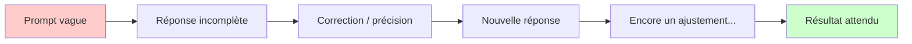

# Patterns pour réduire les allers-retours

<span class="badge-intermediate">Intermédiaire</span>

Chaque échange avec Copilot — qu'il s'agisse d'une complétion, d'un message de chat ou d'un cycle agent — consomme des ressources (requêtes, tokens, temps). La majorité des cycles inutiles vient d'un contexte insuffisant au départ : Copilot devine, on corrige, on redemande... trois fois au lieu d'une.

L'objectif de ce guide est de **passer de 5 échanges à 1** sur les tâches courantes.

---

## Pourquoi les allers-retours coûtent cher



Un aller-retour typique sur une tâche d'implémentation :

| Cycle | Requêtes consommées | Temps perdu |
|-------|---------------------|-------------|
| Prompt vague → correction × 3 | 3–5 premium requests | 5–10 min |
| Prompt complet dès le départ | 1 premium request | 1–2 min |

---

## Pattern 1 — Le contexte complet en une fois

### Mauvais exemple (3 cycles)

```
Toi : "Écris-moi une fonction de validation."
Copilot : [quelque chose de générique]

Toi : "Pour des emails."
Copilot : [validation email basique]

Toi : "Avec les règles métier : pas de sous-domaines, que des .com/.fr/.org"
Copilot : [enfin la bonne chose]
```

### Bon exemple (1 cycle)

```
Toi : "Écris une fonction TypeScript `validateEmail(email: string): boolean`.
       Règles : RFC 5322 basique, refuser les sous-domaines (a.b@domain),
       accepter uniquement .com / .fr / .org comme TLD.
       Inclure les tests unitaires Jest pour 5 cas (valide, TLD invalide,
       sous-domaine, chaîne vide, sans @)."
```

!!! tip "Le principe"
    Formuler le prompt comme si vous écriviez une **spécification fonctionnelle** : entrée, sortie, contraintes, format attendu.

---

## Pattern 2 — Le template de prompt structuré

Pour les tâches récurrentes, créer un prompt file dans `.github/prompts/` réduit le temps de formulation et garantit la cohérence.

**Exemple : `.github/prompts/implement-feature.prompt.md`**

```markdown
# Implémenter une fonctionnalité

## Tâche
[Décris la fonctionnalité en 1-2 phrases]

## Signature attendue
```[langage]
[Signature de la fonction / interface]
```

## Contraintes
- [Contrainte 1]
- [Contrainte 2]

## À inclure
- [ ] Implémentation
- [ ] Tests unitaires
- [ ] Validation des entrées
- [ ] Commentaire JSDoc / Javadoc
```

Ce template se réutilise via `#prompt:implement-feature.prompt.md` — une ligne, zéro ambiguïté.

---

## Pattern 3 — Le contexte explicite avec références

Plutôt que de laisser Copilot deviner quel fichier regarder, pointer explicitement.

=== ":material-microsoft-visual-studio-code: VS Code"

    ```
    "Implémente le service `UserService` en suivant exactement
     le pattern de #file:src/services/ProductService.ts.
     Le contrat est dans #file:src/types/user.types.ts."
    ```

    Les variables `#file:`, `#selection`, `@workspace` éliminent une classe entière d'ambiguïté.

=== ":simple-intellijidea: IntelliJ IDEA"

    Ouvrir les fichiers cibles dans des onglets actifs avant de lancer le chat. Copilot indexe automatiquement le contenu des onglets ouverts.

    Pour ajouter explicitement un fichier dans le contexte : bouton **+** dans la fenêtre de chat → **Add File**.

---

## Pattern 4 — Demander la validation avant l'exécution (Agent Mode)

En Agent Mode, préciser le plan attendu avant l'exécution évite les refactorings complets :

```
"Avant de commencer, liste les fichiers que tu vas modifier et les
 changements prévus dans chaque. Attends ma validation avant d'écrire."
```

Cela transforme un cycle de 8 tool calls en 3 : plan → validation → exécution.

---

## Pattern 5 — Les checkpoints explicites

Pour les tâches longues, découper en étapes avec validation intermédiaire :

```
"Étape 1 uniquement : crée le schéma de base de données. Stop.
 Attends que je valide avant de passer à l'étape 2 (API)."
```

!!! warning "Agent sans contrainte"
    Un agent sans checkpoint peut générer 20 fichiers avant que vous réalisiez qu'il est parti dans la mauvaise direction. Les checkpoints sont de la dette évitée, pas de la lenteur ajoutée.

---

## Récapitulatif des patterns

| Pattern | Gain estimé | Applicable dans |
|---------|-------------|-----------------|
| Contexte complet dès le départ | −60% de cycles | Chat, Agent |
| Template de prompt réutilisable | −40% de temps de formulation | Chat, Agent |
| Références explicites (#file, @workspace) | −50% d'ambiguïtés | VS Code Chat |
| Plan avant exécution (Agent) | −65% de tool calls | Agent Mode |
| Checkpoints explicites | Évite les refactorings | Agent Mode |

---

## Prochaine étape

**[Premium Requests : mécanique](premium-requests.md)** : comprendre ce qu'est une premium request, quels modèles la consomment, et comment surveiller son quota mensuel.

Concepts clés couverts :

- **Coût des modèles** — Standard gratuit, Claude/o1/o3 = premium requests
- **Quotas par plan** — Free 50, Pro 300, Business/Enterprise 300 par utilisateur
- **Surveiller son solde** — GitHub Copilot usage dashboard
- **Comportement après épuisement** — Basculage automatique au modèle standard
