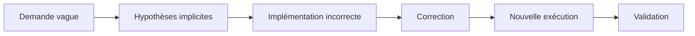

# Réduire les allers-retours avec Claude Code

<span class="badge-intermediate">Intermédiaire</span>

Chaque tour inutile consomme du **temps**, du **contexte** et une partie de votre **allocation d'usage**. L'objectif n'est donc pas de forcer artificiellement « une seule réponse », mais de donner à Claude assez d'information pour travailler correctement puis de lui fournir une **boucle de vérification** fiable.

!!! info "Principe directeur"
    Un bon workflow réduit les ambiguïtés avant l'implémentation et laisse Claude récupérer le contexte supplémentaire **à la demande**. Trop peu de contexte provoque des corrections ; trop de contexte noie l'information utile.

---

## Pourquoi les cycles inutiles coûtent cher


```mermaid
graph LR
    A["Demande vague"] --> B["Hypothèses implicites"]
    B --> C["Implémentation incorrecte"]
    C --> D["Correction"]
    D --> E["Nouvelle exécution"]
    E --> F["Validation"]
```

Les facteurs qui augmentent l'usage Claude incluent notamment :

- longueur et complexité de la conversation ;
- modèle et niveau d'effort utilisés ;
- appels d'outils ;
- contexte chargé dans la session ;
- répétition d'explorations qui auraient pu être isolées dans un subagent.

Il n'existe pas de ratio universel du type « 5 prompts = X crédits ». Mesurez votre usage réel avec `/status` et `/usage` plutôt que d'inventer une conversion fixe.

---

## Pattern 1 — Donner le contrat de la tâche

Un bon prompt de développement précise au minimum :

```text
Objectif     → ce qui doit changer
Périmètre    → fichiers/modules concernés
Contraintes  → compatibilité, sécurité, conventions
Validation   → tests/build/lint ou comportement observable
Exclusions   → ce qui ne doit pas changer
```

Exemple :

```text
Ajoute la validation d'email au service utilisateur.

Périmètre : `src/users/` uniquement.
Contraintes : ne change pas l'API publique et réutilise les patterns existants.
Validation : exécute les tests du module puis le typecheck.
Avant de terminer, relis le diff et signale toute hypothèse restante.
```

---

## Pattern 2 — Laisser Claude récupérer le contexte juste à temps

Évitez de charger tout le dépôt « au cas où ». Donnez :

- le point d'entrée de la tâche ;
- les contraintes stables dans `CLAUDE.md` ;
- les règles ciblées dans `.claude/rules/` ;
- les fichiers explicitement importants lorsque vous les connaissez.

Puis laissez Claude chercher les dépendances réelles avec ses outils.

!!! tip "Contexte ciblé"
    Une exploration lourde qui produit beaucoup de texte peut être confiée à un subagent. Son contexte reste isolé de la session principale et seul le résultat synthétique revient à l'orchestrateur.

---

## Pattern 3 — Planifier quand le périmètre est réellement complexe

Le mode Plan est utile lorsque la tâche :

- touche plusieurs composants ;
- implique une migration ;
- modifie une API publique ;
- comporte un risque de sécurité ou de données ;
- nécessite une décision architecturale avant écriture.

Pour une correction locale évidente, imposer systématiquement un long plan peut au contraire ajouter du coût sans valeur.

```text
Explore le code concerné et propose un plan.
Le plan doit lister : fichiers, comportement actuel, changement prévu,
risques et commandes de validation.
N'implémente rien tant que le plan n'est pas cohérent avec le dépôt.
```

---

## Pattern 4 — Donner à Claude un moyen de vérifier son travail

Le levier le plus efficace contre les itérations inutiles est la **vérification exécutable** :

```text
Avant de conclure :
1. exécute les tests ciblés ;
2. exécute le lint/typecheck pertinent ;
3. corrige les échecs provoqués par tes changements ;
4. relis `git diff` ;
5. résume ce qui reste non vérifié.
```

Sans feedback de l'environnement, Claude doit deviner si le résultat fonctionne réellement.

---

## Pattern 5 — Transformer les procédures répétitives en skills

Une procédure stable ne doit pas être réécrite dans chaque prompt.

```text
.claude/
└── skills/
    └── verify-change/
        └── SKILL.md
```

Le skill peut contenir par exemple :

1. lire le diff ;
2. identifier les tests affectés ;
3. exécuter les checks ;
4. classer les erreurs entre préexistantes et introduites ;
5. produire un résumé reproductible.

Les règles globales restent dans `CLAUDE.md`; les workflows détaillés vont dans des skills.

---

## Pattern 6 — Changer de tâche proprement

Quand une conversation a accumulé un contexte qui n'est plus utile :

- `/compact` si vous devez garder la continuité ;
- `/clear` si vous passez à une tâche indépendante ;
- un subagent si une exploration volumineuse peut rester isolée.

L'objectif est de ne pas payer indéfiniment le contexte d'un travail terminé.

---

## GitHub Copilot — référence conservée

Les mêmes principes restent valables avec Copilot : contexte explicite, prompt files, instructions de dépôt et validation avant changements importants. Les mécanismes spécifiques Copilot (`.github/prompts/`, `#file`, AI Credits) sont documentés dans les pages Copilot de référence.

---

## Sources

- [Claude Help Center — How do usage and length limits work?](https://support.claude.com/en/articles/11647753-how-do-usage-and-length-limits-work) — consulté le 2026-09-28
- [Claude Code — Features overview](https://code.claude.com/docs/en/features-overview) — consulté le 2026-09-28
- [Claude Code — Commands](https://code.claude.com/docs/en/commands) — consulté le 2026-09-28

## Prochaine étape

**[Leviers d'économie](leviers-economie.md)** : réduire l'usage sans sacrifier la qualité en jouant sur le contexte, les modèles, les subagents et les validations.