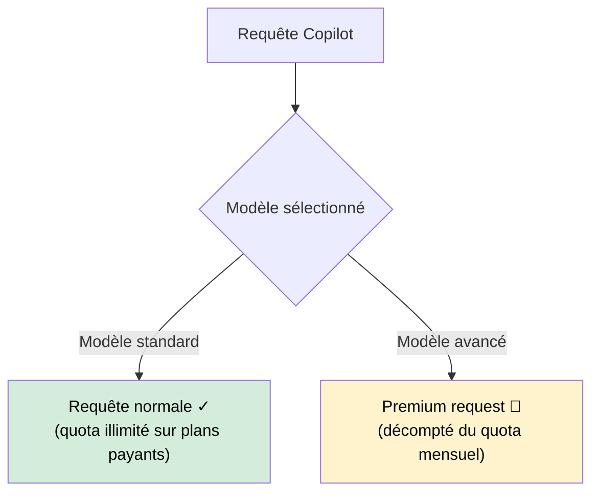

# Premium Requests : mécanique

Intermédiaire

GitHub Copilot distingue deux types de requêtes : les **requêtes standard** (illimitées sur les plans payants) et les **premium requests** (contingentées). Comprendre cette distinction permet d'éviter les mauvaises surprises en milieu de mois.

---

## Qu'est-ce qu'une premium request ?

Une **premium request** est une requête qui sollicite un modèle d'IA avancé — plus puissant et plus coûteux à faire tourner. GitHub facture ces requêtes sur un quota mensuel plutôt qu'à l'usage pour maintenir un prix prévisible.

---

## Modèles et leur coût

| Modèle | Type | Coût en premium requests |
|--------|------|--------------------------|
| GPT-4o mini | Standard | 0 (illimité) |
| GPT-4o | Premium | 1 par requête |
| Claude 3.5 Sonnet | Premium | 1 par requête |
| Claude 3.7 Sonnet | Premium | 1 par requête |
| o1-mini | Premium | 1 par requête |
| o3-mini | Premium | 1 par requête |
| o1 | Premium | 10 par requête |
| Claude 3.5 Opus / 3 Opus | Premium | À confirmer selon la période |

!!! info "Les quotas évoluent"
    GitHub ajuste régulièrement les quotas et les modèles disponibles. Vérifier la page officielle [GitHub Copilot pricing](https://github.com/features/copilot#pricing) pour les valeurs à jour.

---

## Quota par plan

| Plan | Premium requests / mois | Base incluse |
|------|--------------------------|--------------|
| **Free** | 50 | 2 000 complétions + 50 messages chat |
| **Pro** ($10/mois) | 300 | Complétions illimitées |
| **Business** ($19/user/mois) | 300 par utilisateur | Complétions illimitées |
| **Enterprise** ($39/user/mois) | 300 par utilisateur | Complétions illimitées + admin avancé |

!!! tip "Complétions ≠ premium requests"
    L'autocomplétion inline (le ghost text) utilise presque toujours le modèle standard — elle ne grignote **pas** votre quota premium. C'est votre allié gratuit.

---

## Ce qui consomme des premium requests

### Consomme fortement (éviter sans bonne raison)

- **Agent Mode avec modèle premium** : chaque tool call avec un modèle comme Claude 3.5 Sonnet compte. Une tâche agent complexe peut consommer 5–20 premium requests.
- **o1 / o3** : 10× le coût d'un appel standard — réserver aux raisonnements complexes.
- **Longues conversations chat avec modèle premium** : chaque message dans une conversation longue réenvoie l'historique complet.

### Consomme modérément

- **Chat one-shot avec Claude 3.5 Sonnet** : 1 request par échange — raisonnable.
- **Copilot Edits multi-fichiers** : 1–3 requests selon la complexité.

### Ne consomme pas de quota premium

- **Autocomplétion inline** (ghost text) — modèle standard.
- **Questions simples en chat avec GPT-4o mini**.
- **Copilot en IntelliJ** avec le modèle par défaut non changé.

---

## Surveiller son solde

=== ":material-microsoft-visual-studio-code: VS Code"

    **Icône Copilot** dans la barre de statut → cliquer → **"Open GitHub Copilot settings"** → section **Usage**.
    
    Ou directement sur [github.com/settings/copilot](https://github.com/settings/copilot) : section **Premium requests usage**.

=== ":simple-intellijidea: IntelliJ IDEA"

    IntelliJ ne dispose pas d'affichage du quota dans l'IDE. Consulter directement [github.com/settings/copilot](https://github.com/settings/copilot).

---

## Que se passe-t-il quand le quota est épuisé ?

Copilot **ne s'arrête pas** — il bascule automatiquement sur le modèle standard (GPT-4o mini). Les complétions continuent, le chat aussi. La différence : les modèles premium ne sont plus disponibles jusqu'au renouvellement du quota.

!!! warning "Comportement selon le plan"
    Sur le plan **Free**, une fois le quota de complétions ET de messages épuisé, Copilot est désactivé jusqu'au mois suivant. Sur les plans payants, seuls les modèles premium sont restreints.

---

## Prochaine étape

**[Les abonnements](abonnements.md)** : comparatif détaillé des quatre plans GitHub Copilot (Free, Pro, Business, Enterprise) avec quotas, fonctionnalités et critères de choix.

Concepts clés couverts :

- **Quatre plans disponibles** — Free gratuit, Pro $10, Business $19, Enterprise $39
- **Limites et quotas** — Complétions, messages chat, premium requests par plan
- **Fonctionnalités exclusives** — Agent Mode, Audit logs, Custom models
- **Quel plan choisir** — Matrice décision selon profil (solo, équipe, conformité)
