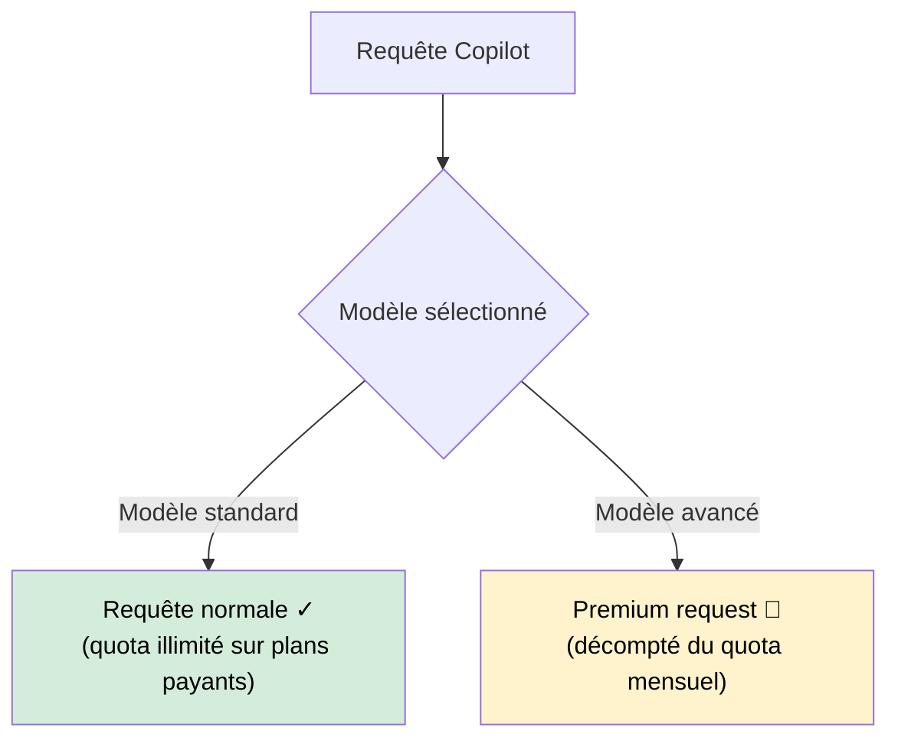

# Premium Requests : mécanique

Intermédiaire

GitHub Copilot distingue deux types de requêtes : les **requêtes standard** (illimitées sur les plans payants) et les **premium requests** (contingentées). Comprendre cette distinction permet d'éviter les mauvaises surprises en milieu de mois.

!!! info "Référence de cette page"
    Contenu vérifié le **4 mai 2026**. La logique request-based reste utile pour comprendre l'existant, mais la bascule **usage-based (AI Credits)** est annoncée pour le **1er juin 2026**.

---

## Qu'est-ce qu'une premium request ?

Une **premium request** est une requête qui sollicite un modèle d'IA avancé — plus puissant et plus coûteux à faire tourner. GitHub facture ces requêtes sur un quota mensuel plutôt qu'à l'usage pour maintenir un prix prévisible.

En mode agentique, seule **l'invite utilisateur** est comptabilisée comme demande premium. Les actions internes de l'agent (appels d'outils, étapes automatiques) ne sont pas facturées comme demandes premium supplémentaires.

??? example "Illustration : 1 prompt → N actions internes → 1 seule premium request"
    **Vous écrivez un seul prompt :**
    > "Crée une API REST avec tests unitaires"

    **Copilot Agent exécute en interne :**

    1. Lit les fichiers existants (`read_file`)
    2. Analyse la structure du projet (appel terminal)
    3. Crée 3 fichiers (`create_file` × 3)
    4. Lance les tests (appel terminal)
    5. Corrige les erreurs détectées (`edit_file`)

    **Résultat :** **1 seule premium request** décomptée — celle de votre prompt initial. Les 6 actions internes de l'agent ne comptent pas.

    ---

    **Contre-exemple :** si vous envoyez **3 messages** dans la même session agent pour guider l'agent (`"Fais ça"` → `"Maintenant ajoute ça"` → `"Corrige ça"`), ce sont **3 premium requests** — une par invite utilisateur.

---

## Modèles et leur coût

| Modèle | Type | Coût en premium requests |
|--------|------|--------------------------|
| GPT-5 mini (modèle inclus) | Inclus | 0 sur plan payant |
| GPT-4.1 (modèle inclus) | Inclus | 0 sur plan payant |
| GPT-4o (modèle inclus) | Inclus | 0 sur plan payant |
| Claude Sonnet 4.x | Premium | multiplicateur 1x |
| Claude Haiku 4.5 | Premium léger | multiplicateur 0.33x |
| Gemini 3 Flash | Premium léger | multiplicateur 0.33x |
| GPT-5.2 / 5.3-Codex / 5.4 | Premium | multiplicateur 1x |
| GPT-5.5 | Premium élevé | multiplicateur 7.5x |

!!! warning "Modèles et multiplicateurs dynamiques"
    Les modèles accessibles et leurs multiplicateurs changent régulièrement. Ne pas figer une liste comme définitive sans date de vérification.

!!! info "Les quotas évoluent"
    GitHub ajuste régulièrement les quotas et les modèles disponibles. Vérifier la page officielle [GitHub Copilot pricing](https://github.com/features/copilot#pricing) pour les valeurs à jour.

---

## Quota par plan

| Plan | Premium requests / mois | Base incluse |
|------|--------------------------|--------------|
| **Free** | 50 | 2 000 complétions + 50 messages chat |
| **Pro** ($10/mois) | 300 | Complétions illimitées |
| **Pro+** ($39/mois) | 1 500 | Complétions illimitées |
| **Business** ($19/user/mois) | 300 par utilisateur | Complétions illimitées |
| **Enterprise** ($39/user/mois) | 1 000 par utilisateur | Complétions illimitées + admin avancé |

!!! tip "Complétions ≠ premium requests"
    L'autocomplétion inline (le ghost text) utilise presque toujours le modèle standard — elle ne grignote **pas** votre quota premium. C'est votre allié gratuit.

---

## Ce qui consomme des premium requests

### Consomme fortement (éviter sans bonne raison)

- **Sessions agentiques longues avec modèles à fort multiplicateur** : une tâche agent complexe peut brûler rapidement le budget.
- **Modèles à multiplicateurs élevés** (ex. familles "powerful") : à réserver aux raisonnements complexes.
- **Longues conversations chat avec modèle premium** : chaque message dans une conversation longue réenvoie l'historique complet.

### Consomme modérément

- **Chat one-shot avec Claude 3.5 Sonnet** : 1 request par échange — raisonnable.
- **Copilot Edits multi-fichiers** : 1–3 requests selon la complexité.

### Ne consomme pas de quota premium

- **Autocomplétion inline** (ghost text) — modèle standard.
- **Questions simples en chat avec GPT-4o mini**.
- **Copilot en IntelliJ** avec le modèle par défaut non changé.

---

## Surveiller son solde

=== ":material-microsoft-visual-studio-code: VS Code"

    **Icône Copilot** dans la barre de statut → cliquer → **"Open GitHub Copilot settings"** → section **Usage**.
    
    Ou directement sur [github.com/settings/copilot](https://github.com/settings/copilot) : section **Premium requests usage**.

=== ":simple-intellijidea: IntelliJ IDEA"

    IntelliJ ne dispose pas d'affichage du quota dans l'IDE. Consulter directement [github.com/settings/copilot](https://github.com/settings/copilot).

---

## Que se passe-t-il quand le quota est épuisé ?

Copilot **ne s'arrête pas** — il bascule automatiquement sur le modèle standard (GPT-4o mini). Les complétions continuent, le chat aussi. La différence : les modèles premium ne sont plus disponibles jusqu'au renouvellement du quota.

À partir du passage en AI Credits, le comportement dépend des budgets configurés :

- si un budget additionnel est autorisé, l'usage continue avec surcoût
- si l'usage additionnel est bloqué, l'accès premium est restreint jusqu'au cycle suivant

!!! warning "Comportement selon le plan"
    Sur le plan **Free**, une fois le quota de complétions ET de messages épuisé, Copilot est désactivé jusqu'au mois suivant. Sur les plans payants, seuls les modèles premium sont restreints.

---

## Prochaine étape

**[Les abonnements](abonnements.md)** : comparatif détaillé des quatre plans GitHub Copilot (Free, Pro, Business, Enterprise) avec quotas, fonctionnalités et critères de choix.

Concepts clés couverts :

- **Plans disponibles** — Free, Pro, Pro+, Business, Enterprise
- **Limites et quotas** — Complétions, messages chat, premium requests par plan
- **Fonctionnalités exclusives** — Agent Mode, Audit logs, Custom models
- **Quel plan choisir** — Matrice décision selon profil (solo, équipe, conformité)
