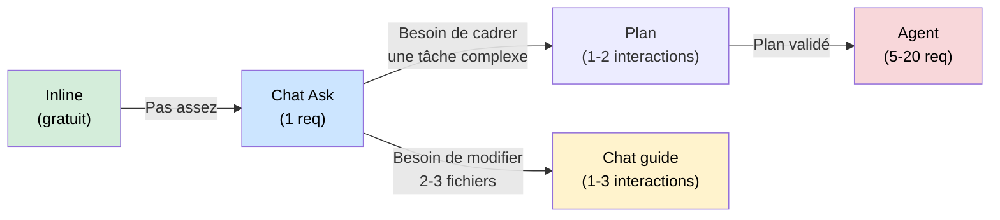
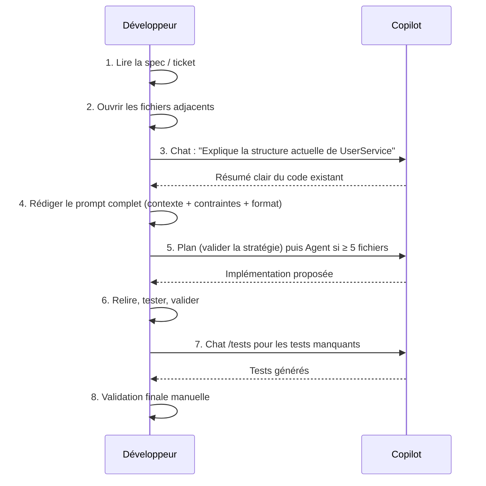
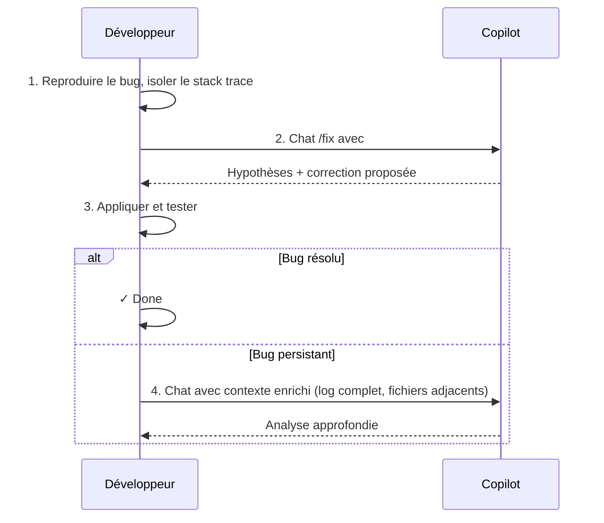

# Workflow recommandé

<span class="badge-expert">Expert</span>

Un workflow efficace avec Copilot, c'est d'abord une séquence de décisions : quel mode, quel modèle, quel niveau de contexte. Ce guide propose une structure journalière et des séquences type pour les tâches les plus courantes.

---

## Principe directeur

```
Toujours commencer par le mode le moins coûteux.
Monter en puissance uniquement si nécessaire.
```



---

## Workflow journalier type

### Début de session — Mise en contexte (5 min)

1. **Ouvrir uniquement les fichiers pertinents** pour la tâche du jour
2. **Vérifier les instructions actives** (`.github/copilot-instructions.md` à jour ?)
3. **Choisir le modèle** : standard pour les tâches légères, premium si une implémentation complexe est prévue

```markdown
# Checklist début de session
□ Fichiers de contexte ouverts (types, interfaces, services voisins)
□ copilot-instructions.md reflète les conventions actuelles
□ Quota premium vérifié si grosse tâche planifiée
```

---

### Séquence type — Implémenter une fonctionnalité



**Budget type :** consommation faible à modérée en AI Credits pour une fonctionnalité moyenne, selon modèle et contexte transmis.

---

### Séquence type — Déboguer un bug



**Règle :** ne pas utiliser Agent Mode pour déboguer avant d'avoir essayé Chat d'abord.

---

### Séquence type — Revue de code

| Étape | Action | Mode |
|-------|--------|------|
| 1 | Sélectionner le bloc à revoir | — |
| 2 | `/explain` pour comprendre l'intention | Chat |
| 3 | Question ciblée : "Y a-t-il des problèmes de sécurité ici ?" | Chat (modèle standard) |
| 4 | Si problème identifié : `/fix` sur la section | Chat |
| 5 | Générer les tests manquants : `/tests` | Chat |

**Budget type :** 2–5 messages avec coût souvent faible si modèle léger et contexte maîtrisé.

---

## Règles de décision rapide

### Le "modèle mental" en 3 questions

```
1. Je sais exactement ce que je veux écrire ?
   → Oui : autocomplétion inline
   → Non : continuer

2. La tâche touche 1 ou 2 fichiers max ?
    → Oui : Chat (modèle standard si la tâche est simple)
   → Non : continuer

3. La tâche nécessite un vrai raisonnement ou traverse 5+ fichiers ?
    → Oui : Plan puis Agent Mode avec modèle adapté
   → Non : revenir à Chat avec contexte enrichi
```

---

## Gestion du budget mensuel

La gestion dépend de votre plan, de vos allocations AI Credits, et de vos politiques de budget.

| Profil d'usage | Plan conseillé | Règle de pilotage |
|---------------|----------------|-------------------|
| Usage modéré solo | Pro | Réserver les modèles premium aux tâches complexes |
| Usage intensif solo | Pro+ | Allouer un budget hebdomadaire et surveiller les pics |
| Équipe | Business | Définir budgets et garde-fous au niveau organisation |
| Grande organisation | Enterprise | Piloter par budgets, observabilité et politiques |

!!! tip "Approche pragmatique"
    Fixer un budget hebdomadaire, puis comparer la consommation réelle à la planification dans [Historique des changements coûts & modèles](historique-modifications.md).

---

## Anti-patterns à éviter

| Anti-pattern | Impact | Solution |
|-------------|--------|----------|
| Relancer Agent Mode pour corriger une erreur de l'agent | ×2 à ×3 le coût | Corriger manuellement si l'erreur est mineure |
| Laisser une conversation ouverte toute la journée | Tokens croissants, réponses lentes | Nouvelles conversations par sujet |
| Utiliser modèle premium pour des questions de syntaxe | Gaspillage pur | Standard ou documentation |
| Demander un scaffold complet avec Agent dès le début | Risque de direction incorrecte | Plan → validation → exécution |
| Ne jamais utiliser l'autocomplétion | Sous-exploitation du mode le plus efficace | 70%+ du code via autocomplétion |

---

## Template de session efficace

```markdown
# Session Copilot — [Date]

## Tâche principale
[Description en 1-2 phrases]

## Fichiers de contexte ouverts
- [ ] [fichier-1.ts]
- [ ] [fichier-2.ts]

## Plan d'exécution
1. Chat /explain sur [composant existant]
2. Plan rapide si ambiguïté de scope
3. Agent ou Chat guidé selon complexité
4. /tests pour la couverture

## Budget estimé
~[N] AI Credits (estimation)
```

Copier ce template dans le chat en début de tâche complexe cadre l'interaction dès le premier message.

---

## Chapitres suivants

**[Outils & Économies](../chapitre-13-outils-economies/index.md)** : découvrir les outils complémentaires à Copilot pour déléguer les tâches légères et préserver vos AI Credits.

**[Appendices](../appendices/index.md)** : ressources de référence complètes — FAQ, raccourcis clavier, templates de configuration prêts à copier-coller.
