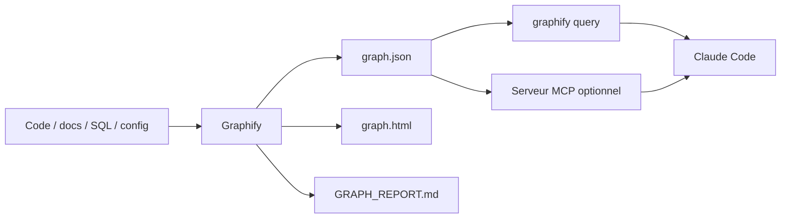

# Graphify — knowledge graph pour comprendre un dépôt

<span class="badge-intermediate">Intermédiaire</span>

**Graphify** transforme un dépôt et ses artefacts associés en **knowledge graph interrogeable**. Pour le code, il s'appuie notamment sur une analyse AST avec Tree-sitter ; il peut aussi intégrer documentation, schémas SQL, configurations et autres fichiers dans le graphe.

La page [Tree-sitter — comprendre et analyser la structure du code](tree-sitter.md) explique le parseur, ses arbres syntaxiques, les queries et leurs limites. Tree-sitter fournit une structure syntaxique ; les relations du graphe demandent un traitement supplémentaire par Graphify.

Cette fiche du chapitre **Outils** regroupe le fonctionnement, la configuration et les limites de l’outil.

!!! warning "Projet tiers"
    Graphify est un projet tiers. Vérifiez sa version, sa licence, ses hooks et les fichiers qu'il installe avant de l'activer dans un dépôt sensible.

---

## Pourquoi un graphe plutôt qu'une simple recherche

Une recherche textuelle répond bien à :

```text
Où apparaît PaymentService ?
```

Un graphe permet de poser des questions plus relationnelles :

```text
Qu'est-ce qui relie PaymentService à RetryPolicy ?
Quels composants dépendent de ce module ?
Quel chemin relie l'API au stockage ?
Quel sera l'impact probable de cette modification ?
```

Graphify distingue les relations extraites directement des sources de celles qu'il infère, ce qui aide à comprendre **pourquoi** une connexion apparaît dans le graphe.

---

## Architecture mentale



Le résultat n'est pas une base vectorielle : Graphify construit un **graphe de relations**.

---

## Installation et intégration Claude Code

Le paquet officiel PyPI est actuellement nommé `graphifyy` — avec deux `y` — tandis que la commande CLI reste `graphify`.

Installation recommandée par le projet :

```bash
uv tool install graphifyy
graphify install
```

Pour une installation projet Claude Code plus stricte :

```bash
graphify install --project --strict
```

Graphify peut installer des instructions/skills et un hook afin d'inciter Claude Code à interroger le graphe avant de lire directement une grande quantité de fichiers.

!!! danger "Relisez toujours les hooks"
    Un hook `PreToolUse` peut influencer ou bloquer des lectures d'outils. Ne versionnez pas automatiquement une configuration générée sans relire le diff.

---

## Construire et interroger le graphe

Le workflow présenté par le projet est volontairement simple :

```text
/graphify .
```

Le dossier de sortie contient notamment :

```text
graphify-out/
├── graph.html
├── GRAPH_REPORT.md
└── graph.json
```

Puis le graphe peut être interrogé depuis le terminal :

```bash
graphify query "show the auth flow"
graphify query "what connects PaymentService to RetryPolicy?"
```

Utilisez ce type de requête pour **réduire l'espace d'exploration** avant de demander à Claude de lire les fichiers concernés.

---

## Exposer Graphify via MCP

Graphify peut également exposer son graphe comme serveur MCP :

```bash
python -m graphify.serve graphify-out/graph.json
```

Cela donne à un client MCP des outils structurés pour :

- rechercher dans le graphe ;
- récupérer un nœud ;
- explorer ses voisins ;
- calculer un chemin ;
- analyser certains impacts de PR selon les fonctions disponibles.

Architecture :

```text
Claude Code
   │
   └── MCP
        │
        └── Graphify server
               │
               └── graph.json
```

Pour une équipe, le projet documente aussi un transport HTTP partagé. Dans ce cas, ajoutez authentification, segmentation réseau et moindre privilège avant d'exposer le service.

---

## Graphify, recherche native et Qdrant

| Besoin | Recherche Claude / `rg` | Graphify | Qdrant |
|---|---:|---:|---:|
| trouver un texte exact | ✅ | secondaire | secondaire |
| trouver un symbole | ✅ | ✅ | ❌ |
| chemin entre composants | limité | ✅ | ❌ |
| dépendances / relations explicites | limité | ✅ | ❌ |
| similarité sémantique | limitée | complément | ✅ |
| recherche dense/sparse | ❌ | ❌ | ✅ |
| filtrage metadata RAG | ❌ | selon modèle | ✅ |

La règle pratique :

- commencez par la recherche native pour une question locale ;
- utilisez Graphify quand la **structure relationnelle** du dépôt devient le problème ;
- utilisez Qdrant lorsque vous avez besoin de **retrieval sémantique** sur un corpus.

---

## Cas d'usage intéressants avec Claude Code

### Cartographier avant un refactoring

```text
1. Interroge le graphe sur le composant cible.
2. Liste les dépendances entrantes et sortantes.
3. Vérifie ensuite les fichiers sources réellement concernés.
4. Propose le plan de refactoring.
5. Exécute les tests après modification.
```

### Explorer un dépôt inconnu

Au lieu de lire des centaines de fichiers :

1. construire le graphe ;
2. identifier les nœuds centraux ;
3. demander les chemins entre les composants clés ;
4. ne charger ensuite que les sources nécessaires.

### Préparer une revue de PR

Un graphe peut aider à identifier les zones connexes qu'un diff local ne montre pas immédiatement. Cela reste une **aide à l'exploration**, pas une preuve que l'impact réel est complet.

---

## Limites et garde-fous

- un graphe obsolète donne une image obsolète du dépôt ;
- une relation inférée doit être vérifiée dans les sources avant une décision critique ;
- les fichiers non analysés ou formats mal compris créent des angles morts ;
- n'utilisez pas Graphify comme autorité sur le comportement runtime ;
- excluez secrets, dumps et données sensibles qui n'ont rien à faire dans le graphe ;
- vérifiez les fichiers ajoutés à `CLAUDE.md`, `.claude/`, `AGENTS.md` ou aux hooks lors de l'installation.

---

## Sources

Source principale consultée le **28 septembre 2026** :

- [Graphify Labs — dépôt officiel Graphify](https://github.com/Graphify-Labs/graphify)

Le dépôt officiel documente notamment l'installation `graphifyy`, l'intégration Claude Code, le mode projet/strict, les sorties `graphify-out/` et le serveur MCP.

## Prochaine étape

Poursuivez avec **[Tree-sitter](tree-sitter.md)**, la page suivante dans le menu.
