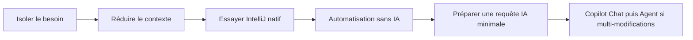

# Outils pour économiser les crédits IA

<span class="badge-intermediate">Intermédiaire</span> <span class="badge-intellij">IntelliJ</span>

Ce chapitre te propose une méthode concrète pour réduire les crédits Copilot consommés dans un workflow IntelliJ. L'objectif est simple : traiter d'abord ce qui est déterministe, local et automatisable. Copilot reste réservé aux tâches complexes à forte valeur.

---

## Objectif du chapitre

Objectif opérationnel : **diminuer les appels IA coûteux** en appliquant une séquence outillée avant d'ouvrir Copilot Chat ou Copilot Agent.

!!! info "Règle globale"
    Si IntelliJ, la CLI ou un outil d'automatisation peut répondre en local, ne consomme pas de crédits IA.

---

## Principe général

1. **Réduire le contexte avant envoi** (logs, diff, arborescence, données).
2. **Exploiter IntelliJ natif en premier** (inspections, refactorings, SSR, navigation).
3. **Industrialiser sans IA** (qualité statique, réécriture, règles d'architecture).
4. **Monter en gamme IA uniquement si nécessaire** (Copilot en dernier recours).

!!! tip "Impact direct"
    Cette séquence évite les prompts trop larges, réduit les allers-retours et limite la consommation en chat/agent.

---

## Famille 1 — Réduire et préparer le contexte

Avant toute interaction IA, prépare un contexte minimal et exploitable.

### RTK
- **Rôle** : compresser et nettoyer les sorties terminales.
- **Cas d'usage** : logs d'erreur volumineux Maven/Gradle/tests.
- **Évite de demander à Copilot** : "résume ces 500 lignes de logs".
- **Impact crédits** : **fort** (moins de tokens envoyés).

### TOON
- **Rôle** : compacter les données tabulaires.
- **Cas d'usage** : exports CSV, tableaux de métriques, résultats batch.
- **Évite de demander à Copilot** : "analyse tout ce tableau brut".
- **Impact crédits** : **fort** sur les prompts data.

### ripgrep (`rg`)
- **Rôle** : rechercher vite et précisément dans le code.
- **Cas d'usage** : retrouver une classe, un appel, une exception.
- **Évite de demander à Copilot** : "où est utilisée cette classe ?" sur tout le repo.
- **Impact crédits** : **moyen à fort**.

### ast-grep
- **Rôle** : recherche syntaxique (AST), pas seulement textuelle.
- **Cas d'usage** : retrouver un pattern de code exact (throw, annotations, appels).
- **Évite de demander à Copilot** : "trouve tous les endroits qui ressemblent à...".
- **Impact crédits** : **fort** en phase de refactor.

### tree
- **Rôle** : visualiser l'arborescence utile.
- **Cas d'usage** : partager la structure d'un module sans tout envoyer.
- **Évite de demander à Copilot** : "explore mon workspace".
- **Impact crédits** : **moyen**.

### jq / yq
- **Rôle** : filtrer JSON/YAML localement.
- **Cas d'usage** : isoler erreurs API, config CI, payloads.
- **Évite de demander à Copilot** : "parse et filtre ce gros JSON/YAML".
- **Impact crédits** : **fort**.

### MCP local de réduction
- **Rôle** : filtrer/résumer localement avant envoi à une IA distante.
- **Cas d'usage** : traces, logs multi-sources, gros diffs.
- **Évite de demander à Copilot** : analyse brute d'un volume non filtré.
- **Impact crédits** : **très fort**.

```bash
rg "OrderService|PaymentTimeout" src/
ast-grep --pattern "throw new $ERR($MSG)" src/
tree -L 2 src/main/java
jq '.errors[] | {code, message, service}' logs.json
```

---

## Famille 2 — Outils IntelliJ à utiliser avant l'IA

Pour IntelliJ, ce sont les gains les plus immédiats **et ces actions ne consomment pas de crédits Copilot**.

- **Inspections** + quick-fixes.
- **Refactorings** : rename, extract method, inline, safe delete, change signature.
- **Structural Search and Replace (SSR)**.
- **Find in Files / Replace in Files**.
- **Find Usages / Call Hierarchy / Type Hierarchy**.
- **Navigate to Class / File / Symbol**.
- **Maven / Gradle tool window** (build, dépendances, tasks).
- **Run tests / Debugger / Coverage**.
- **Git tools IntelliJ** (diff, annotate, historique local).
- **Diagrammes UML** (édition Ultimate).

=== "IntelliJ IDEA"
    Utilise d'abord : `Analyze > Inspect Code`, `Refactor`, SSR, navigation, puis tests/debug. Ces opérations sont locales à l'IDE et n'appellent pas Copilot.

=== "Visual Studio Code"
    L'équivalent existe en partie via extensions/CLI, mais IntelliJ est généralement plus robuste pour l'analyse structurelle Java/Kotlin et les refactorings sûrs.

!!! warning "Erreur fréquente"
    Ouvrir Copilot Chat pour un warning d'inspection que l'IDE peut corriger en 1 clic.

---

## Famille 3 — Automatiser sans IA

Quand la dette technique est répétitive, automatise hors LLM.

- **Qodana** (JetBrains)
- **[SonarQube for IDE + Connected Mode](sonarqube.md)**
- **[SonarQube pour VS Code](sonarqube-vscode.md)**
- **[RTK + SonarQube](rtk-sonar.md)**
- **OpenRewrite**
- **Semgrep**
- **PMD**
- **Checkstyle**
- **SpotBugs**
- **Error Prone**
- **ArchUnit**

### Différence entre les types d'outils

- **Outil déterministe** : même entrée, même sortie (ex. `rg`, `jq`, inspections).
- **Analyse statique** : détecte des problèmes sans exécuter le code (ex. SpotBugs, Semgrep, Qodana).
- **Transformation automatique** : modifie du code via règles explicites (ex. OpenRewrite, SSR).
- **Assistant IA** : propose des solutions probabilistes selon le contexte (Copilot).

!!! info "Lecture rapide"
    Plus un outil est déterministe, plus son coût est prévisible et nul côté crédits Copilot.

!!! success "Approche équipe"
    Mets ces outils en CI pour traiter les problèmes à la source, puis utilise Copilot sur les cas réellement ambigus.

### SonarQube (analyse statique + gouvernance)

- **Rôle** : détecter les bugs, vulnérabilités et code smells avant IA.
- **Coût Copilot** : nul en détection locale et corrections déterministes.
- **Escalade** : Quick Fix Sonar/IntelliJ, puis AI CodeFix Sonar, puis Copilot ciblé.
- **Guide complet IntelliJ** : **[SonarQube — Détecter et corriger sans gaspiller de crédits IA](sonarqube.md)**.
- **Guide VS Code** : **[SonarQube — Détecter et corriger sans gaspiller de crédits IA (VS Code)](sonarqube-vscode.md)**.
- **Guide combiné RTK + SonarQube** : **[Construire un filtre anti-bruit avant Copilot](rtk-sonar.md)**.

---

## Famille 4 — IA locales et alternatives

Conserver les outils existants du chapitre permet de décharger Copilot sur les tâches simples.

- **[Ollama](ollama.md)**
- **[LM Studio](lm-studio.md)**
- **[Continue.dev](continue-dev.md)**
- **[Codeium / Windsurf](codeium-windsurf.md)**
- **[Tabnine](tabnine.md)**
- **[Amazon Q Developer](amazon-q-developer.md)**
- **[Supermaven](supermaven.md)**

### Positionnement par outil

| Outil | Rôle | Avantage économique | Limite | Usage recommandé avec IntelliJ |
|:---:|:---:|:---:|:---:|:---:|
| Ollama | LLM local | Pas de crédit Copilot | Qualité variable selon modèle/machine | Brainstorm local, explication de code non critique |
| LM Studio | Exécution locale de modèles | Coût API nul | Setup et perf machine | Tests de prompts hors production |
| Continue.dev | Pont IDE ↔ modèles locaux/distants | Contrôle fin du routage | Configuration initiale | Complétion/chat local sur fichiers ciblés |
| Codeium / Windsurf | Assistant alternatif | Réduit usage Copilot | Pertinence variable selon langage | Tâches simples de complétion/correction |
| Tabnine | Complétion IA | Bon pour saisie répétitive | Moins fort en raisonnement complexe | Boilerplate, snippets, suggestions rapides |
| Amazon Q Developer | Assistant cloud orienté dev AWS | Peut absorber une partie des usages Copilot | Dépend de l'écosystème AWS | Questions infra/cloud ciblées depuis IntelliJ |
| Supermaven | Complétion rapide | Réduit les interactions chat | Contexte long parfois moins précis | Flux d'écriture continu dans l'éditeur |

!!! note "Positionnement"
    Garde Copilot pour les tâches de raisonnement profond multi-fichiers. Pour le reste, une IA locale ou une alternative gratuite suffit souvent.

---

## Famille 5 — MCP et agents spécialisés

MCP et agents spécialisés sont utiles, mais seulement avec filtrage d'entrée.

- Utilise **MCP** pour brancher des outils dynamiques (API, DB, observabilité).
- Utilise **[MCPs](mcps/index.md)** pour choisir entre la solution locale, les options gratuites et la V2 documentaire.
- Utilise le **MCP SonarQube** pour filtrer/triager les issues par règle avant correction.
- Utilise **[OpenSkills](openskills.md)** pour normaliser les skills portables entre agents.
- N'envoie jamais l'intégralité d'un workspace si seule une sous-zone est utile.

### Parcours MCP

| Page | Rôle |
|---|---|
| [Présentation et choix](mcps/index.md) | Vue d'ensemble, familles et critères de décision |
| [MCP Web local](mcps/configuration.md) | Architecture V1, contrat des outils et sécurité |
| [MCP Web gratuit](mcps/serveurs.md) | Tavily, Firecrawl et usages de secours |
| [Comparaison](mcps/securite.md) | Arbitrage local / gratuit / V1 / V2 |

### Exemples de MCP utiles (filtrage local)

- **Recherche locale ciblée** : ne remonter que les fichiers pertinents.
- **Erreurs Maven/Gradle seulement** : exclure le bruit non build.
- **Fichiers Git modifiés** : limiter l'analyse au diff courant.
- **Documentation projet** : extraire uniquement les pages liées au sujet.
- **Base de connaissance locale** : injecter des réponses validées internes.
- **Résumé compact de module** : architecture, dépendances, points chauds.
- **Recherche d'une documentation officielle** : renvoyer seulement les sources validées et leurs URL canonique.

!!! tip "Rappel important"
    MCP sert d'abord à **filtrer** et **réduire** le contexte avant IA, pas à envoyer plus de données.

!!! danger "Coût caché"
    Un agent spécialisé mal cadré peut consommer plus qu'un chat classique si tu envoies trop de contexte brut.

---

## Tableau de synthèse

| Besoin | Outil recommandé | Consommation IA | À utiliser avant Copilot ? | Gain attendu |
|:---:|:---:|:---:|:---:|:---:|
| Retrouver une classe | `rg`, Navigate to Class, Find Usages | Nulle | Oui | Rapide, zéro chat |
| Comprendre un bug localisé | Debugger IntelliJ, tests ciblés, logs filtrés RTK/jq | Nulle à faible | Oui | Réduction forte des allers-retours IA |
| Corriger un warning | Inspections + quick-fix IntelliJ | Nulle | Oui | Correction immédiate |
| Corriger une issue Sonar | SonarQube for IDE + Quick Fix Sonar/IntelliJ | Nulle à faible | Oui | Très fort sur Java/IntelliJ |
| Refactorer un pattern répétitif | SSR + OpenRewrite + ast-grep | Nulle | Oui | Traitement en masse fiable |
| Migrer une API | OpenRewrite + compil/tests + inspections | Faible | Oui | Migration semi-automatique contrôlée |
| Analyser tout le repo | Qodana + Semgrep + ArchUnit | Nulle | Oui | Vue globale sans prompt géant |
| Faire une revue sécurité | Semgrep + SpotBugs + dépendances outillées | Nulle | Oui | Détection systématique initiale |
| Générer une architecture | Copilot Chat/Agent avec contexte filtré | Élevée | Non (après filtres) | Valeur sur décisions complexes |
| Écrire une documentation | Structure locale + Copilot pour reformulation finale | Moyenne | Oui (préparer plan d'abord) | Texte plus rapide et plus propre |
| Rechercher une documentation officielle | MCP Web local, puis Tavily ou Firecrawl si nécessaire | Variable | Oui, après filtrage des sources | Réponses bornées, sources fiables, contexte réduit |

---

## Workflow recommandé en 6 étapes

1. **Isoler le besoin** (fichiers, erreurs, périmètre exact).
2. **Réduire le contexte** (`rg`, `ast-grep`, RTK, `jq`/`yq`, TOON).
3. **Essayer IntelliJ natif** (inspection, refactor, usages, tests, debug).
4. **Passer par l'automatisation** (SonarQube, Qodana, Semgrep, OpenRewrite, règles qualité).
5. **Préparer une requête IA minimale** :
    - Problème
    - Fichiers concernés
    - Erreurs exactes
    - Résultat attendu
6. **Utiliser Copilot Chat, puis Copilot Agent seulement pour des tâches multi-modifications coordonnées**.



---

## Points clés à retenir

- L'économie de crédits IA se joue d'abord **avant** le prompt.
- Les outils IntelliJ locaux ne consomment pas de crédits Copilot.
- SonarQube est complémentaire de RTK : Sonar détecte, RTK réduit le contexte transmis.
- MCP est un filtre d'entrée : moins de bruit, moins de coût, meilleures réponses.

---

## Prochaine étape

**[RTK — Rust Token Killer](rtk.md)** : mettre en place la compression des sorties terminal pour réduire immédiatement les tokens envoyés aux agents.

Concepts clés couverts :

- **Compression terminal** — réduire massivement le bruit des commandes
- **Hook global** — automatiser l'usage sans friction
- **Mesure des gains** — suivre les économies via `rtk gain`
- **Usage IntelliJ** — bonnes pratiques spécifiques au terminal intégré
