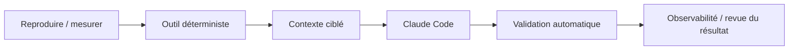

# Outils complémentaires pour Claude Code

<span class="badge-intermediate">Intermédiaire</span>

Ce chapitre présente les outils qui complètent Claude Code : utilitaires déterministes, analyse statique, compression de sorties, MCP, observabilité, GreenOps, architectures event-driven, modèles locaux et agents alternatifs.

**Les fiches détaillées des outils sont regroupées ici.** Les autres chapitres expliquent leur rôle dans un workflow et renvoient vers ces fiches pour l'installation, la configuration et les limites. Le **[catalogue des outils](outils-complementaires.md)** rassemble aussi les utilitaires et frameworks employés dans les exemples.

## Retrouver une fiche

| Famille | Guides dans Outils |
|---|---|
| Réduction du bruit et des tokens | [RTK](rtk.md), [Caveman](caveman.md), [TOON](toon.md) |
| Recherche et structure du code | [Semble](semble.md), [Serena](serena.md), [Graphify](graphify.md), [Tree-sitter](tree-sitter.md) |
| Ingestion et retrieval RAG | [Docling](docling.md), [Qdrant](qdrant.md) |
| Spécifications et workflows | [OpenSpec](openspec.md), [schémas OpenSpec](openspec-schemas.md) |
| Data, ML et Deep Learning | [Jupyter](jupyter.md), [frameworks ML](frameworks-ml.md), [frameworks Deep Learning](frameworks-deep-learning.md) |
| Validation et migrations | [SonarQube](sonarqube.md), [catalogue des outils de validation](outils-complementaires.md#validation-analyse-statique-et-migrations) |
| Connexions et skills | [MCP](mcps/index.md), [OpenSkills](openskills.md) |
| Observabilité et événements | [Grafana, Loki, Kepler](observabilite/index.md), [Solace](solace.md) |
| Modèles locaux et agents alternatifs | [Ollama](ollama.md), [LM Studio](lm-studio.md), [Cline et Kilo](agents-code/index.md), [autres assistants](outils-complementaires.md#autres-assistants-ou-environnements-alternatifs) |

Le bon principe est : **utiliser l'outil le plus fiable et le plus simple pour chaque étape**, puis réserver le raisonnement agentique aux problèmes qui en ont réellement besoin.

---

## Principe général

```text
Outil déterministe / IDE / analyse statique
        ↓
Contexte ciblé et vérifiable
        ↓
Claude Code pour raisonner / modifier
        ↓
Tests, lint, build, analyse statique
        ↓
Observabilité et preuve de validation
```

Un outil local n'est pas automatiquement préférable à Claude, et un appel IA n'est pas automatiquement coûteux ou inutile. La décision dépend de la nature du problème.

---

## 1. Réduire le bruit avec des outils ciblés

### RTK

**[RTK — Rust Token Killer](rtk.md)** compresse les sorties terminales volumineuses afin de réduire le bruit avant analyse.

Cas utiles :

- sorties Maven/Gradle ;
- logs de tests ;
- erreurs de compilation ;
- grands diffs ou rapports textuels.

RTK ne remplace pas `/compact` : l'un transforme une **sortie externe**, l'autre compacte le **contexte de conversation Claude**.

### TOON

**[TOON](toon.md)** vise la représentation compacte de données structurées. Utilisez-le lorsque son format est réellement supporté par votre workflow ; ne convertissez pas des données simplement pour « économiser des tokens » si JSON/CSV filtré est déjà suffisamment lisible.

### Caveman

**[Caveman](caveman.md)** propose un skill de concision, un proxy local et un middleware. Comparez-le à RTK selon la source du bruit : réponses de l'agent ou résultats d'outils. Le chapitre [Coûts & Gouvernance](../chapitre-12-couts-gouvernance/caveman.md) explique comment mesurer leur intérêt budgétaire.

### Graphify

Pour un dépôt volumineux, **[Graphify](graphify.md)** peut construire un knowledge graph afin de cartographier les relations entre code, documentation et configurations. Consultez aussi **[Semble](semble.md)** pour rechercher du code, **[Serena](serena.md)** pour les symboles et références, et **[Tree-sitter](tree-sitter.md)** pour comprendre l'analyse syntaxique utilisée par certains outils.

### CLI déterministes

Outils toujours utiles avant ou pendant une session Claude :

```bash
rg "PaymentTimeout" src/
jq '.errors[] | {code, message}' logs.json
yq '.services.api' config.yaml
tree -L 2 src/
```

Claude Code dispose déjà d'outils de recherche et d'exécution. Ces CLI restent intéressantes lorsqu'une commande précise produit une sortie plus petite, reproductible ou facile à réutiliser dans la CI.

---

## 2. Utiliser l'IDE et l'analyse statique comme sources de vérité

Avant de demander à Claude de « deviner » un problème détectable automatiquement, exploitez :

- compilateur ;
- tests ;
- linter ;
- type checker ;
- inspections IDE ;
- SonarQube ;
- Semgrep ;
- Qodana ;
- SpotBugs / PMD / Checkstyle ;
- OpenRewrite pour des migrations déterministes.

Pages du chapitre :

- **[SonarQube — IntelliJ](sonarqube.md)** ;
- **[SonarQube — VS Code](sonarqube-vscode.md)** ;
- **[RTK + SonarQube](rtk-sonar.md)**.

Claude est particulièrement utile **après** ces outils : interprétation, priorisation, correction multi-fichiers, tests de non-régression et revue du diff.

---

## 3. MCP : connecter Claude à des services externes

MCP n'est pas un simple « compresseur de contexte ». Dans Claude Code, MCP sert à **connecter des outils et services externes** : issue tracker, documentation, base de données, observabilité, API interne, navigateur spécialisé, etc.

```text
Claude Code
   │
   ├── outils intégrés : fichiers, recherche, shell, web
   │
   └── MCP : services/outils externes supplémentaires
```

Configuration projet partagée :

```text
.mcp.json
```

Configuration personnelle possible via la configuration Claude utilisateur.

Claude Code charge les noms d'outils MCP connectés et peut différer le chargement de leurs schémas complets jusqu'à leur utilisation. Les serveurs inactifs ont donc un coût de contexte limité, mais il reste utile de surveiller les connexions avec :

```text
/mcp
```

et de désactiver les serveurs qui ne servent pas au workflow courant.

### Parcours MCP du chapitre

- **[Présentation et choix](mcps/index.md)** ;
- **[Configuration](mcps/configuration.md)** ;
- **[Serveurs et sources externes](mcps/serveurs.md)** ;
- **[Sécurité](mcps/securite.md)**.

!!! warning "Sécurité MCP"
    Un serveur MCP peut exposer des outils capables de lire ou modifier des systèmes externes. Appliquez le principe du moindre privilège, limitez les credentials et relisez les permissions avant d'autoriser des actions sensibles.

---

## 4. Skills et OpenSkills

Claude Code utilise nativement les **skills** dans `.claude/skills/<nom>/SKILL.md`.

La page **[OpenSkills](openskills.md)** documente un outil/format complémentaire visant la portabilité des skills entre agents. Ne confondez pas :

- le mécanisme natif Claude Code ;
- les conventions d'un projet tiers ;
Pour un projet Claude-only, commencez par les skills natifs avant d'ajouter une couche de portabilité.

---

## 5. Observabilité & GreenOps

Un workflow agentique doit être observable comme n'importe quel système distribué.

La nouvelle section **[Observabilité & GreenOps](observabilite/index.md)** couvre :

- **[Grafana](observabilite/grafana.md)** pour dashboards, exploration et alerting ;
- **[Loki](observabilite/loki.md)** pour centraliser et interroger les logs ;
- **[Kepler](observabilite/kepler.md)** pour mesurer la consommation énergétique de workloads Kubernetes.

Architecture typique :

```text
applications / agents
├── métriques → Prometheus → Grafana
└── logs      → Loki       → Grafana

Kubernetes → Kepler → Prometheus → Grafana
```

Cette télémétrie sert de preuve pendant un diagnostic ou une optimisation : Claude peut analyser les données, mais ne doit pas remplacer la mesure.

---

## 6. Architecture event-driven avec Solace

**[Solace](solace.md)** documente le rôle d'un Event Broker/Event Mesh dans des architectures temps réel et la manière dont des agents peuvent être déclenchés par des événements.

Solace et MCP résolvent des problèmes différents :

```text
Event Mesh → distribuer les événements
MCP        → exposer des outils/ressources à un agent
```

Les deux peuvent être combinés via des workflows agentiques lorsque le besoin est réel.

---

## 7. Modèles locaux

Les modèles locaux peuvent être utiles pour :

- données qui ne doivent pas quitter la machine ;
- expérimentations ;
- tâches répétitives simples ;
- fonctionnement hors ligne ;
- maîtrise de l'infrastructure.

Pages disponibles :

- **[Ollama](ollama.md)** ;
- **[LM Studio](lm-studio.md)** ;
- **[Continue.dev](continue-dev.md)** ;
- **[Stack locale VS Code](stack-prete-15-min-vscode.md)** ;
- **[Stack locale IntelliJ](stack-prete-15-min-intellij.md)**.

!!! info "Local ≠ gratuit"
    Le coût se déplace vers la machine, la mémoire, le GPU, l'électricité, le temps d'administration et parfois une qualité de modèle différente. Comparez sur votre workload réel.

---

## 8. Agents de code alternatifs — Cline & Kilo Code

Une section spéciale **[Agents de code alternatifs](agents-code/index.md)** est dédiée à :

- **[Cline](agents-code/cline.md)** ;
- **[Kilo Code](agents-code/kilo-code.md)**.

Ces outils sont des **agent runtimes complets**, pas seulement des modèles. Ils sont particulièrement intéressants pour comparer :

- harness agentique ;
- multi-provider ;
- modèles locaux ;
- IDE/CLI ;
- rules/skills ;
- MCP ;
- politiques d'approbation et gouvernance.

Claude Code reste le parcours principal du dépôt ; Cline et Kilo sont documentés comme alternatives à évaluer sur un même jeu de tâches.

---

## 9. Autres assistants alternatifs et références

Le dépôt conserve également des pages sur :

- **[Codeium / Windsurf](codeium-windsurf.md)** ;
- **[Tabnine](tabnine.md)** ;
- **[Amazon Q Developer / Kiro](amazon-q-developer.md)** ;
- **[Supermaven](supermaven.md)** ;
Ces outils ne sont pas présentés comme des « remplaçants moins chers » par défaut. Leurs offres, modèles, politiques de données et prix changent ; évaluez-les selon :

```text
qualité sur votre code
+ intégration IDE
+ confidentialité
+ gouvernance
+ latence
+ coût réel
+ capacité de vérification
```

Voir **[Comparaison des outils](comparaison.md)** et **[Recommandations par application](recommandations-taille-type-application.md)**.

---

## 10. Choisir le bon outil selon le besoin

| Besoin | Premier outil | Claude Code intervient quand… |
|---|---|---|
| trouver un symbole | IDE / `rg` / code intelligence | la relation nécessite interprétation |
| cartographier les relations d'un gros dépôt | Graphify / outil de code intelligence | il faut vérifier et modifier les sources |
| erreur de compilation | compilateur | il faut comprendre/corriger la cause |
| vulnérabilité statique | Sonar/Semgrep | la correction touche architecture ou logique |
| migration répétitive | OpenRewrite / AST tool | cas particuliers ou revue des transformations |
| gros log | Loki / filtre / RTK / jq | il faut diagnostiquer la cause |
| dashboards / corrélation télémétrie | Grafana | il faut analyser ou automatiser un runbook |
| énergie Kubernetes | Kepler + Prometheus | il faut comparer ou expliquer les mesures |
| service externe | MCP | il faut raisonner ou agir avec les données récupérées |
| événements temps réel multi-systèmes | event broker / Solace selon architecture | il faut déclencher ou alimenter un workflow agentique |
| procédure récurrente | skill Claude | il faut exécuter le workflow contextualisé |
| agent multi-provider | Cline/Kilo selon contraintes | comparer au workflow Claude avec mêmes tests |
| données très sensibles | outil/local model selon politique | seulement si l'accès Claude est autorisé |

---

## 11. Workflow recommandé


```mermaid
graph LR
    A["Reproduire / mesurer"] --> B["Outil déterministe"]
    B --> C["Contexte ciblé"]
    C --> D["Claude Code"]
    D --> E["Validation automatique"]
    E --> F["Observabilité / revue du résultat"]
```

1. reproduire le problème ou formuler le résultat attendu ;
2. utiliser les outils déterministes disponibles ;
3. donner à Claude les preuves utiles, pas tout le bruit ;
4. laisser Claude explorer davantage si nécessaire ;
5. faire exécuter les checks ;
6. mesurer et relire le résultat.

---

## Sources

- [Claude Code — Features overview](https://code.claude.com/docs/en/features-overview) — consulté le 2026-09-28
- [Claude Code — `.claude/` directory](https://code.claude.com/docs/en/claude-directory) — consulté le 2026-09-28
- [Claude Code — MCP](https://code.claude.com/docs/en/mcp) — consulté le 2026-09-28
- [Grafana — documentation](https://grafana.com/docs/grafana/latest/) — consulté le 2026-09-28
- [Cline — site officiel](https://cline.bot/) — consulté le 2026-09-28
- [Kilo Code — documentation](https://kilo.ai/docs) — consulté le 2026-09-28
- [Solace — Event Broker](https://solace.com/products/event-broker/) — consulté le 2026-09-28

---

## Référence en annexe

[Copilot — archive de ce chapitre](../appendices/copilot/chapitre-13-outils-economies.md#page-chapitre-13-outils-economies-index).

## Prochaine étape

Poursuivez avec **[RTK AI](rtk.md)**, la page suivante dans le menu.
