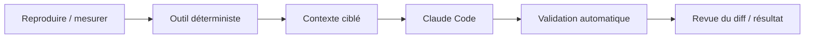

# Outils complémentaires pour Claude Code

<span class="badge-intermediate">Intermédiaire</span>

Ce chapitre présente les outils qui complètent Claude Code : utilitaires déterministes, analyse statique, compression de sorties, MCP, modèles locaux et assistants alternatifs.

L'objectif n'est plus « économiser des crédits Copilot » à tout prix. Le bon principe est : **utiliser l'outil le plus fiable et le plus simple pour chaque étape**, puis réserver le raisonnement agentique aux problèmes qui en ont réellement besoin.

---

## Principe général

```text
Outil déterministe / IDE / analyse statique
        ↓
Contexte ciblé et vérifiable
        ↓
Claude Code pour raisonner / modifier
        ↓
Tests, lint, build, analyse statique
        ↓
Preuve de validation
```

Un outil local n'est pas automatiquement préférable à Claude, et un appel IA n'est pas automatiquement coûteux ou inutile. La décision dépend de la nature du problème.

---

## 1. Préparer un contexte propre

### RTK

**[RTK — Rust Token Killer](rtk.md)** compresse les sorties terminales volumineuses afin de réduire le bruit avant analyse.

Cas utiles :

- sorties Maven/Gradle ;
- logs de tests ;
- erreurs de compilation ;
- grands diffs ou rapports textuels.

RTK ne remplace pas `/compact` : l'un transforme une **sortie externe**, l'autre compacte le **contexte de conversation Claude**.

### TOON

**[TOON](toon.md)** vise la représentation compacte de données structurées. Utilisez-le lorsque son format est réellement supporté par votre workflow ; ne convertissez pas des données simplement pour « économiser des tokens » si JSON/CSV filtré est déjà suffisamment lisible.

### CLI déterministes

Outils toujours utiles avant ou pendant une session Claude :

```bash
rg "PaymentTimeout" src/
jq '.errors[] | {code, message}' logs.json
yq '.services.api' config.yaml
tree -L 2 src/
```

Claude Code dispose déjà d'outils de recherche et d'exécution. Ces CLI restent intéressantes lorsqu'une commande précise produit une sortie plus petite, reproductible ou facile à réutiliser dans la CI.

---

## 2. Utiliser l'IDE et l'analyse statique comme sources de vérité

Avant de demander à Claude de « deviner » un problème détectable automatiquement, exploitez :

- compilateur ;
- tests ;
- linter ;
- type checker ;
- inspections IDE ;
- SonarQube ;
- Semgrep ;
- Qodana ;
- SpotBugs / PMD / Checkstyle ;
- OpenRewrite pour des migrations déterministes.

Pages du chapitre :

- **[SonarQube — IntelliJ](sonarqube.md)** ;
- **[SonarQube — VS Code](sonarqube-vscode.md)** ;
- **[RTK + SonarQube](rtk-sonar.md)**.

Claude est particulièrement utile **après** ces outils : interprétation, priorisation, correction multi-fichiers, tests de non-régression et revue du diff.

---

## 3. MCP : connecter Claude à des services externes

MCP n'est pas un simple « compresseur de contexte ». Dans Claude Code, MCP sert à **connecter des outils et services externes** : issue tracker, documentation, base de données, observabilité, API interne, navigateur spécialisé, etc.

```text
Claude Code
   │
   ├── outils intégrés : fichiers, recherche, shell, web
   │
   └── MCP : services/outils externes supplémentaires
```

Configuration projet partagée :

```text
.mcp.json
```

Configuration personnelle possible via la configuration Claude utilisateur.

Claude Code charge les noms d'outils MCP connectés et peut différer le chargement de leurs schémas complets jusqu'à leur utilisation. Les serveurs inactifs ont donc un coût de contexte limité, mais il reste utile de surveiller les connexions avec :

```text
/mcp
```

et de désactiver les serveurs qui ne servent pas au workflow courant.

### Parcours MCP du chapitre

- **[Présentation et choix](mcps/index.md)** ;
- **[Configuration](mcps/configuration.md)** ;
- **[Serveurs et sources externes](mcps/serveurs.md)** ;
- **[Sécurité](mcps/securite.md)**.

!!! warning "Sécurité MCP"
    Un serveur MCP peut exposer des outils capables de lire ou modifier des systèmes externes. Appliquez le principe du moindre privilège, limitez les credentials et relisez les permissions avant d'autoriser des actions sensibles.

---

## 4. Skills et OpenSkills

Claude Code utilise nativement les **skills** dans `.claude/skills/<nom>/SKILL.md`.

La page **[OpenSkills](openskills.md)** documente un outil/format complémentaire visant la portabilité des skills entre agents. Ne confondez pas :

- le mécanisme natif Claude Code ;
- les conventions d'un projet tiers ;
- la compatibilité éventuelle avec Copilot ou d'autres agents.

Pour un projet Claude-only, commencez par les skills natifs avant d'ajouter une couche de portabilité.

---

## 5. Modèles locaux

Les modèles locaux peuvent être utiles pour :

- données qui ne doivent pas quitter la machine ;
- expérimentations ;
- tâches répétitives simples ;
- fonctionnement hors ligne ;
- maîtrise de l'infrastructure.

Pages disponibles :

- **[Ollama](ollama.md)** ;
- **[LM Studio](lm-studio.md)** ;
- **[Continue.dev](continue-dev.md)** ;
- **[Stack locale VS Code](stack-prete-15-min-vscode.md)** ;
- **[Stack locale IntelliJ](stack-prete-15-min-intellij.md)**.

!!! info "Local ≠ gratuit"
    Le coût se déplace vers la machine, la mémoire, le GPU, l'électricité, le temps d'administration et parfois une qualité de modèle différente. Comparez sur votre workload réel.

---

## 6. Assistants alternatifs et Copilot

Le dépôt conserve des pages sur :

- **[Codeium / Windsurf](codeium-windsurf.md)** ;
- **[Tabnine](tabnine.md)** ;
- **[Amazon Q Developer](amazon-q-developer.md)** ;
- **[Supermaven](supermaven.md)** ;
- GitHub Copilot dans ses chapitres dédiés.

Ces outils ne sont pas présentés comme des « remplaçants moins chers » par défaut. Leurs offres, modèles, politiques de données et prix changent ; évaluez-les selon :

```text
qualité sur votre code
+ intégration IDE
+ confidentialité
+ gouvernance
+ latence
+ coût réel
+ capacité de vérification
```

Voir **[Comparaison des outils](comparaison.md)** et **[Recommandations par application](recommandations-taille-type-application.md)**.

---

## 7. Choisir le bon outil selon le besoin

| Besoin | Premier outil | Claude Code intervient quand… |
|---|---|---|
| trouver un symbole | IDE / `rg` / code intelligence | la relation nécessite interprétation |
| erreur de compilation | compilateur | il faut comprendre/corriger la cause |
| vulnérabilité statique | Sonar/Semgrep | la correction touche architecture ou logique |
| migration répétitive | OpenRewrite / AST tool | cas particuliers ou revue des transformations |
| gros log | filtre/RTK/jq | il faut diagnostiquer la cause |
| service externe | MCP | il faut raisonner ou agir avec les données récupérées |
| procédure récurrente | skill Claude | il faut exécuter le workflow contextualisé |
| données très sensibles | outil/local model selon politique | seulement si l'accès Claude est autorisé |

---

## 8. Workflow recommandé


```mermaid
graph LR
    A["Reproduire / mesurer"] --> B["Outil déterministe"]
    B --> C["Contexte ciblé"]
    C --> D["Claude Code"]
    D --> E["Validation automatique"]
    E --> F["Revue du diff / résultat"]
```

1. reproduire le problème ou formuler le résultat attendu ;
2. utiliser les outils déterministes disponibles ;
3. donner à Claude les preuves utiles, pas tout le bruit ;
4. laisser Claude explorer davantage si nécessaire ;
5. faire exécuter les checks ;
6. relire le résultat.

---

## GitHub Copilot — référence conservée

Les outils de ce chapitre peuvent aussi compléter Copilot. Les anciennes formulations centrées sur « économiser les AI Credits Copilot » sont conservées uniquement dans les pages de facturation Copilot lorsque cela est pertinent ; le chapitre Outils est désormais indépendant du fournisseur principal.

---

## Sources

- [Claude Code — Features overview](https://code.claude.com/docs/en/features-overview) — consulté le 2026-09-28
- [Claude Code — `.claude/` directory](https://code.claude.com/docs/en/claude-directory) — consulté le 2026-09-28
- [Claude Code — MCP](https://code.claude.com/docs/en/mcp) — consulté le 2026-09-28

## Prochaine étape

**[RTK — Rust Token Killer](rtk.md)** : évaluer la compression des sorties terminales avant de poursuivre vers MCP, analyse statique et modèles locaux.