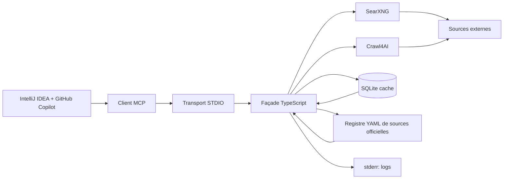

# MCP Web local

<span class="badge-expert">Expert</span> <span class="badge-intellij">IntelliJ</span>

Cette page décrit la **cible documentaire** `mcp-search-net`. Elle expose une architecture et un cahier des charges, pas nécessairement un logiciel déjà livré dans ce dépôt.

---

## Positionnement

L’objectif de la V1 est de proposer un pont MCP local, lisible et borné, pour rechercher une documentation officielle et récupérer des pages connues sans exposer plus de contexte que nécessaire.

La V1 ne repose sur **aucune API commerciale obligatoire** : elle doit rester exploitable localement avec les composants documentés ici.

!!! info "Périmètre"
    Rien dans cette page ne doit être interprété comme une promesse de livraison du futur dépôt `mcp-search-net`. Ici, on documente seulement la cible, le contrat et les garde-fous.

---

## Architecture V1



| Composant | Rôle | Remarque |
|---|---|---|
| Façade TypeScript | Orchestration et filtrage | Pas de logique métier lourde |
| STDIO | Transport principal | Sorties du protocole sur `stdout` |
| SearXNG | Recherche web | Découverte bornée de sources |
| Crawl4AI | Récupération / extraction | Lecture ciblée de pages connues |
| SQLite | Cache local | Accélère les répétitions |
| Registre YAML | Gouvernance des sources | Liste validée, sans secret |

!!! warning "Aucun LLM interne en V1"
    La V1 ne doit pas embarquer de modèle local pour raisonner à la place du client. Le serveur prépare, filtre et compacte le contexte ; il ne remplace pas l’agent principal.

---

## Outils V1

### `search_web`

`search_web` sert à **découvrir** des sources à partir de mots-clés. Il doit renvoyer des résultats courts, comparables et faciles à relire.

| Paramètre | Valeur attendue |
|---|---|
| Politique par défaut | `prefer` |
| Politique de source | `strict`, `prefer`, `any` |
| Domaines autorisés | Liste bornée |
| Domaines exclus | Liste bornée |
| Langue | Selon la requête, sinon valeur explicite |
| Filtre temporel | Optionnel et borné |
| Résultats par défaut | 5 |
| Résultats maximum | 10 |
| Champs conservés | Titre, URL, domaine, statut, score |

!!! tip "Bon usage"
    Utilise `search_web` pour trouver la bonne page, puis passe à `fetch_url` seulement si l’URL est déjà identifiée.

### `fetch_url`

`fetch_url` sert à **lire** une URL connue. Il doit extraire uniquement les sections utiles et ne jamais devenir un mini-crawler.

| Paramètre | Valeur attendue |
|---|---|
| Sections par défaut | 5 |
| Sections maximum | 10 |
| Taille par défaut | 12 000 caractères |
| Taille maximum | 30 000 caractères |
| Mode | `static` ou `auto` |
| JavaScript arbitraire | Interdit |
| Suivi automatique des liens | Interdit |
| `followLinks` public | Inexistant en V1 |
| Crawl | Interdit |

!!! note "Pourquoi séparer les deux outils"
    `search_web` découvre. `fetch_url` lit. Cette séparation évite d’exposer trop de contenu, limite le contexte envoyé à Copilot et réduit les appels inutiles. Crawl4AI reste interne à la façade ; Copilot ne voit que les deux outils V1.

---

## Statut des sources

| Statut | Signification |
|---|---|
| `VERIFIED_OFFICIAL` | Domaine officiel confirmé et pertinent pour la page |
| `LIKELY_OFFICIAL` | Domaine très probable, mais à revalider si le contenu est critique |
| `THIRD_PARTY` | Source utile, mais non officielle |
| `UNKNOWN` | Source non classée ou insuffisamment fiable |

!!! warning "Positionnement du classement"
    Un résultat en première position n’est pas automatiquement officiel. Le classement dépend de la requête, du moteur et des signaux de pertinence.

---

## Registre YAML

Exemple documentaire sans secret :

```yaml
sources:
  github:
    status: VERIFIED_OFFICIAL
    domains:
      - docs.github.com
  jetbrains:
    status: VERIFIED_OFFICIAL
    domains:
      - www.jetbrains.com
      - plugins.jetbrains.com
  mcp:
    status: VERIFIED_OFFICIAL
    domains:
      - modelcontextprotocol.io
      - spec.modelcontextprotocol.io
  java_openjdk:
    status: VERIFIED_OFFICIAL
    domains:
      - openjdk.org
      - jdk.java.net
      - docs.oracle.com
  quarkus:
    status: VERIFIED_OFFICIAL
    domains:
      - quarkus.io
      - docs.quarkus.io
  sonar:
    status: VERIFIED_OFFICIAL
    domains:
      - docs.sonarsource.com
      - sonarsource.com
  maven:
    status: VERIFIED_OFFICIAL
    domains:
      - maven.apache.org
  javafx:
    status: VERIFIED_OFFICIAL
    domains:
      - openjfx.io
```

---

## Cache

- Recherche : environ **1 heure** par défaut.
- Documentation : environ **24 heures** par défaut.
- Les validations HTTP doivent exploiter `ETag` et `Last-Modified` quand ils existent.
- Un hash de contenu permet de détecter les changements réels.
- Le cache doit être désactivable.
- Le cache V1 reste un cache d’accès et d’extraction ; le cache V2 devient un cache d’index et de fraîcheur documentaire.

!!! tip "Bon compromis"
    Un bon cache réduit les appels, mais il ne doit pas masquer les mises à jour officielles. Pour les sources critiques, un délai court et une revalidation restent préférables.

---

## Sécurité

- Autoriser uniquement `http` et `https`.
- Bloquer `localhost`.
- Bloquer les réseaux privés.
- Bloquer les adresses link-local.
- Vérifier le DNS avant et pendant la récupération.
- Revalider chaque redirection.
- Limiter la taille de la réponse.
- Appliquer un timeout court.
- Nettoyer le HTML avant l’extraction.
- Considérer tout contenu externe comme non fiable.
- Réserver `stdout` au protocole STDIO.
- Envoyer les logs sur `stderr`.

!!! danger "SSRF"
    Un serveur MCP web qui ne borne pas ses destinations peut devenir une surface SSRF. Les filtres réseau et DNS font partie du contrat, pas d’un détail d’implémentation.

---

## Formats pris en charge

| V1 | Hors V1 |
|---|---|
| HTML | OCR |
| Markdown | Connexion authentifiée à des formulaires |
| Texte | CAPTCHA |
| JSON | Crawl complet sans borne |
| XML | Base vectorielle |
| YAML | Embeddings |
| README GitHub | Automatisation générale de navigateur |
| PDF textuel |  |
| Sitemap |  |
| `robots.txt` |  |
| `llms.txt` |  |

---

## Environnement

| Élément | Statut / remarque |
|---|---|
| IntelliJ IDEA | IDE principal de référence |
| GitHub Copilot | Client IA principal |
| Node.js LTS | Version à vérifier au moment de l’implémentation |
| npm | Gestionnaire de paquets de référence |
| Docker Desktop | Environnement local de travail |
| Docker Compose | Orchestration locale de V1 |
| Windows | Poste de référence du dépôt |
| Linux | Portabilité attendue |
| IDE obligatoire pour construire et tester | Non |

!!! note "Portabilité"
    Le cahier des charges doit rester testable depuis la ligne de commande, même si IntelliJ IDEA reste l’environnement principal du dépôt.

---

## V2 documentaire

La V2 vise un index documentaire local plus riche.

- Indexation.
- Catalogue.
- Recherche multi-document.
- Synchronisation du corpus.
- Gestion des versions.
- Statut de fraîcheur.
- Priorité à SQLite FTS5 ou BM25 avant les embeddings.
- Réduction du risque d’obsolescence documentaire.

!!! warning "Risque principal"
    Le risque de V2 n’est pas seulement technique. C’est surtout l’obsolescence du corpus si les sources ne sont pas revalidées régulièrement.

---

## Sources

- [Model Context Protocol](https://modelcontextprotocol.io/)
- [MCP Specification](https://spec.modelcontextprotocol.io/)
- [GitHub Copilot documentation](https://docs.github.com/copilot)
- [GitHub Copilot et MCP dans l’IDE](https://docs.github.com/en/copilot/how-tos/provide-context/use-mcp-in-your-ide/extend-copilot-chat-with-mcp)
- [Documentation SearXNG](https://docs.searxng.org/)
- [Documentation Crawl4AI](https://docs.crawl4ai.com/)
- [Docker Compose](https://docs.docker.com/compose/)
- [Node.js releases](https://nodejs.org/en/about/releases/)
- [TypeScript documentation](https://www.typescriptlang.org/docs/)

---

## Prochaine étape

**[MCP Web gratuit et à quota](./serveurs.md)** : comparer Tavily et Firecrawl pour les besoins simples, les cas de secours et les extractions plus complexes.

Concepts clés couverts :

- **V1 locale** — façade TypeScript, STDIO et cache SQLite
- **Outillage borné** — peu d’outils, résultats compacts
- **Sécurité réseau** — bloquer les cibles risquées et contrôler les redirections
- **V2 documentaire** — indexer et suivre la fraîcheur du corpus


