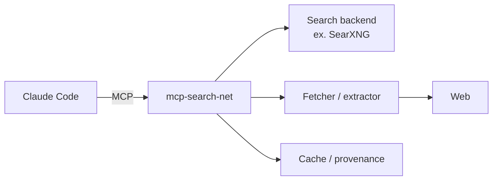

# MCP Web local — design `mcp-search-net`

<span class="badge-expert">Expert</span>

Cette page décrit la **cible documentaire** `mcp-search-net` : un serveur MCP local de recherche et récupération Web bornée. Il s'agit d'un design et d'un contrat d'outils, pas d'une promesse qu'un serveur complet est déjà livré dans ce dépôt.

Le client principal documenté est désormais **Claude Code**.

---

## Objectif

Le serveur doit permettre à Claude de :

- rechercher des sources candidates ;
- récupérer une URL déjà identifiée ;
- extraire uniquement le contenu utile ;
- conserver la provenance ;
- appliquer des garde-fous réseau ;
- éviter les sorties inutilement volumineuses.

Il ne doit pas devenir un navigateur autonome généraliste ni un crawler sans borne.

---

## Architecture cible


```mermaid
graph LR
    C["Claude Code"] -->|MCP| S["mcp-search-net"]
    S --> Q["Search backend\nex. SearXNG"]
    S --> F["Fetcher / extractor"]
    F --> W["Web"]
    S --> K["Cache / provenance"]
```

Composants possibles :

- façade MCP en TypeScript/Node ;
- moteur de recherche local ou distant ;
- récupérateur HTTP avec validation stricte des URL ;
- extracteur HTML → texte/Markdown ;
- cache léger ;
- journal d'audit sans secrets.

Le choix exact des bibliothèques est secondaire par rapport au contrat de sécurité et de sortie.

---

## Contrat minimal d'outils

Une V1 raisonnable peut rester très petite.

### `search_web`

Entrées :

```json
{
  "query": "Claude Code MCP security",
  "allowedDomains": ["code.claude.com"],
  "maxResults": 5
}
```

Sortie attendue :

```json
{
  "results": [
    {
      "title": "...",
      "url": "https://...",
      "snippet": "..."
    }
  ]
}
```

### `fetch_url`

Entrées :

```json
{
  "url": "https://code.claude.com/docs/en/mcp",
  "maxCharacters": 12000
}
```

Sortie : contenu nettoyé + URL canonique + métadonnées minimales.

!!! tip "Deux outils valent mieux qu'un crawler opaque"
    Séparer découverte et récupération rend les permissions, logs et limites plus lisibles.

---

Les noms camelCase des exemples ci-dessus correspondent à l’interface MCP disponible pendant cet audit ; un autre serveur peut publier un contrat différent. Pour un catalogue documentaire, complétez avec `search_docs` puis `read_doc_section`. Validez le schéma annoncé par le serveur plutôt que de supposer que tous les MCP Web utilisent les mêmes arguments.

## Intégration Claude Code

Pour un serveur projet partagé, utilisez `.mcp.json` à la racine du dépôt.

Exemple conceptuel pour un serveur `stdio` :

```json
{
  "mcpServers": {
    "search-net": {
      "type": "stdio",
      "command": "node",
      "args": ["./tools/mcp-search-net/dist/index.js"]
    }
  }
}
```

!!! warning "Exemple à adapter"
    Vérifiez toujours le format courant de la documentation Claude MCP avant copie dans un environnement de production. Ne stockez pas de secret directement dans `.mcp.json` versionné.

Dans Claude Code :

```text
/mcp
```

permet de vérifier la connexion et l'authentification.

---

## Sorties et coût de contexte

Le serveur doit renvoyer **le minimum suffisant** :

- quelques résultats de recherche ;
- extraits courts ;
- contenu nettoyé ;
- limites de taille explicites ;
- possibilité de demander la suite plutôt que tout renvoyer.

Claude Code avertit lorsque des réponses MCP deviennent très volumineuses et expose des mécanismes de contrôle de taille côté client. Le serveur doit malgré tout borner ses propres sorties : la sécurité et la qualité ne doivent pas dépendre uniquement du client.

---

## Garde-fous SSRF

Pour `fetch_url`, bloquez par défaut :

- `localhost` ;
- loopback IPv4/IPv6 ;
- réseaux privés RFC1918 ;
- link-local ;
- metadata endpoints cloud ;
- schémas autres que HTTP(S) sauf besoin explicite ;
- redirections vers une destination interdite.

Validez **chaque redirection**, pas seulement l'URL initiale.

---

## Prompt injection Web

Le contenu récupéré est **non fiable**. Une page peut contenir des instructions destinées à détourner un agent.

Le serveur peut aider en :

- séparant métadonnées et contenu ;
- supprimant scripts/styles inutiles ;
- conservant la provenance ;
- n'exécutant jamais le contenu de la page ;
- évitant de transformer une page en instruction système.

Claude doit traiter le texte récupéré comme **donnée**, pas comme autorité sur les instructions de la session.

---

## Secrets et environnement des subprocess

Un serveur `stdio` local est un subprocess. Évitez qu'il hérite de credentials dont il n'a pas besoin.

Claude Code fournit notamment des options de durcissement de l'environnement des subprocess/MCP. Dans un contexte sensible, utilisez une allowlist d'environnement ou le mécanisme de scrubbing recommandé par la documentation actuelle.

Principe :

```text
MCP search Web
→ pas besoin d'ANTHROPIC_API_KEY
→ ne pas lui transmettre cette variable
```

---

## Cache et provenance

Si un cache est utilisé, conservez au minimum :

```text
URL canonique
horodatage de récupération
status HTTP
content-type
hash du contenu
```

Ne présentez pas un document mis en cache comme « actuel » sans afficher sa date de récupération.

---

## Tests du serveur

### Fonctionnels

- recherche bornée ;
- récupération HTML ;
- redirection valide ;
- page vide ;
- timeout ;
- contenu trop volumineux.

### Sécurité

- localhost bloqué ;
- `127.0.0.1` bloqué ;
- `::1` bloqué ;
- IP privée après résolution DNS bloquée ;
- redirection vers IP privée bloquée ;
- credentials absents des logs ;
- schémas non autorisés refusés.

### Contrat MCP

- schémas d'entrée stricts ;
- erreurs structurées ;
- timeouts ;
- sortie bornée ;
- arrêt propre du serveur.

---

## Ce que la V1 ne doit pas faire

- crawl récursif sans limite ;
- contourner CAPTCHA/paywall ;
- exécuter JavaScript arbitraire par défaut ;
- écrire sur des sites distants ;
- recevoir tous les secrets du shell ;
- résumer avec un second LLM interne sans besoin explicite ;
- masquer l'URL source.

---

## Sources

- [Claude Code — MCP](https://code.claude.com/docs/en/mcp) — consulté le 2026-09-28
- [Claude Code — Environment variables](https://code.claude.com/docs/en/env-vars) — consulté le 2026-09-28
- [Model Context Protocol](https://modelcontextprotocol.io/) — consulté le 2026-09-28

---

## Squelette de configuration projet

Le [template .mcp.json](../../chapitre-4-contexte/templates-configuration.md#template-mcp) fournit un squelette sans credential réel.

## Référence en annexe

[Copilot — archive de ce chapitre](../../appendices/copilot/chapitre-13-outils-economies.md#page-chapitre-13-outils-economies-mcps-configuration).

## Prochaine étape

Poursuivez avec **[MCP Web gratuit](serveurs.md)**, la page suivante dans le menu.
