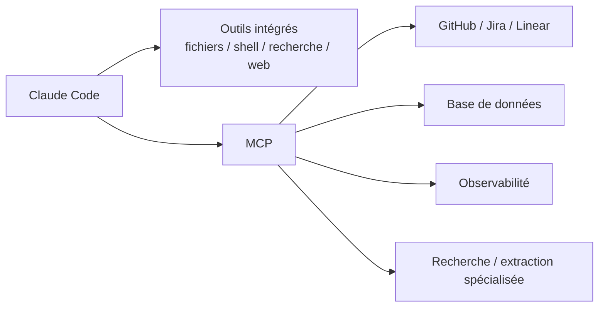

# MCP avec Claude Code — présentation et choix

<span class="badge-intermediate">Intermédiaire</span>

MCP (**Model Context Protocol**) permet à Claude Code de se connecter à des **services et outils externes**. Il ne s'agit pas seulement de « filtrer du contexte » : un serveur MCP peut lire des données, lancer des recherches, interroger une API, accéder à un ticketing ou effectuer des actions selon les outils qu'il expose.

---

## Où MCP se place dans Claude Code

Claude Code dispose déjà d'outils intégrés pour les fichiers, la recherche, le shell et le web. Ajoutez MCP lorsqu'une capacité externe manque réellement.



| Concept | Rôle |
|---|---|
| Client | Claude Code |
| Serveur MCP | processus/service exposant des capacités |
| Tool | action invocable par Claude |
| Resource | donnée exposée par le serveur |
| Transport | mécanisme de communication du serveur |

---

## Configuration projet et personnelle

Pour un serveur partagé avec l'équipe, Claude Code peut utiliser un fichier projet :

```text
.mcp.json
```

Ce fichier est versionnable lorsqu'il ne contient pas de secrets.

Les serveurs personnels peuvent aussi être gérés dans la configuration utilisateur Claude.

Dans une session :

```text
/mcp
```

permet de gérer les connexions et l'authentification MCP.

---

## Coût de contexte

Claude Code charge les noms des outils MCP connectés et peut différer le chargement des schémas complets jusqu'à ce qu'un outil soit nécessaire. Un serveur inactif n'a donc pas le même coût qu'un gros bloc de contexte injecté à chaque tour.

Cela ne dispense pas de discipline :

- trop de serveurs rendent l'environnement plus complexe ;
- des outils aux descriptions ambiguës peuvent être mal sélectionnés ;
- une réponse MCP volumineuse peut gonfler le contexte ;
- un serveur déconnecté peut faire disparaître ses outils en cours de session.

Utilisez `/mcp` pour contrôler l'état des serveurs et déconnectez ceux qui ne sont pas nécessaires.

---

## Quand utiliser MCP

MCP est adapté lorsque Claude doit :

- lire une issue ou un ticket sans copier-coller ;
- interroger une base ou une API interne ;
- récupérer des métriques d'observabilité ;
- consulter une documentation privée ;
- contrôler un navigateur spécialisé ;
- écrire dans un service externe avec des permissions explicites.

MCP est moins utile si la même information est déjà facilement accessible par :

- les fichiers du dépôt ;
- une commande CLI ;
- un script local simple ;
- les outils web natifs disponibles.

---

## Le cas `mcp-search-net` de ce dépôt

Le sous-chapitre conserve une **architecture documentaire** pour un MCP de recherche/extraction Web local nommé `mcp-search-net`.

Objectifs de cette architecture :

- recherche bornée ;
- récupération d'URL identifiées ;
- sorties compactes ;
- sécurité SSRF ;
- provenance des sources ;
- pas de secret dans le dépôt.

!!! info "Cible documentaire"
    Les pages décrivent un design et un contrat d'outils. Elles ne doivent pas laisser entendre qu'un serveur complet est déjà livré dans ce dépôt si ce n'est pas le cas.

---

## Local vs distant

| Option | Atout principal | Point de vigilance |
|---|---|---|
| serveur local `stdio` | contrôle de l'exécution locale | dépendances et environnement du poste |
| serveur distant | partage et maintenance centralisée | auth, réseau, confiance du fournisseur |
| API tierce via MCP | mise en route rapide | quotas, coûts, données transmises |
| index documentaire local | réutilisation d'un corpus interne | fraîcheur et maintenance de l'index |

Ne choisissez pas sur le seul critère « gratuit ». Évaluez sécurité, disponibilité, maintenance, qualité et coût réel.

---

## Sécurité minimale

Pour tout MCP :

- principe du moindre privilège ;
- secrets hors Git ;
- outils d'écriture séparés des outils de lecture si possible ;
- confirmation avant action destructive ;
- contenu externe considéré comme non fiable ;
- validation des URL/redirections côté serveur Web ;
- logs sans credentials ;
- scope projet seulement si le serveur doit être partagé.

Pour un serveur `stdio`, évitez de lui transmettre inutilement tout l'environnement du processus parent. Claude Code fournit des options de durcissement pour réduire l'héritage de credentials par les subprocess.

---

## Navigation

| Page | Rôle |
|---|---|
| [MCP Web local](configuration.md) | architecture `mcp-search-net` et intégration Claude |
| [Serveurs externes](serveurs.md) | exemples de services de recherche/extraction |
| [Sécurité et choix](securite.md) | menaces, permissions et arbitrage local/distant |

---

## GitHub Copilot — référence conservée

Copilot supporte également MCP dans certains environnements. Les mêmes serveurs peuvent parfois être réutilisables, mais la configuration, les permissions et les surfaces disponibles ne doivent pas être supposées identiques. Le parcours principal de ce chapitre utilise désormais Claude Code.

---

## Sources

- [Claude Code — MCP](https://code.claude.com/docs/en/mcp) — consulté le 2026-09-28
- [Claude Code — Features overview](https://code.claude.com/docs/en/features-overview) — consulté le 2026-09-28
- [Claude Code — `.claude/` directory](https://code.claude.com/docs/en/claude-directory) — consulté le 2026-09-28
- [Model Context Protocol](https://modelcontextprotocol.io/) — consulté le 2026-09-28

## Prochaine étape

**[MCP Web local](configuration.md)** : définir un serveur local de recherche/extraction borné et l'intégrer proprement à Claude Code.