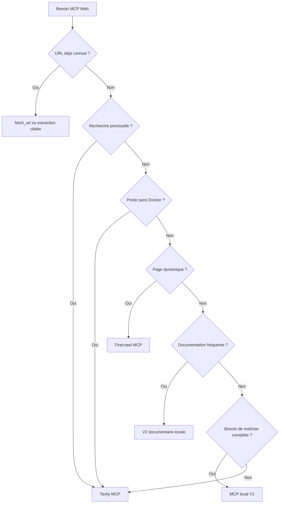

# Comparaison — local, gratuit, V1 et V2

Intermédiaire

Cette page aide à choisir entre la solution locale, les options gratuites et l’évolution V1/V2. Elle résume les compromis principaux sans répéter les guides détaillés.

---

## Méthode de comparaison

On compare trois axes :

1. **Maîtrise** : contrôle des sources, du réseau et du contexte.
2. **Coût** : coût direct, quota, exploitation et maintenance.
3. **Pertinence** : recherche, extraction, pages dynamiques et fraîcheur.

!!! tip "Règle de décision"
    Si tu veux d’abord réduire le contexte et garder le contrôle, la solution locale est la base. Si tu veux aller vite, Tavily peut suffire. Si la page est dynamique ou difficile à extraire, Firecrawl devient plus intéressant. La V2 n’a de sens que si le corpus local doit être réutilisé souvent.

---

## Solution locale contre solution gratuite

| Critère | Solution locale | Solution gratuite |
|---|---|---|
| Coût | Principalement local | Variable, quota dépendant |
| Maîtrise | Forte | Moyenne |
| Confidentialité | Bonne si le réseau est bien borné | Plus faible car service externe |
| Installation | Plus longue | Plus rapide |
| Maintenance | Locale à assumer | Externalisée en partie |
| Recherche | Bonne si bien configurée | Bonne pour démarrer |
| Extraction | Bornée et ciblée | Variable selon le service |
| Pages dynamiques | Dépend de Crawl4AI et du cadrage | Souvent meilleur que le local brut |
| Quota | Pas de quota fournisseur | Quota et limites à vérifier |
| Dépendance fournisseur | Faible | Forte |
| Réduction du contexte | Très bonne si le serveur est strict | Correcte si bien bornée |
| Disponibilité hors ligne | Partielle ou locale | Non |
| Risque d’obsolescence | Lié au corpus local | Lié à l’évolution du service |
| Public recommandé | Équipe qui veut maîtriser | Lecture rapide, test, secours |

---

## Tavily contre Firecrawl

| Critère | Tavily | Firecrawl |
|---|---|---|
| Recherche documentaire | Très adapté | Adapté |
| Extraction | Basique à ciblée | Plus avancée |
| Pages dynamiques | Limité | Meilleur choix |
| Simplicité | Plus simple | Un peu plus riche |
| Quotas | À vérifier | À vérifier |
| Confidentialité | Dépend du service externe | Dépend du service externe |
| Cas d’usage | Recherche rapide, secours | Extraction, pages riches, crawl contrôlé |

!!! note "Ne pas surcharger le serveur"
    Un serveur gratuit trop permissif peut devenir plus coûteux qu’utile si tu lui demandes de trop larges extractions ou si tu lui exposes trop d’outils.

---

## V1 contre V2

| Critère | V1 locale | V2 documentaire |
|---|---|---|
| Recherche Web | Oui | Oui, mais absorbée par l’index local |
| Extraction | Oui | Oui |
| Cache | Oui | Oui, plus riche |
| Indexation | Non | Oui |
| Recherche locale | Bornée | Multi-document |
| Versions | Limitées | Suivi de version et de fraîcheur |
| Synchronisation | Minimale | Oui |
| Complexité | Modérée | Plus élevée |
| Maintenance | Plus simple | Plus exigeante |

---

## Arbre de décision

---

## Recommandation

- **MCP local** pour la solution principale.
- **Tavily** pour un usage simple ou comme secours.
- **Firecrawl** pour les cas d’extraction plus complexes.
- **V2** seulement si le corpus documentaire doit être interrogé souvent et synchronisé.

!!! warning "Point d’attention"
    Choisir un outil plus puissant ne doit pas conduire à envoyer plus de contexte. Le bon arbitrage consiste à transmettre moins, mais mieux.

---

## Sources

- [Model Context Protocol](https://modelcontextprotocol.io/) (consulté le 2026-06-20)
- [MCP Specification](https://spec.modelcontextprotocol.io/) (consulté le 2026-06-20)
- [Documentation Tavily](https://docs.tavily.com/) (consulté le 2026-06-20)
- [Tavily Pricing](https://tavily.com/pricing) (consulté le 2026-06-20)
- [Documentation Firecrawl](https://docs.firecrawl.dev/) (consulté le 2026-06-20)
- [Firecrawl Pricing](https://firecrawl.dev/pricing) (consulté le 2026-06-20)
- [Documentation SearXNG](https://docs.searxng.org/) (consulté le 2026-06-20)
- [Documentation Crawl4AI](https://docs.crawl4ai.com/) (consulté le 2026-06-20)

---

## Prochaine étape

**[Vue d’ensemble des outils complémentaires](../outils-complementaires.md)** : revenir au sommaire du chapitre 13 pour choisir la bonne stack d’outillage selon le besoin.

Concepts clés couverts :

- **Maîtrise** — local quand le contrôle prime
- **Gratuit** — rapide quand il faut dépanner
- **V2** — utile si le corpus documentaire doit être réutilisé
- **Contexte** — limiter les données envoyées à Copilot

