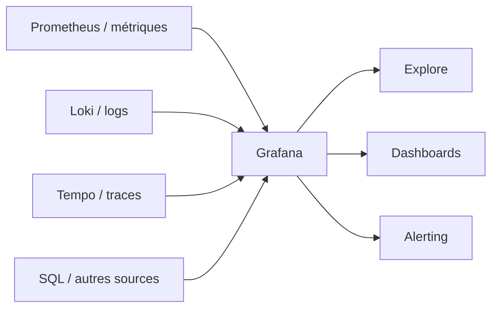

# Grafana — visualiser, explorer et alerter

<span class="badge-intermediate">Intermédiaire</span>

**Grafana** est une plateforme d'observabilité qui permet de **requêter, visualiser, explorer et alerter** sur des métriques, logs et traces stockés dans des systèmes externes.

Grafana n'est pas le backend de données : il se connecte à des **data sources** telles que Prometheus, Loki, PostgreSQL, CloudWatch ou d'autres services.

---

## Architecture



Cette séparation est importante : un dashboard Grafana n'est fiable que si la source interrogée l'est également.

---

## Ce que Grafana apporte

Grafana fournit notamment :

- des dashboards composés de panels ;
- une couche de requêtes sur les data sources ;
- Explore pour l'analyse ad hoc ;
- transformations de données ;
- alerting ;
- annotations ;
- provisioning pour automatiser la configuration.

Une même vue peut combiner plusieurs sources afin de rapprocher métriques, logs et événements.

---

## Cas d'usage pour une application IA

Un dashboard d'agent ou de service IA peut suivre :

```text
latence p50 / p95 / p99
erreurs par outil ou endpoint
retries / timeouts
durée des workflows
volume de requêtes
CPU / RAM / GPU
files d'attente
métriques métier
consommation énergétique si Kepler est présent
```

Évitez les dashboards décoratifs. Chaque panel doit répondre à une question opérationnelle.

---

## Grafana + Loki

Loki est une data source native de Grafana pour les logs.

Workflow classique :

```text
service
  ↓ logs
Loki
  ↓ LogQL
Grafana Explore / Dashboard / Alerting
```

Grafana permet alors de corréler une métrique anormale avec les logs de la même période.

Voir **[Loki](loki.md)**.

---

## Grafana + Kepler

Kepler expose des métriques Prometheus liées à la consommation énergétique de workloads Kubernetes.

Architecture :

```text
Kubernetes
   ↓
Kepler
   ↓ métriques Prometheus
Prometheus
   ↓
Grafana
```

Cela permet de visualiser la consommation par nœud, pod ou conteneur selon les métriques disponibles.

Voir **[Kepler](kepler.md)**.

---

## Avec Claude Code

Claude Code peut être utile pour :

- produire ou corriger du provisioning Grafana ;
- générer des requêtes à partir d'un symptôme ;
- analyser un export de métriques ciblé ;
- transformer un runbook manuel en procédure reproductible ;
- corréler un changement Git à un incident observé ;
- documenter les dashboards et alertes.

!!! tip "Donnez des données bornées"
    Pour un diagnostic, transmettez une fenêtre temporelle, un service et quelques métriques pertinentes plutôt qu'un dump complet de la plateforme.

---

## Sécurité et gouvernance

- limitez les droits des data sources ;
- utilisez des comptes de service dédiés ;
- évitez de stocker des secrets dans les dashboards ;
- contrôlez qui peut modifier les alertes ;
- versionnez le provisioning critique ;
- redigez les données sensibles avant exposition à un agent.

Grafana documente des permissions spécifiques aux data sources dans ses éditions compatibles ; adaptez la stratégie à votre déploiement.

---

## Quand utiliser Grafana

Grafana est adapté lorsque vous devez :

- agréger plusieurs sources d'observabilité ;
- construire des dashboards opérationnels ;
- explorer les données pendant un incident ;
- définir des alertes sur métriques/logs ;
- partager une vue commune entre développement, SRE et exploitation.

Il n'est pas nécessaire pour un petit script ponctuel dont quelques logs locaux suffisent.

---

## Sources

Sources officielles consultées le **28 septembre 2026** :

- [Grafana — About Grafana](https://grafana.com/docs/grafana/latest/introduction/)
- [Grafana — Data sources](https://grafana.com/docs/grafana/latest/datasources/)
- [Grafana — Data sources, plugins and integrations](https://grafana.com/docs/grafana/latest/datasources/concepts/)
- [Grafana — Visualizations](https://grafana.com/docs/grafana/latest/visualizations/)
