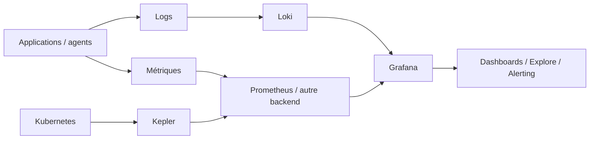

# Observabilité & GreenOps

Intermédiaire

Cette section regroupe les outils qui rendent les applications et workloads IA **observables** : métriques, logs, tableaux de bord, alertes et consommation énergétique.

Le trio documenté ici couvre trois rôles complémentaires :

- **Grafana** : exploration, visualisation et alerting ;
- **Loki** : agrégation et interrogation des logs ;
- **Kepler** : métriques de consommation énergétique pour Kubernetes.

---

## Architecture de référence

Grafana n'est pas un stockage de logs à lui seul : il interroge des **data sources**. Loki est une de ces sources pour les logs ; Prometheus est un backend courant pour les métriques, y compris celles exportées par Kepler.

---

## Pourquoi cette section est utile avec des agents IA

Une architecture agentique doit être observable comme n'importe quel système distribué. Suivez notamment :

- taux d'erreur des outils et MCP ;
- latence des appels externes ;
- durée des workflows ;
- retries et timeouts ;
- volumes de logs ;
- saturation CPU/mémoire ;
- consommation énergétique lorsque cela est pertinent ;
- métriques métier liées au résultat produit.

!!! warning "Ne journalisez pas les secrets"
    Les prompts, sorties d'outils et traces d'agents peuvent contenir des tokens, données personnelles ou informations internes. Définissez une politique de redaction avant ingestion dans Loki ou tout autre backend de logs.

---

## Pages de la section

- **[Grafana](grafana.md)** — dashboards, Explore, data sources et alerting ;
- **[Loki](loki.md)** — agrégation de logs, labels et LogQL ;
- **[Kepler](kepler.md)** — métriques d'énergie Kubernetes et GreenOps.

---

## Choisir par besoin

| Besoin | Outil principal |
|---|---|
| visualiser plusieurs sources | Grafana |
| explorer et corréler les logs | Loki + Grafana |
| alerter sur métriques/logs | Grafana Alerting + source adaptée |
| mesurer énergie/power Kubernetes | Kepler + Prometheus + Grafana |
| diagnostiquer une exécution agentique | logs + métriques + traces selon le système |

---

## Relation avec Claude Code

Claude Code peut aider à :

1. écrire les configurations et dashboards as code ;
2. analyser une fenêtre de logs ciblée ;
3. corréler un changement de code avec une régression mesurée ;
4. préparer des règles d'alerting ;
5. automatiser des runbooks via des outils/MCP en lecture seule ;
6. produire un diagnostic reproductible à partir de métriques et logs.

Claude ne remplace pas la télémétrie. Sans données fiables, l'agent ne fait qu'interpréter des symptômes incomplets.

---

## Sources

Sources officielles consultées le **28 septembre 2026** :

- [Grafana — documentation](https://grafana.com/docs/grafana/latest/)
- [Grafana Loki — documentation](https://grafana.com/docs/loki/latest/)
- [CNCF — Kepler](https://www.cncf.io/projects/kepler/)
