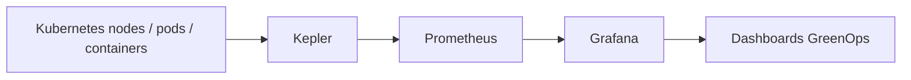

# Kepler — mesurer l'énergie des workloads Kubernetes

<span class="badge-intermediate">Intermédiaire</span>

**Kepler** (*Kubernetes-based Efficient Power Level Exporter*) est un projet CNCF qui expose des **métriques Prometheus de consommation énergétique** pour les workloads Kubernetes.

Sa place dans cette documentation est le croisement entre **observabilité, performance, FinOps et GreenOps**.

---

## Architecture



Kepler mesure et attribue des informations énergétiques au niveau nœud, pod et conteneur selon les capacités de la plateforme et sa configuration.

---

## Pourquoi mesurer l'énergie

CPU, mémoire et durée sont utiles, mais ne répondent pas directement à :

```text
Quel workload consomme le plus d'énergie ?
Cette optimisation réduit-elle réellement la consommation ?
Quel namespace est responsable de la hausse ?
Une nouvelle version est-elle plus efficace à charge comparable ?
```

Kepler ajoute un signal exploitable dans un environnement Kubernetes.

---

## Kepler 0.10+ : architecture réécrite

Le projet indique qu'à partir de la branche **0.10.0 et suivantes**, Kepler a fait l'objet d'une réécriture importante visant notamment :

- une meilleure attribution de la puissance ;
- une détection dynamique des zones RAPL ;
- une meilleure détection des workloads ;
- une réduction des ressources consommées ;
- des exigences de privilèges réduites, avec accès hôte en lecture seule à `/proc` et `/sys` selon la documentation actuelle.

!!! warning "Vérifiez votre version"
    Les anciens articles et dashboards Kepler peuvent cibler l'architecture antérieure. Vérifiez toujours la version installée et la documentation correspondante avant de copier une configuration.

---

## Grafana et Prometheus

Kepler est un **exporter Prometheus**. Grafana peut ensuite interroger Prometheus pour afficher les métriques.

Exemples de vues :

- consommation par namespace ;
- consommation par workload ;
- énergie avant/après déploiement ;
- corrélation énergie ↔ CPU ↔ throughput ;
- consommation normalisée par unité métier.

La métrique la plus utile n'est pas toujours « énergie totale ». Selon le système, comparez par exemple :

```text
joules / requête
joules / document traité
énergie / build
énergie / job ML
énergie / workflow agentique
```

à charge fonctionnelle comparable.

---

## Cas d'usage IA

Kepler devient intéressant lorsque les workloads IA tournent dans Kubernetes :

- services d'inférence ;
- pipelines d'embeddings ;
- traitements RAG ;
- jobs ML ;
- workers d'agents ;
- batchs de transformation de documents.

Il permet d'ajouter l'énergie aux critères habituels :

```text
qualité + latence + coût + ressources + énergie
```

---

## Avec Claude Code

Claude Code peut aider à :

1. lire les manifests Kepler ;
2. construire les requêtes Prometheus nécessaires ;
3. générer ou corriger un dashboard Grafana ;
4. comparer deux déploiements ;
5. calculer des ratios métier à partir des métriques ;
6. documenter une expérience de performance/énergie reproductible.

Exemple de protocole :

```text
1. fixer la charge de test ;
2. exécuter version A ;
3. enregistrer latence, throughput et énergie ;
4. exécuter version B dans les mêmes conditions ;
5. comparer les distributions ;
6. vérifier que le gain ne dégrade pas la qualité métier.
```

---

## Limites

- l'attribution énergétique reste une mesure/modélisation dépendante du matériel et de l'environnement ;
- les résultats de deux clusters différents ne sont pas automatiquement comparables ;
- une baisse de watts instantanés n'implique pas une baisse d'énergie totale si le traitement dure plus longtemps ;
- mesurez plusieurs répétitions et conservez le contexte de charge ;
- ne transformez pas une métrique estimée en bilan carbone sans méthodologie supplémentaire.

---

## Sources

Sources officielles consultées le **28 septembre 2026** :

- [CNCF — Kepler](https://www.cncf.io/projects/kepler/)
- [Kepler — dépôt officiel](https://github.com/sustainable-computing-io/kepler)

## À lire ensuite

- **[Grafana](grafana.md)** pour la visualisation ;
- **[Performance & Ressources](../../chapitre-9-bonnes-pratiques/performance.md)** pour la démarche de mesure avant/après.
