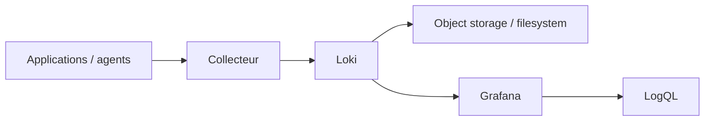

# Loki — centraliser et interroger les logs

<span class="badge-intermediate">Intermédiaire</span>

**Grafana Loki** est un système d'agrégation de logs conçu autour d'un principe proche de Prometheus : il indexe principalement les **labels** décrivant les flux de logs, tandis que le contenu des lignes est compressé et stocké en chunks.

Cette architecture permet d'éviter d'indexer chaque mot de chaque log comme le ferait un moteur de recherche plein texte généraliste.

---

## Modèle mental



Les logs sont regroupés en **streams** identifiés par leurs labels.

Pour une nouvelle collecte, utilisez **Grafana Alloy** ou un autre client maintenu. **Promtail est en fin de vie depuis le 2 mars 2026** : les anciens tutoriels Promtail nécessitent une migration. [État officiel et migration](https://grafana.com/docs/loki/latest/send-data/promtail/), vérifié le 3 octobre 2026.

---

## Labels : privilégier la faible cardinalité

Exemples de labels utiles :

```text
service="payment-api"
environment="prod"
region="eu-west"
namespace="payments"
```

Évitez de mettre dans les labels des valeurs presque uniques comme :

```text
request_id
user_id
trace_id
full_url
prompt_text
```

La documentation Loki recommande les labels pour les valeurs de **faible cardinalité**. Les informations très variables doivent rester dans le contenu du log ou dans des métadonnées structurées appropriées.

---

## LogQL

Loki utilise **LogQL** pour sélectionner les streams puis filtrer ou agréger leurs logs.

Conceptuellement :

```text
sélectionner un service
→ réduire à une fenêtre temporelle
→ filtrer ERROR / timeout / pattern
→ extraire les champs utiles
→ corréler avec métriques et traces
```

Les requêtes LogQL peuvent également produire des métriques dérivées de logs pour certains cas d'alerting ou d'analyse.

---

## Logs d'agents IA

Pour un système agentique, journalisez des **événements**, pas nécessairement le contenu intégral des conversations.

Exemples utiles :

```text
workflow_started
workflow_completed
tool_call_started
tool_call_failed
mcp_timeout
validation_failed
retry_count
model_provider
latency_ms
```

!!! danger "Prompts et sorties = données potentiellement sensibles"
    Un prompt peut contenir du code privé, des secrets copiés par erreur, des données personnelles ou du contenu client. Ne journalisez pas systématiquement prompts et réponses complets. Appliquez redaction, minimisation, durée de rétention et contrôle d'accès.

---

## Loki + Grafana

Grafana prend Loki en charge comme data source intégrée.

Cela permet :

- exploration dans Grafana Explore ;
- dashboards de logs ;
- corrélation avec des métriques ;
- alerting à partir de requêtes adaptées.

Voir **[Grafana](grafana.md)**.

---

## Avec Claude Code

Claude Code peut aider à :

1. concevoir un schéma de labels ;
2. écrire des requêtes LogQL ;
3. analyser une fenêtre de logs réduite ;
4. comparer logs avant/après un déploiement ;
5. transformer un diagnostic récurrent en runbook ;
6. vérifier qu'aucun secret évident n'est ajouté à la journalisation.

Pattern recommandé :

```text
incident
→ sélectionner service + fenêtre temporelle
→ requête Loki ciblée
→ exporter quelques lignes représentatives
→ analyse Claude
→ hypothèse
→ vérification avec métriques/tests
```

Ne fournissez pas à l'agent plusieurs gigaoctets de logs lorsque Loki peut effectuer le filtrage côté serveur.

---

## Quand choisir Loki

Loki est pertinent lorsque :

- vous utilisez déjà Grafana/Prometheus ;
- vous voulez centraliser les logs de plusieurs workloads ;
- vous voulez corréler logs et autres signaux d'observabilité ;
- un modèle fondé sur labels convient à votre usage.

Un simple fichier local ou les logs natifs d'une petite plateforme peuvent suffire pour des projets modestes.

---

## Prochaine étape

Poursuivez avec **[Kepler](kepler.md)**, la page suivante dans le menu.

## Sources

Sources officielles consultées le **28 septembre 2026** :

- [Grafana Loki — documentation](https://grafana.com/docs/loki/latest/)
- [Grafana Loki — Understand labels](https://grafana.com/docs/loki/latest/get-started/labels/)
- [Grafana — Loki data source](https://grafana.com/docs/grafana/latest/datasources/loki/)
- [Grafana — Configure the Loki data source](https://grafana.com/docs/grafana/latest/datasources/loki/configure/)
