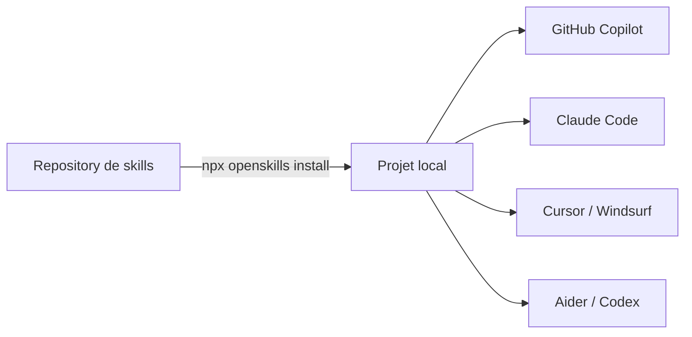

# OpenSkills — Skills universelles pour agents IA

<span class="badge-intermediate">Intermédiaire</span>

**OpenSkills** ([GitHub](https://github.com/numman-ali/openskills)) est un CLI open source qui permet d'installer et de synchroniser des skills au format `SKILL.md`. Il agit comme un *installateur universel de skills* : il récupère les skills depuis un repository (tout le repo ou seulement une partie), puis les installe localement pour les rendre utilisables par les agents IA capables de lire ce manifeste.

Il peut notamment installer les skills publiques du dépôt Anthropic :

```bash
npx openskills install anthropics/skills
```

Le projet implémente la spécification Agent Skills tout en restant **indépendant et open source** (Apache 2.0).

---

## Quand l'utiliser

- Quand tu veux partager des procedures longues entre plusieurs agents.
- Quand tu veux séparer des instructions globales et des details specialises.
- Quand tu veux réduire le contexte charge a chaque requete.

## Quand l'éviter

- Quand tu n'as besoin que d'une instruction courte et unique
- Quand ton équipe n'a pas encore établi de conventions communes
- Quand la tache se resout mieux par une simple instruction locale

---

## Deux dépôts distincts à ne pas confondre

| Dépôt | Rôle |
|-------|------|
| [`numman-ali/openskills`](https://github.com/numman-ali/openskills) | Le CLI OpenSkills — à installer et utiliser |
| [`anthropics/skills`](https://github.com/anthropics/skills) | Le dépôt public de skills Anthropic — installable via le CLI |

!!! info "En pratique"
    Tu utilises le CLI `numman-ali/openskills` pour **installer** les skills, y compris celles provenant du dépôt `anthropics/skills`.

---

## Pourquoi OpenSkills peut économiser des crédits IA

OpenSkills n'économise pas des crédits par magie. L'économie vient surtout de la **réduction du contexte envoyé à l'agent IA**.

Le principe est simple :

- `AGENTS.md` sert d'index court des skills disponibles.
- Les fichiers `SKILL.md` contiennent les instructions détaillées.
- Les dossiers `references/`, `scripts/` et `assets/` ne sont consultés que si nécessaire.
- L'agent ne doit pas charger toutes les règles de tous les domaines à chaque requête.

Moins de contexte inutile signifie :

- moins de tokens consommés ;
- moins de bruit dans la réponse ;
- une meilleure précision ;
- moins de risque que l'agent mélange plusieurs règles contradictoires.

!!! success "Bonne stratégie"
    Mets les règles générales courtes dans `.github/copilot-instructions.md`.
    Mets les procédures spécialisées dans des skills.
    Demande à Copilot de charger uniquement la skill pertinente pour la tâche courante.

---

## Pourquoi OpenSkills est utile

### Le problème

Chaque agent IA a ses propres conventions de configuration : `.github/copilot-instructions.md` pour Copilot, `CLAUDE.md` pour Claude Code, `.cursorrules` pour Cursor… Résultat : fragmentation, duplication, et zéro portabilité.

### La solution

OpenSkills propose un **format standardisé** (`SKILL.md`). Les agents compatibles ou configurés pour lire `AGENTS.md` peuvent découvrir les skills disponibles. OpenSkills facilite l'exposition des skills aux agents capables de lire ce manifeste.



!!! warning "Comportement variable selon l'agent et l'IDE"
    Selon l'outil, il peut être nécessaire d'ajouter une instruction explicite pour que l'agent consulte `AGENTS.md`. Dans IntelliJ, il est recommandé de passer par `.github/copilot-instructions.md` comme point d'entrée principal.

### Philosophie

| Principe | Description |
|----------|-------------|
| **Progressive Disclosure** | Les skills se chargent à la demande — pas de surcharge du contexte |
| **File-Based** | Fichiers Markdown, pas de serveur (contrairement à MCP) |
| **Standardisation** | Format YAML + Markdown portable entre agents |
| **Extensibilité** | Support de ressources annexes (docs, scripts, assets) |

---

## Installation et configuration

### Prérequis

- **Node.js 20.6+**
- **Git** (pour cloner des repositories)
- Un agent compatible : GitHub Copilot, Claude Code, Cursor, Windsurf, Aider ou Codex

### Installation de skills

OpenSkills s'utilise via `npx` — **aucune installation globale requise** :

```bash
# Installer des skills depuis le repository officiel Anthropic
npx openskills install anthropics/skills

# Synchroniser le fichier AGENTS.md
npx openskills sync
```

Concrètement, `install` va chercher les skills à la source indiquée (repository GitHub, source Git locale/SSH, ou dossier local), puis les copie dans un dossier local du projet (ou utilisateur selon le mode).

### Sources d'installation

```bash
# Depuis GitHub (organisation/repo)
npx openskills install your-org/your-skills

# Depuis un chemin local
npx openskills install ./local-skills/my-skill

# Depuis un repository privé (SSH)
npx openskills install git@github.com:your-org/private-skills.git
```

### Modes d'installation

| Mode | Commande | Emplacement | Usage |
|------|----------|-------------|-------|
| **Projet** (défaut) | `npx openskills install ...` | `./.claude/skills/` | Skills spécifiques au projet |
| **Global** | `... --global` | `~/.claude/skills/` | Skills partagées entre projets |
| **Universel** | `... --universal` | `./.agent/skills/` | Multi-agents (pas seulement Claude) |

!!! tip "Mode universel recommandé pour Copilot"
    Si tu utilises GitHub Copilot **et** d'autres agents, préfère le mode `--universal`. Les skills seront stockées dans `.agent/skills/` et lisibles par tous.

!!! info "Dossier d'installation OpenSkills"
    Par défaut, OpenSkills installe au niveau projet dans `./.claude/skills/`.
    Avec `--universal`, la cible devient `./.agent/skills/`.
    Le dossier `./.github/skills/` peut exister dans certains workflows, mais **ce n'est pas la destination d'installation par défaut d'OpenSkills**.

---

## Commandes principales

| Commande | Description |
|----------|-------------|
| `npx openskills install <source>` | Installe des skills depuis GitHub, local ou SSH |
| `npx openskills sync` | Met à jour `AGENTS.md` avec la liste des skills |
| `npx openskills list` | Affiche les skills installées |
| `npx openskills read <name>` | Charge le contenu d'une skill (utilisé par les agents) |
| `npx openskills update [name...]` | Met à jour une ou toutes les skills |
| `npx openskills manage` | Interface interactive de gestion |

### Options communes

- `--global` : installation au niveau utilisateur
- `--universal` : utilise `.agent/skills/` au lieu de `.claude/skills/`
- `-y, --yes` : saute les confirmations interactives
- `-o, --output <path>` : fichier de sortie personnalisé

---

## Structure d'une skill

### Arborescence

**Structure minimale** :

```
ma-skill/
└── SKILL.md
```

**Structure complète** :

```
ma-skill/
├── SKILL.md
├── references/
│   └── documentation.md
├── scripts/
│   └── helper.sh
└── assets/
    └── diagram.png
```

### Rôle de chaque élément

| Élément | Contenu recommandé | Chargement |
|---------|-------------------|------------|
| `SKILL.md` | Instructions principales, critères d'activation, workflow | Chargé quand la skill est pertinente |
| `references/` | Documentation longue, normes, exemples détaillés | Chargé seulement si nécessaire |
| `scripts/` | Scripts d'aide exécutables | Utilisé seulement si la tâche le demande |
| `assets/` | Images, modèles, schémas, fichiers statiques | Chargé à la demande |

!!! tip "Limiter la taille du SKILL.md"
    Garde le `SKILL.md` principal court et opérationnel.
    Place les longues explications, exemples détaillés et normes complètes dans `references/`.
    Cela respecte le principe de progressive disclosure et évite de consommer du contexte inutilement.

### Contenu type d'un `SKILL.md`

````markdown
---
name: review-standards
description: "Vérifie que le code respecte nos conventions d'équipe"
---

# Instructions

Quand on te demande de relire du code, vérifie les points suivants :

## Conventions de nommage
- Variables : camelCase
- Classes : PascalCase
- Fichiers : kebab-case

## Structure
- Maximum 200 lignes par fichier
- Un composant par fichier
````

**Installation locale** :

```bash
npx openskills install ./ma-skill
npx openskills sync
```

### Exemple de skill Java pour Copilot dans IntelliJ

````markdown
---
name: java-review
description: "À utiliser pour relire du code Java, vérifier la POO, les responsabilités, les tests et la cohérence avec l'architecture du projet."
---

# Java Review Skill

Utilise cette skill uniquement lorsqu'on te demande :

- une revue de code Java ;
- une amélioration de classe ;
- une vérification POO ;
- une analyse d'architecture ;
- une proposition de refactoring.

## Vérifications obligatoires

1. Responsabilité unique des classes.
2. Nommage clair des méthodes, variables et packages.
3. Absence de duplication évidente.
4. Gestion correcte des erreurs.
5. Respect de l'architecture existante.
6. Tests unitaires proposés si nécessaire.
7. Documentation ou JavaDoc quand cela apporte une vraie valeur.

## Règle d'économie de contexte

Ne lis pas toute l'application si la tâche concerne une seule classe.
Commence par le fichier courant, puis recherche seulement les dépendances nécessaires.
````

---

## Quel fichier utiliser ?

| Élément | Rôle | Quand l'utiliser |
|---------|------|-----------------|
| `.github/copilot-instructions.md` | Instructions générales du projet pour Copilot | Toujours, pour les règles globales |
| `.github/instructions/*.instructions.md` | Instructions ciblées par domaine, dossier ou type de fichier | Java, SQL, tests, documentation, sécurité |
| `AGENTS.md` | Manifeste agentique ou index des skills | Pour lister les skills disponibles |
| `SKILL.md` | Procédure spécialisée et réutilisable | Revue de code, tests, migration, PDF, documentation |
| `.github/agents/*.agent.md` | Agent Copilot spécialisé | Pour créer un agent dédié à une tâche ou un workflow |
| MCP | Outils dynamiques / API | Accès à GitHub, base de données, fichiers, web, services externes |

---

## Utilisation recommandée avec GitHub Copilot dans IntelliJ

Avec IntelliJ IDEA, ne pars pas du principe que toutes les skills seront injectées automatiquement dans chaque requête Copilot. Le comportement dépend de la version de Copilot et des paramètres activés dans JetBrains.

### Comment Copilot découvre les skills

Quand tu lances `npx openskills sync`, le fichier `AGENTS.md` est mis à jour avec la liste des skills disponibles au format XML :

```xml
<available_skills>
  <skill name="pdf">
    <description>Extract text and images from PDF files</description>
  </skill>
  <skill name="java-review">
    <description>Relecture de code Java, POO, tests, architecture</description>
  </skill>
</available_skills>
```

Les agents configurés pour lire `AGENTS.md` peuvent alors découvrir les skills disponibles. Copilot Chat peut consulter ce fichier, mais **il n'est pas garanti qu'il le fasse automatiquement dans tous les modes d'IntelliJ**.

### Stratégie recommandée pour IntelliJ

1. Utiliser `.github/copilot-instructions.md` comme point d'entrée principal.
2. Utiliser `.github/instructions/**/*.instructions.md` pour les règles spécifiques par technologie, dossier ou type de fichier.
3. Utiliser `AGENTS.md` comme manifeste des skills disponibles.
4. Garder les instructions longues dans les fichiers `SKILL.md`.
5. Demander explicitement à Copilot de charger une skill seulement quand elle est utile.

### Exemple de contenu pour `.github/copilot-instructions.md`

```text
Ce projet utilise OpenSkills.

Avant de répondre à une demande complexe, consulte `AGENTS.md` pour identifier les skills disponibles.

Si une skill correspond à la tâche, charge uniquement cette skill avec :

  npx openskills read <skill-name>

Ne charge pas toutes les skills systématiquement.
Utilise seulement les instructions nécessaires à la tâche courante afin de limiter le contexte consommé.
```

### Workflow typique avec Copilot

**1. Installer les skills dans ton projet**

```bash
cd mon-projet
npx openskills install anthropics/skills
npx openskills sync
```

**2. Versionner `AGENTS.md`**

```bash
git add AGENTS.md
git commit -m "chore: add openskills agents manifest"
```

**3. Utiliser dans Copilot Chat**

Selon l'agent et sa configuration, il peut être nécessaire de guider Copilot explicitement :

```text
@workspace Consulte AGENTS.md, puis utilise la skill "java-review" pour analyser cette classe.
```

**4. Créer des skills personnalisées pour ton équipe**

```
mon-projet/
├── .agent/skills/
│   └── java-review/
│       ├── SKILL.md
│       └── references/
│           └── coding-standards.md
└── AGENTS.md
```

!!! info "Progressive Disclosure avec Copilot"
    L'idée est que Copilot peut lire `AGENTS.md` pour connaître les skills disponibles, puis charger le contenu complet (`SKILL.md`) uniquement quand c'est pertinent. Cela **préserve la fenêtre de contexte** — mais ce comportement n'est pas automatique dans tous les contextes IntelliJ et peut évoluer selon les versions.

### Intégrer dans un prompt file Copilot

Tu peux créer un prompt file qui référence les skills disponibles :

````markdown
---
description: "Relecture de code avec les skills du projet"
---

Consulte AGENTS.md pour voir les skills disponibles dans ce projet.
Utilise la skill appropriée pour effectuer une relecture complète du code.
Vérifie : conventions de nommage, structure, tests, documentation.
````

---

## Workflow conseillé pour économiser le contexte

1. Créer ou maintenir `.github/copilot-instructions.md`.
2. Ajouter uniquement les règles globales indispensables.
3. Installer les skills avec OpenSkills.
4. Synchroniser `AGENTS.md`.
5. Créer des skills spécialisées pour les tâches fréquentes.
6. Dans Copilot Chat, demander explicitement la skill utile.
7. Ne jamais demander à Copilot de charger toutes les instructions du projet si la tâche est locale.

Exemple de prompt dans Copilot Chat :

```text
@workspace Consulte AGENTS.md.
Utilise uniquement la skill `java-review`.
Analyse cette classe sans charger le reste du projet sauf si une dépendance est nécessaire.
```

---

## Recommandations selon la taille du projet

| Situation | Recommandation |
|-----------|---------------|
| Petit projet personnel | Un seul `.github/copilot-instructions.md` suffit souvent |
| Projet moyen | Ajouter `.github/instructions/*.instructions.md` pour séparer Java, tests, SQL, documentation |
| Gros projet | Ajouter OpenSkills pour isoler les procédures longues dans des `SKILL.md` |
| Multi-projets | Créer un dépôt privé de skills réutilisables |
| Équipe | Versionner les skills, les relire en revue de code et documenter leur usage |
| Projet avec outils externes | Combiner OpenSkills avec MCP |

---

## Comparaison avec MCP

| Aspect | OpenSkills | MCP |
|--------|-----------|-----|
| Architecture | File-based (Markdown) | Server-based |
| Complexité | Faible | Moyenne / Élevée |
| Dynamisme | Statique | Dynamique (temps réel) |
| Portabilité | Bonne (agents supportant le format) | Dépendant de l'agent |
| Performance | Rapide (lecture fichier) | Latence réseau |
| Cas d'usage | Instructions, docs, conventions | Outils temps réel, API |

OpenSkills et MCP ne résolvent pas le même problème :

- **OpenSkills** sert à fournir des **instructions, des procédures et des connaissances structurées**.
- **MCP** sert à fournir des **outils dynamiques** : appeler une API, interroger une base de données, accéder à un service, manipuler des fichiers ou récupérer des données en temps réel.

En pratique :

- OpenSkills = **"comment travailler"**
- MCP = **"avec quels outils agir"**

!!! info "Complémentaires, pas concurrents"
    OpenSkills fournit des **instructions structurées** aux agents. MCP fournit des **outils dynamiques** (requêtes API, bases de données…). Les deux peuvent coexister dans un même projet.

---

## Ordre de priorité des skills

Le système recherche les skills dans cet ordre :

1. `./.agent/skills/` — projet, universel
2. `~/.agent/skills/` — utilisateur, universel
3. `./.claude/skills/` — projet, Claude
4. `~/.claude/skills/` — utilisateur, Claude

Les skills au niveau projet prennent toujours la priorité sur les skills globales.

---

## Sécurité

!!! warning "Ne jamais inclure de secrets dans les skills"
    Les skills sont du **texte brut non chiffré**. N'y place jamais d'API keys, tokens ou mots de passe. Utilise des variables d'environnement :

    ```text
    ❌ MAUVAIS : API_KEY=sk-1234567890abcdef

    ✅ BON : Utilise la variable d'environnement $API_KEY pour l'authentification.
    ```

!!! danger "Auditer les skills tierces"
    Une skill malveillante peut instruire un agent IA à exécuter du code dangereux. Avant d'installer des skills depuis une source externe :

    - Vérifie la réputation du repository source
    - Lis le contenu des fichiers `SKILL.md` téléchargés
    - Préfère les skills officielles ou d'organisations reconnues

!!! danger "Attention aux commandes dans les skills"
    Une skill peut contenir des instructions demandant à l'agent d'exécuter des scripts ou des commandes shell.

    Avant d'installer une skill tierce :

    - lis toujours son `SKILL.md` ;
    - vérifie les scripts présents dans `scripts/` ;
    - évite les sources inconnues ;
    - surveille les commandes destructrices comme `rm -rf`, `git reset --hard`, suppression de branches ou effacement de fichiers ;
    - évite d'installer automatiquement une source non vérifiée en CI/CD ;
    - privilégie les sources versionnées, auditées et approuvées par l'équipe.

### Bonnes pratiques de gouvernance

1. Maintenir une **whitelist** des sources de skills approuvées
2. **Revue de code** pour toute nouvelle skill ajoutée au projet
3. **Documenter** les skills utilisées dans chaque projet
4. **Scanner** les skills avec des outils de sécurité si elles sont critiques

---

## Intégration CI/CD

```yaml
# .github/workflows/main.yml
- name: Setup Skills
  run: |
    npx openskills install your-org/ci-skills --yes
    npx openskills sync
```

!!! warning "CI/CD et sources non vérifiées"
    N'installe jamais en CI/CD une source de skills externe non vérifiée et non versionnée. Préfère pointer vers un tag ou un commit précis pour garantir la reproductibilité et éviter les injections.

---

## Résumé opérationnel

| Aspect | Détail |
|--------|--------|
| Type | CLI Node.js (open source, Apache 2.0) |
| CLI GitHub | [numman-ali/openskills](https://github.com/numman-ali/openskills) |
| Skills Anthropic | [anthropics/skills](https://github.com/anthropics/skills) |
| Installation | `npx openskills install ...` (aucune install globale) |
| Gratuit | Oui, entièrement |
| Prérequis | Node.js 20.6+, Git |
| Compatible avec | Copilot, Claude Code, Cursor, Windsurf, Aider, Codex (selon configuration) |
| Meilleur pour | Standardiser les skills entre agents et projets |

Pour un usage Copilot dans IntelliJ :

1. Utilise `.github/copilot-instructions.md` pour les règles globales courtes.
2. Utilise `.github/instructions/*.instructions.md` pour les règles ciblées.
3. Utilise OpenSkills pour stocker les procédures longues dans des `SKILL.md`.
4. Utilise `AGENTS.md` comme index des skills disponibles.
5. Demande à Copilot de charger seulement la skill utile.
6. Ne mets jamais de secrets dans une skill.
7. Audite les skills tierces avant installation.

!!! success "Recommandation"
    OpenSkills est surtout intéressant pour les projets moyens à gros, les équipes, ou les développeurs qui utilisent plusieurs agents IA.
    Pour Copilot dans IntelliJ, son intérêt principal est de **séparer les instructions longues du contexte principal** afin d'éviter de consommer inutilement des crédits IA.

## Résumé

OpenSkills sert a organiser des skills reutilisables et portables entre
agents IA. Son interet principal est de reduire le contexte inutile en
deplacant les procedures longues dans des fichiers specialises.

---

## Prochaine étape

**[Outils Complémentaires](outils-complementaires.md)** : Continue.dev, Ollama, LM Studio, Codeium, Tabnine, Amazon Q et Supermaven — des alternatives gratuites ou locales pour couvrir les usages que les outils spécialisés ne prennent pas en charge.
