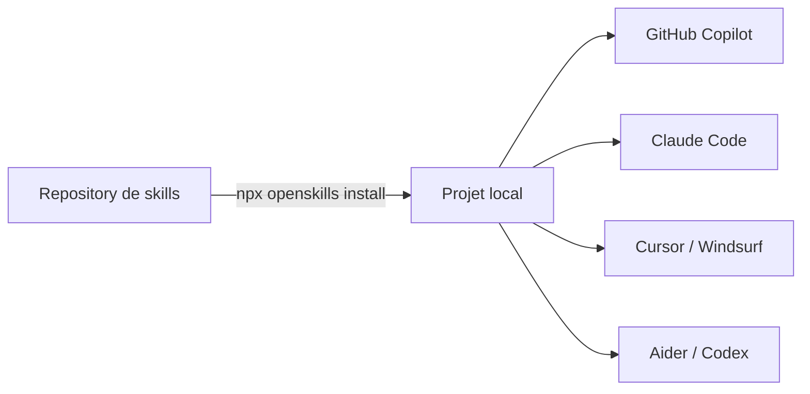

# OpenSkills — Skills universelles pour agents IA

<span class="badge-intermediate">Intermédiaire</span>

**OpenSkills** ([GitHub](https://github.com/anthropics/openskills)) est un outil CLI qui **démocratise le système de skills** en le rendant accessible à tous les agents IA de codage : GitHub Copilot, Claude Code, Cursor, Windsurf, Aider, Codex. Il agit comme un *installateur universel de SKILL.md*, permettant à tout agent capable de lire du Markdown d'acquérir de nouvelles capacités.

Le projet implémente la spécification Agent Skills d'Anthropic tout en restant **indépendant et open source** (Apache 2.0).

---

## Pourquoi OpenSkills est utile

### Le problème

Chaque agent IA a ses propres conventions de configuration : `.github/copilot-instructions.md` pour Copilot, `CLAUDE.md` pour Claude Code, `.cursorrules` pour Cursor… Résultat : fragmentation, duplication, et zéro portabilité.

### La solution

OpenSkills propose un **format standardisé** (`SKILL.md`) lu par tous les agents. Tu installes une skill une seule fois, et elle est disponible pour tous tes agents IA.



### Philosophie

| Principe | Description |
|----------|-------------|
| **Progressive Disclosure** | Les skills se chargent à la demande — pas de surcharge du contexte |
| **File-Based** | Fichiers Markdown, pas de serveur (contrairement à MCP) |
| **Standardisation** | Format YAML + Markdown portable entre agents |
| **Extensibilité** | Support de ressources annexes (docs, scripts, assets) |

---

## Installation et configuration

### Prérequis

- **Node.js 20.6+**
- **Git** (pour cloner des repositories)
- Un agent compatible : GitHub Copilot, Claude Code, Cursor, Windsurf, Aider ou Codex

### Installation de skills

OpenSkills s'utilise via `npx` — **aucune installation globale requise** :

```bash
# Installer des skills depuis le repository officiel Anthropic
npx openskills install anthropics/skills

# Synchroniser le fichier AGENTS.md
npx openskills sync
```

### Sources d'installation

```bash
# Depuis GitHub (organisation/repo)
npx openskills install your-org/your-skills

# Depuis un chemin local
npx openskills install ./local-skills/my-skill

# Depuis un repository privé (SSH)
npx openskills install git@github.com:your-org/private-skills.git
```

### Modes d'installation

| Mode | Commande | Emplacement | Usage |
|------|----------|-------------|-------|
| **Projet** (défaut) | `npx openskills install ...` | `./.claude/skills/` | Skills spécifiques au projet |
| **Global** | `... --global` | `~/.claude/skills/` | Skills partagées entre projets |
| **Universel** | `... --universal` | `./.agent/skills/` | Multi-agents (pas seulement Claude) |

!!! tip "Mode universel recommandé pour Copilot"
    Si tu utilises GitHub Copilot **et** d'autres agents, préfère le mode `--universal`. Les skills seront stockées dans `.agent/skills/` et lisibles par tous.

---

## Commandes principales

| Commande | Description |
|----------|-------------|
| `npx openskills install <source>` | Installe des skills depuis GitHub, local ou SSH |
| `npx openskills sync` | Met à jour `AGENTS.md` avec la liste des skills |
| `npx openskills list` | Affiche les skills installées |
| `npx openskills read <name>` | Charge le contenu d'une skill (utilisé par les agents) |
| `npx openskills update [name...]` | Met à jour une ou toutes les skills |
| `npx openskills manage` | Interface interactive de gestion |

### Options communes

- `--global` : installation au niveau utilisateur
- `--universal` : utilise `.agent/skills/` au lieu de `.claude/skills/`
- `-y, --yes` : saute les confirmations interactives
- `-o, --output <path>` : fichier de sortie personnalisé

---

## Utilisation avec GitHub Copilot

### Comment Copilot découvre les skills

Copilot lit les fichiers de contexte du projet. Quand tu lances `npx openskills sync`, le fichier `AGENTS.md` est mis à jour avec la liste des skills disponibles au format XML :

```xml
<available_skills>
  <skill name="pdf">
    <description>Extract text and images from PDF files</description>
  </skill>
  <skill name="test-runner">
    <description>Run and analyze test suites</description>
  </skill>
</available_skills>
```

Copilot peut alors **lire ce fichier** et invoquer les skills pertinentes quand tu lui demandes une tâche correspondante.

### Workflow typique avec Copilot

**1. Installer les skills dans ton projet**

```bash
cd mon-projet
npx openskills install anthropics/skills
npx openskills sync
```

**2. Versionner `AGENTS.md`**

```bash
git add AGENTS.md
git commit -m "chore: add openskills agents manifest"
```

**3. Utiliser dans Copilot Chat**

Copilot lira `AGENTS.md` automatiquement et saura quelles skills sont disponibles. Tu peux aussi le guider explicitement :

```
@workspace Utilise la skill "pdf" pour extraire le texte de docs/spec.pdf
```

**4. Créer des skills personnalisées pour ton équipe**

Crée des skills spécifiques à ton projet que Copilot pourra utiliser :

```
mon-projet/
├── .agent/skills/
│   └── review-pr/
│       ├── SKILL.md
│       └── references/
│           └── coding-standards.md
└── AGENTS.md
```

!!! info "Progressive Disclosure avec Copilot"
    Copilot ne charge pas toutes les skills en mémoire. Il lit `AGENTS.md` pour connaître les skills disponibles, puis charge le contenu complet (`SKILL.md`) uniquement quand c'est pertinent. Cela **préserve la fenêtre de contexte**.

### Créer une skill utilisable par Copilot

**Structure minimale** :

```
ma-skill/
└── SKILL.md
```

**Structure complète** :

```
ma-skill/
├── SKILL.md
├── references/
│   └── documentation.md
├── scripts/
│   └── helper.sh
└── assets/
    └── diagram.png
```

**Contenu d'un `SKILL.md`** :

```markdown
---
name: review-standards
description: "Vérifie que le code respecte nos conventions d'équipe"
---

# Instructions

Quand on te demande de relire du code, vérifie les points suivants :

## Conventions de nommage
- Variables : camelCase
- Classes : PascalCase
- Fichiers : kebab-case

## Structure
- Maximum 200 lignes par fichier
- Un composant par fichier

## Exemples

[Exemples concrets...]
```

**Installation locale** :

```bash
npx openskills install ./ma-skill
npx openskills sync
```

### Intégrer dans un prompt file Copilot

Tu peux créer un prompt file qui référence les skills disponibles :

```markdown
---
description: "Relecture de code avec les skills du projet"
---

Consulte AGENTS.md pour voir les skills disponibles dans ce projet.
Utilise la skill appropriée pour effectuer une relecture complète du code.
Vérifie : conventions de nommage, structure, tests, documentation.
```

---

## Comparaison avec MCP

| Aspect | OpenSkills | MCP |
|--------|-----------|-----|
| Architecture | File-based (Markdown) | Server-based |
| Complexité | Faible | Moyenne / Élevée |
| Dynamisme | Statique | Dynamique (temps réel) |
| Portabilité | Excellente (tous agents) | Dépendant de l'agent |
| Performance | Rapide (lecture fichier) | Latence réseau |
| Cas d'usage | Instructions, docs, conventions | Outils temps réel, API |

!!! info "Complémentaires, pas concurrents"
    OpenSkills fournit des **instructions structurées** aux agents. MCP fournit des **outils dynamiques** (requêtes API, bases de données…). Les deux peuvent coexister dans un même projet.

---

## Ordre de priorité des skills

Le système recherche les skills dans cet ordre :

1. `./.agent/skills/` — projet, universel
2. `~/.agent/skills/` — utilisateur, universel
3. `./.claude/skills/` — projet, Claude
4. `~/.claude/skills/` — utilisateur, Claude

Les skills au niveau projet prennent toujours la priorité sur les skills globales.

---

## Sécurité

!!! warning "Ne jamais inclure de secrets dans les skills"
    Les skills sont du **texte brut non chiffré**. N'y place jamais d'API keys, tokens ou mots de passe. Utilise des variables d'environnement :

    ```markdown
    <!-- ❌ MAUVAIS -->
    API_KEY=sk-1234567890abcdef

    <!-- ✅ BON -->
    Utilise la variable d'environnement $API_KEY pour l'authentification.
    ```

!!! danger "Auditer les skills tierces"
    Une skill malveillante peut instruire un agent IA à exécuter du code dangereux. Avant d'installer des skills depuis une source externe :

    - Vérifie la réputation du repository source
    - Lis le contenu des fichiers `SKILL.md` téléchargés
    - Préfère les skills officielles ou d'organisations reconnues

### Bonnes pratiques de gouvernance

1. Maintenir une **whitelist** des sources de skills approuvées
2. **Revue de code** pour toute nouvelle skill ajoutée au projet
3. **Documenter** les skills utilisées dans chaque projet
4. **Scanner** les skills avec des outils de sécurité si elles sont critiques

---

## Intégration CI/CD

```yaml
# .github/workflows/main.yml
- name: Setup Skills
  run: |
    npx openskills install your-org/ci-skills --yes
    npx openskills sync
```

---

## Résumé

| Aspect | Détail |
|--------|--------|
| Type | CLI Node.js (open source, Apache 2.0) |
| GitHub | [anthropics/openskills](https://github.com/anthropics/openskills) |
| Installation | `npx openskills install ...` (aucune install globale) |
| Gratuit | Oui, entièrement |
| Prérequis | Node.js 20.6+, Git |
| Compatible avec | Copilot, Claude Code, Cursor, Windsurf, Aider, Codex |
| Meilleur pour | Standardiser les skills entre agents et projets |

!!! success "Recommandation"
    Si tu utilises plusieurs agents IA (Copilot + Claude Code, ou Copilot + Cursor), OpenSkills te permet de **centraliser les instructions** dans un format unique. Installe avec `--universal`, versionne `AGENTS.md`, et tous tes agents bénéficieront des mêmes skills.

---

## Prochaine étape

**[Outils Complémentaires](outils-complementaires.md)** : Continue.dev, Ollama, LM Studio, Codeium, Tabnine, Amazon Q et Supermaven — des alternatives gratuites ou locales pour couvrir les usages que les outils spécialisés ne prennent pas en charge.
