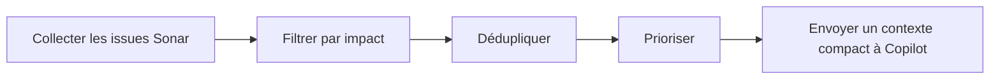
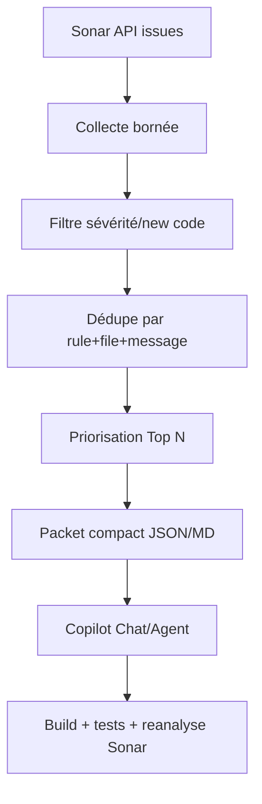
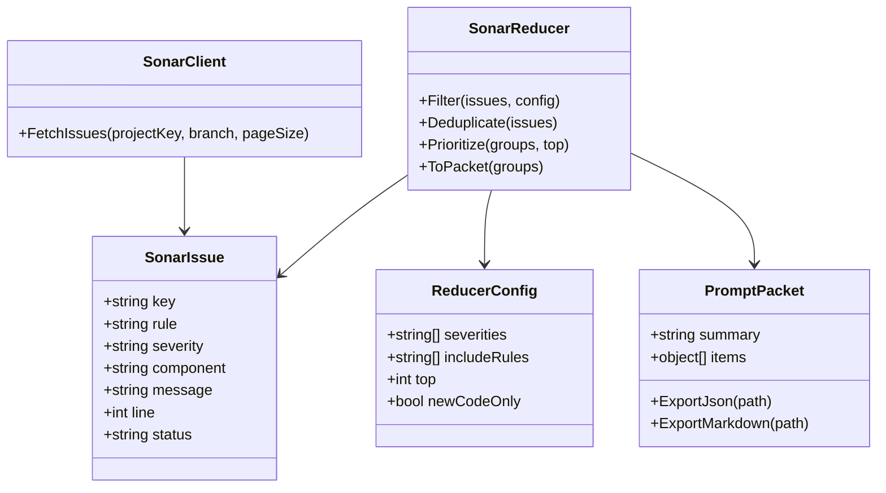
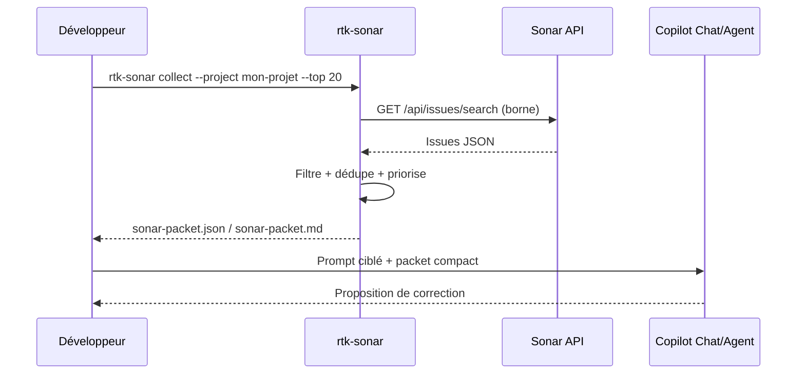

# RTK Sonar — Construire un filtre anti-bruit avant Copilot

<span class="badge-expert">Expert</span> <span class="badge-intellij">IntelliJ</span> <span class="badge-vscode">VS Code</span>

Cette page te guide pour créer un outil de style `rtk`, spécialisé Sonar, afin de filtrer le bruit avant d'envoyer du contexte à GitHub Copilot. L'objectif est simple : transmettre des informations compactes, actionnables et vérifiées.

!!! info "Fiabilité et date de vérification"
    Informations vérifiées le : 2026-06-15. Les endpoints Sonar, éditions et surfaces Copilot peuvent évoluer.

---

## Objectif

Construire un MVP `rtk-sonar` qui :

- récupère des issues Sonar de façon bornée,
- filtre par impact (sévérité, nouveau code, fichiers modifiés),
- déduplique les occurrences répétitives,
- produit un packet compact pour Copilot Chat/Agent.



!!! tip "Pourquoi c'est rentable"
    Envoyer 15 lignes utiles est souvent plus efficace que transmettre 1 000 lignes JSON. Tu réduis le coût en tokens, les allers-retours, et le risque de correction hors périmètre.

---

## Prérequis

### Prérequis techniques

- SonarQube Server ou SonarQube Cloud accessible.
- Un token utilisateur Sonar avec lecture des issues.
- PowerShell 7+ (`pwsh`) pour le MVP.
- Accès GitHub Copilot Chat/Agent dans l'IDE cible.

### Variables d'environnement minimales

```powershell
$env:SONAR_HOST_URL = "https://sonar.example.com"
$env:SONAR_PROJECT_KEY = "mon-projet"
$env:SONAR_TOKEN = "<SONAR_USER_TOKEN>"
```

!!! danger "Sécurité des secrets"
    - Ne commit jamais `SONAR_TOKEN`.
    - N'affiche jamais le token en logs.
    - Utilise un token à moindre privilège.
    - Révoque immédiatement tout token exposé.

### Vérifications initiales

- Le projet Sonar existe et remonte des issues.
- Le token répond correctement sur les endpoints API.
- Le périmètre de travail est défini (branche, module, règle, sévérité).

---

## Ce que `rtk-sonar` peut faire

### Cas d'usage utiles

- Triage par sévérité (`BLOCKER`, `CRITICAL`, `MAJOR`).
- Focus sur le nouveau code (`inNewCodePeriod=true` si disponible).
- Regroupement par règle (`java:S3776`, etc.).
- Priorisation des fichiers modifiés dans la branche courante.
- Production d'un résumé markdown ou JSON compact pour prompt Copilot.

### Sorties recommandées

- `sonar-packet.json` : version machine (pipeline, scripts).
- `sonar-packet.md` : version humaine (Copilot Chat, revue équipe).

---

## Ce qu'il faut éviter

### Anti-patterns coût/tokens

- Envoyer toutes les pages d'issues Sonar à Copilot.
- Demander "corrige tout le backlog" sans lot ni priorisation.
- Mélanger dette historique et nouveau code dans un même prompt.

### Anti-patterns qualité

- Corriger sans compiler ni tester entre lots.
- Lancer un agent non borné sur un repo complet.
- Ignorer les Quick Fix Sonar/IntelliJ disponibles.

### Anti-patterns sécurité

- Copier un token Sonar dans les prompts.
- Envoyer des URLs internes sensibles sans anonymisation.
- Stocker des exports non nettoyes dans des espaces partages.

!!! warning "Règle d'escalade"
    Déterministe d'abord (SonarQube for IDE, refactoring IntelliJ), puis IA seulement sur le reliquat complexe.

---

## Architecture fonctionnelle



---

## Diagramme de classes (MVP)



---

## Séquence de travail recommandée



---

## MVP PowerShell (copier-coller)

Le MVP est maintenant disponible comme exemple dans : [`docs/assets/templates/sonar/rtk-sonar.example.ps1`](../assets/templates/sonar/rtk-sonar.example.ps1).

Fonctions incluses :

- `collect` : collecte API Sonar bornee (`/api/issues/search`) avec pagination.
- `summarize` : filtrage, deduplication, priorisation et generation de `sonar-packet.json` + `sonar-packet.md`.
- `prompt` : generation d'un prompt compact pret a coller dans Copilot.
- `--git-modified-only` : restriction optionnelle aux fichiers modifies Git.

Documentation equipe : [`docs/assets/templates/sonar/README-rtk-sonar.example.md`](../assets/templates/sonar/README-rtk-sonar.example.md).
Jeu de test local : [`docs/assets/templates/sonar/sonar-issues.sample.json`](../assets/templates/sonar/sonar-issues.sample.json).

### Exemple d'utilisation

```powershell
# 1) Tester localement sans Sonar API
pwsh .\docs\assets\templates\sonar\rtk-sonar.example.ps1 summarize --input .\docs\assets\templates\sonar\sonar-issues.sample.json --top 10 --outDir .\tmp

# 2) Generer un prompt compact
pwsh .\docs\assets\templates\sonar\rtk-sonar.example.ps1 prompt --input .\tmp\sonar-packet.json --top 5 --outDir .\tmp

# 3) Flux complet (avec Sonar API)
# $env:SONAR_TOKEN = "<SONAR_USER_TOKEN>"
# pwsh .\docs\assets\templates\sonar\rtk-sonar.example.ps1 collect --base-url "https://sonar.example.com" --projectKey "mon-projet" --branch "main" --maxItems 300 --outDir .\tmp
# pwsh .\docs\assets\templates\sonar\rtk-sonar.example.ps1 summarize --input .\tmp\sonar-issues.raw.json --git-modified-only --top 25 --outDir .\tmp
# pwsh .\docs\assets\templates\sonar\rtk-sonar.example.ps1 prompt --input .\tmp\sonar-packet.json --top 20 --outDir .\tmp
```

!!! note "Intégration progressive"
    Commence par `summarize` sur le fichier d'exemple, puis active `collect` pour brancher la collecte API Sonar.

---

## Positionnement avec Sonar et Copilot

| Outil | Rôle | Crédits Copilot | Bon usage |
|---|---|---|---|
| SonarQube for IDE | Détection locale continue | Non | Toujours en premier |
| Sonar Quick Fix | Correction déterministe | Non | Prioritaire |
| AI CodeFix Sonar | Suggestion IA Sonar | Non direct | Escalade contrôlée |
| `rtk-sonar` | Réduction de bruit contextuel | Réduit la conso | Avant Copilot |
| Copilot Chat/Agent | Correction du reliquat complexe | Oui | Sur périmètre borné |

---

## Plan d'évolution après MVP

1. Ajouter un mode `guard` (bloque export si secrets detectes).
2. Ajouter un mode `stats` (delta `issues in/out`, reduction %, temps moyen).
3. Ajouter un mode `rules` (tri et lots par cle de regle).
4. Ajouter un mode `template` (prompt specialise par type d'issue).
5. Ajouter un export CI (`sarif`/`json` compact) pour pipeline equipe.

---

## Sources officielles

- [SonarQube for IDE](https://docs.sonarsource.com/sonarqube-for-ide/) (consulté le 2026-06-15)
- [SonarQube Server Web API](https://docs.sonarsource.com/sonarqube-server/extension-guide/web-api/) (consulté le 2026-06-15)
- [SonarQube Cloud](https://docs.sonarsource.com/sonarqube-cloud/) (consulté le 2026-06-15)
- [SonarQube MCP Server](https://docs.sonarsource.com/sonarqube-mcp-server/) (consulté le 2026-06-15)
- [GitHub Copilot documentation](https://docs.github.com/copilot) (consulté le 2026-06-15)
- [PowerShell documentation](https://learn.microsoft.com/powershell/) (consulté le 2026-06-15)

---

## Prochaine étape

**[TOON](toon.md)** : compresser les données tabulaires envoyées aux LLM pour réduire encore le volume de tokens.

Concepts clés couverts :

- **Escalade maîtrisée** - de la détection déterministe à l'IA ciblée
- **Validation locale** - compiler, tester, puis réanalyser Sonar
- **Périmètre borné** - limiter les fichiers, règles et itérations
- **Gouvernance équipe** - sécurité des secrets et suivi des gains


