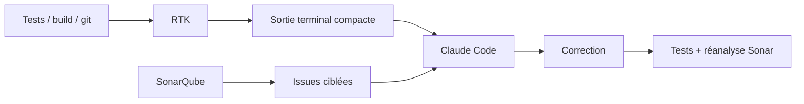

# RTK + SonarQube — réduire le bruit avant Claude Code

<span class="badge-expert">Expert</span> <span class="badge-intellij">IntelliJ</span> <span class="badge-vscode">VS Code</span>

RTK et SonarQube répondent à deux problèmes différents :

- **RTK** réduit le bruit des sorties terminal ;
- **SonarQube** produit des signaux de qualité/sécurité structurés ;
- **Claude Code** utilise ces preuves pour raisonner, modifier et vérifier le dépôt.

Ne les présentez pas comme un même « compresseur ». Sonar doit rester la source de vérité pour ses règles ; RTK ne fait que transformer certaines sorties CLI.

---

## Workflow recommandé


```mermaid
flowchart LR
    A[Tests / build / git] --> B[RTK]
    B --> C[Sortie terminal compacte]
    D[SonarQube] --> E[Issues ciblées]
    C --> F[Claude Code]
    E --> F
    F --> G[Correction]
    G --> H[Tests + réanalyse Sonar]
```

Claude doit recevoir le **minimum de preuve nécessaire**, mais pas au prix de supprimer les détails requis pour diagnostiquer.

---

## Commencer par le serveur MCP officiel Sonar

Avant de construire une couche `rtk-sonar` personnalisée, évaluez le **SonarQube MCP Server officiel**. Il permet à Claude Code d'interroger directement SonarQube Cloud ou Server via des outils structurés.

Pour les cas courants, cette voie évite de maintenir un client API maison.

Un réducteur personnalisé reste pertinent lorsque vous avez besoin d'un format strict, d'un tri métier spécifique, d'une intégration legacy ou d'un export reproductible hors MCP.

---

## Quand un packet Sonar personnalisé reste utile

Le dépôt conserve un exemple PowerShell qui peut :

- collecter un ensemble borné d'issues ;
- filtrer par règle, sévérité ou fichiers Git modifiés ;
- dédupliquer ;
- produire un JSON/Markdown compact ;
- préparer un contexte stable pour une revue humaine ou agentique.

Fichiers :

- [`docs/assets/templates/sonar/rtk-sonar.example.ps1`](../assets/templates/sonar/rtk-sonar.example.ps1) ;
- [`docs/assets/templates/sonar/README-rtk-sonar.example.md`](../assets/templates/sonar/README-rtk-sonar.example.md) ;
- [`docs/assets/templates/sonar/sonar-issues.sample.json`](../assets/templates/sonar/sonar-issues.sample.json).

!!! info "Positionnement"
    Cet exemple est un **outil du dépôt**, pas une fonctionnalité officielle de RTK ni de SonarSource. Le nom `rtk-sonar` désigne ici le pattern de réduction de contexte.

---

## Exemple local sans API

```powershell
pwsh .\docs\assets\templates\sonar\rtk-sonar.example.ps1 summarize \
  --input .\docs\assets\templates\sonar\sonar-issues.sample.json \
  --top 10 --outDir .\tmp
```

Puis :

```powershell
pwsh .\docs\assets\templates\sonar\rtk-sonar.example.ps1 prompt \
  --input .\tmp\sonar-packet.json \
  --top 5 --outDir .\tmp
```

Vérifiez toujours les endpoints Sonar et les champs d'issue contre la version de votre plateforme avant d'utiliser le mode `collect`.

---

## Prioriser le nouveau code

Un backlog complet est rarement un bon lot agentique. Préférez :

```text
1. fichiers modifiés ;
2. nouveau code ;
3. issues bloquantes/fort impact ;
4. une règle ou une famille cohérente ;
5. petit lot ;
6. tests + réanalyse ;
7. lot suivant.
```

Cette stratégie limite les modifications hors périmètre et rend chaque correction vérifiable.

---

## Exemple de consigne Claude

```text
À partir des issues Sonar fournies :
- ne traite que les fichiers modifiés ;
- groupe par règle ;
- commence par les issues bloquantes ;
- applique une correction minimale ;
- exécute les tests pertinents ;
- réinterroge Sonar avant de déclarer l'issue résolue.
```

---

## Sécurité

- Ne placez jamais `SONARQUBE_TOKEN` ou `SONAR_TOKEN` dans un prompt ou un fichier versionné.
- Les exports peuvent révéler noms de fichiers, règles internes et messages métier : traitez-les comme données de développement potentiellement sensibles.
- Limitez les permissions du token à ce qui est nécessaire.
- Ne laissez pas Claude corriger un backlog complet sans bornes et sans validation.
- Si RTK a masqué un détail de build, reproduisez la commande sans filtrage.

---

## Sources

- [SonarQube MCP Server officiel](https://github.com/SonarSource/sonarqube-mcp-server) — consulté le 2026-09-28
- [RTK](https://github.com/rtk-ai/rtk) — consulté le 2026-09-28

---

## Référence en annexe

[Copilot — archive de ce chapitre](../appendices/copilot/chapitre-13-outils-economies.md#page-chapitre-13-outils-economies-rtk-sonar).

## Prochaine étape

Poursuivez avec **[TOON](toon.md)**, la page suivante dans le menu.
