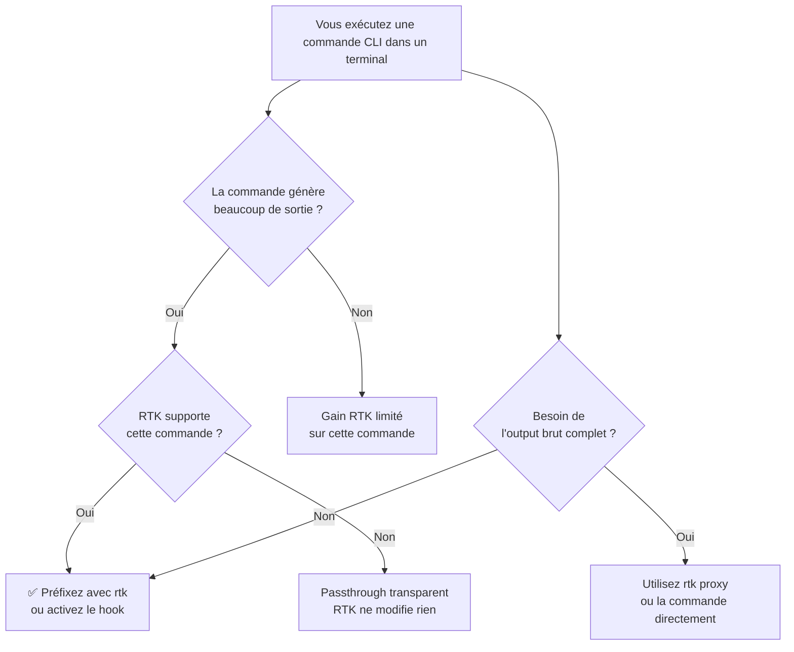

# RTK — Rust Token Killer

<span class="badge-intermediate">Intermédiaire</span>

**RTK** ([rtk-ai.app](https://www.rtk-ai.app/) · [documentation](https://www.mintlify.com/rtk-ai/rtk/introduction) · [GitHub](https://github.com/rtk-ai/rtk)) est un outil **CLI open source écrit en Rust**. Il se place entre votre agent IA (Copilot, Cursor, Claude Code…) et le terminal, et **compresse les sorties de commandes de 60 à 90 %** avant qu'elles n'atteignent la fenêtre de contexte du modèle.

!!! warning "Ce n'est pas un plugin IDE"
    RTK ne s'installe pas dans IntelliJ ou VS Code. C'est un outil **ligne de commande** global. Il n'existe pas de plugin "RTK AI" dans le marketplace JetBrains ni dans celui de VS Code.

---

## Pourquoi RTK réduit les crédits IA

Quand Copilot Agent ou Claude Code exécute une commande dans le terminal (ex. `npm test`, `git log`), la sortie brute est injectée dans la fenêtre de contexte du modèle. Ces sorties peuvent être **très volumineuses** :

```
Sans RTK :
  npm test  →  25 000 tokens de sortie brute  →  injectés dans le contexte

Avec RTK :
  rtk npm test  →  2 500 tokens filtrés  →  -90% de tokens consommés
```

Moins de tokens dans le contexte = **moins de crédits IA consommés** par session d'agent, et des sessions qui durent **3× plus longtemps** avant d'atteindre la limite.

### Économies mesurées (exemples réels)

| Commande | Fréquence (30 min) | Sans RTK | Avec RTK | Gain |
|----------|-------------------|----------|----------|------|
| `git status` | 10× | 3 000 tokens | 600 tokens | -80% |
| `git log` | 5× | 2 500 tokens | 500 tokens | -80% |
| `npm test` | 5× | 25 000 tokens | 2 500 tokens | -90% |
| `ls / tree` | 10× | 2 000 tokens | 400 tokens | -80% |
| `grep / rg` | 8× | 16 000 tokens | 3 200 tokens | -80% |
| **Total session** | — | ~150 000 tokens | ~45 000 tokens | **-70%** |

---

## Comment ça fonctionne

RTK applique quatre stratégies selon la commande :

1. **Filtrage intelligent** — supprime les warnings répétitifs, le boilerplate, les barres de progression
2. **Regroupement** — agrège les fichiers par dossier, les erreurs par type
3. **Troncature** — conserve les N premières/dernières lignes pertinentes au lieu de 1 000
4. **Déduplication** — `Error: timeout (×347)` au lieu de 347 lignes identiques

```bash
# Exemple : git push brut (15 lignes, ~200 tokens)
$ git push
Enumerating objects: 5, done.
Counting objects: 100% (5/5), done.
Delta compression using up to 8 threads
Compressing objects: 100% (3/3), done.
...
To github.com:user/repo.git
   abc1234..def5678  main -> main

# Avec RTK (1 ligne, ~10 tokens — réduction de 95%)
$ rtk git push
ok ✓ main
```

---

## Installation

### Windows

Téléchargez le binaire pré-compilé depuis les [GitHub Releases](https://github.com/rtk-ai/rtk/releases) :

1. Rendez-vous sur [github.com/rtk-ai/rtk/releases](https://github.com/rtk-ai/rtk/releases)
2. Téléchargez `rtk-x86_64-pc-windows-msvc.zip` (ou la version `aarch64` pour ARM)
3. Créez un dossier dédié et ajoutez-le au PATH :

    Ouvrez un terminal **PowerShell** (pas cmd) : dans VS Code ++ctrl+grave++ ou dans le menu Démarrer → "Windows PowerShell". Puis exécutez ces commandes une par une :

    ```powershell
    # Créer le dossier
    New-Item -ItemType Directory -Path "C:\Tools" -Force

    # Extraire rtk.exe dedans (adapter le chemin du zip)
    Expand-Archive -Path "$env:USERPROFILE\Downloads\rtk-x86_64-pc-windows-msvc.zip" -DestinationPath "C:\Tools"

    # Ajouter C:\Tools au PATH de façon permanente (utilisateur courant)
    [Environment]::SetEnvironmentVariable(
        "PATH",
        [Environment]::GetEnvironmentVariable("PATH", "User") + ";C:\Tools",
        "User"
    )
    ```

    !!! info "Prendre en compte le PATH"
        Fermez et rouvrez votre terminal (ou VS Code / IntelliJ) pour que le nouveau PATH soit chargé.

4. Vérifiez l'installation :

```powershell
rtk --version
# rtk 0.34.3 (ou supérieur)

rtk gain
# Doit afficher les statistiques de tokens économisés
```

!!! warning "Résoudre un conflit de nom"
    Il existe deux projets nommés `rtk` sur crates.io. Vérifiez avec `rtk gain` : si la commande n'existe pas, vous avez le mauvais paquet. Utilisez toujours le binaire issu de [`rtk-ai/rtk`](https://github.com/rtk-ai/rtk/releases).

### macOS / Linux

```bash
# Via le script d'installation (recommandé)
curl -fsSL https://raw.githubusercontent.com/rtk-ai/rtk/refs/tags/v0.34.3/install.sh | sh

# Via Homebrew (macOS et Linux)
brew install rtk
```

---

## Activation du hook automatique

Sans configuration supplémentaire, vous devez préfixer chaque commande avec `rtk`. Pour que **toutes les commandes soient automatiquement compressées** sans effort, lancez cette commande **dans votre terminal système** (PowerShell sous Windows, ou bash/zsh sur macOS/Linux) — **pas dans le chat IA** :

```powershell
rtk init --global
```

!!! note "Traçabilité — option `--copilot`"
    Des retours communautaires indiquent qu'une variante dédiée Copilot peut
    fonctionner, et elle a été testée avec succès dans ce contexte (jouer les 2 commandes, celle de dessus puis la version copilot) :
    ```powershell
    rtk init -g --copilot
    ```
    Cette option n'est pas documentée officiellement à date dans la
    documentation RTK. Utilisez-la de manière prudente (selon version), et
    conservez `rtk init --global` comme commande de référence si l'option est
    refusée. Attention, il se peut qu'un fichier copilote-instruction soit créé ou remplace le votre, 
    dans ce cas là faite en un fichier `.instruction` et reméttez votre propre copilot-instruction.md !

!!! info "Copilot : commande à utiliser"
    La commande officiellement documentée pour activer RTK reste
    `rtk init --global` dans un terminal (PowerShell, bash ou zsh), pas dans le
    chat Copilot.
    Une fois exécutée, le hook shell s'applique automatiquement aux commandes
    suivantes.

!!! info "Où lancer cette commande ?"
    - **VS Code** : terminal intégré (++ctrl+grave++) → PowerShell
    - **IntelliJ** : onglet Terminal en bas de l'IDE
    - **Windows** : menu Démarrer → "Windows PowerShell"

    Cette commande n'interagit pas avec une IA. Elle modifie la configuration de votre shell pour intercepter automatiquement les commandes CLI.

    Cette commande installe un **hook shell** (dans votre profil PowerShell, bash ou zsh). À partir de là, chaque commande `git status`, `npm test`, etc. que vous tapez dans un terminal passe automatiquement par RTK.

    !!! note "Hook shell vs hook agent"
        Le hook shell fonctionne dans **tout terminal interactif** (VS Code, IntelliJ, Windows Terminal…) car le shell charge votre profil au démarrage. En revanche, certains agents IA comme Claude Code ont leur propre mécanisme (`PreToolUse`) qui garantit l'interception même hors terminal interactif.

### Utilisation explicite (sans hook)

Préfixez simplement `rtk` devant vos commandes habituelles :

```bash
rtk git status
rtk git log
rtk npm test
rtk cargo test
rtk grep "pattern" src/
rtk ls -la
```

### Avec le hook (automatique)

Après `rtk init --global`, continuez à écrire vos commandes normalement — RTK s'intercale automatiquement.

### Suivi des économies

```bash
rtk gain
```

```
📊 RTK Token Savings
════════════════════════════════════════
Total commands:    2,927
Input tokens:      11.6M
Output tokens:     1.4M
Tokens saved:      10.3M (89.2%)

By Command:
────────────────────────────────────────
Command               Count      Saved     Avg%
rtk find                324       6.8M    78.3%
rtk git status          215       1.4M    80.8%
rtk grep                227     786.7K    49.5%
rtk cargo test           16      50.1K    91.8%
```

---

## Commandes supportées

RTK optimise **50+ commandes** classiques du développement :

| Catégorie | Commandes |
|-----------|-----------|
| **Git** | `status`, `diff`, `log`, `push`, `pull`, `branch`, `stash` |
| **Tests** | `cargo test`, `npm test`, `pytest`, `go test`, `vitest`, `playwright` |
| **Packages** | `npm install`, `pnpm list`, `pip install`, `cargo build` |
| **Linters** | `eslint`, `ruff`, `tsc`, `mypy`, `cargo clippy` |
| **Containers** | `docker ps`, `docker logs`, `kubectl get pods` |
| **Fichiers** | `ls`, `tree`, `grep`, `cat`, `find` |
| **Divers** | `curl`, `gh pr list`, `next build`, `prisma migrate` |

La liste complète avec les détails de filtrage par commande est disponible dans la documentation officielle : **[mintlify.com/rtk-ai/rtk/commands/overview](https://www.mintlify.com/rtk-ai/rtk/commands/overview)**

---

## Compatibilité avec les agents IA

| Outil | Compatibilité | Notes |
|-------|--------------|-------|
| **Claude Code** | ✅ Natif | Hook `PreToolUse` intégré — compression automatique garantie |
| **GitHub Copilot Agent** (VS Code) | ✅ Via hook shell | Le terminal intégré charge le profil shell → RTK actif |
| **GitHub Copilot Agent** (IntelliJ) | ✅ Via hook shell | Le terminal intégré charge le profil shell → RTK actif |
| **Cursor** | ✅ Via hook shell | Terminal intégré charge le profil shell |
| **Aider** | ✅ Via hook shell | Réduit la facture API de ~70% |
| **Gemini CLI** | ✅ Via hook shell | Libère du headroom sur le quota gratuit |


---

## Intérêts concrets

RTK cible un problème précis : les sorties de commandes CLI sont la source de bruit la plus **volumineuse et la plus répétitive** dans la fenêtre de contexte d'un agent IA. Un `npm test` peut générer 25 000 tokens de sortie brute ; RTK le ramène à 2 500 tokens — sans perte d'information utile pour l'agent.

### Ce que RTK apporte réellement

| Intérêt | Détail |
|---------|--------|
| **Réduction mesurable** | 60–90 % de tokens en moins sur les sorties CLI (données issues de la documentation officielle RTK) |
| **Sessions plus longues** | Moins de tokens consommés = sessions agent 3× plus longues avant d'atteindre la limite de contexte |
| **Zéro reconfiguration** | 50+ commandes optimisées dès l'installation, sans ajustement par commande |
| **Hook transparent** | Après `rtk init --global`, les commandes habituelles passent automatiquement par RTK — aucun changement de workflow |
| **Traçabilité objective** | `rtk gain` affiche précisément les tokens économisés par commande et par session |
| **Gratuit et open source** | Licence MIT, aucun abonnement, code auditable sur [github.com/rtk-ai/rtk](https://github.com/rtk-ai/rtk) |
| **Multi-agents** | Fonctionne avec Claude Code (natif), Copilot Agent VS Code, Cursor, Aider, Gemini CLI |
| **Passthrough sécurisé** | Pour les commandes non reconnues, RTK laisse passer la sortie sans modification — aucun risque de casser un workflow existant |

### Ce que ça change concrètement

Sur une session de développement de 30 minutes typique avec un agent IA :

- **Sans RTK** : ~150 000 tokens de sorties CLI injectées dans le contexte
- **Avec RTK** : ~45 000 tokens — soit **70 % d'économie** avant même d'optimiser les prompts

Cette réduction s'accumule sur chaque cycle. Chaque `git status`, chaque `npm test`, chaque `ls` répété dix fois dans une session devient une opportunité d'économie automatique.

!!! tip "Rentabilité immédiate"
    RTK est particulièrement rentable pour les sessions Copilot Agent ou Claude Code qui enchaînent des cycles build/test/debug. Ces sessions appellent des dizaines de commandes CLI dont les sorties remplissent rapidement la fenêtre de contexte — souvent bien avant la fin d'une tâche complexe.

---

## Limites et points de vigilance

RTK est efficace dans son périmètre, mais il ne fait **pas tout**. Comprendre ses limites évite les malentendus et les mauvaises surprises.

### Ce que RTK ne fait pas

| Besoin | RTK ? | Outil adapté |
|--------|:-----:|-------------|
| Détecter des bugs ou vulnérabilités dans le code | ❌ | SonarQube, ESLint, mypy, Semgrep |
| Réduire les tokens des **fichiers de code** envoyés à l'IA | ❌ | Sélectionner manuellement les fichiers pertinents |
| Compresser les **prompts ou messages** de chat | ❌ | Rédiger des prompts plus concis |
| Analyser la qualité ou l'architecture du code | ❌ | SonarQube, Qodana, ArchUnit |
| Fournir des suggestions ou complétions de code | ❌ | GitHub Copilot, Codeium, Tabnine |
| Réduire le contexte entre deux sessions distinctes | ❌ | Gérer manuellement l'historique de chat |

!!! info "RTK et SonarQube ne font pas la même chose"
    RTK réduit la taille des sorties **terminal**. SonarQube détecte des problèmes de **qualité de code** par analyse statique. Ces deux outils sont complémentaires — l'un agit sur le bruit CLI, l'autre sur la qualité du code source.

### Limites du hook shell

!!! warning "Hook shell ≠ hook agent"
    Le hook installé par `rtk init --global` modifie votre **profil shell** (PowerShell, bash ou zsh). Il fonctionne dans tout terminal **interactif** qui charge ce profil au démarrage — y compris le terminal intégré de VS Code et d'IntelliJ.

    En revanche, si un agent IA exécute des commandes via son **propre moteur interne** sans passer par un shell interactif, le hook shell peut ne pas être déclenché. Les commandes passent alors sans compression. C'est notamment le cas de **Claude Code** qui dispose d'un hook `PreToolUse` dédié pour garantir la compression indépendamment du shell.

### Garantie de compression par agent

| Agent | Garantie de compression | Mécanisme utilisé |
|-------|:----------------------:|------------------|
| **Claude Code** | ✅ Garantie | Hook `PreToolUse` natif — indépendant du shell |
| **Copilot Agent (VS Code)** | ✅ Via hook shell | Le terminal intégré charge votre profil shell |
| **Copilot Agent (IntelliJ)** | ✅ Via hook shell | Le terminal intégré charge votre profil shell |
| **Cursor, Aider, Gemini CLI** | ✅ Via hook shell | Terminal intégré charge le profil shell |

### Risque de filtrage excessif

RTK applique des règles de filtrage par commande. Dans de rares cas, une information utile pourrait être supprimée si elle ressemble à du bruit (warning répétitif, ligne de progression, etc.). Si vous avez besoin de **l'output complet** pour un diagnostic avancé, utilisez `rtk proxy` :

```bash
# Exécuter la commande sans filtrage RTK (sortie brute complète)
rtk proxy npm test
```

Cette commande laisse passer l'output sans modification tout en continuant à enregistrer les statistiques.

### Conflit de nom sur crates.io

!!! danger "Ne pas installer via `cargo install rtk`"
    Il existe **deux projets différents** nommés `rtk` sur crates.io. Le paquet installé via `cargo install rtk` n'est **pas** RTK AI et ne dispose pas de la commande `rtk gain`.

    **Vérification** : après installation, `rtk gain` doit fonctionner. Si la commande n'existe pas, vous avez installé le mauvais paquet.

    Utilisez toujours le **binaire officiel** depuis [github.com/rtk-ai/rtk/releases](https://github.com/rtk-ai/rtk/releases) ou `brew install rtk`.

---

## Quand utiliser RTK — guide décisionnel

### ✅ Cas d'usage idéaux

RTK est particulièrement utile dans ces situations :

- **Sessions agent longues** (Copilot Agent, Claude Code) : les agents exécutent des dizaines de commandes CLI dont les sorties s'accumulent dans la fenêtre de contexte.
- **Cycles build/test répétitifs** : `npm test`, `cargo test`, `pytest` — chaque exécution peut générer des milliers de lignes de sortie.
- **Exploration de codebase** : `ls`, `find`, `grep` répétés produisent un volume important, surtout sur de gros dépôts.
- **Logs de conteneurs et pods** : `docker logs`, `kubectl logs` — la déduplication RTK est particulièrement efficace sur les logs répétitifs.
- **Usage avec Aider ou Gemini CLI** : ces outils n'ont pas de mécanisme natif d'économie de tokens sur les sorties CLI.
- **Développement avec de nombreux allers-retours terminal** : plus une session est intensive en CLI, plus le gain est élevé.

### ❌ Quand ne pas s'en remettre uniquement à RTK

RTK n'est **pas** la bonne réponse à ces situations :

- **Besoin d'analyser la qualité du code** → utilisez SonarQube, Qodana ou ESLint en amont.
- **Besoin de réduire les tokens d'un prompt de chat** → affinez votre prompt, ne copiez que ce qui est nécessaire.
- **Besoin de l'output complet pour un diagnostic précis** → utilisez `rtk proxy <commande>` pour passer sans filtre.
- **Sessions IA centrées sur des fichiers de code** → RTK n'agit pas sur le contenu des fichiers, seulement sur les sorties CLI.
- **Problème de performance ou de rendu d'une interface** → RTK ne comprime pas les sorties graphiques.

### Diagramme de décision



### À retenir

!!! success "Bonne pratique"
    Activez RTK avec `rtk init --global` **une seule fois** puis oubliez-le. Il réduit automatiquement le bruit sur toutes les commandes supportées. Pour le reste — qualité code, prompts, fichiers — continuez à appliquer les autres leviers du chapitre.

!!! failure "Mauvaise pratique"
    Considérer que RTK seul suffira si vos sessions IA portent principalement sur des **analyses de fichiers de code** ou des **discussions en chat**. RTK n'agit que sur les sorties des **commandes CLI** — pas sur le reste du contexte envoyé au modèle.

---

## Résumé

| Aspect | Détail |
|--------|--------|
| Type | Outil CLI (Rust, open source, MIT) |
| GitHub | [rtk-ai/rtk](https://github.com/rtk-ai/rtk) |
| Documentation | [mintlify.com/rtk-ai](https://www.mintlify.com/rtk-ai/rtk/introduction) |
| Installation | Binaire Windows · `brew install rtk` · script curl |
| Gratuit | Oui, entièrement |
| Économies mesurées | 60–90% de tokens par commande CLI |
| Plugin IDE | ❌ Aucun — fonctionne au niveau du terminal |
| Ce que RTK fait | Compresse les sorties CLI avant injection dans le contexte LLM |
| Ce que RTK ne fait pas | Qualité code, analyse statique, réduction des fichiers ou prompts |

!!! success "Recommandation"
    Lancez `rtk init --global` une seule fois. Ensuite, chaque session Copilot Agent ou Claude Code consommera automatiquement 60 à 90 % de tokens en moins sur les sorties de commandes, sans rien changer à votre workflow.

---

## Sources

- [RTK — Introduction](https://www.mintlify.com/rtk-ai/rtk/introduction) (vérifié le 2026-06-17)
- [RTK — Commands overview](https://www.mintlify.com/rtk-ai/rtk/commands/overview) (vérifié le 2026-06-17)
- [RTK — GitHub Releases (binaires officiels)](https://github.com/rtk-ai/rtk/releases) (vérifié le 2026-06-17)
- [RTK — Site officiel](https://www.rtk-ai.app/) (vérifié le 2026-06-17)
- [RTK — Dépôt GitHub rtk-ai/rtk](https://github.com/rtk-ai/rtk) (vérifié le 2026-06-17)

---

## Prochaine étape

**[SonarQube — Détecter et corriger sans gaspiller de crédits IA](sonarqube.md)** : appliquer une détection qualité déterministe avant d'escalader vers l'IA.

Concepts clés couverts :

- **Détection déterministe** — corriger d'abord sans consommer de crédits IA
- **Connected Mode** — aligner les règles locales et serveur d'équipe
- **Escalade maîtrisée** — passer à l'IA uniquement sur les cas résiduels
- **Validation locale** — compiler/tester avant relance d'analyse
