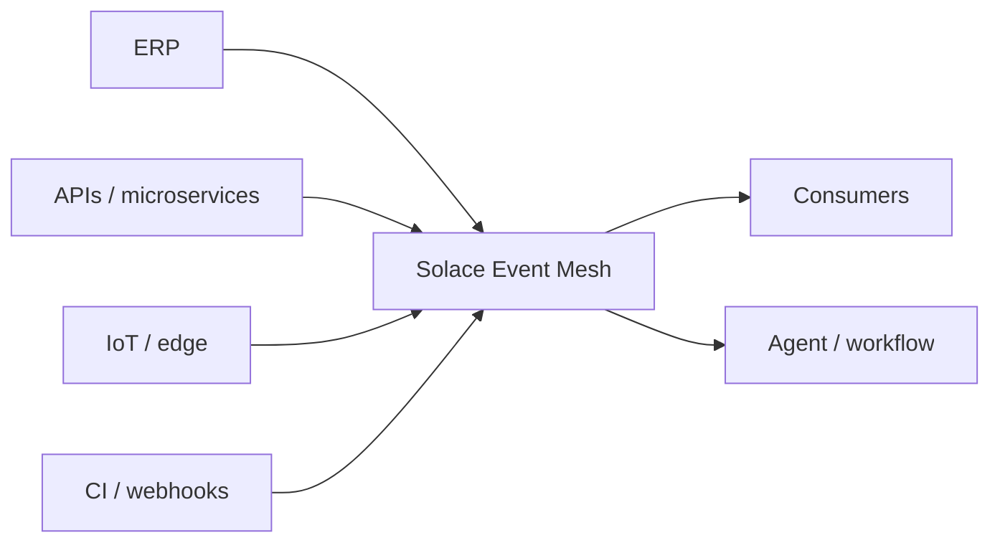

# Solace — event mesh et agents temps réel

<span class="badge-intermediate">Intermédiaire</span>

**Solace** fournit des technologies de messaging et d'architecture event-driven. Son **Event Broker** permet de transporter des événements entre applications, services, appareils et agents, tandis qu'un **event mesh** fédère plusieurs brokers pour router les événements entre environnements.

Solace documente également **Agent Mesh**, qui peut connecter des agents et workflows à différents points d'entrée, notamment MCP, webhooks et événements provenant d'un event mesh.

!!! info "Deux couches à ne pas confondre"
    **Event Broker / Event Mesh** transporte les événements. **Agent Mesh** orchestre des agents/workflows et peut consommer ou exposer ces capacités via plusieurs entrypoints. MCP est l'un de ces mécanismes, pas un synonyme de l'event mesh.

---

## Architecture event-driven



Le producteur publie un événement sans devoir connaître tous les consommateurs. Les consommateurs s'abonnent aux topics pertinents selon l'architecture choisie.

---

## Pourquoi c'est différent d'un appel API classique

Avec une API synchrone :

```text
service A → appelle directement → service B
```

Avec une architecture événementielle :

```text
service A → publie événement → broker/event mesh → consommateurs
```

Ce découplage devient utile lorsque plusieurs systèmes doivent réagir au même événement, lorsque les producteurs et consommateurs évoluent indépendamment ou lorsqu'il faut distribuer des événements entre plusieurs environnements.

---

## Agents IA et temps réel

Un agent devient plus utile lorsqu'il peut être déclenché par un **événement métier réel** plutôt que seulement par un utilisateur humain.

Exemples :

```text
commande créée
→ événement
→ workflow de contrôle
→ agent analyse anomalie
→ ticket ou recommandation
```

```text
incident observabilité
→ événement
→ agent récupère contexte
→ diagnostic
→ validation humaine
```

```text
pipeline CI échoue
→ webhook/event mesh
→ agent analyse logs
→ proposition de correction
```

Le broker assure le transport ; l'agent assure le raisonnement. Gardez ces responsabilités séparées.

---

## Solace Agent Mesh et MCP

La documentation Solace Agent Mesh décrit plusieurs types d'entrypoints :

- **MCP** : exposer des agents comme outils MCP à des clients tels que Claude Code ;
- **Event Mesh** : router des événements de topics vers un agent ou workflow ;
- **Webhook** : recevoir des événements HTTP depuis GitHub, CI, IoT ou d'autres systèmes ;
- autres canaux selon les intégrations disponibles.

Architecture possible :

```text
Système métier
    ↓ événement
Solace Event Mesh
    ↓
Agent Mesh workflow
    ↓
Agent spécialisé
    ↓
outil/API/MCP
```

Ou dans l'autre sens :

```text
Claude Code
    ↓ MCP
Agent Mesh
    ↓
workflow / agent / service
```

---

## Quand utiliser Solace

Solace devient pertinent lorsque vous avez :

- beaucoup de producteurs et consommateurs d'événements ;
- plusieurs clouds/datacenters/environnements à relier ;
- un besoin de distribution temps réel ;
- des workflows agents déclenchés par événements ;
- un SI déjà orienté messaging/event-driven.

Il est probablement excessif pour une petite application où quelques appels HTTP ou une file simple suffisent.

---

## Avec Claude Code

Claude Code peut aider à :

1. cartographier producteurs, consumers et topics ;
2. écrire ou relire la configuration ;
3. vérifier les contrats d'événements ;
4. construire des tests de consumers/producers ;
5. documenter les workflows et erreurs de livraison ;
6. analyser des incidents à partir de métriques/logs ciblés ;
7. intégrer un point d'entrée MCP lorsque l'architecture le justifie.

Claude ne doit pas recevoir un accès global à l'administration du broker uniquement pour lire quelques événements. Exposez des outils bornés et audités.

---

## Sécurité

Dans une architecture agentique event-driven :

- authentifiez producteurs et consommateurs ;
- segmentez les droits par topics/opérations ;
- validez le schéma des événements ;
- considérez les payloads externes comme non fiables ;
- empêchez qu'un événement injecte directement des instructions privilégiées dans un agent ;
- rendez les actions critiques idempotentes ;
- conservez correlation IDs et audit trail ;
- placez une validation humaine devant les opérations irréversibles lorsque nécessaire.

!!! danger "Event payload ≠ instruction fiable"
    Un événement métier peut contenir du texte contrôlé par un utilisateur externe. Traitez-le comme une donnée, pas comme une instruction système pour l'agent.

---

## Solace vs MCP

| Besoin | Solace Event Mesh | MCP |
|---|---:|---:|
| distribuer des événements temps réel | ✅ | ❌ |
| découpler producteurs/consommateurs | ✅ | ❌ |
| exposer des outils à un LLM | ❌ | ✅ |
| appeler une ressource à la demande | indirect | ✅ |
| déclencher un agent depuis un événement | ✅ via intégration/workflow | pas son rôle principal |
| combiner les deux | ✅ | ✅ |

Ils sont donc **complémentaires** dans certaines architectures.

---

## Sources

Sources officielles consultées le **28 septembre 2026** :

- [Solace — Event Broker](https://solace.com/products/event-broker/)
- [Solace Developer](https://www.solace.dev/)
- [Solace Agent Mesh — Entrypoints](https://docs.solace.com/Agent-Mesh/Framework/building/entrypoints/index.htm)

## À lire ensuite

- **[MCP — présentation et choix](mcps/index.md)** pour connecter des outils à Claude ;
- **[Observabilité & GreenOps](observabilite/index.md)** pour surveiller les workflows distribués.
