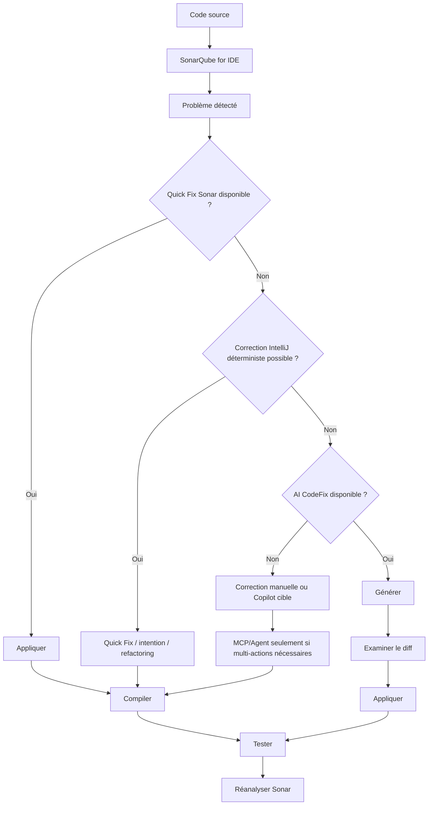

# SonarQube — Détecter et corriger sans gaspiller de crédits IA

<span class="badge-expert">Expert</span> <span class="badge-intellij">IntelliJ</span>

Ce guide te montre comment utiliser SonarQube dans IntelliJ IDEA avec GitHub Copilot en limitant les coûts de contexte et de crédits. Le principe est simple : traiter d'abord tout ce qui est déterministe, puis n'escalader vers l'IA que pour le reliquat complexe.

!!! info "Fiabilité et date de vérification"
    Informations vérifiées le : 2026-06-15. Les conditions commerciales et les fonctionnalités en preview peuvent évoluer.

---

## Objectif

Sonar devient le moteur de détection prioritaire. Copilot intervient ensuite, au cas par cas.

```text
Détecter sans IA
-> corriger sans IA
-> corriger avec l'IA Sonar
-> utiliser Copilot sur le reliquat complexe
-> compiler, tester et réanalyser
```

!!! tip "Pourquoi ce workflow économise"
    Une règle Sonar ciblée (ex : `java:S3776`) est un contexte compact. C'est plus fiable et moins coûteux qu'un prompt large du type "analyse tout le dépôt".

---

## Architecture du système



---

## Comparaison des composants

| Composant | Usage prioritaire | Crédits Copilot | Vigilance |
|---|---|---|---|
| SonarQube for IDE | Détecter localement en continu | Non | Couverture variable selon langage/règle |
| Sonar Quick Fix | Corriger une issue unitaire déterministe | Non | Pas disponible sur toutes les règles |
| Inspections/Code Cleanup IntelliJ | Nettoyage local avant IA | Non | Ne remplace pas les règles Sonar d'entreprise |
| AI CodeFix (Sonar) | Escalade IA côté Sonar si pas de quick fix | Non direct | Disponibilité selon édition/version/langage |
| SonarQube MCP Server | Triage assisté et collecte bornée d'issues | Possible (si mode Agent de GitHub Copilot) | Cadrage strict pour limiter le contexte |
| GitHub Copilot (chat ou mode Agent) | Reliquat complexe ou multi-fichiers | Oui, possible | Borner périmètre, itérations et fichiers |
| Remediation Agent (Sonar) | Traitement backlog/PR à grande échelle | Non direct | Capacité beta/contractuelle selon offre |

!!! info "Version et édition"
    Les disponibilités exactes (features, quotas, clients compatibles) varient selon ta version Sonar, ton édition et le plan Copilot. Vérifie toujours la matrice officielle avant de généraliser.

!!! warning "Copilot et MCP"
    Le serveur MCP Sonar fournit des outils et des résultats d'analyse. Toutefois, lorsqu'un modèle GitHub Copilot raisonne sur ces résultats, appelle les outils et génère une correction, l'activité du modèle peut consommer des AI Credits. Une terminologie legacy peut encore apparaître dans certains contextes.

---

## Installation de SonarQube for IDE (IntelliJ)

1. Ouvre `Settings`.
2. Va dans `Plugins`.
3. Recherche le plugin officiel SonarQube for IDE.
4. Vérifie l'éditeur (`SonarSource`) sur la fiche du plugin.
5. Installe.
6. Redémarre IntelliJ si demandé.
7. Ouvre la fenêtre SonarQube dans l'IDE.
8. Vérifie qu'une analyse locale remonte des issues.

### Diagnostic si aucune alerte n'apparaît

- Vérifie que le fichier/langage est pris en charge.
- Vérifie les exclusions du projet.
- Vérifie les logs IntelliJ et plugin.
- Vérifie le niveau d'analyse actif.
- Vérifie le JDK du projet.
- Vérifie les règles actives/profil qualité.
- Vérifie le Connected Mode s'il est activé.
- Vérifie les notifications/erreurs du plugin.

!!! info "Référence JetBrains"
    L'installation de plugins IntelliJ passe par `Settings -> Plugins` selon la documentation officielle JetBrains.

---

## Mode autonome et Connected Mode

### Mode autonome

- Analyse locale dans l'IDE.
- Regles embarquees.
- Pas de synchro automatique avec le profil qualite entreprise.
- Zero credit Copilot.

### Connected Mode

- Connexion a SonarQube Server ou SonarQube Cloud.
- Synchronisation des regles et Quality Profiles.
- Liaison du projet (bind).
- Notifications et contexte serveur selon fonctionnalites actives.
- Authentification par token utilisateur.

### Connexion cloud vs server

=== "SonarQube Cloud"
    - Connecte l'IDE à ton organisation SonarQube Cloud.
    - Crée un token utilisateur adapté.
    - Lie le projet et vérifie la synchro des règles.

=== "SonarQube Server"
    - Connecte l'IDE à l'URL de ton SonarQube Server.
    - Crée un token utilisateur.
    - Lie le projet pour aligner les règles IDE/CI.

### Token : création, test, rotation

- Crée un token utilisateur selon la doc officielle de ta plateforme Sonar.
- Teste la connexion depuis l'IDE.
- Renouvelle/rotation selon la politique sécurité.
- Révoque immédiatement un token exposé.

!!! danger "Secrets"
    - Ne mets jamais le token dans Git.
    - Ne mets jamais un vrai token dans une capture.
    - N'utilise jamais un exemple ressemblant à un vrai secret.
    - Privilégie les variables d'environnement et le gestionnaire de secrets entreprise.

---

## Règles d'entreprise Sonar

Les règles d'entreprise (Quality Profiles personnalisés, sévérités adaptées, règles custom) permettent de réduire le bruit et de concentrer l'effort sur ce qui compte vraiment pour ton contexte métier.

- Définis un profil par stack (Java, JS/TS, etc.).
- Distingue règles bloquantes vs non bloquantes.
- Versionne et gouverne les exceptions.
- Aligne IDE, CI et Quality Gate sur le même référentiel.

!!! tip "Effet direct sur les crédits"
    Moins de faux positifs et moins de bruit = moins de prompts inutiles vers Copilot.

---

## Détection sans crédit IA

SonarQube for IDE permet d'exploiter en local :

- surlignage dans l'éditeur.
- fenêtre des problèmes Sonar.
- identifiant de règle (ex: `java:S3776`).
- catégorie et sévérité.
- description et emplacement.
- flux de données quand disponible.
- distinction nouveau code vs dette historique, si le serveur le permet.

Cette étape ne nécessite pas de LLM : elle repose sur analyse statique et règles déterministes.

---

## Sonar Quick Fix

- Repère l'indication de Quick Fix sur l'issue.
- Ouvre la proposition depuis l'IDE.
- Examine l'aperçu.
- Applique la correction.
- Annule si la correction n'est pas conforme.
- Vérifie disparition de l'issue après réanalyse.

!!! warning "À ne pas surpromettre"
    Toutes les règles n'ont pas de Quick Fix. Et la couverture dépend du langage, de la règle et de la version plugin.

### Ne pas confondre

- **Quick Fix Sonar** : correction proposée par règle Sonar.
- **Intention IntelliJ** : action contextuelle native IDE.
- **Refactoring IntelliJ** : transformation structurelle de code.
- **Code Cleanup IntelliJ** : application en lot de nettoyages IntelliJ.

---

## AI CodeFix

AI CodeFix doit rester un niveau d'escalade, pas le point d'entrée.

- Principe : suggestion de correctif IA pour certaines issues Sonar compatibles.
- Point d'entrée : l'action apparaît sur une **issue Sonar** dans **SonarQube for IDE**.
- Emplacement pratique : depuis le code surligné dans l'éditeur ou depuis la fenêtre SonarQube d'IntelliJ, pas dans un menu global séparé.
- Prérequis : projet lié en Connected Mode à un SonarQube Server/Cloud compatible, fonctionnalité activée côté administration, et issue éligible.
- Produits/éditions/langages : vérifier la matrice officielle Sonar de ta version.
- Processus : générer -> relire le diff -> appliquer -> compiler/tester -> réanalyser.

### Ce qu'est AI CodeFix

AI CodeFix est une fonctionnalité Sonar qui propose un correctif généré par IA à partir d'une issue précise. Elle sert quand il n'existe pas de correction déterministe suffisante, ou quand tu veux un point de départ rapide sur une règle compatible.

À distinguer de **Sonar Quick Fix** :

- **Sonar Quick Fix** : correction déterministe fournie par la règle quand elle existe.
- **AI CodeFix** : proposition générée par IA, à relire et valider avant application.

### Où le trouver dans IntelliJ

Ne cherche pas un bouton `AI CodeFix` dans les menus globaux d'IntelliJ ou dans GitHub Copilot.

Cherche-le à l'endroit où l'issue Sonar est affichée :

1. Ouvre un fichier contenant une issue détectée par SonarQube for IDE.
2. Clique sur le code surligné ou ouvre le détail de l'issue dans la fenêtre SonarQube.
3. Vérifie si l'action de correction IA est proposée pour cette issue.
4. Ouvre l'aperçu du diff, puis applique seulement après relecture.

### Si l'option n'apparaît pas

Les causes fréquentes sont :

- l'issue n'est pas éligible à AI CodeFix ;
- le projet n'est pas en Connected Mode ;
- la fonctionnalité n'est pas activée côté Sonar ;
- l'édition, la version, le langage ou la règle ne sont pas pris en charge.

!!! info "Position coût"
    AI CodeFix ne consomme pas les crédits GitHub Copilot à lui seul, mais peut dépendre d'une licence Sonar, d'un quota ou de limitations produit.

!!! warning "Validation obligatoire"
    AI CodeFix ne remplace jamais les tests ni la revue humaine.

---

## SonarQube MCP Server

Le MCP est un pont outillage, pas un LLM.

- Il expose des outils Sonar à un client MCP.
- Les transports documentés peuvent inclure `stdio` et des modes distants HTTP/HTTPS selon la version cible.
- Les variables d'environnement de référence peuvent inclure `SONARQUBE_TOKEN`, `SONARQUBE_URL`, `SONARQUBE_ORG` selon le contexte (Server/Cloud).
- Utilise le générateur officiel de configuration quand possible.

### Scénario A - MCP local avec Docker

Exemple générique (placeholders uniquement):

```bash
# SonarQube Server (placeholder)
docker run --rm -i \
  -e SONARQUBE_TOKEN=<SONARQUBE_USER_TOKEN> \
  -e SONARQUBE_URL=<SONARQUBE_URL> \
  sonarsource/sonarqube-mcp-server:latest

# SonarQube Cloud (placeholder)
docker run --rm -i \
  -e SONARQUBE_TOKEN=<SONARQUBE_USER_TOKEN> \
  -e SONARQUBE_ORG=<SONARQUBE_ORG> \
  sonarsource/sonarqube-mcp-server:latest
```

### Scénario B - MCP distant d'entreprise

- HTTPS obligatoire.
- Authentification Bearer/tokens selon politique interne.
- Certificats valides et rotation.
- Filtrage réseau et moindre privilège.
- Journalisation et traçabilité.
- Gouvernance admin explicite (responsabilités, audits).

### Test de disponibilité MCP

- Utilise l'outil de diagnostic officiel documenté par ta version.
- `ping_system` doit être utilisé uniquement s'il est listé officiellement dans la référence des tools de la version cible.

!!! warning "Compatibilité Copilot JetBrains"
    La prise en charge directe dans GitHub Copilot pour les IDE JetBrains doit être vérifiée selon la version du plugin. Le guide officiel Sonar documente principalement les clients explicitement listés.

### Compatibilité Copilot (distinction obligatoire)

| Surface | État pratique (à valider selon version) |
|---|---|
| GitHub Copilot CLI | Souvent le cas le mieux documenté dans les quickstarts Sonar MCP |
| GitHub Copilot dans VS Code | Généralement documenté côté GitHub et Sonar |
| Agent de codage GitHub Copilot (cloud) | Peut être disponible selon rollout et documentation du moment |
| GitHub Copilot dans IntelliJ | À vérifier explicitement sur la version du plugin JetBrains/Copilot |

---

## Remediation Agent

Le Remediation Agent Sonar est documenté comme fonctionnalité beta sur les pages Sonar dédiées à date (vérifiées le 2026-06-15).

À couvrir dans une équipe:

- objectif (traitement du backlog/PR),
- disponibilité selon offre,
- intégration GitHub,
- corrections proposées et création de PR,
- réanalyse Sonar avant validation,
- validation humaine obligatoire avant merge,
- langages officiellement supportés,
- limites et conditions commerciales.

!!! warning "Positionnement"
    Ce n'est pas un plugin local IntelliJ autonome. C'est une capacité côté plateforme Sonar.

---

## Distinction obligatoire sur la consommation de crédits

### Zéro crédit GitHub Copilot

- Analyse statique locale SonarQube for IDE.
- Détection en temps réel dans l'éditeur.
- Consultation description de règle.
- Sonar Quick Fix déterministe.
- Quick-fixes/intention/refactoring IntelliJ.
- Compilation locale.
- Tests locaux.
- Nouvelle analyse Sonar locale.
- Consultation Sonar Server/Cloud sans mode Agent de GitHub Copilot.

### Pas de crédit Copilot, mais service Sonar soumis à conditions

- AI CodeFix.
- Remediation Agent.
- Fonctions Sonar selon édition/licence/quota.

### Consommation possible de crédits/requêtes Copilot

- GitHub Copilot (chat).
- Édition assistée par GitHub Copilot (selon l'IDE).
- GitHub Copilot (mode Agent).
- Appel d'un outil MCP via le mode Agent de GitHub Copilot.
- Analyse multi-fichiers par GitHub Copilot.
- Boucles automatiques corriger/compiler/tester/reessayer.

---

## Workflow économique recommandé

### Niveau 0 - Détection locale

- SonarQube for IDE.
- Aucune IA.
- Aucun contexte envoyé.

### Niveau 1 - Correction déterministe

- Sonar Quick Fix.
- IntelliJ quick fix/intention/refactoring.
- Compilation + tests.

### Niveau 2 - Correction IA Sonar

- AI CodeFix.
- Relecture du diff.
- Tests et réanalyse.

### Niveau 3 - Copilot cible

- Une issue.
- Une règle.
- Une méthode/classe.
- Contexte minimal.

### Niveau 4 - Agent MCP

Seulement si nécessaire pour :

- récupérer plusieurs issues,
- grouper par règle,
- corriger plusieurs fichiers cohérents,
- compiler, tester, réanalyser,
- produire un rapport.

### Niveau 5 - Remediation Agent + CI

Pour équipes disposant de l'offre Sonar compatible.

---

## Procédure de correction manuelle optimisée

1. Sélectionne une issue.
2. Relève la clé de règle.
3. Lis la description Sonar.
4. Recherche les occurrences de la même règle.
5. Vérifie un Quick Fix Sonar.
6. Vérifie une intention IntelliJ.
7. Applique sur une occurrence.
8. Compile.
9. Exécute le test cible.
10. Réanalyse.
11. Puis traite les autres occurrences.
12. Utilise Copilot uniquement si nécessaire.

---

## Procédure semi-automatique avec Copilot

1. Sélectionne uniquement le fichier concerné.
2. Donne la clé de règle.
3. Donne le message exact.
4. Donne la méthode ciblée.
5. Donne les contraintes projet.
6. Analyse sans modif d'abord uniquement si nécessaire.
7. Demande une correction minimale.
8. Interdis les modifications hors périmètre.
9. Compile + tests localement.
10. Demande un second passage seulement en cas d'échec réel.

### À éviter

- "Corrige tous les problèmes Sonar du projet".
- "Analyse tout le dépôt".
- "Refactore toute l'application".
- Boucles agent non bornées.
- Envoi du rapport Sonar complet si une issue suffit.

---

## Procédure automatisée par lots

- Branche dédiée obligatoire.
- Un seul type de règle/catégorie par lot.
- Nombre de fichiers borné.
- Priorité aux corrections déterministes.
- Sauvegarde du diff.
- Compilation après chaque petit lot.
- Tests cibles.
- Réanalyse Sonar.
- Rollback à la première régression.
- Ne pas mélanger correction Sonar et refactoring fonctionnel.

!!! info "Taille de lot recommandée"
    Recommandation pratique (pas exigence Sonar): 5 à 15 fichiers par lot selon criticité, couverture de tests et maturité de l'équipe.

---

## Matrice de décision

| Situation | Premier réflexe | IA nécessaire ? | Action |
|---|---|---|---|
| Règle avec Quick Fix | Sonar Quick Fix | Non | Corriger localement puis compiler/tester |
| Règle sans Quick Fix mais refactoring IntelliJ possible | Refactoring IntelliJ | Non | Corriger déterministe puis réanalyse Sonar |
| Règle compatible AI CodeFix | AI CodeFix Sonar | Selon Sonar | Appliquer après revue du diff et tests |
| Problème localisé dans une méthode | Copilot ciblé | Souvent oui | Prompt compact + vérification Sonar |
| Problème multi-fichiers cohérents | Agent MCP borné | Oui | Plan en lots et validations intermédiaires |
| Dette historique importante | Triage par règle | Éventuelle | Prioriser l'impact et traiter par lots |
| Quality Gate en échec | Sonar serveur/cloud | Éventuelle | Corriger les bloquants d'abord |
| Vulnérabilité de sécurité | Revue humaine + Sonar | Éventuelle | Ne jamais appliquer aveuglément |
| Faux positif supposé | Revue règle/profil | Non | Documenter la justification |
| Décision métier requise | Équipe/PO | Optionnelle | Ne pas déléguer la décision métier |

---

## Mesure des économies

Mesures simples à suivre :

- nombre d'issues détectées sans IA.
- nombre corrigé par Quick Fix.
- nombre corrigé par IntelliJ.
- nombre corrigé par AI CodeFix.
- nombre nécessitant Copilot.
- nombre de requêtes/crédits Copilot.
- nombre moyen de fichiers transmis à Copilot.
- taux de corrections validées au premier passage.
- taux de régression.
- temps moyen par catégorie.

Exemple de tableau de suivi équipe :

| Sprint | Issues détectées | Quick Fix Sonar | IntelliJ déterministe | AI CodeFix | Copilot ciblé | Régressions | Durée moyenne/issue |
|---|---:|---:|---:|---:|---:|---:|---:|
| S1 | 120 | 38 | 42 | 14 | 26 | 3 | 18 min |
| S2 | 95 | 31 | 37 | 11 | 16 | 2 | 15 min |

---

## Sécurité

- Tokens : moindre privilège et rotation.
- Aucun secret dans les prompts.
- Protection du code propriétaire.
- Respect des politiques entreprise (conformité, rétention, audit).
- Vigilance sur les données envoyées à un service cloud.
- Différence claire entre analyse locale et traitement distant.
- Revue humaine obligatoire pour les vulnérabilités.
- Interdit de désactiver une règle uniquement pour faire passer la Quality Gate sans justification.

---

## Dépannage

!!! tip "Causes fréquentes"
    Les causes les plus courantes sont : token invalide/expiré, bind projet manquant, proxy/certificat d'entreprise, version/toolset MCP non alignés.

| Problème | Vérification rapide | Correction |
|---|---|---|
| Plugin introuvable | Recherche marketplace + éditeur SonarSource | Installer le plugin officiel |
| Analyse non déclenchée | Vérifier exclusions et analyse active | Réactiver l'analyse et corriger les exclusions |
| Projet non lié | Vérifier le bind Connected Mode | Relier le projet au serveur/cloud |
| Règles IDE/CI différentes | Comparer profils et versions | Uniformiser profil et synchroniser |
| Token refusé / type incorrect | Tester la connexion IDE/MCP | Régénérer un token utilisateur adapté |
| Certificat / proxy entreprise | Contrôler accès URL Sonar + logs TLS | Configurer proxy et importer la CA |
| Docker/MCP indisponible | Tester `docker info` + logs MCP | Démarrer Docker et corriger la config MCP |
| `ping_system` en échec | Vérifier doc tools + authentification | Ajuster auth ou utiliser un outil supporté |
| AI CodeFix absent | Vérifier paramètres admin et édition | Activer la feature si éligible |
| Remediation Agent absent | Vérifier offre, beta et activation | Confirmer éligibilité et activer côté admin |
| Corrigé localement mais présent serveur | Vérifier relance analyse CI | Relancer CI sur la bonne branche |
| Analyse locale vs CI divergente | Comparer versions/règles/toolchain | Aligner pipeline et IDE |

---

## Kit Sonar réutilisable

Les templates suivants sont fournis pour copier-coller dans d'autres projets:

- Agent: [`docs/assets/templates/sonar/sonar-remediation.agent.md`](../assets/templates/sonar/sonar-remediation.agent.md)
- Prompt unitaire: [`docs/assets/templates/sonar/sonar-fix.prompt.md`](../assets/templates/sonar/sonar-fix.prompt.md)
- Prompt triage: [`docs/assets/templates/sonar/sonar-triage.prompt.md`](../assets/templates/sonar/sonar-triage.prompt.md)
- Prompt lot: [`docs/assets/templates/sonar/sonar-batch-fix.prompt.md`](../assets/templates/sonar/sonar-batch-fix.prompt.md)
- Instructions permanentes: [`docs/assets/templates/sonar/sonar.instructions.md`](../assets/templates/sonar/sonar.instructions.md)
- Exemple config MCP: [`docs/assets/templates/sonar/mcp-config.example.json`](../assets/templates/sonar/mcp-config.example.json)
- Variables d'env exemple: [`docs/assets/templates/sonar/sonar-mcp.env.example`](../assets/templates/sonar/sonar-mcp.env.example)

### Où copier dans un projet cible

- Agent: `.github/agents/`
- Prompts: `.github/prompts/`
- Instructions permanentes: `.github/instructions/`
- MCP config: selon client MCP officiel choisi
- `.env` réel : hors Git, ignoré via `.gitignore`

### Impact contexte/crédits

- Agent/prompt : charge ponctuelle, utile pour tâches ciblées.
- Instructions permanentes : charge récurrente, à garder très courtes.
- MCP config : pas de coût direct, mais peut augmenter les appels IA si mal cadrée.

---

## Prompts opérationnels à copier

### Prompt 1 - Corriger une issue

```text
Traite uniquement l'issue Sonar suivante :

- Regle : <RULE_KEY>
- Message : <MESSAGE>
- Fichier : <FILE>
- Ligne : <LINE>
- Element concerne : <METHOD_OR_CLASS>

Contraintes :
- conserve strictement le comportement metier.
- effectue la correction minimale.
- n'ajoute aucune dependance.
- n'utilise ni NOSONAR ni desactivation de regle.
- ne modifie aucun fichier hors du perimetre necessaire.
- compile le module concerne.
- execute les tests cibles.
- verifie que l'issue est reellement supprimee.

Avant toute modification, verifie s'il existe un Quick Fix Sonar ou une intention IntelliJ deterministe.
A la fin, indique les fichiers modifies, les tests executes et le resultat de la verification Sonar.
```

### Prompt 2 - Triage sans modification

```text
Analyse les issues Sonar fournies sans modifier le code.

Regroupe-les par :
- cle de regle.
- severite.
- type.
- module.
- caractere deterministe ou ambigu.
- disponibilite probable d'un Quick Fix.
- besoin eventuel d'une decision metier.

Propose un ordre de traitement qui minimise :
- le nombre d'appels IA.
- le nombre de fichiers transmis.
- les risques de regression.
- les changements simultanes.

Ne genere aucun correctif a cette etape.
```

### Prompt 3 - Correction par regle

```text
Corrige uniquement les occurrences de la regle Sonar <RULE_KEY> dans le perimetre <SCOPE>.

Methode :
1. selectionne une premiere occurrence representative.
2. applique une correction minimale.
3. compile.
4. execute les tests cibles.
5. verifie la disparition de l'issue.
6. demande validation avant de propager le pattern.
7. traite ensuite au maximum <MAX_FILES> fichiers.
8. arrete immediatement en cas de regression.

Interdictions :
- aucune modification fonctionnelle.
- aucune nouvelle dependance.
- aucun NOSONAR.
- aucune desactivation de regle.
- aucun commit ou push automatique.
```

### Prompt 4 - Exploitation du MCP Sonar

```text
Utilise uniquement les outils officiels exposes par le serveur MCP SonarQube.

Commence par :
1. verifier la connexion avec l'outil de diagnostic officiel.
2. identifier le projet Sonar lie.
3. recuperer uniquement les issues correspondant a <RULE_KEY_OR_SCOPE>.
4. limiter les resultats a <MAX_RESULTS>.
5. produire un triage sans modification.

Ne demande pas l'ensemble du backlog si un filtre plus precis est possible.
Ne corrige le code qu'apres validation du plan.
```

---

## Sections pédagogiques essentielles

- Une seule règle (`java:S3776`) est un contexte compact, moins coûteux et plus explicite qu'un rapport complet.
- Une correction déterministe est souvent plus fiable qu'une suggestion probabiliste pour les cas mécaniques.
- Un agent en boucle peut vite augmenter la consommation si le périmètre n'est pas borné.
- Le MCP peut réduire la consommation (triage ciblé) ou l'augmenter (collecte trop large) selon l'usage.
- Compilation et tests doivent rester locaux pour valider rapidement sans envoyer de code inutile.
- Les problèmes de sécurité exigent une revue humaine, même avec proposition IA.
- Séparer dette historique et nouveau code évite de lancer des campagnes massives non prioritaires.

---

## Captures d'écran à produire (section interne équipe doc)

!!! warning "Section interne documentation"
    Cette section sert uniquement à l'équipe doc pour préparer les illustrations. Elle n'est pas destinée à décrire une procédure pour les lecteurs finaux.

!!! info "Placeholders de captures"
    Aucune fausse capture n'est ajoutée. Les chemins ci-dessous servent de cibles internes pour l'équipe.

- `docs/assets/images/sonarqube/installation-plugin-intellij.png`
- `docs/assets/images/sonarqube/fenetre-sonarqube-ide.png`
- `docs/assets/images/sonarqube/connected-mode.png`
- `docs/assets/images/sonarqube/bind-project.png`
- `docs/assets/images/sonarqube/issue-editeur.png`
- `docs/assets/images/sonarqube/quick-fix.png`
- `docs/assets/images/sonarqube/ai-codefix.png`
- `docs/assets/images/sonarqube/mcp-configuration.png`
- `docs/assets/images/sonarqube/remediation-agent.png`

---

## Prochaine étape

**[SonarQube — VS Code](sonarqube-vscode.md)** : adapter le même workflow de détection/correction à l'écosystème Visual Studio Code.

Concepts clés couverts :

- **Complémentarité Sonar/RTK** — qualité statique vs réduction de contexte
- **Choix du bon levier** — déterministe d'abord, IA ensuite
- **Contraintes entreprise** — édition, sécurité, gouvernance
- **Escalade maîtrisée** — de l'issue unitaire à l'automatisation

---

## Sources officielles

### SonarQube for IDE

- [Portail SonarQube for IDE](https://docs.sonarsource.com/sonarqube-for-ide/) (vérifié le 2026-06-15)
- [SonarQube for IntelliJ - Documentation](https://docs.sonarsource.com/sonarqube-for-intellij/readme.md) (vérifié le 2026-06-15)
- [Setup du connected mode SonarQube for IntelliJ](https://docs.sonarsource.com/sonarqube-for-intellij/connect-your-ide/setup.md) (vérifié le 2026-06-15)
- [Plugin JetBrains Marketplace - SonarQube for IDE](https://plugins.jetbrains.com/plugin/7973-sonarqube-for-ide) (vérifié le 2026-06-15)

### AI CodeFix

- [Portail SonarQube Cloud documentation](https://docs.sonarsource.com/sonarqube-cloud/) (vérifié le 2026-06-15)
- [Enable AI CodeFix - SonarQube Server 2026.1](https://docs.sonarsource.com/sonarqube-server/2026.1/project-administration/ai-features/enable-ai-codefix.md) (vérifié le 2026-06-15)
- [Enable AI CodeFix - SonarQube Cloud](https://docs.sonarsource.com/sonarqube-cloud/administering-sonarcloud/ai-features/enable-ai-codefix.md) (vérifié le 2026-06-15)

### MCP Server

- [SonarQube MCP Server - Documentation](https://docs.sonarsource.com/sonarqube-mcp-server/) (vérifié le 2026-06-15)
- [MCP prerequisites](https://docs.sonarsource.com/sonarqube-mcp-server/setup/prerequisites) (vérifié le 2026-06-15)
- [MCP quickstart guides](https://docs.sonarsource.com/sonarqube-mcp-server/setup/quickstart-guides) (vérifié le 2026-06-15)
- [MCP environment variables](https://docs.sonarsource.com/sonarqube-mcp-server/reference/environment-variables) (vérifié le 2026-06-15)
- [MCP tools reference](https://docs.sonarsource.com/sonarqube-mcp-server/reference/tools) (vérifié le 2026-06-15)
- [MCP config generator](https://mcp.sonarqube.com/config-generator.html) (vérifié le 2026-06-15)
- [GitHub - sonarqube-mcp-server](https://github.com/SonarSource/sonarqube-mcp-server) (vérifié le 2026-06-15)

### Remediation Agent

- [Portail Agent-Centric Development Cycle](https://docs.sonarsource.com/agent-centric-development-cycle/) (vérifié le 2026-06-15)
- [Remediation Agent - Sonar docs](https://docs.sonarsource.com/agent-centric-development-cycle/features/remediation-agent.md) (vérifié le 2026-06-15)
- [Administer Remediation Agent](https://docs.sonarsource.com/agent-centric-development-cycle/how-to-guides/administer-ac-dc-features/remediation-agent.md) (vérifié le 2026-06-15)
- [Article beta SonarSource](https://www.sonarsource.com/blog/join-the-sonarqube-remediation-agent-beta/) (vérifié le 2026-06-15)

### IntelliJ IDEA

- [JetBrains - Managing plugins](https://www.jetbrains.com/help/idea/managing-plugins.html) (vérifié le 2026-06-15)
- [JetBrains - Resolving problems](https://www.jetbrains.com/help/idea/resolving-problems.html) (vérifié le 2026-06-15)
- [JetBrains Help (Inspections)](https://www.jetbrains.com/help/idea/code-inspection.html) (vérifié le 2026-06-15)
- [JetBrains Help (Code Cleanup)](https://www.jetbrains.com/help/idea/reformat-and-rearrange-code.html) (vérifié le 2026-06-15)

### GitHub Copilot

- [GitHub Copilot - documentation](https://docs.github.com/copilot) (vérifié le 2026-06-15)
- [Copilot in JetBrains IDE](https://docs.github.com/en/copilot/using-github-copilot/using-github-copilot-in-your-ide/using-github-copilot-in-a-jetbrains-ide) (vérifié le 2026-06-15)
- [Use MCP in your IDE](https://docs.github.com/en/copilot/how-tos/provide-context/use-mcp-in-your-ide/extend-copilot-chat-with-mcp) (vérifié le 2026-06-15)
- [Plans GitHub Copilot](https://docs.github.com/en/copilot/get-started/plans) (vérifié le 2026-06-15)
