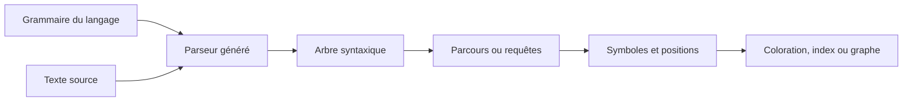

# Tree-sitter — comprendre et analyser la structure du code

Tree-sitter est un **générateur de parseurs et une bibliothèque d'analyse syntaxique incrémentale**. Un parseur transforme le texte d'un programme en arbre : fonctions, paramètres, expressions et blocs deviennent des nœuds identifiables. Il ne s'agit pas d'un modèle IA : l'analyse repose sur une grammaire du langage.

Dans [Graphify](graphify.md), cette analyse fournit une base structurée pour extraire des éléments du code et construire un graphe. Comprendre Tree-sitter permet de distinguer ce qui est observé dans la syntaxe de ce qui reste à vérifier sur le comportement du programme.

## Pourquoi rechercher la structure plutôt que seulement le texte ?

Chercher `payer` avec une recherche textuelle peut trouver une définition de fonction, un appel, un commentaire ou une chaîne de caractères. Un parseur distingue ces formes et leurs positions.

| Besoin | Recherche textuelle | Analyse syntaxique |
|---|---|---|
| Retrouver un message d'erreur exact | Très adaptée | Généralement inutile |
| Identifier les fonctions déclarées | Dépend des conventions d'écriture | Recherche des nœuds de déclaration |
| Séparer un appel d'un commentaire | Nécessite des filtres | Les catégories syntaxiques sont distinctes |
| Comprendre la cible réelle d'un appel dynamique | Insuffisante | Insuffisante sans analyse complémentaire |

Les deux approches se complètent : une recherche rapide repère les fichiers, puis une analyse structurée précise les éléments intéressants.

## Comment cela fonctionne



Une **grammaire** définit la syntaxe d'un langage. Le générateur produit un parseur adapté à cette grammaire. À l'exécution, une application associe le parseur au langage choisi et lui fournit le texte source. Elle obtient un arbre qu'elle peut parcourir ou interroger.

La bibliothèque expose notamment les notions de langage, parseur, arbre et nœud. Un nœud possède un type, des enfants et une plage dans le fichier. L'application peut donc retrouver le texte source et sa position pour afficher un résultat ou produire un lien vers le code.

### Exemple de lecture d'un arbre

Prenons ce code JavaScript :

```javascript
function payer(montant) {
  return debiter(montant);
}
```

Une représentation simplifiée de l'arbre ressemble à ceci :

```text
program
└── function_declaration
    ├── name: identifier → payer
    ├── parameters: formal_parameters
    │   └── identifier → montant
    └── body: statement_block
        └── return_statement
            └── call_expression
                ├── function: identifier → debiter
                └── arguments: arguments
                    └── identifier → montant
```

L'analyse montre que `payer` est une déclaration et `debiter` une expression d'appel. Elle ne prouve pas encore où `debiter` est défini, si le paiement aboutira ou si cet appel sera exécuté.

## CST, AST et graphe : trois niveaux différents

Tree-sitter produit un **arbre syntaxique concret**, ou CST. Il conserve des éléments de la syntaxe, notamment des nœuds anonymes pour certains mots-clés et signes de ponctuation. Les nœuds nommés permettent de travailler à un niveau plus utile pour l'analyse.

Un **arbre syntaxique abstrait**, ou AST, écarte généralement davantage de détails de surface pour représenter les constructions du programme. Les outils parlent parfois d'« analyse AST » pour désigner leur traitement des nœuds Tree-sitter. Cela ne transforme pas Tree-sitter en compilateur ou en moteur de résolution des types.

Un **graphe de dépôt** est encore autre chose : l'outil crée des entités et des liens à partir des arbres de plusieurs fichiers, puis peut enrichir ces liens avec imports, documentation ou autres analyses. Tree-sitter fournit la structure locale ; Graphify construit la représentation du dépôt autour de ces informations.

## Que signifie « incrémental » ?

Dans un éditeur, le texte change à chaque frappe. Refaire toutes les analyses depuis zéro serait coûteux. Tree-sitter peut réutiliser un arbre précédent pour analyser une nouvelle version du texte :

1. L'application décrit précisément l'édition à l'ancien arbre : positions et étendue avant/après.
2. Elle donne le nouveau texte et cet arbre mis à jour au parseur.
3. Le parseur réutilise les portions encore valides et produit le nouvel arbre.
4. L'application actualise ses résultats selon les changements pertinents.

Ce bénéfice exige que l'application transmette correctement les éditions. Le simple fait d'utiliser Tree-sitter dans un indexeur qui reparcourt tout un dépôt ne garantit pas une mise à jour incrémentale de l'ensemble du graphe.

Tree-sitter est également conçu pour rester exploitable sur du code incomplet. Des nœuds `ERROR` ou des éléments `MISSING` peuvent signaler un problème syntaxique. Un indexeur doit les prendre en compte : disposer d'un arbre ne prouve pas que le fichier compile.

## Interroger l'arbre avec des queries

Une query Tree-sitter décrit une forme d'arbre à chercher. Ce n'est ni une expression régulière ni une requête en langage naturel. La syntaxe utilise des parenthèses et des **captures** préfixées par `@`.

Avec une grammaire JavaScript proposant les nœuds ci-dessus :

```scheme
(function_declaration
  name: (identifier) @fonction.nom)

(call_expression
  function: (identifier) @appel.nom)
```

Le premier motif capture le nom d'une fonction déclarée. Le second capture une cible d'appel écrite comme un identifiant simple. Dans notre exemple, on obtient `payer` et `debiter`, avec les positions des nœuds correspondants.

Ce second motif ne couvre pas `client.debiter(montant)` : sa cible est une expression de membre. Il faut un motif supplémentaire adapté à la grammaire. **Les types de nœuds et les champs dépendent du langage et de sa grammaire**, donc une query JavaScript ne se transpose pas telle quelle à Python.

## Comment l'utiliser dans un outil

Vous n'avez généralement pas à installer Tree-sitter séparément pour utiliser un outil qui l'intègre. Pour développer votre propre analyseur, le chemin est le suivant :

1. Choisir la bibliothèque ou les bindings de votre langage, puis la grammaire du langage à analyser.
2. Parser un petit fichier et inspecter les nœuds réellement produits.
3. Écrire des queries adaptées aux déclarations, imports ou appels recherchés.
4. Convertir les captures en résultats utiles : nom, fichier, position, catégorie.
5. Tester les formes difficiles : appels de méthodes, fonctions imbriquées, syntaxe incomplète, fichiers générés.
6. Ajouter une résolution sémantique si l'objectif exige de relier précisément références et définitions.

La [CLI officielle](https://tree-sitter.github.io/tree-sitter/cli/) sert notamment à générer et tester un parseur dans un projet de grammaire. Ce n'est pas une commande universelle qui comprend automatiquement tous les langages sans leurs grammaires.

## À quoi cela sert pour un agent de développement ?

- **Sélectionner du contexte** : fournir la fonction concernée et sa plage, plutôt que tout le fichier.
- **Indexer le dépôt** : extraire des déclarations et des imports pour faciliter les recherches.
- **Construire une carte** : proposer des relations entre composants à examiner, comme dans Graphify.
- **Aider l'éditeur** : coloration syntaxique ou navigation fondées sur la structure.

Tree-sitter n'envoie pas lui-même ces informations à Claude. L'éditeur, l'indexeur ou le serveur MCP décide quels résultats rendre disponibles. La qualité du contexte dépend donc aussi des filtres et des limites de sortie de cet outil.

## Limites et précautions

Un arbre décrit la **syntaxe**, pas l'exécution. La résolution des types, l'héritage, les imports indirects, la réflexion, les macros et les appels dynamiques nécessitent des traitements supplémentaires. Un lien de graphe extrait ou inféré mérite d'être confronté aux sources et aux tests avant une modification.

Évitez également de supposer que tous les fichiers ont été analysés : langage sans grammaire, exclusions, fichiers générés ou erreurs de parsing peuvent laisser des zones hors de l'index. Vérifiez la couverture annoncée par l'outil et conservez la recherche textuelle comme complément.

---

## Prochaine étape

Poursuivez avec **[Docling](docling.md)**, la page suivante dans le menu.

## Sources

Documentation primaire consultée le **3 octobre 2026** :

- [Tree-sitter — Présentation](https://tree-sitter.github.io/tree-sitter/)
- [Tree-sitter — Utiliser un parseur](https://tree-sitter.github.io/tree-sitter/using-parsers/1-getting-started.html)
- [Tree-sitter — Syntaxe des queries](https://tree-sitter.github.io/tree-sitter/using-parsers/queries/1-syntax.html)
- [Graphify — Dépôt du projet](https://github.com/Graphify-Labs/graphify)
