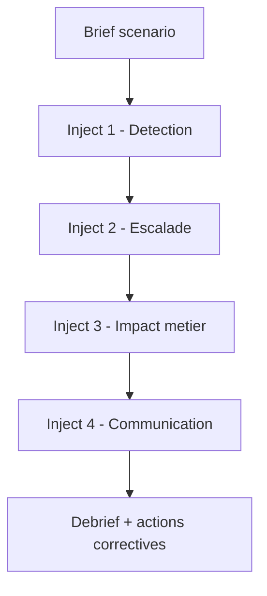

# Exercices tabletop IA (60/90/120 minutes)

<span class="badge-expert">Expert</span> <span class="badge-intermediate">Intermédiaire</span>

Cette page fournit des exercices tabletop prêts à animer pour tester la réponse de l'organisation face à des incidents cyber impliquant l'IA.

---

## Objectifs d'un tabletop IA

- Tester les décisions sous contrainte de temps
- Vérifier la coordination SOC, IT, métiers et direction
- Identifier les angles morts de procédure
- Améliorer la préparation avant incident réel

!!! tip "Format recommandé"
    Commence par 60 minutes pour installer le réflexe, puis augmente à 90 et 120 minutes quand le niveau de maturité progresse.

---

## Trame d'animation commune



---

## Exercice 1 - Format 60 minutes (fondation)

### Scénario

Campagne de phishing personnalisée visant finance et support avec demandes urgentes crédibles.

### Rythme proposé

| Minute | Inject | Décision attendue |
|---|---|---|
| 0-10 | Alerte initiale | Activation triage incident |
| 10-20 | Compte VIP ciblé | Validation hors bande et confinement |
| 20-35 | Tentative de virement | Blocage process et escalade management |
| 35-50 | Propagation campagne | Communication interne de vigilance |
| 50-60 | Clôture | Plan d'action à 7 jours |

### Critères de réussite

- Temps d'activation incident
- Qualité de coordination inter-équipes
- Rigueur des validations hors bande

---

## Exercice 2 - Format 90 minutes (intermédiaire)

### Scénario

Deepfake vocal + email de confirmation demandant action sensible sur comptes et paiements.

### Rythme proposé

| Minute | Inject | Décision attendue |
|---|---|---|
| 0-15 | Appel voix dirigeant | Procédure anti-usurpation |
| 15-35 | Email de suivi cohérent | Vérification identité multicritère |
| 35-55 | Pression temporelle externe | Maintien des contrôles sans exception |
| 55-75 | Impact réputation | Préparation communication interne/externe |
| 75-90 | Debrief | Correctifs process + formation |

### Critères de réussite

- Pas d'exception aux contrôles critiques
- Décision juridique/comms alignée
- Documentation horodatée des décisions

---

## Exercice 3 - Format 120 minutes (avancé)

### Scénario

Incident combiné: prompt poisoning dans dépôt + dépendance non approuvée + suspicion d'exfiltration de données.

### Rythme proposé

| Minute | Inject | Décision attendue |
|---|---|---|
| 0-20 | Alerte dépôt | Restriction immédiate permissions agent |
| 20-45 | Dépendance suspecte | Blocage CI/CD et revue supply chain |
| 45-75 | Indice de fuite | Confinement + procédure juridique/privacy |
| 75-100 | Pression métier (reprise prod) | Arbitrage risque vs continuité |
| 100-120 | Debrief final | Plan d'amélioration 30/60/90 jours |

### Critères de réussite

- Confinement rapide et traçable
- Qualité d'analyse cause racine
- Robustesse des décisions de reprise

---

## Kit facilitateur (prêt à copier)

### Ouverture de session

```markdown
Objectif: tester notre capacité de réponse à un incident cyber avec composante IA.
Règle: exercice sans blâme, orienté apprentissage.
Livrables: décisions, timeline, actions correctives priorisées.
```

### Questions de cadrage pendant l'exercice

- Qui décide de la sévérité et sur quels critères ?
- Quelles preuves conservons-nous immédiatement ?
- Qui valide la communication interne/externe ?
- À quel moment relançons-nous les opérations ?

### Debrief standard

- Ce qui a bien fonctionné
- Ce qui a ralenti la réponse
- Les 3 priorités d'amélioration
- Les responsables et échéances

---

## Scorecard d'évaluation

| Axe | Note 1-5 | Commentaire |
|---|---|---|
| Détection et qualification |  |  |
| Confinement et coordination |  |  |
| Investigation et preuves |  |  |
| Communication de crise |  |  |
| Décision de reprise |  |  |
| Gouvernance et conformité |  |  |

!!! info "Conseil"
    Conserve les scorecards dans un historique trimestriel pour mesurer l'amélioration réelle, pas seulement le ressenti.

---

## Sources et provenance

- [CISA AI](https://www.cisa.gov/ai)
- [NIST AI RMF](https://www.nist.gov/itl/ai-risk-management-framework)
- [ANSSI](https://www.ssi.gouv.fr/)
- [ENISA Threat Landscape](https://www.enisa.europa.eu/topics/cyber-threats/threat-landscape)
- [MITRE ATLAS](https://atlas.mitre.org/)
- [OWASP Top 10 for LLM Applications](https://owasp.org/www-project-top-10-for-large-language-model-applications/)

---

## Prochaine étape

**[Cas sectoriels IA et cybersécurité](cas-sectoriels-ia.md)** : adapte maintenant les défenses aux contraintes spécifiques de ton secteur.

Concepts clés couverts :

- **Exercices progressifs** — 60, 90, 120 minutes
- **Décisions sous pression** — qualité plutôt que vitesse seule
- **Debrief structuré** — transformer l'exercice en amélioration réelle
- **Mesure de maturité** — scorecards comparables dans le temps
