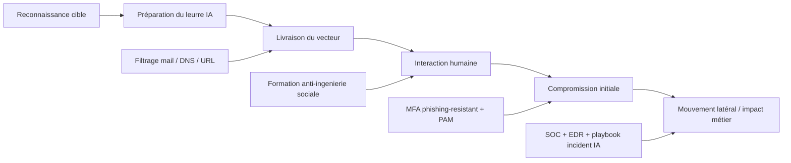

# IA et hacking: usages offensifs, risques réels et protections

Intermédiaire Expert

L'IA accélère autant les attaquants que les défenseurs. Cette page explique où l'IA améliore réellement les techniques de cyberattaque, ce qui relève surtout du buzz, et comment renforcer ta posture de sécurité sans attendre.

---

## Pourquoi le sujet est critique en 2026

L'industrialisation de l'IA réduit le coût d'entrée de certaines activités malveillantes: génération de contenus de phishing crédibles, automatisation de reconnaissance ouverte (OSINT), et adaptation plus rapide des campagnes. En parallèle, les équipes sécurité disposent aussi de nouveaux leviers (détection, triage, simulation, formation).

!!! info "Point d'équilibre"
    L'IA ne remplace pas les compétences techniques d'un attaquant confirmé. Elle agit surtout comme multiplicateur de vitesse, de volume, et de personnalisation.

---

## Comment l'IA est utilisée dans les cyberattaques

| Famille d'usage | Ce que l'IA apporte | Risque principal | Signal d'alerte |
|---|---|---|---|
| Phishing et ingénierie sociale | Messages mieux ciblés, multilingues, plus crédibles | Hausse du taux de clic et de divulgation | Emails très personnalisés, style cohérent mais source douteuse |
| Deepfakes audio/vidéo | Usurpation d'identité plus convaincante | Fraude au virement, manipulation interne | Demandes urgentes inhabituelles via canaux non habituels |
| Automatisation de campagnes | Variation rapide des contenus, tests A/B malveillants | Campagnes massives plus efficaces | Pic d'attaques avec contenus similaires mais légèrement variés |
| Aide au code malveillant | Assistance à la compréhension de scripts existants | Accélération des acteurs peu expérimentés | Artefacts réutilisés, signatures de code génératif |
| Contournement social des défenses | Adaptation du discours selon la cible | Bypass des procédures humaines | Pression temporelle, prétextes hiérarchiques |

!!! warning "Limite importante"
    Cette documentation ne fournit pas d'instructions techniques offensives. Elle se concentre sur la détection, la prévention et la réponse.

---

## Chaîne d'attaque IA vs chaîne de défense

!!! tip "Comment lire ce schéma"
    L'attaquant optimise surtout les étapes amont (leurre et interaction humaine) avec l'IA. La défense gagne en efficacité en combinant garde-fous humains, techniques et organisationnels à chaque étape.

---

## Hacking éthique vs non éthique: rôle de l'IA

### Hacking éthique (red team, pentest, AppSec)

- Génération de scénarios de test plus variés
- Priorisation des surfaces d'attaque à valider
- Aide à la rédaction de rapports exploitables par les métiers
- Simulation de campagnes de sensibilisation réalistes

### Hacking non éthique (cybercriminalité)

- Phishing plus crédible et localisé
- Industrialisation de l'arnaque conversationnelle
- Création de fausses identités à grande échelle
- Automatisation de reconnaissance d'information publique

!!! danger "Même technologie, finalités opposées"
    La même IA peut aider à mieux sécuriser un SI ou à mieux cibler une fraude. La différence tient à la gouvernance, au cadre légal, et aux contrôles en place.

---

## Niveaux de maturité: où commencer selon ton contexte

| Niveau | Symptômes | Priorités des 30 prochains jours |
|---|---|---|
| Niveau 1 - Initial | Pas de politique IA, pas de revue dédiée | Politique "no secret in prompt", MFA robuste, revue humaine obligatoire |
| Niveau 2 - Structuré | Outils en place mais hétérogènes | Standardiser les permissions agents, logs d'audit, exercices phishing ciblés |
| Niveau 3 - Maîtrisé | Processus sécurité définis et suivis | Tabletop trimestriel, métriques SOC dédiées IA, amélioration continue du playbook |

---

## Exemples de scénarios d'attaque et protections

### 1. Fraude au président augmentée par IA

**Scénario**: message vocal imitant un dirigeant + email urgent demandant un paiement exceptionnel.

**Protections prioritaires**:

- Procédure de double validation hors canal initial
- Mot de passe de crise ou phrase de vérification interne
- Blocage des paiements urgents sans contrôle financier croisé
- Entraînement trimestriel des équipes finance et support

### 2. Phishing ciblé sur développeurs

**Scénario**: faux message de revue de code ou de CI/CD menant vers une page d'authentification clonée.

**Protections prioritaires**:

- MFA résistant au phishing (FIDO2/WebAuthn)
- Vérification systématique du domaine et du certificat
- Isolation des postes administrateurs et comptes à privilèges
- Politique de rotation rapide des tokens compromis

### 3. Empoisonnement de contexte dans les outils IA

**Scénario**: fichier de dépôt ou documentation contenant des instructions trompeuses destinées à influencer l'agent IA.

**Protections prioritaires**:

- Revue des fichiers d'instructions avant exécution agent
- Cloisonnement des permissions de l'agent (moindre privilège)
- Confirmation humaine pour actions terminales sensibles
- Journalisation complète des actions agentiques

### 4. Faux support technique généré par IA

**Scénario**: un collaborateur reçoit un message crédible d'un faux "support IT" demandant de valider une action urgente.

**Protections prioritaires**:

- Processus de support avec canal officiel unique
- Vérification d'identité sur un second canal connu
- Interdiction d'actions administrateur sur demande non ticketée
- Campagnes régulières de simulation de social engineering

### 5. Dépendance malveillante suggérée par IA

**Scénario**: une suggestion d'assistant propose une librairie peu connue ou usurpée, puis la chaîne CI/CD la déploie.

**Protections prioritaires**:

- Allowlist de dépendances validées
- SCA bloquant en CI pour nouveaux paquets non approuvés
- Signature et provenance (quand disponible)
- Double revue sur les changements de dépendances critiques

---

## "IA hacker" qui circulent sur le web: quels dangers

On voit apparaître des offres de type "AI Hacker", "auto-pentest", "one-click exploit", souvent via des sites vitrine, canaux sociaux, ou dépôts non vérifiés.

### Risques fréquents

- Promesses trompeuses ou frauduleuses
- Logiciels contenant malwares ou voleurs d'identifiants
- Collecte de données sensibles envoyées au service
- Exposition juridique majeure en cas d'usage non autorisé

### Grille d'évaluation rapide avant test

| Critère | Question à poser | Décision prudente |
|---|---|---|
| Éditeur identifié | Société, mentions légales, contact vérifiable ? | Refuser si opaque |
| Conditions d'usage | Cadre légal explicite et usage défensif autorisé ? | Refuser si ambigu |
| Politique données | Où vont les prompts, logs et artefacts ? | Refuser sans transparence |
| Réputation sécurité | Audit tiers, incidents connus, historique public ? | Refuser sans preuves |
| Environnement de test | Sandbox isolée disponible ? | Ne jamais tester en prod |

!!! warning "Réflexe opérationnel"
    Si un outil se présente comme "hacker IA miracle" sans documentation sécurité ni cadre légal clair, considère-le comme à haut risque.

---

## Signaux SOC à surveiller spécifiquement

| Signal | Exemple observé | Action défensive immédiate |
|---|---|---|
| Pic de tentatives d'authentification ciblées | Comptes VIP visés en rafale | Forcer MFA fort, blocage adaptatif, revue des sessions actives |
| Campagne de mails fortement personnalisés | Variantes nombreuses avec mêmes intents | Renforcer filtres anti-phishing et chasse IOC/IOA |
| Activité anormale d'agents de code | Écritures massives hors périmètre habituel | Suspendre permissions agent, revue manuelle des changements |
| Hausse d'alertes dépendances | Nouveaux paquets non approuvés en PR | Bloquer merge, lancer analyse supply chain |
| Demandes internes "urgentes" hors process | Finance/RH/IT sollicités sans ticket | Appliquer protocole d'authentification hors bande |

---

## Bonnes pratiques défensives pour équipes dev et sécu

=== "IntelliJ IDEA"
    - Active les confirmations avant actions à impact
    - Évite d'exposer secrets et fichiers sensibles dans le contexte IA
    - Utilise SAST/SCA en pipeline pour valider tout code généré
    - Documente une procédure de revue humaine obligatoire pour les changements critiques

=== "Visual Studio Code"
    - Vérifie les permissions des agents et outils connectés
    - Isole les tâches exploratoires dans un environnement dédié
    - Configure des exclusions de contenu pour les secrets et fichiers sensibles
    - Active lint, tests et scans sécurité avant fusion de code

---

## Références officielles à suivre

- [OWASP Top 10 for LLM Applications](https://owasp.org/www-project-top-10-for-large-language-model-applications/)
- [MITRE ATLAS](https://atlas.mitre.org/)
- [NIST AI Risk Management Framework](https://www.nist.gov/itl/ai-risk-management-framework)
- [ENISA: Threat Landscape](https://www.enisa.europa.eu/topics/cyber-threats/threat-landscape)
- [ANSSI: Publications et recommandations](https://www.ssi.gouv.fr/)
- [CISA: AI Security Resources](https://www.cisa.gov/ai)

## Sources et provenance des affirmations de cette page

| Sujet | Source principale |
|---|---|
| Risques applicatifs LLM (injection, exfiltration, agency) | [OWASP Top 10 for LLM Applications](https://owasp.org/www-project-top-10-for-large-language-model-applications/) |
| Taxonomie de techniques adverses IA | [MITRE ATLAS](https://atlas.mitre.org/) |
| Tendances de menace en Europe | [ENISA Threat Landscape](https://www.enisa.europa.eu/topics/cyber-threats/threat-landscape) |
| Recommandations opérationnelles cyber US | [CISA AI Security](https://www.cisa.gov/ai) |
| Cadre de gouvernance du risque IA | [NIST AI RMF](https://www.nist.gov/itl/ai-risk-management-framework) |
| Référentiel français de cybersécurité | [ANSSI](https://www.ssi.gouv.fr/) |
| Veille cybercriminalité organisée | [Europol Reports](https://www.europol.europa.eu/publications-events/main-reports) |

!!! info "Transparence"
    Les scénarios de cette page sont des cas pédagogiques défensifs construits à partir de tendances documentées par les sources ci-dessus et par tes liens fournis. Ils ne constituent pas des preuves forensiques d'un incident unique.

!!! tip "Cadence recommandée"
    Mets à jour ta veille sécurité IA une fois par mois et rejoue un exercice de simulation sociale chaque trimestre.

---

## Checklist opérationnelle (30 jours)

- [ ] Cartographier les usages IA internes et leurs permissions
- [ ] Mettre en place une politique "no secret in prompt"
- [ ] Imposer une revue humaine sur les changements sensibles
- [ ] Renforcer MFA contre phishing pour comptes critiques
- [ ] Former finance, support, RH aux deepfakes et à l'urgence simulée
- [ ] Créer un playbook "incident IA" (détection, confinement, communication)

---

## Avant / Après la mise en place des garde-fous

| Critère | Sans contrôle | Avec contrôle |
|---|---|---|
| Phishing personnalisé IA | Taux de clic élevé, victime ne détecte pas la personnalisation | Formation + validation hors bande réduit la surface d'exposition |
| Deepfake vocal / vidéo | Virement ou accès sensible accordé sur demande simulée | Procédure de confirmation multi-canal, aucun accès sur canal unique |
| Agent IA sur-permissionné | L'agent lit, écrit ou exécute sans garde-fou | Permissions minimales + confirmations obligatoires + logs audités |
| Code malveillant via IA | Script injecté ou suggéré par l'assistant sans revue | Revue humaine systématique + SCA bloquante en CI |
| Secrets dans les prompts | Secrets potentiellement envoyés à l'API IA | Politique écrite + scan de secrets + exclusions configurées |

---

## Prochaine étape

**[Études de cas 2024-2026](etudes-de-cas-2024-2026.md)** : analyse des cas et tendances documentés, avec impacts métiers et plans de protection concrets.

Concepts clés couverts :

- **Surfaces d'exposition** — ce que l'agent peut lire, écrire et exécuter
- **Moindre privilège** — limiter les actions automatiques à faible impact
- **Validation humaine** — garde-fou final sur les opérations critiques
- **Veille sécurité IA** — suivi continu des menaces et contre-mesures
