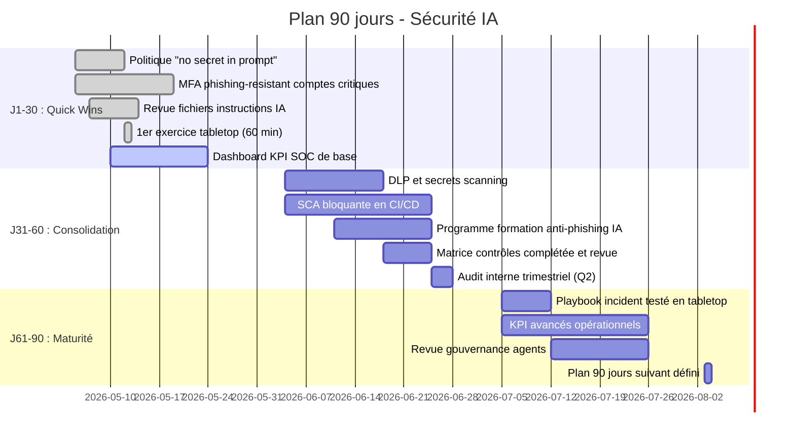

# Plan 90 jours — Passer à l'action face aux menaces IA

Intermédiaire Expert

Ce plan de 90 jours synthétise l'ensemble du chapitre Hacker & IA en actions concrètes, priorisées et attribuées. Il est conçu pour être copié et adapté à ton contexte.

---

## Comment utiliser ce plan

1. Identifie ton niveau de maturité actuel (voir [Panorama IA et hacking](page-principale.md)).
2. Sélectionne les actions par rôle (Dev, SecOps, Direction, Métiers).
3. Attribue un owner et une échéance pour chaque ligne.
4. Pilote avec les KPI définis dans [KPI & SOC pour menaces IA](kpi-soc-ia.md).
5. Réévalue à J30, J60 et J90.

---

## Vue d'ensemble : timeline 90 jours

---

## J1-J30 — Quick wins (impact immédiat, effort faible)

### Priorité absolue

| Action | Responsable | Ressource associée | Preuve attendue |
|---|---|---|---|
| Déployer MFA phishing-resistant sur tous les comptes privilégiés | IT/SecOps | [Matrice contrôles](matrice-controles-menaces.md) | Rapport d'activation |
| Adopter la politique "no secret in prompt" par écrit | RSSI / Lead Dev | [Matrice contrôles](matrice-controles-menaces.md) | Note de politique publiée |
| Revue de tous les fichiers d'instructions IA (`.github/copilot-instructions.md`, `.cursor/`, etc.) | Lead Dev | [Panorama IA et hacking](page-principale.md) | Liste révisée + commit |
| Animer un 1er exercice tabletop phishing IA (60 min) | RSSI / Sécurité | [Exercices tabletop IA](exercices-tabletop-ia.md) | Compte-rendu de séance |
| Mettre en place un dashboard KPI SOC minimal | SOC / SecOps | [KPI & SOC pour menaces IA](kpi-soc-ia.md) | Dashboard actif |

### Avant / Après — J30

| Situation | Avant J30 | Après J30 |
|---|---|---|
| Comptes critiques | MFA standard ou absent | MFA phishing-resistant sur 100% des comptes critiques |
| Gestion des secrets | Secrets potentiellement dans les prompts IA | Politique écrite, revue des fichiers d'instructions |
| Culture équipe | Peu de conscience des risques IA | 1er tabletop réalisé, réflexes de base sensibilisés |
| Visibilité SOC | Pas d'indicateurs IA | Dashboard de base actif (MTTD, MTTC, KPI minimum) |

---

## J31-J60 — Consolidation (outils, processus, formation)

### Actions de fond

| Action | Responsable | Ressource associée | Preuve attendue |
|---|---|---|---|
| Déployer DLP et secrets scanning sur les dépôts et outils IA | DevSecOps | [Matrice contrôles](matrice-controles-menaces.md) | Alertes DLP actives |
| Activer SCA bloquante dans le pipeline CI/CD | DevSecOps | [Études de cas](etudes-de-cas-2024-2026.md) | Étape CI documentée |
| Lancer la formation anti-ingénierie sociale IA pour les métiers exposés | RH / Sécurité | [Études de cas](etudes-de-cas-2024-2026.md) | Taux de participation |
| Compléter et valider la matrice contrôles-menaces | RSSI | [Matrice contrôles](matrice-controles-menaces.md) | Registre à jour |
| Réaliser l'audit interne trimestriel Q2 | RSSI | [Checklist audit interne](checklist-audit-interne.md) | Rapport d'audit |

### Avant / Après — J60

| Situation | Avant J60 | Après J60 |
|---|---|---|
| Pipelines CI/CD | Dépendances non contrôlées | SCA bloquante active, alertes sur supply chain |
| Posture métiers | Formations génériques cybersécurité | Programme ciblé ingénierie sociale IA déployé |
| Couverture contrôles | Partielle et informelle | Matrice complétée, écarts documentés avec owners |
| Audit | Pas d'audit formel IA | Premier audit IA trimestriel réalisé avec rapport |

---

## J61-J90 — Maturité (tests, pilotage avancé, gouvernance)

### Actions de maturité

| Action | Responsable | Ressource associée | Preuve attendue |
|---|---|---|---|
| Tester le playbook incident IA en exercice tabletop (90 min) | RSSI / SecOps | [Playbook incident IA](playbook-incident-ia.md) + [Exercices tabletop](exercices-tabletop-ia.md) | Compte-rendu + axes d'amélioration |
| Activer les KPI avancés et les règles de détection SOC | SOC | [KPI & SOC pour menaces IA](kpi-soc-ia.md) | Alertes + dashboards actifs |
| Revoir la gouvernance des agents IA (permissions, logs, confirmations) | Lead Dev / SecOps | [Panorama IA et hacking](page-principale.md) | Inventaire agents signé |
| Communiquer un bilan 90 jours à la direction | RSSI / CISO | Ce plan | Présentation exécutive |
| Préparer le plan 90 jours suivant (J91-J180) | RSSI | Ce plan | Plan J91+ rédigé |

### Avant / Après — J90

| Situation | Avant J90 | Après J90 |
|---|---|---|
| Playbook incident | Rédigé mais non testé | Testé, ajusté, propriétaire désigné |
| Agents IA | Permissions larges, peu de logs | Gouvernance formalisée, revue périodique en place |
| KPI SOC | Indicateurs de base | KPI avancés opérationnels, seuils d'alerte définis |
| Position globale | Réactive | Proactive — audits, exercices, dashboards en cycle |

---

## Par rôle — Ce que chaque profil doit faire

=== "Développeur / Lead Dev"

    **J1-30**
    - Revue des fichiers d'instructions IA dans tous les dépôts
    - Suppression des secrets et données sensibles des prompts
    - Activer les scans de secrets (GitHub Advanced Security, gitleaks…)

    **J31-60**
    - Intégrer SCA bloquante dans le CI/CD
    - Documenter les permissions de chaque agent IA utilisé
    - Participer à l'exercice tabletop équipe Dev (voir [Exercices tabletop](exercices-tabletop-ia.md))

    **J61-90**
    - Revoir la gouvernance agents : scope, logs, confirmations obligatoires
    - Former les nouveaux arrivants au risque supply chain IA
    - Contribuer au rapport 90 jours

=== "SecOps / SOC"

    **J1-30**
    - Activer le dashboard KPI SOC minimal
    - Mettre en place les règles de détection phishing IA et deepfake
    - Revue du playbook incident IA existant

    **J31-60**
    - Déployer les alertes DLP et secrets scanning
    - Tester la corrélation multi-sources sur un incident simulé
    - Animer la partie SOC de l'exercice tabletop

    **J61-90**
    - Activer les KPI avancés (FPR/FNR, dérive permissions, temps corrélation)
    - Participer au tabletop playbook complet (90 min)
    - Mettre à jour les règles de détection selon les retours d'exercice

=== "Direction / CISO"

    **J1-30**
    - Valider et publier la politique "no secret in prompt"
    - Allouer le budget pour MFA phishing-resistant
    - Communiquer sur la nouvelle posture sécurité IA

    **J31-60**
    - Recevoir le rapport d'audit interne Q2
    - Valider la matrice contrôles et les priorités de remédiation
    - Suivre les KPI sur le dashboard exécutif

    **J61-90**
    - Recevoir le bilan 90 jours (incidents, KPI, axes d'amélioration)
    - Valider les budgets pour le plan J91-J180
    - Arbitrer les écarts critiques non encore couverts

=== "Métiers (RH, Finance, Marketing…)"

    **J1-30**
    - Suivre la sensibilisation anti-phishing IA (30 min)
    - Appliquer systématiquement la validation hors bande sur demandes inhabituelles

    **J31-60**
    - Participer à la formation ingénierie sociale IA
    - Remonter tout comportement suspect via le canal de signalement dédié

    **J61-90**
    - Tester les réflexes en participant à un exercice tabletop métiers (60 min)
    - Vérifier que les procédures de validation intègrent la dimension IA

---

## Récapitulatif des ressources du chapitre

| Page | Ce qu'elle apporte au plan |
|---|---|
| [Panorama IA et hacking](page-principale.md) | Contexte, niveaux de maturité, chaîne attaque/défense |
| [Études de cas 2024-2026](etudes-de-cas-2024-2026.md) | 5 cas réels avec défenses prioritaires |
| [Playbook incident IA](playbook-incident-ia.md) | Réponse opérationnelle T+0 à T+7j |
| [KPI & SOC pour menaces IA](kpi-soc-ia.md) | Métriques de pilotage et règles de détection |
| [Exercices tabletop IA](exercices-tabletop-ia.md) | Scénarios animables 60/90/120 min |
| [Cas sectoriels IA et cybersécurité](cas-sectoriels-ia.md) | Priorités par secteur (finance, santé, industrie…) |
| [Matrice menaces IA -> contrôles](matrice-controles-menaces.md) | Cartographie menace-contrôle avec priorisation |
| [Checklist audit interne IA](checklist-audit-interne.md) | Grille d'audit trimestrielle + score de maturité |
| [Modèles fiches incident et post-mortem](modeles-fiches-incident.md) | Templates copiables pour chaque type d'incident |
| [Comparaison IDE pour sécurité IA](comparaison.md) | Choix IntelliJ vs VS Code selon le contexte sécurité |

---

!!! tip "Conseil d'animation"
    Ce plan est plus efficace avec une réunion mensuelle de 30 minutes pour vérifier les tâches ouvertes et mettre à jour les KPI. Désigne un animateur (souvent le RSSI ou le Lead SecOps) avec un compte-rendu type disponible dans [Modèles fiches incident](modeles-fiches-incident.md).

!!! warning "Adapte à ton contexte"
    Les délais proposés sont indicatifs. Une petite équipe peut compresser certaines actions sur J1-30. Une grande organisation peut distribuer sur 6 mois. L'essentiel est d'avoir des owners et des preuves.

---

## Sources et provenance

- [NIST AI RMF](https://www.nist.gov/itl/ai-risk-management-framework)
- [CISA AI](https://www.cisa.gov/ai)
- [ANSSI](https://www.ssi.gouv.fr/)
- [OWASP Top 10 for LLM Applications](https://owasp.org/www-project-top-10-for-large-language-model-applications/)
- [ENISA Threat Landscape](https://www.enisa.europa.eu/topics/cyber-threats/threat-landscape)
- [MITRE ATLAS](https://atlas.mitre.org/)

---

## Prochaine étape

Consulte la [Comparaison IntelliJ vs VS Code pour la sécurité IA](comparaison.md) pour choisir les bons outils selon ton IDE.
