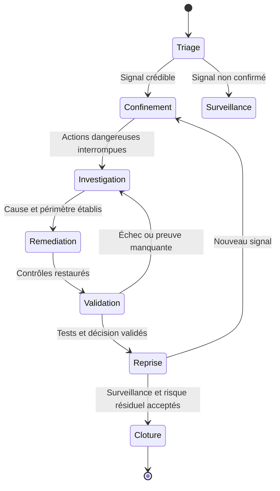

# Playbook incident IA — détection, confinement, investigation

<span class="badge-expert">Expert</span> <span class="badge-vscode">VS Code</span> <span class="badge-intellij">IntelliJ</span>

Ce playbook fournit un cadre défensif pour un incident impliquant un agent IA, une fuite de données, une prompt injection, un MCP compromis, une fraude assistée par IA ou un autre composant GenAI.

Les délais et seuils doivent venir de votre politique d'incident response et de la criticité métier ; cette page ne fixe pas de SLA universel.

---

## Conditions d'activation

Activez ce playbook lorsqu'un signal crédible implique :

- une action inattendue d'un agent ;
- un secret ou une donnée sensible potentiellement exposé ;
- un serveur MCP, plugin, hook ou skill suspect ;
- une modification de dépôt non expliquée ;
- une fraude ou une usurpation où l'IA peut avoir facilité la préparation ;
- un fournisseur IA ou intermédiaire potentiellement compromis.

L'objectif du triage est de confirmer rapidement le périmètre sans détruire les preuves utiles.

---

## Rôles

| Activité | Incident Manager | SOC/SecOps | IT/Cloud | Dev Lead | Juridique/Privacy/Comms |
|---|---|---|---|---|---|
| Qualification | A | R | C | C | I |
| Confinement | A | R | R | C | I |
| Investigation technique | C | R | R | R | I |
| Évaluation données/obligations | C | C | I | I | R/A selon organisation |
| Retour d'expérience | A | R | C | R | C |

Adaptez ce RACI à l'organisation réelle.

---

## Phase 1 — Triage

Le cadre de référence actualisé est [NIST SP 800-61 Rev. 3](https://csrc.nist.gov/pubs/sp/800/61/r3/final), publié en avril 2025 et consulté le **4 octobre 2026**. Il remplace la Rev. 2 et rattache préparation, détection, réponse et récupération à la gestion du risque du CSF 2.0. Les phases ci-dessous sont une organisation pratique du dépôt, pas une reproduction normative de NIST.

- créer un incident et horodater les premiers faits ;
- identifier comptes, dépôts, endpoints, services et données potentiellement touchés ;
- préserver les logs et artefacts pertinents ;
- distinguer fait observé, hypothèse et information manquante ;
- identifier les credentials auxquels l'agent ou le service avait accès.

Pour Claude Code, vérifiez notamment :

- fichiers d'instructions chargés ;
- `.mcp.json` et serveurs actifs ;
- skills/plugins/hooks utilisés ;
- commandes exécutées ;
- diff Git ;
- variables/secrets disponibles dans l'environnement.

---

## Phase 2 — Confinement

Selon le cas :

- arrêter ou restreindre l'agent ;
- désactiver un MCP/plugin/hook suspect ;
- révoquer les tokens potentiellement exposés ;
- isoler le poste, runner ou environnement affecté ;
- bloquer temporairement les écritures ou déploiements automatisés ;
- suspendre les nouvelles dépendances si la supply chain est concernée.

Préférez un confinement proportionné : ne supprimez pas les logs ou configurations utiles à l'investigation avant capture.

---

## Phase 3 — Investigation

Construisez une chronologie :

```text
source du contexte
→ instruction reçue
→ décision/outils appelés
→ commandes/actions
→ ressources touchées
→ données lues/écrites
→ destination éventuelle
```

Corrélez si disponible :

- logs IAM/cloud ;
- EDR ;
- SCM/Git ;
- CI/CD ;
- proxy/DNS ;
- logs MCP ;
- logs IDE/agent ;
- secret manager ;
- messagerie/ticketing.

Ne supposez pas qu'une sortie générée par le modèle décrit fidèlement toutes les actions réellement effectuées : utilisez les journaux système comme preuve.

---

## Phase 4 — Remédiation

- corriger la cause racine ;
- réduire les permissions ;
- remplacer/mettre à jour le composant compromis ;
- ajouter ou renforcer tests, policies et contrôles CI ;
- faire tourner les secrets exposés ou raisonnablement suspects ;
- restaurer depuis une source de confiance ;
- valider le retour en service avec des contrôles indépendants.

## Phase 5 — Reprise contrôlée

Avant de relancer, vérifier : composants provenant d'une source de confiance, politique effective, secrets anciens invalides, processus persistants arrêtés ou examinés, accès minimaux et télémétrie disponible. En cas d'empoisonnement, traiter aussi mémoire, index, caches et artefacts dérivés ; retirer uniquement le document source peut laisser une copie active.

Relancer une tâche représentative avec des données fictives, contrôler le résultat côté service puis obtenir la validation du responsable de reprise. Maintenir une surveillance adaptée et un retour arrière documenté. Voir les [tests de sécurité](tests-securite.md).



## Conserver les preuves sans retarder le confinement

Si un dommage continue, interrompre les actions dangereuses sans attendre une collecte complète ; documenter les preuves éventuellement perdues. Dès que possible, conserver des copies protégées avec heure UTC, source, collecteur, empreinte et historique d'accès.

| Artefact | Pourquoi le conserver |
|---|---|
| Version du client, modèle/backend et configuration effective | Reconstituer le comportement applicable au moment de l'incident |
| Instructions, mémoire, sources externes et identifiants RAG | Identifier le contenu qui a influencé la session |
| Identités, permissions, décisions et révocations | Séparer action proposée, autorisée et exécutée |
| Journaux endpoint, réseau, IAM, SCM et CI | Vérifier les effets indépendamment du modèle |
| MCP/plugins/skills/hooks et empreintes | Identifier la version réellement exécutée |
| Index, caches, état des tâches et processus | Vérifier les copies et activités persistantes |

Ne recopiez pas les secrets dans le ticket d'incident : référencer un coffre de preuves restreint. Une nouvelle clé ne révoque pas automatiquement l'ancienne ; vérifier l'invalidation et les sessions ou jetons dérivés.

---

## Runbooks par scénario

### Prompt injection / contexte empoisonné

- isoler la source du contenu ;
- identifier les actions déclenchées après sa lecture ;
- retirer l'accès aux outils non nécessaires ;
- corriger les règles de confiance sur contenu externe ;
- ajouter un test ou un contrôle empêchant la répétition.

### MCP compromis ou trop permissif

- désactiver le serveur ;
- révoquer ses secrets ;
- vérifier les destinations réseau et actions utilisées ;
- auditer sa configuration et provenance ;
- réintroduire avec scopes minimaux seulement après validation.

### Secret potentiellement exfiltré

- considérer le secret compromis jusqu'à preuve contraire ;
- révoquer/rotater ;
- rechercher son usage après l'événement ;
- identifier comment il est devenu accessible à l'agent ;
- supprimer cette exposition structurelle.

### Dépendance / skill / plugin suspect

- geler la version ;
- préserver package, lockfile et hash ;
- vérifier mainteneur, release et advisories ;
- analyser scripts d'installation/exécution ;
- remplacer ou retirer si la confiance n'est pas rétablie.

### Fraude / deepfake / demande urgente

- valider l'identité hors bande ;
- suspendre la transaction/action sensible ;
- conserver messages et métadonnées ;
- rechercher les autres cibles ;
- revoir la procédure de validation humaine.

### RAG, mémoire ou messages inter-agents suspects

- isoler le corpus, la mémoire ou la source de message concernée ;
- identifier qui pouvait écrire et quels agents ont lu le contenu ;
- invalider les caches et copies dérivées selon le périmètre établi ;
- vérifier les accès entre tenants et les opérations déclenchées ;
- restaurer les données de confiance et rejouer un test de cloisonnement.

---

## Post-mortem

Le retour d'expérience doit produire :

- chronologie confirmée ;
- cause racine et facteurs contributifs ;
- actifs/données réellement concernés ;
- contrôles qui ont fonctionné ou échoué ;
- actions avec owner et échéance ;
- preuve attendue pour fermer chaque action ;
- mise à jour du threat model et des exercices.

---

## Communication et cadre légal

Si des données personnelles, secrets clients ou systèmes réglementés sont concernés, associez rapidement les fonctions juridiques, privacy/DPO et conformité. Les obligations de notification dépendent de la juridiction, du type de donnée, du rôle de l'organisation et de l'impact réel ; vérifiez les textes et procédures internes applicables.

---

## Sources

- [NIST SP 800-61 Rev. 3](https://csrc.nist.gov/pubs/sp/800/61/r3/final) — consulté le 2026-10-04
- [Claude Code — Security](https://code.claude.com/docs/en/security) — consulté le 2026-10-04

- [OWASP GenAI Security Project](https://genai.owasp.org/)
- [MITRE ATLAS](https://atlas.mitre.org/)
- [NIST AI RMF](https://www.nist.gov/itl/ai-risk-management-framework)
- [CISA — AI](https://www.cisa.gov/ai)
- [ANSSI](https://cyber.gouv.fr/)
- [Anthropic Threat Intelligence](https://www.anthropic.com/threat-intelligence)

## Prochaine étape

Poursuivez avec **[KPI & SOC pour menaces IA](kpi-soc-ia.md)**, la page suivante dans le menu.
