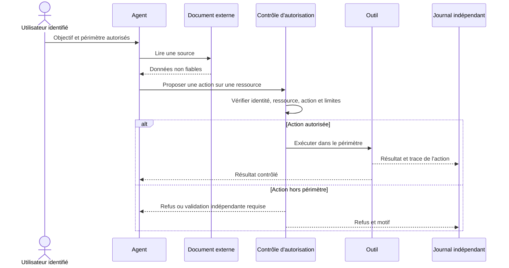

# Sécuriser les agents IA — identités, permissions et frontières de confiance

Un agent peut être trompé par un document ou commettre une erreur sans que le modèle lui-même soit compromis. La défense consiste à limiter les actions possibles, vérifier chaque accès sensible et conserver des preuves indépendantes des explications générées.

Les comportements Claude Code ci-dessous ont été vérifiés dans la documentation officielle le **4 octobre 2026**. Les mesures d'architecture sont des recommandations à adapter au système réel.

## Trois risques à distinguer

| Risque | Exemple défensif | Contrôle principal |
|---|---|---|
| IA utilisée par un attaquant | Préparation d'une fraude ou accélération d'une campagne | Identité, contrôle transactionnel, détection comportementale |
| Application IA attaquée | Corpus RAG empoisonné, fuite entre utilisateurs | Provenance, ACL, séparation des tenants, validation des sorties |
| Agent disposant d'outils influencé | Ticket qui pousse à modifier une configuration sensible | Autorisation indépendante, isolation, limites de délégation |

Une **prompt injection** cherche à faire passer du contenu externe pour une instruction légitime. Un **jailbreak** cherche à contourner les limites comportementales du modèle. Dans les deux cas, les droits système doivent rester appliqués même si le modèle accepte la demande.

## Cartographier les frontières

Le contrôle d'autorisation doit être dans le service ou le runtime, pas uniquement dans un prompt. Un document, une réponse MCP ou un sous-agent ne peut pas accorder de nouveaux droits.

## Claude Code : permissions, sandbox et configuration

La documentation actuelle distingue notamment **Auto**, où un classificateur examine certaines actions, et **Manual**, où les actions nécessitant une autorisation donnent lieu à une demande. Les règles explicites `ask` et `deny` restent importantes. Le mode initial dépend de la surface, de la version et des réglages : contrôlez le mode effectif au lancement plutôt que de supposer que toute session démarre en lecture seule.

| Couche | Ce qu'elle apporte | Limite à tester |
|---|---|---|
| Instructions `CLAUDE.md` et rules | Intentions et procédures du projet | Texte modifiable ; pas une barrière système |
| Permissions | Autorisation des outils et actions de l'agent | Une commande shell approuvée dispose des accès permis au processus |
| Sandbox | Isolation de commandes prises en charge, du système de fichiers et du réseau | Couverture réelle, commandes exclues, sortie de sandbox et plateforme |
| Identité IAM et credentials | Droits sur Git, cloud, bases et services | Les droits d'un compte partagé peuvent dépasser ceux du workflow |
| Paramètres administrés | Politique imposée par l'organisation | Vérifier son déploiement et sa résistance aux réglages locaux |
| Hooks | Contrôles et traces à des étapes du workflow | Code exécutable à auditer ; pas une isolation universelle |

La frontière du répertoire de travail dans les demandes de permission ne remplace pas l'isolation du shell au niveau du système d'exploitation. Les protections sur les outils de fichiers ne suffisent pas à empêcher une commande approuvée d'accéder aux mêmes fichiers.

Pour une politique qui exige la sandbox, la documentation décrit les réglages administrés `sandbox.enabled`, `sandbox.failIfUnavailable` et `sandbox.allowUnsandboxedCommands`. Vérifiez leur prise en charge avant déploiement. La sandbox ne fonctionne pas sur **Windows natif** ; une exigence avec `failIfUnavailable` peut empêcher le lancement. Évaluez un environnement pris en charge, par exemple WSL2, et les montages ou accès qu'il expose réellement.

Les commandes `excludedCommands` s'exécutent hors de l'isolation : chaque exception doit avoir un propriétaire, un besoin documenté et un test. N'assimilez pas un conteneur à une isolation suffisante s'il expose des secrets, des volumes sensibles ou le socket du moteur de conteneurs.

Voir le [guide Sandbox](../chapitre-4-contexte/sandbox.md) pour l'utilisation et l'intégration du runtime ; voir [Sécurité et gouvernance Claude Code](../chapitre-3b-claude-code-migration-copilot/securite-gouvernance.md) pour le parcours produit.

## Dépôts non fiables et automatisation

Avant la première exécution, inspectez les instructions, les scripts de build, `.mcp.json`, hooks, plugins, skills et configurations de tâches. Préparez un environnement jetable sans credentials de production et limitez les destinations réseau.

La documentation signale que les sessions non interactives `-p` n'affichent pas les mêmes dialogues de confiance et d'approbation MCP que les sessions interactives. La CI doit donc appliquer sa politique **avant le démarrage** : source approuvée, configuration contrôlée, identité bornée et secrets minimaux.

Sur Windows, Anthropic signale aussi le risque des chemins réseau WebDAV pouvant déclencher des requêtes vers des hôtes distants. Évitez leur activation et les accès à des chemins distants non maîtrisés ; vérifiez le comportement réel de votre configuration Windows.

## MCP : autoriser un serveur ne valide pas ses réponses

Un serveur peut retourner des données malveillantes, changer ses descriptions d'outils ou disposer de droits excessifs. Il faut auditer le client, le serveur, l'authentification et le service final.

| Point à contrôler | Mesure vérifiable |
|---|---|
| Provenance et version | Source approuvée, version ou artefact identifié, revue des mises à jour |
| Identité et audience des tokens | Token destiné au service attendu ; droits distincts pour les services aval |
| Autorisation | Contrôle côté service pour chaque ressource et action |
| Réseau | Contrôle des URL et redirections ; protection des adresses internes et services de métadonnées |
| Exécution locale `stdio` | Compte minimal, dépendances contrôlées et environnement sans secrets inutiles |
| Données retournées | Traitement comme contenu non fiable, taille bornée et validation des sorties |
| Arrêt d'urgence | Désactivation du serveur et révocation effectivement testées |

Le guide de sécurité MCP interdit le **token passthrough**, c'est-à-dire l'acceptation puis la transmission de tokens destinés à un autre service sans la séparation et les validations prévues. Contrôlez audience, identité et privilèges à chaque frontière. La page MCP citée est un guide **draft** ; fixez également la version de spécification utilisée par votre implémentation.

Les fiches détaillées restent dans **Outils** : [configuration MCP](../chapitre-13-outils-economies/mcps/configuration.md), [sécurité MCP](../chapitre-13-outils-economies/mcps/securite.md), [catalogue des outils](../chapitre-13-outils-economies/outils-complementaires.md).

## Mémoire, RAG et délégation

- **Mémoire persistante** : identifier qui peut écrire, conserver la provenance et éviter qu'une sortie de modèle soit promue automatiquement en instruction durable.
- **RAG** : appliquer les ACL à l'ingestion et au retrieval, y compris aux caches et lectures directes. Un filtre pertinent n'accorde pas un droit d'accès. Voir [Sécurité du RAG](../chapitre-7-rag/securite.md).
- **Sous-agents et équipes** : borner outils, ressources et budget de chaque rôle ; ne pas transmettre des credentials au seul motif qu'une tâche est déléguée.
- **Messages inter-agents** : garder identité de l'émetteur, provenance et lien avec la tâche ; un message ne devient pas une autorisation administrative.
- **Reprise d'une session** : réévaluer les permissions et les données chargées après changement d'identité, de projet ou de droits.

## Sorties, coûts et actions irréversibles

Traitez le code, les commandes, URL, requêtes SQL et paramètres générés comme des entrées à valider. Utilisez des schémas, paramètres typés et APIs bornées plutôt que concaténer une réponse libre dans une commande.

Pour une action sensible, la validation doit porter sur un résultat concret : destination, diff, ressources, portée et conséquences. Si ces éléments changent, l'approbation précédente ne couvre pas automatiquement la nouvelle action.

Fixez aussi nombre d'itérations, durée, volume de sortie, budgets et stratégie d'arrêt. Préparez une clé d'idempotence pour les opérations répétables et une reprise contrôlée : un retry peut répéter un paiement, un envoi ou un changement de droits.

## Référentiels et preuves

OWASP propose désormais une édition **LLM 2026** et un référentiel **agentique 2026** distinct. Son **Agent Control Standard** concerne les contrôles à l'exécution. Ce sont des repères à traduire en exigences et tests ; ils ne certifient pas la sécurité de Claude Code ni la compatibilité d'un runtime.

Pour chaque contrôle : préciser le périmètre, le propriétaire, la preuve et le test de refus. Le [plan de tests de sécurité](tests-securite.md) donne des scénarios utilisant exclusivement des données fictives.

## Sources

- [Claude Code — Security](https://code.claude.com/docs/en/security) — consulté le 2026-10-04
- [Claude Code — Sandboxing](https://code.claude.com/docs/en/sandboxing) — consulté le 2026-10-04
- [MCP — Security Best Practices, draft](https://modelcontextprotocol.io/docs/draft/tutorials/security/security_best_practices) — consulté le 2026-10-04
- [OWASP — LLM Top 10 2026](https://genai.owasp.org/resource/owasp-genai-llm-top-10-2026/) — consulté le 2026-10-04
- [OWASP — Agentic Applications 2026](https://genai.owasp.org/resource/owasp-top-10-for-agentic-applications-for-2026/) — consulté le 2026-10-04
- [OWASP — Agent Control Standard](https://genai.owasp.org/resource/agent-control-standard-acs/) — consulté le 2026-10-04

## Prochaine étape

Poursuivez avec **[Études de cas 2024-2026](etudes-de-cas-2024-2026.md)**, la page suivante dans le menu.
