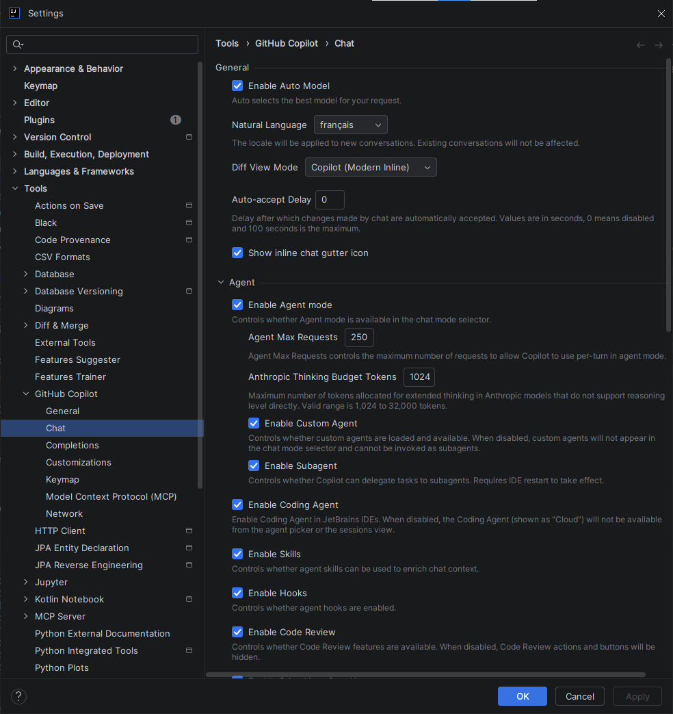
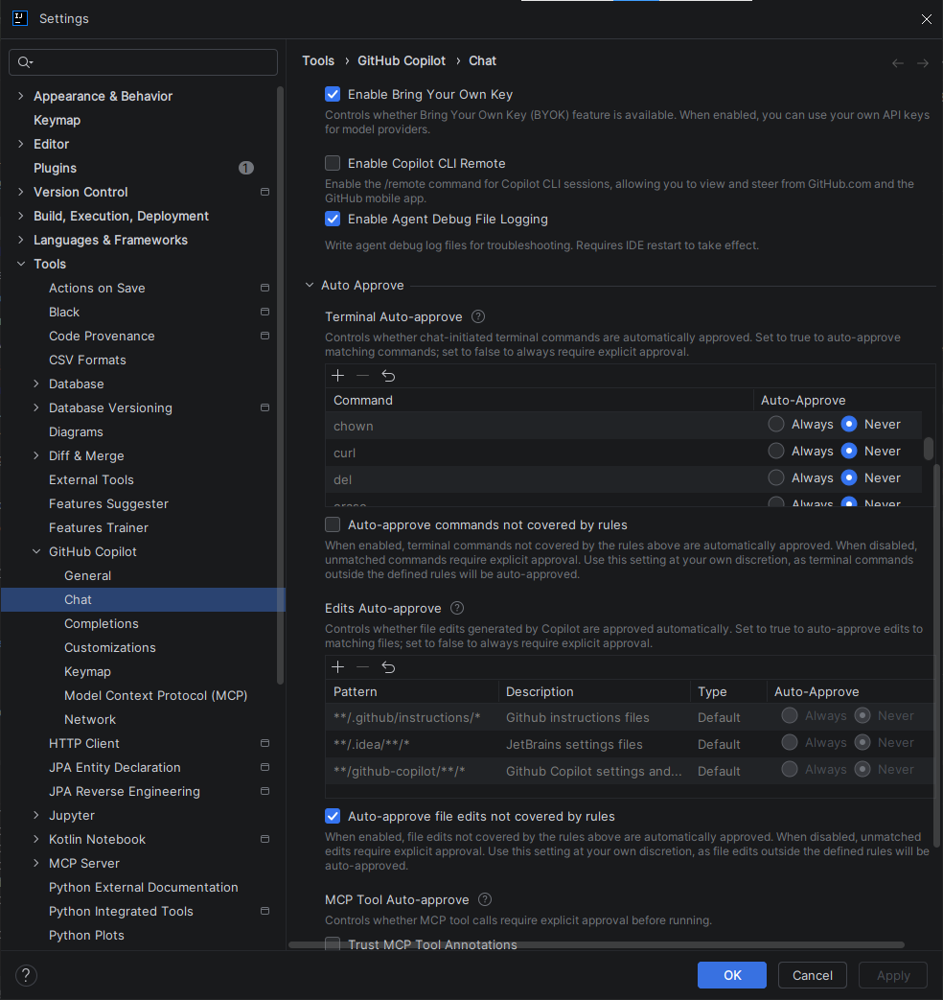
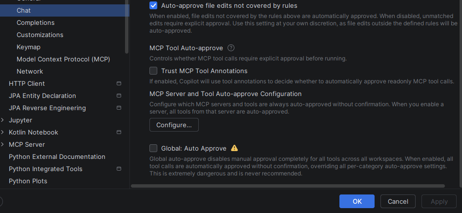
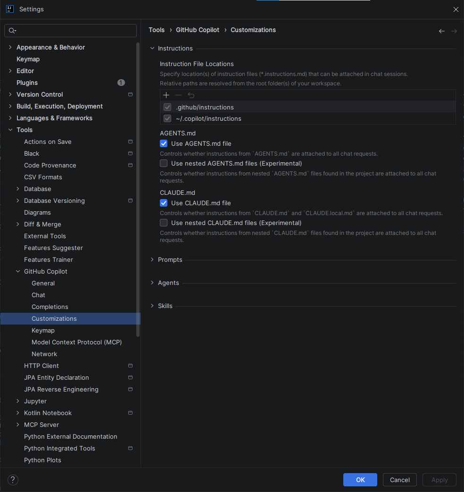
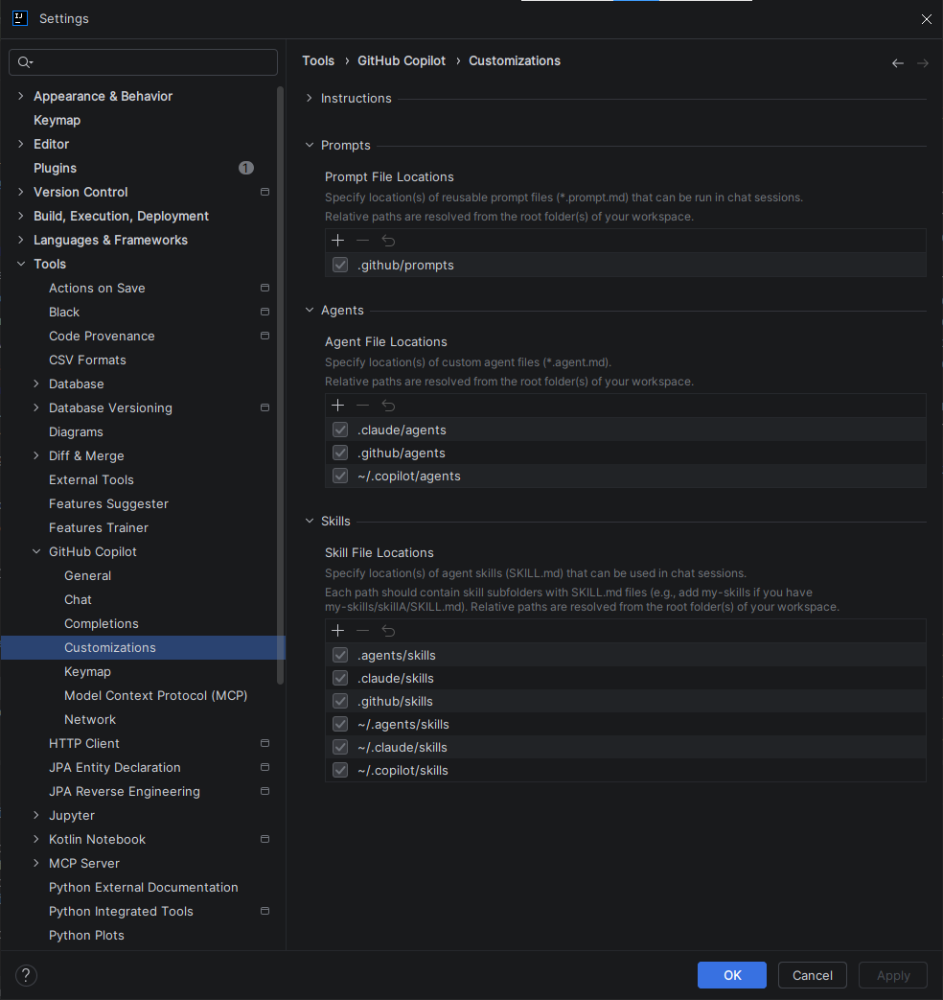

# :simple-intellijidea: Paramétrage Complet — GitHub Copilot sur IntelliJ IDEA

<span class="badge-intellij">IntelliJ IDEA</span> <span class="badge-intermediate">Intermédiaire</span>

!!! info "Interface en évolution"
    Les écrans GitHub Copilot dans IntelliJ IDEA évoluent rapidement selon la **version du plugin**, le **canal de diffusion** (stable/beta), votre **plan GitHub Copilot** et les **politiques** appliquées par votre organisation. Cette page se concentre sur les réglages officiellement documentés et sur les pratiques qui restent valables même quand l'interface change.

!!! warning "Raccourcis clavier — valeurs par défaut uniquement"
    Tous les raccourcis mentionnés dans cette page correspondent aux **valeurs par défaut** d'IntelliJ IDEA. Selon votre keymap (AZERTY, IdeaVim, Emacs, schéma personnalisé d'entreprise), ces raccourcis peuvent ne pas fonctionner ou être mappés différemment. Consultez la [section Raccourcis clavier GitHub Copilot](#raccourcis-clavier-github-copilot) pour vérifier et adapter vos raccourcis.

## Accès aux paramètres

Trois façons d'accéder aux paramètres GitHub Copilot :

### 1️⃣ Via le menu principal

1. *File → Settings* (Windows/Linux) ou *IntelliJ IDEA → Preferences* (macOS)
   - Raccourci : ++ctrl+alt+s++ / ++cmd+comma++
2. Cherchez **GitHub Copilot** dans le panneau de gauche et expandez-le

### 2️⃣ Via l'icône dans la barre d'état

- Cliquez sur l'icône Copilot en bas à droite de la fenêtre
- Sélectionnez **"Open GitHub Copilot Settings"**

### 3️⃣ Via le menu Tools

- *Tools → GitHub Copilot → Settings...*

**Page d'accueil des paramètres :**

Une fois ouvert, vous voyez plusieurs catégories de réglages. Selon votre version, vous retrouverez généralement `General`, `Chat`, `Completions`, `Customizations`, `Keymap`, et parfois des sections supplémentaires liées au réseau ou au contexte, comme MCP.

{ .doc-screenshot }
*Catégories des paramètres GitHub Copilot*

---

## Catégories des paramètres

Les paramètres GitHub Copilot sont organisés en plusieurs catégories. Explorez chaque section selon vos besoins :

### 🔧 General

#### Authentification et gestion du plugin

- **GitHub Copilot account settings** — Gérez votre compte GitHub, authentification device code flow ou custom enterprise URI
- **Plugin updates** — Canal de mise à jour (Stable / Beta), vérification automatique
- **Send usage telemetry** — Optionnel ; permet à GitHub d'améliorer Copilot

{ .doc-screenshot }
*Paramètres généraux : compte, mise à jour, authentification, télémétrie*

#### Quand l'utiliser

Lors de la première configuration, ou pour changer de compte GitHub.

---

### 💬 Chat

#### Configuration du Chat et du raisonnement

Les options visibles dans **Settings → GitHub Copilot → Chat** dépendent de la version du plugin, du plan Copilot et des politiques d'organisation.

!!! note "Méthode de lecture"
    Les noms ci-dessous reprennent **les libellés UI exacts vus sur les captures**. Quand un détail de comportement n'est pas documenté officiellement pour IntelliJ, il est indiqué comme **comportement UI observé**.

{ .doc-screenshot }
*Paramètres généraux du Chat : auto-model, langue, affichage*

#### 1) Paramètres généraux (capture 1)

| Nom UI exact | Explication concise | Prudence recommandée |
|---|---|---|
| **Enable Auto Model** | Laisse Copilot sélectionner automatiquement le modèle. | Gardez activé par défaut ; le choix réel dépend du plan/politiques. |
| **Natural Language** | Définit la langue principale du chat. | Peut être contourné par le prompt utilisateur ou le contexte de session. |
| **Diff View Mode** | Définit le mode d'affichage des modifications proposées. | Le rendu précis peut varier selon version IntelliJ/plugin (UI observée). |
| **Auto-accept Delay** | Définit un délai avant acceptation automatique dans les flux concernés. | Utiliser un délai prudent pour éviter des validations involontaires. |
| **Show inline chat gutter icon** | Affiche/masque l'icône de chat dans la gouttière de l'éditeur. | Option d'ergonomie ; sans impact fonctionnel majeur attendu. |

{ .doc-screenshot }
*Mode Agent : activation des agents personnalisés, skills, et code review*

#### 2) Paramètres Agent (capture 1 & 2)

| Nom UI exact | Explication concise | Prudence recommandée |
|---|---|---|
| **Enable Agent mode** | Active le mode agent pour des tâches multi-étapes plus autonomes. | À activer progressivement ; disponibilité dépend du plan/politiques. |
| **Agent Max Requests** | Limite le nombre de requêtes qu'un agent peut enchaîner. | Commencer bas pour limiter coût et boucles. |
| **Anthropic Thinking Budget Tokens** | Budget de tokens pour le raisonnement étendu (si modèle compatible). | Monter seulement pour tâches complexes ; sinon rester modéré. |
| **Enable Custom Agent** | Active les agents personnalisés. | Comportement exact dépendant des features activées côté GitHub (UI observée). |
| **Enable Subagent** | Autorise un agent principal à déléguer des sous-tâches à d'autres agents spécialisés (ex. recherche, refactor, test). | Plus d'autonomie = plus de surface de risque/coût ; utile seulement si le gain sur les tâches complexes est réel. |
| **Enable Coding Agent** | Active un agent orienté modifications de code (proposition de patchs, itérations de correction, mise à jour ciblée de fichiers). | Conserver une validation humaine, surtout sur sécurité, infra, dépendances et logique métier critique. |
| **Enable Skills** | Active des capacités spécialisées prêtes à l'emploi (actions/outils agentiques selon votre environnement). | Activer par besoin concret ; les skills disponibles peuvent varier selon version/plan/politiques. |
| **Enable Hooks** | Active des points d'extension déclenchés à certains moments du flux agent (avant/après une action, validation, etc., selon implémentation). | Vérifier gouvernance et traçabilité ; le cycle exact des hooks peut varier selon plugin et politiques. |
| **Enable Code Review** | Active les fonctions de revue de code pilotées par Copilot. | À recouper avec votre processus de revue humain. |
| **Enable Bring Your Own Key** | Permet l'usage d'une clé/API externe quand supporté. | Respecter strictement les politiques sécurité et secret management. |
| **Enable Copilot CLI Remote** | Active l'intégration Copilot CLI en contexte distant si proposée. | Option dépendante de l'environnement et potentiellement restreinte. |
| **Enable Agent Debug File Logging** | Écrit des logs de debug agent dans des fichiers. | Activer seulement en diagnostic ; attention aux données sensibles dans les logs. |

##### Micro-définitions — options agent avancées

- **Enable Hooks** : mécanisme d'extension pour brancher des contrôles ou actions automatiques autour des étapes agentiques.
  - **Quand l'activer :** si vous avez un cadre de contrôle clair (audit, validation, observabilité) et une équipe outillée.
  - **Quand éviter :** si vous débutez, ou si vous n'avez pas de politique explicite sur ce que les hooks peuvent exécuter.
- **Enable Skills** : ajoute des compétences spécialisées à l'agent pour éviter des prompts longs et répétitifs.
  - **Quand l'activer :** quand certaines tâches reviennent souvent (analyse ciblée, génération structurée, workflows récurrents).
  - **Quand éviter :** si vous ne savez pas quelles skills sont réellement utilisées, ou si cela complexifie le comportement du Chat.
- **Enable Subagent** : permet la délégation en parallèle ou par spécialité pour traiter des tâches plus larges.
  - **Quand l'activer :** pour des demandes multi-fichiers ou multi-étapes où un agent unique devient vite limité.
  - **Quand éviter :** sur tâches simples/rapides, où la délégation ajoute du coût et de la latence sans bénéfice.
- **Enable Coding Agent** : focalise l'agent sur des actions d'édition de code dans le workspace.
  - **Quand l'activer :** pour accélérer des refactors locaux, des corrections guidées ou des changements répétitifs bien cadrés.
  - **Quand éviter :** sur zones sensibles (auth, paiement, sécurité) sans revue manuelle systématique.

{ .doc-screenshot }
*Paramètres complémentaires Chat : revue de code et options de validation (selon disponibilité)*

#### 3) Paramètres Code Review et validation (capture 2 & 3)

| Nom UI exact | Explication concise | Prudence recommandée |
|---|---|---|
| **Terminal Auto-approve** | Auto-approuve certaines commandes terminal selon règles. | Garder des règles strictes et revues ; éviter les motifs trop larges. |
| **Auto-approve commands not covered by rules** | Auto-approuve aussi les commandes sans règle explicite. | Recommandé **désactivé** en équipe/systèmes sensibles. |
| **Edits Auto-approve** | Auto-approuve des modifications fichiers selon règles. | Limiter à périmètres sûrs et traçables. |
| **Auto-approve file edits not covered by rules** | Auto-approuve aussi les edits hors règles. | Recommandé **désactivé** sauf sandbox très contrôlé. |
| **MCP Tool Auto-approve** | Autorise l'exécution automatique d'outils MCP sans confirmation interactive à chaque appel. | À réserver à une allowlist d'outils MCP maîtrisés ; sinon garder l'approbation manuelle. |
| **Trust MCP Tool Annotations** | Utilise les métadonnées/annotations fournies par l'outil MCP (risque, contexte, usage) pour orienter les décisions d'exécution. | N'activer que si le serveur MCP est fiable, gouverné et auditable ; le détail des annotations dépend du serveur. |
| **MCP Server and Tool Auto-approve Configuration (Configure...)** | Ouvre la configuration fine serveur/outil pour l'auto-approve MCP. | Préférer le "allowlist" explicite par serveur et outil. |
| **Global: Auto Approve** | Active l'auto-approbation de façon transversale (portée large selon les options disponibles dans votre version). | Recommandé **désactivé** par défaut ; à n'envisager qu'en environnement très contrôlé. |

##### Micro-définitions — auto-approbation MCP et globale

- **MCP Tool Auto-approve** : évite la confirmation manuelle répétée pour certains outils MCP.
  - **Quand l'activer :** pour des outils internes non destructifs et déjà validés (ex. lecture de documentation interne).
  - **Quand éviter :** pour des outils qui écrivent, déclenchent des actions externes, ou accèdent à des données sensibles.
- **Trust MCP Tool Annotations** : délègue une partie de l'évaluation du risque aux informations renvoyées par l'outil MCP.
  - **Quand l'activer :** si vos annotations sont normalisées, testées et revues côté plateforme.
  - **Quand éviter :** si les annotations sont incomplètes, hétérogènes, ou non auditées.
- **Global: Auto Approve** : réduit fortement les interruptions de validation, mais augmente le risque d'actions non désirées.
  - **Quand l'activer :** rarement, surtout dans une sandbox locale dédiée à l'expérimentation.
  - **Quand éviter :** en équipe, sur dépôt de production, ou dès qu'il y a des exigences de conformité.

##### Exemples de règles prudentes — Terminal Auto-approve

| Règle | Exemple prudent |
|---|---|
| Autoriser seulement des commandes en lecture | `git status`, `git diff --name-only` |
| Interdire commandes destructives | refuser `rm`, `del`, `git reset --hard`, scripts non revus |
| Limiter le scope | seulement dépôt courant, pas de chemins système |

##### Exemples de règles prudentes — Edits Auto-approve

| Règle | Exemple prudent |
|---|---|
| Autoriser un périmètre restreint | fichiers docs/tests uniquement |
| Exclure fichiers sensibles | secrets, CI/CD, infra, dépendances critiques |
| Exiger revue au-delà d'un seuil | approbation manuelle si diff volumineux |

!!! note "Détail de comportement"
    Pour plusieurs options avancées (auto-approve fin, hooks, sous-agents, MCP), la documentation officielle IntelliJ reste partielle au niveau champ par champ. Les descriptions ci-dessus sont volontairement prudentes et basées sur la **sémantique UI observée** sur les captures.

#### Quand l'utiliser

Configuration personnalisée du Chat, activation progressive des capacités avancées, et ajustement du niveau d'autonomie selon votre budget et votre confiance.

---

### ✏️ Completions

#### Configuration des complétions automatiques

- **Automatically show completions** — Active/désactive les suggestions pendant la frappe
- **Enable Next Edit Suggestions (NES)** — Propose la prochaine édition logique
- **Show IDE completions side-by-side** — Affiche les suggestions IDE et Copilot ensemble
- **Show multiple code suggestions** — Propose plusieurs variantes
- **Model for completions** — Sélectionne le modèle de complétion lorsque votre plan et votre configuration l'autorisent

{ .doc-screenshot }
*Paramètres des complétions : auto-show, NES, affichage side-by-side, model*

**Langages** :

- **Enabled languages for completions** — Liste des langages supportés (Java, Python, C#, JavaScript, SQL, etc.)
  - Les langages cochés reçoivent les suggestions
  - Décochez pour désactiver Copilot sur des fichiers sensibles (`.env`, configuration critique)

#### Quand l'utiliser

Pour contrôler quand et où Copilot propose des suggestions.

---

### 📝 Customizations

#### Instructions personnalisées pour guider Copilot

La section **Customizations** regroupe les mécanismes qui donnent du **contexte persistant** à Copilot. Dans la nouvelle UI observée (*Settings → GitHub Copilot → Customizations*), on voit 4 blocs : **Instructions**, **Prompts**, **Agents**, **Skills**.

!!! info "Officiel confirmé vs UI observée"
    - **Officiel confirmé (GitHub Docs / JetBrains Help)** : support des instructions de dépôt (dont `.github/copilot-instructions.md`), et présence de la personnalisation Copilot dans l'IDE JetBrains.
    - **UI observée sur capture** : certains libellés précis et certains chemins affichés dans les sélecteurs (`Instruction/Prompt/Agent/Skill File Locations`) peuvent évoluer selon version plugin/feature flags/politiques d'organisation.

{ .doc-screenshot }
*Customizations — Instructions : emplacements de fichiers et options associées*

#### Lecture pratique des 4 blocs

| Bloc | À quoi il sert | Officiel confirmé | Détails UI observés (susceptibles d'évoluer) |
|---|---|---|---|
| **Instructions** | Définir des règles persistantes (style, architecture, contraintes métier) appliquées au contexte Copilot. | `.github/copilot-instructions.md` et instructions de dépôt documentés côté GitHub. | `Instruction File Locations` affiche notamment `.github/instructions` et `~/.copilot/instructions`. Toggles visibles : **Use AGENTS.md file**, **Use nested AGENTS.md files (Experimental)**, **Use CLAUDE.md file**, **Use nested CLAUDE.md files (Experimental)**. |
| **Prompts** | Stocker des prompts réutilisables pour des tâches fréquentes (revue, test, refactor). | Le mécanisme de personnalisation par fichiers est documenté côté GitHub Copilot. | `Prompt File Locations` montre par exemple `.github/prompts`. |
| **Agents** | Déclarer des agents spécialisés réutilisables (rôle + comportement + outillage). | Les mécanismes de personnalisation avancée sont documentés par GitHub Copilot selon l'environnement. | `Agent File Locations` montre par exemple `.claude/agents`, `.github/agents`, `~/.copilot/agents`. |
| **Skills** | Fournir des compétences spécialisées que les agents peuvent invoquer sur des workflows précis. | Le support dépend du couple plugin/version/plan/politiques. | `Skill File Locations` montre par exemple `.agents/skills`, `.claude/skills`, `.github/skills`, `~/.agents/skills`, `~/.claude/skills`, `~/.copilot/skills`. |

{ .doc-screenshot }
*Customizations — Prompts / Agents / Skills : emplacements de personnalisation avancée*

#### Détail des options UI `AGENTS.md` / `CLAUDE.md`

!!! info "Statut documentaire"
    - **Confirmé officiellement** : GitHub documente le socle d'instructions de dépôt (notamment `.github/copilot-instructions.md` et fichiers d'instructions versionnés).
    - **UI observée dans IntelliJ (plugin Copilot)** : les toggles `Use AGENTS.md file`, `Use nested AGENTS.md files (Experimental)`, `Use CLAUDE.md file`, `Use nested CLAUDE.md files (Experimental)` apparaissent dans la section **Customizations**. Le détail précis de fusion/priorité n'est pas documenté champ par champ côté GitHub pour IntelliJ.

!!! tip "Pourquoi c'est utile"
    - **Stabilité** : Copilot reçoit des consignes constantes, donc moins de variations d'une réponse à l'autre.
    - **Moins de répétition** : tu évites de réécrire les mêmes prompts à chaque demande.
    - **Qualité** : les réponses collent mieux aux conventions du projet (tests, style, limites).
    - **Coût maîtrisé** : moins d'aller-retour inutiles = moins de tokens consommés.
    - **Onboarding équipe** : un nouveau membre profite tout de suite des mêmes règles que le reste de l'équipe.

##### Comparatif simple (qui sert à quoi ?)

| Fichier | Rôle principal | Valeur concrète |
|---|---|---|
| **`.github/copilot-instructions.md`** | **Socle global** du dépôt | Donne les règles communes à tout le monde, partout dans le repo |
| **`AGENTS.md`** | Consignes orientées **rôles / tâches / workflows** | Rend Copilot plus opérationnel sur des missions récurrentes (ex. refactor, review, tests) |
| **`CLAUDE.md`** | Conventions de travail/projet déjà en place | Réutilise vos habitudes existantes sans tout réécrire ailleurs |
| **Fichiers nested** (`*/AGENTS.md`, `*/CLAUDE.md`) | Spécialisation **locale** par sous-dossier | Réduit les réponses hors contexte sur les zones très différentes d'un même monorepo |

##### AGENTS.md vs CLAUDE.md en une phrase

- **`AGENTS.md`** : un mode d'emploi opérationnel pour dire à Copilot **comment agir** sur un scope (rôle, étapes, limites) — **pas** un fichier pour "référencer des agents" techniques.
- **`CLAUDE.md`** : un mémo de conventions d'équipe/projet déjà utilisées (style de réponse, contraintes, façon de collaborer), que Copilot peut aussi lire si activé.

##### Que mettre dedans ?

`AGENTS.md` (minimal et concret) :

```markdown
# AGENTS.md
## Scope
- Dossier: services/billing

## Mission
- Corriger/refactorer avec des diffs courts et lisibles.

## Garde-fous
- Ajouter/adapter les tests touchés.
- Ne pas modifier CI/CD ni dépendances critiques sans validation humaine.
```

`CLAUDE.md` (minimal et concret) :

```markdown
# CLAUDE.md
## Conventions de travail
- Réponse courte, puis patch.
- Expliquer les hypothèses si un point est ambigu.

## Contraintes projet
- Respecter conventions de nommage et stratégie de tests du dépôt.
```

##### 1) `Use AGENTS.md file`

- **Objectif** : demander à Copilot de prendre en compte un fichier `AGENTS.md` quand il est présent dans un emplacement scanné par la configuration.
- **Clarification importante** : `AGENTS.md` n'est pas un inventaire d'agents à déclarer. C'est un fichier d'instructions texte (rôle, workflow, limites) pour guider le comportement de Copilot.
- **Valeur apportée** : évite de re-prompt le rôle attendu et réduit les réponses génériques.
- **Activer quand** : vous avez déjà un cadre d'instructions clair par rôle/tâche et vous voulez le rendre réutilisable.
- **Éviter quand** : vous n'avez pas encore de règles stabilisées, ou si cela duplique fortement `.github/copilot-instructions.md`.

**Utilisation concrète :**

1. Activez le toggle.
2. Créez un `AGENTS.md` court (versionné dans le dépôt).
3. Gardez ce fichier orienté "rôle + garde-fous" et laissez le socle global dans `.github/copilot-instructions.md`.

- **Gabarit minimal (exemple)** :

```markdown
# AGENTS.md
## Scope
- Ce fichier s'applique au dossier <scope>.

## Rôle
- Agir comme assistant de refactor Java orienté lisibilité et tests.

## Do
- Proposer des changements petits et réversibles.
- Ajouter/mettre à jour les tests concernés.

## Don't
- Ne pas modifier CI/CD, secrets, dépendances critiques sans validation humaine.
```

- **Où le placer** : commencez par la racine du dépôt (portable et auditables en équipe), puis spécialisez par dossier seulement si nécessaire.

##### 2) `Use nested AGENTS.md files (Experimental)`

- **Objectif** : autoriser des `AGENTS.md` supplémentaires dans des sous-dossiers pour affiner localement les consignes.
- **Valeur apportée** : réduit les réponses hors contexte dans les dépôts multi-domaines, sans alourdir le socle global.
- **Activer quand** : monorepo ou dépôt multi-domaines avec conventions réellement différentes par zone.
- **Éviter quand** : petit dépôt, ou gouvernance documentaire encore immature.

**Utilisation concrète :**

1. Gardez un `AGENTS.md` racine très court.
2. Ajoutez des `AGENTS.md` locaux uniquement dans les zones qui en ont besoin.
3. Testez sur un dépôt pilote (option expérimentale).

- **Génération** : reprendre le gabarit minimal ci-dessus, en réduisant le scope au dossier ciblé.
- **Placement typique** : `AGENTS.md` racine + `services/billing/AGENTS.md`, `frontend/AGENTS.md`, etc.

!!! warning "Expérimental = prudence"
    Le comportement exact (ordre de priorité, héritage, fusion) doit être validé par tests internes, car non détaillé officiellement champ par champ dans la doc IntelliJ Copilot.

##### 3) `Use CLAUDE.md file`

- **Objectif** : demander la prise en compte d'un fichier `CLAUDE.md` si votre workflow en utilise déjà un.
- **Clarification importante** : `CLAUDE.md` ne remplace pas automatiquement `.github/copilot-instructions.md`. Utilisez-le surtout pour des conventions déjà existantes, sans dupliquer le socle global.
- **Valeur apportée** : capitalise sur vos conventions existantes et limite la duplication entre documents.
- **Activer quand** : vous exploitez déjà `CLAUDE.md` comme convention interne et voulez réduire la duplication d'instructions.
- **Éviter quand** : votre standard d'équipe est exclusivement GitHub (`.github/copilot-instructions.md`) et vous ne voulez pas multiplier les sources de vérité.

**Utilisation concrète :**

1. Activez le toggle.
2. Créez un `CLAUDE.md` minimal, cohérent avec le socle global.
3. Vérifiez en pratique que les réponses deviennent plus stables sur vos cas récurrents.

- **Gabarit minimal (exemple)** :

```markdown
# CLAUDE.md
## Projet
- Stack: <langages/frameworks>

## Principes
- Privilégier la clarté et les diffs courts.
- Expliquer les compromis avant code si ambigu.

## Contraintes
- Respecter conventions de nommage et stratégie de tests du dépôt.
```

- **Où le placer** : privilégier la racine du dépôt si vous l'utilisez, pour garder une gouvernance simple.

##### 4) `Use nested CLAUDE.md files (Experimental)`

- **Objectif** : autoriser des `CLAUDE.md` locaux par sous-dossier.
- **Valeur apportée** : adapte finement Copilot par domaine (backend, frontend, data) et évite les consignes contradictoires à l'échelle du dépôt.
- **Activer quand** : gros dépôt avec besoins très distincts (ex. backend Java vs frontend TypeScript) et discipline documentaire établie.
- **Éviter quand** : risque de divergence entre équipes ou quand les règles locales sont trop volatiles.
- **Utilisation concrète** : même logique que pour les nested `AGENTS.md` : socle court global + fichiers locaux ciblés + tests de non-régression sur prompts clés.
- **Génération** : cloner le gabarit minimal `CLAUDE.md` et supprimer toute règle redondante avec le socle global.
- **Placement typique** : `CLAUDE.md` racine + fichiers locaux dans les zones fortement spécialisées.

!!! example "Scénario concret (avant / après)"
    **Avant** : à chaque demande, l'équipe répète "fais un diff court, ajoute les tests, respecte notre style commit". Résultat : réponses inégales et beaucoup de retouches.

    **Après** : ces règles sont posées dans `.github/copilot-instructions.md` + `AGENTS.md` (et localement en nested si besoin). Copilot répond plus vite, plus régulièrement, avec moins d'allers-retours.

#### Stratégie recommandée pour des réponses plus précises

Chaque mécanisme de personnalisation n'a pas la même valeur. Pour obtenir des réponses plus fiables **et** consommer moins de crédits, appliquez cet ordre :

| Levier | Utilisation recommandée | Pourquoi |
|---|---|---|
| **`.github/copilot-instructions.md`** | Viser un socle court (souvent ~10–20 règles). Pour gros dépôts, garder le socle concis et déplacer le détail vers des règles ciblées. | C'est le contexte global le plus stable et le plus rentable |
| **Instructions ciblées** | Ajouter des règles par langage ou dossier uniquement si elles évitent un vrai bruit récurrent | Évite de surcharger tout le dépôt avec des détails locaux |
| **AGENTS.md / CLAUDE.md (si activés)** | Les utiliser en complément, avec périmètre explicite et sans dupliquer le socle global | Utile pour des workflows spécifiques ; limite les conflits d'instructions |
| **Git Commit Instructions** | Uniformiser le style des commits produits avec l'IA | Réduit les retouches sur l'historique Git |
| **Prompts / Agents / Skills partagés** | Les réserver aux workflows fréquents et coûteux | Intéressant quand l'équipe répète les mêmes tâches |

##### Stratégie d'échelle (petit dépôt vs gros monorepo)

| Contexte | Stratégie recommandée |
|---|---|
| **Petit dépôt** | 1) Socle global court dans `.github/copilot-instructions.md` ; 2) peu ou pas de règles locales ; 3) éviter les options nested expérimentales tant que le besoin n'est pas prouvé. |
| **Gros monorepo** | 1) Socle global court ; 2) règles ciblées par dossier/langage/framework ; 3) `AGENTS.md`/`CLAUDE.md` uniquement sur zones à forte spécialisation ; 4) éviter un fichier monolithique unique qui mélange tout. |

!!! tip "Portabilité équipe : dépôt avant local"
    Pour la cohérence d'équipe, privilégiez les chemins **versionnés dans le repo** (`.github/*`) avant les chemins **locaux utilisateur** (`~/.copilot/*`, `~/.claude/*`, `~/.agents/*`). Les chemins locaux sont utiles pour des préférences personnelles, mais moins auditables et moins portables.

!!! warning "Réglages expérimentaux"
    Les options marquées **(Experimental)** (ex. nested `AGENTS.md` / `CLAUDE.md`) sont à activer seulement après test sur un dépôt pilote. Ne les imposez pas d'emblée comme standard d'équipe.

!!! success "Configuration recommandée pour IntelliJ"
    Si vous ne devez faire qu'une seule chose, commencez par **versionner un `copilot-instructions.md` court, net et maintenu**. C'est aujourd'hui le meilleur compromis entre compatibilité, précision et maîtrise des coûts dans un workflow IntelliJ.

#### Règles de rédaction pour un contexte plus efficace

Pour que les customizations améliorent vraiment la qualité au lieu d'alourdir le prompt :

- écrivez des règles **courtes, testables et sans ambiguïté**
- préférez les **contraintes métier et de validation** aux slogans vagues
- séparez le **global** (architecture, conventions communes) du **local** (un dossier, un langage, un framework)
- supprimez les instructions obsolètes après chaque évolution majeure du dépôt
- évitez les doublons entre l'IDE, le dépôt et vos prompts manuels

!!! tip "La maîtrise des Customizations est le vrai levier de productivité"
    Les paramètres de Completions et de Chat sont des réglages de confort. Les Customizations, elles, définissent **comment Copilot comprend votre projet**. Consultez le [Chapitre 4 — Contexte & Personnalisation](../chapitre-4-contexte/index.md) pour configurer ces mécanismes et transformer Copilot en véritable assistant de votre codebase.

**Quand l'utiliser :** Standardisation d'équipe, amélioration de la cohérence des suggestions, réduction des itérations et meilleure maîtrise des coûts.

---

### ⌨️ Keymap

#### Raccourcis clavier GitHub Copilot

Vérifiez et personnalisez les raccourcis clavier en naviguant vers *Keymap → GitHub Copilot* (Windows/Linux) ou *Preferences → Keymap* (macOS).

**Raccourcis courants :**

| Action | Raccourci (défaut) | Customisable |
|--------|-------|----------------|
| Copilot Completion | ++alt+backslash++ | ✅ Oui |
| Copilot Chat | ++alt+l++ | ✅ Oui |
| Copilot Inline Chat | ++ctrl+k++ | ✅ Oui |

!!! warning "⚠️ Attention"
    Les raccourcis clavier **dépendent de votre configuration**. Si vous utilisez un clavier AZERTY ou avez personnalisé les raccourcis, les touches réelles peuvent différer. Vérifiez toujours sous *Keymap → GitHub Copilot*.

#### Quand l'utiliser

Lors de la configuration initiale ou pour adapter les raccourcis à votre workflow.

---

### 🔗 Model Context Protocol (MCP)

#### Qu'est-ce que MCP ?

Model Context Protocol est un **protocole standard** qui permet à Copilot d'intégrer et d'utiliser des **outils et des données externes** directement dans le Chat. Avec MCP, vous pouvez :

- connecter des bases de données, APIs et services externes
- accéder à des documentations externalisées
- exécuter des commandes ou interroger des outils spécialisés
- enrichir le contexte avec des réponses structurées venant d'autres systèmes

**Exemple :** Copilot peut interroger une base documentaire, un système de tickets ou une source de vérité technique avant de proposer une réponse.

**Installation de MCPs :**

GitHub documente MCP comme un mécanisme d'extension de contexte pour Copilot Chat. Dans les versions récentes, l'expérience peut passer par un registre, une configuration manuelle ou des politiques d'organisation selon votre environnement.

**Types de connexion MCP :**

| Type | Description | Exemple |
|------|-------------|---------|
| **stdio** | Communication locale via ligne de commande | Outil local démarré à la demande |
| **http** | Communication HTTP à distance | Service d'entreprise ou fournisseur SaaS |
| **docker** | Exécution containerisée | Outil isolé dans un conteneur |

!!! warning "Un MCP = plus de contexte = plus de coût potentiel"
    Chaque réponse renvoyée par un serveur MCP peut être réinjectée dans la fenêtre de contexte. Installez seulement les serveurs qui apportent une vraie valeur métier et formulez des requêtes étroites.

#### Impact sur la consommation de tokens et de coûts

L'utilisation d'un serveur MCP a un **double impact** qu'il faut anticiper avant d'activer plusieurs connecteurs.

**1. Les prompts utilisateur restent l'unité de facturation principale**

La facturation dépend du mode et du modèle. Les appels MCP déclenchés par l'agent peuvent augmenter le volume de travail, sans se résumer à une simple logique « 1 appel = 1 coût fixe ».

**2. La réponse MCP entre dans la fenêtre de contexte**

Le résultat retourné par le serveur MCP est transmis au modèle IA avec votre demande. Plus la réponse est volumineuse, plus elle consomme de tokens — réduisant d'autant l'espace disponible pour votre code et vos instructions.

!!! tip "Bonnes pratiques — maîtriser la consommation MCP"
    N'activez que quelques serveurs MCP à forte valeur, demandez des sorties courtes, et évitez les requêtes larges du type « analyse tout ». Consultez aussi la page [Performance & Ressources](../chapitre-9-bonnes-pratiques/performance.md).

**Quand l'utiliser :** Pour des workflows spécialisés nécessitant l'intégration directe au Chat.

**Ressources utiles :**

- [GitHub MCP Registry](https://github.com/mcp/registry) — Point d'entrée officiel GitHub cité dans la documentation MCP
- [Documentation GitHub Copilot sur MCP](https://docs.github.com/en/copilot/how-tos/provide-context/use-mcp-in-your-ide/extend-copilot-chat-with-mcp) — Pour la configuration détaillée selon votre environnement

---

### 🌐 Network

**Paramètres réseau et proxy :**

Configuration des connexions réseau, proxy, et certificats SSL (rarement nécessaire sauf en entreprise).

#### Quand l'utiliser

Environnements d'entreprise avec proxy obligatoire.


## Profils de configuration recommandés

Copilot est un outil à double tranchant : mal calibré, il peut devenir **intrusif** (suggestions constantes qui brisent la concentration) ou au contraire **trop discret** (aucune aide visible). Ces trois profils offrent des points de départ calibrés selon votre expérience et votre contexte de travail.

### Les deux axes de granularité

**1. Automatisme des suggestions (Completions)**
Contrôle si Copilot propose des suggestions automatiquement pendant la frappe ou seulement sur demande explicite. En mode automatique, chaque pause de saisie déclenche une suggestion — pratique en apprentissage, potentiellement gênant sur du code complexe où la concentration est prioritaire.

**2. Niveau d'autonomie des fonctions avancées**
Détermine si Copilot se limite à des suggestions passives ou peut agir de façon plus autonome : lire des fichiers, écrire du code, exécuter des commandes, intégrer des outils externes. Plus l'autonomie augmente, plus la **qualité du contexte** et la **surveillance humaine** deviennent importantes.

### Tableau comparatif des profils

| Critère | 🟢 Débutant | 🔴 Expert | 👥 Équipe |
|---|---|---|---|
| Suggestions automatiques | ✅ Maximum | ⚠️ Manuel | ✅ Activé |
| Fonctions avancées | ⚠️ Progressives | ✅ À la demande | ✅ Encadrées |
| Auto-approve | ❌ | ❌ Manuel | ❌ Désactivé |
| Customizations | Minimales | Fines et ciblées | Partagées (dépôt) |
| Portabilité des fichiers de customisation | Priorité dépôt, local optionnel | Mix dépôt + local selon besoin | Dépôt prioritaire, local exceptionnel |
| Langages actifs | Limités à l'utile | Sélectifs | Projet uniquement |
| Idéal pour | Apprentissage, découverte | Contrôle maximal | Cohérence d'équipe |

!!! tip "Ces profils sont des points de départ"
    Ne les appliquez pas tels quels sans les adapter à votre workflow. Activez progressivement les fonctionnalités avancées à mesure que vous gagnez en confiance.

---

### 🟢 Profil Débutant

#### Pour ceux qui découvrent Copilot et veulent un maximum d'aide

**Completions :**
```text
✅ Suggestions automatiques : activées
✅ Next Edit Suggestions : à tester selon votre confort
✅ Affichage côte à côte avec l'IDE : activé si utile
✅ Modèle : auto ou modèle standard de votre plan
✅ Langages actifs : votre langage principal et ceux réellement utilisés
```

**Chat :**
```text
✅ Auto model : activé
⚠️ Fonctions agentiques : à activer progressivement
❌ Auto-approve : désactivé
```

**Customizations :**
```text
✅ `.github/copilot-instructions.md` : court et clair
⚠️ Fichiers locaux utilisateur (`~/.copilot/*`) : seulement si besoin personnel
❌ Options "Experimental" : laisser désactivées au départ
```

### 🔴 Profil Expert

#### Pour les développeurs expérimentés qui veulent le contrôle granulaire

**Completions :**
```text
⚠️ Suggestions automatiques : désactivées ou fortement limitées
✅ Next Edit Suggestions : désactivées si elles perturbent le flux
✅ Variantes multiples : seulement si elles apportent un vrai gain
✅ Modèle : choisi selon le type de tâche
✅ Langages actifs : sélectifs (ex: Java, Python ; désactiver le bruit)
```

**Chat :**
```text
✅ Auto model : activé
✅ Fonctions agentiques : à la demande
✅ Revue de code : activée si votre plan la permet
✅ Auto-approve : désactivé (approbation manuelle)
```

**Customizations :**
```text
✅ Copilot Instructions : personnalisées finement
✅ Instructions ciblées : seulement pour les zones à forte spécificité
✅ Artefacts avancés partagés : uniquement s'ils sont réellement utilisés
⚠️ AGENTS.md / CLAUDE.md et variantes "nested" : activer après validation sur repo test
```

### 👥 Profil Équipe

#### Pour standardiser la configuration dans une équipe

**Completions :**
```text
✅ Suggestions automatiques : activées
✅ Affichage côte à côte : activé si l'équipe le trouve utile
✅ Langages actifs : ceux du projet uniquement
```

**Chat :**
```text
✅ Auto model : activé
✅ Fonctions agentiques : activées avec garde-fous
❌ Auto-approve : désactivé
```

**Customizations (IMPORTANT - Workspace level) :**
```text
✅ `.github/copilot-instructions.md` : instructions de l'équipe
✅ Instructions ciblées : conventions par domaine si nécessaire
✅ Templates ou artefacts partagés : standardisés et versionnés
✅ Priorité aux emplacements dépôt (`.github/*`) pour prompts/agents/skills
❌ Dépendance forte aux chemins locaux (`~/.copilot/*`, `~/.claude/*`) en standard équipe
```

!!! tip "Partage de settings en équipe"
    Préférez le **versionnement des fichiers de dépôt** (`.github/copilot-instructions.md`, instructions ciblées, README, conventions) plutôt qu'un partage de fichiers internes IntelliJ. Les réglages internes de l'IDE changent plus facilement et sont moins portables.

---

## Diagnostic avancé

JetBrains stocke une partie des préférences du plugin dans les fichiers internes de configuration de l'IDE. Cependant, **le format exact et l'emplacement peuvent évoluer** selon la famille d'IDE, la version et le plugin installé.

Utilisez ces fichiers principalement pour :

- **diagnostiquer un écart** entre deux postes
- **comparer un comportement** après une mise à jour
- **confirmer qu'un réglage UI a bien été persisté**

!!! warning "Ne pas en faire un contrat d'équipe"
    Évitez de documenter ou de partager des fichiers internes JetBrains comme mécanisme principal de gouvernance Copilot. Pour une configuration durable et portable, privilégiez les fichiers versionnés du dépôt et les paramètres officiellement exposés dans l'interface.

---

## Pièges à éviter

!!! danger "Erreurs de configuration courantes"

    **1. Activer les fonctions agentiques trop tôt**
    Si votre dépôt n'a pas encore d'instructions claires ni de garde-fous, l'autonomie supplémentaire augmente surtout le bruit et la consommation.
    
    ✅ Commencez par nettoyer `copilot-instructions.md`, puis activez les capacités avancées progressivement.

    **2. Laisser trop de langages et de fichiers actifs**
    Plus Copilot voit de bruit, moins ses réponses sont précises.
    
    ✅ Limitez les langages actifs à ceux du projet et excluez les dossiers générés, volumineux ou sensibles.

    **3. Empiler des instructions qui se répètent**
    Des règles dupliquées entre prompts, README et custom instructions diluent le contexte utile.

    ✅ Gardez un socle global court, puis n'ajoutez des règles ciblées qu'en cas de besoin réel.

    **4. Auto-approve trop agressif**
    Activer l'approbation automatique sur les éditions ou le terminal peut appliquer des modifications non vérifiées.
    
    ✅ En équipe, gardez Auto-approve désactivé ou très restrictif.

---

## Sources

- GitHub Docs — *[Using GitHub Copilot in a JetBrains IDE](https://docs.github.com/en/copilot/using-github-copilot/using-github-copilot-in-your-ide/using-github-copilot-in-a-jetbrains-ide)* (consulté le 2026-06-06)
- GitHub Docs — *[Use GitHub Copilot Chat in your IDE](https://docs.github.com/en/copilot/using-github-copilot/copilot-chat/asking-github-copilot-questions-in-your-ide)* (consulté le 2026-06-06)
- JetBrains Help — *[GitHub Copilot](https://www.jetbrains.com/help/idea/github-copilot.html)* (consulté le 2026-06-06)
- GitHub Docs — *[Support for different types of custom instructions](https://docs.github.com/en/copilot/reference/custom-instructions-support)* (consulté le 2026-06-06)
- GitHub Docs — *[Adding repository custom instructions for GitHub Copilot in your IDE](https://docs.github.com/en/copilot/how-tos/configure-custom-instructions-in-your-ide/add-repository-instructions-in-your-ide)* (consulté le 2026-06-06)
- GitHub Docs — *[Extending GitHub Copilot Chat with Model Context Protocol (MCP) servers](https://docs.github.com/en/copilot/how-tos/provide-context/use-mcp-in-your-ide/extend-copilot-chat-with-mcp)* (consulté le 2026-06-03)
- GitHub Docs — *[Models and pricing for GitHub Copilot](https://docs.github.com/en/copilot/reference/copilot-billing/models-and-pricing)* (consulté le 2026-06-03)
- GitHub Docs — *[Improving agent quality to optimize AI usage](https://docs.github.com/en/copilot/tutorials/optimize-ai-usage)* (consulté le 2026-06-03)

---

## Prochaine étape

**[Comparaison des paramètres](comparaison-parametres.md)** : situer précisément ce que vous pouvez standardiser dans IntelliJ, ce qui reste mieux documenté dans VS Code, et comment choisir le bon niveau de personnalisation.

Concepts clés couverts :

- **Parité réelle vs supposée** — distinguer les mécanismes officiellement documentés de ceux qui dépendent d'une version
- **Customizations portables** — ce qui fonctionne durablement à l'échelle du dépôt
- **Contexte et coût** — quels réglages augmentent la précision sans faire exploser la consommation
- **Choix par IDE** — quand IntelliJ suffit et quand VS Code apporte encore un avantage documentaire
