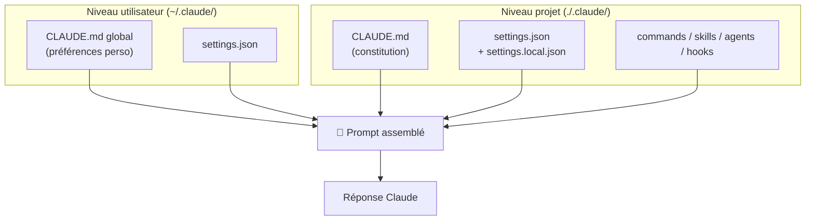
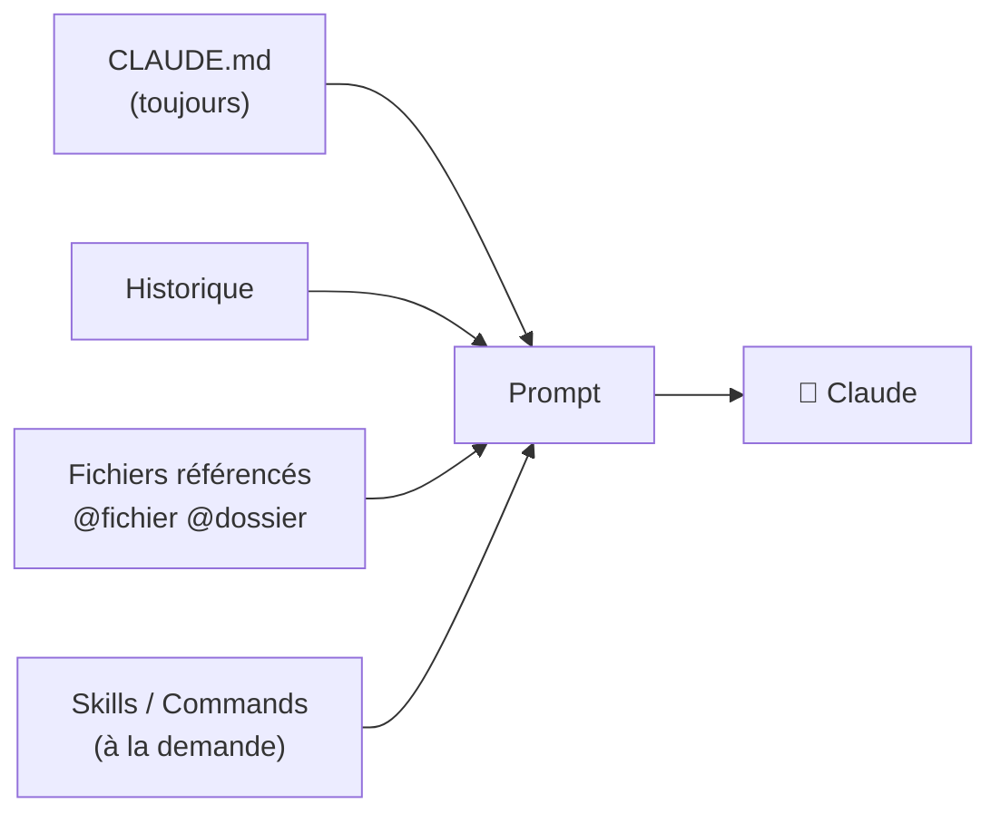

# Architecture de configuration `.claude/`

<span class="badge-intermediate">Intermédiaire</span> <span class="badge-expert">Expert</span> <span class="badge-cli">CLI</span>

Claude Code se distingue de GitHub Copilot par une configuration **modulaire, versionnée et explicite**. Au lieu de disperser les réglages entre `.github/`, `.vscode/` et l'interface de l'IDE, Claude centralise tout dans un dossier `.claude/` à la racine du dépôt. Cette page détaille chaque brique et son rôle exact.

---

## Vue d'ensemble

```text
mon-projet/
├─ CLAUDE.md                      ← constitution du projet (chargée en continu)
└─ .claude/
   ├─ settings.json               ← réglages projet (versionnés)
   ├─ settings.local.json         ← réglages locaux (NON versionnés)
   ├─ commands/                   ← workflows invocables via /commande
   │  ├─ review-pr.md
   │  └─ generate-tests.md
   ├─ skills/                     ← expertise réutilisable, auto-invoquée
   │  └─ conventions-java/
   │     └─ SKILL.md
   ├─ agents/                     ← subagents isolés (contexte propre)
   │  ├─ security-auditor.md
   │  └─ schema-explorer.md
   └─ hooks/                      ← scripts avant/après action
      ├─ pre-tool-use.py
      └─ post-tool-use.sh
```

!!! info "Deux niveaux de configuration"
    - **Projet** : `./.claude/` et `./CLAUDE.md` — partagés via Git, communs à l'équipe.
    - **Utilisateur** : `~/.claude/` et `~/.claude/CLAUDE.md` — préférences personnelles (modèle par défaut, clés, couleurs d'agents). À **ne pas** committer.



---

## `CLAUDE.md` — la constitution du projet

`CLAUDE.md` est **chargé à chaque tour** de conversation. C'est l'équivalent fonctionnel de `README.md` + `.github/copilot-instructions.md` chez Copilot, mais conçu spécifiquement comme mémoire permanente.

### Ce qu'il doit contenir

- **Stack technique** : langages, frameworks, versions
- **Conventions** : style de code, nommage, structure des dossiers
- **Commandes clés** : build, test, lint, run
- **Architecture** : modules principaux, frontières, dépendances
- **Pièges connus** : contraintes métier, comportements non évidents

### Ce qu'il ne doit PAS contenir

- Des secrets (clés API, mots de passe)
- Des pavés de documentation : gardez-le **court et stable** (idéalement < 1 page)
- Des informations obsolètes qui alourdissent inutilement la fenêtre de contexte

!!! example "Squelette de `CLAUDE.md`"
    ```markdown
    # Projet — API de réservation

    ## Stack
    - Java 21, Spring Boot 3.3, PostgreSQL 16, Redis 7
    - Tests : JUnit 5 + Mockito + Testcontainers

    ## Commandes
    - Build : `./mvnw clean install`
    - Tests : `./mvnw test`
    - Lint : `./mvnw spotless:check`

    ## Conventions
    - Injection par constructeur uniquement (jamais @Autowired sur champ)
    - DTOs en sortie d'API, jamais d'entités JPA exposées
    - Logs via SLF4J, jamais System.out

    ## Pièges
    - Le cache Redis L2 doit être invalidé après toute écriture sur `Booking`.
    ```

### Imports avec `@`

`CLAUDE.md` peut **importer** d'autres fichiers pour rester modulaire :

```markdown
Voir les conventions détaillées : @docs/conventions-backend.md
Schéma de base : @docs/db-schema.md
```

!!! tip "Générer un premier `CLAUDE.md`"
    Lancez `/init` dans le REPL : Claude analyse le dépôt et propose un `CLAUDE.md` de départ que vous affinez ensuite.

---

## `commands/` — workflows réutilisables

Une **command** est un fichier Markdown dans `.claude/commands/<nom>.md`, invoqué manuellement via `/<nom>` ou automatiquement quand la tâche correspond. Elle encapsule un **workflow complet** avec contexte dynamique et outils autorisés.

```markdown
---
description: "Revue de PR : analyse le diff et propose des corrections priorisées"
allowed-tools: [bash, read, grep]
---

## Contexte
Branche courante et changements :
!`git diff --stat`
!`git diff`

## Tâche
Analyse le diff ci-dessus et produis :
1. Les risques (sécurité, perf, régressions) classés High/Medium/Low
2. Les corrections recommandées, avec extraits de code
3. Un message de commit conforme à la convention du projet
```

| Élément | Rôle |
|---------|------|
| `description` | Texte affiché et utilisé pour l'invocation automatique |
| `allowed-tools` | Liste blanche d'outils que la command peut utiliser |
| `` !`commande` `` | Injection **dynamique** : exécute la commande shell et insère sa sortie |
| `$ARGUMENTS` | Récupère les arguments passés après `/<nom>` |

!!! info "Équivalent Copilot"
    Les commands remplacent les `.prompt.md` de Copilot, mais ajoutent l'**injection dynamique** (`!`commande``) et le **contrôle d'outils** (`allowed-tools`).

---

## `skills/` — expertise auto-invoquée

Un **skill** vit dans `.claude/skills/<nom>/SKILL.md`. Il représente un **paquet d'instructions réutilisables** que Claude invoque **automatiquement** lorsqu'une tâche correspond à son domaine (via le front-matter `description`).

```markdown
---
name: conventions-java
description: "Conventions de code Java du projet : injection par constructeur, DTOs, nommage des services, gestion des transactions."
---

# Conventions Java

## Injection de dépendances
- Toujours par constructeur, jamais @Autowired sur champ.

## Couche service
- Annoter @Transactional au niveau service uniquement.
- Retourner des DTOs, jamais d'entités JPA.

## Nommage
- Services : `XxxService` ; implémentations : `XxxServiceImpl`.
```

| Différence avec une command | Skill |
|-----------------------------|-------|
| Déclenchement | **Automatique** selon la `description` |
| Vocation | **Expertise / connaissance** durable |
| Structure | Dossier `skills/<nom>/SKILL.md` (+ fichiers de référence) |

!!! tip "Command ou Skill ?"
    - **Command** = un *verbe*, un workflow qu'on lance (« génère les tests », « audite cet endpoint »).
    - **Skill** = un *savoir*, appliqué en arrière-plan quand le contexte s'y prête (« comment on écrit du Java ici »).

---

## `agents/` — subagents isolés

Un **subagent** est un assistant avec son **propre contexte**, qui s'exécute en parallèle du modèle principal sans le polluer. Idéal pour les tâches lourdes : exploration de schéma, audit de sécurité, planification.

```markdown
---
name: security-auditor
description: "Audite un endpoint ou un module à la recherche de failles OWASP Top 10 (injection, XSS, SSRF, IDOR, secrets)."
tools: [read, grep, bash]
model: claude-sonnet-4
color: red
---

Tu es un expert en sécurité applicative certifié OWASP.
Pour chaque cible analysée :
1. Identifie les entrées non validées.
2. Vérifie l'authentification et l'autorisation (IDOR/BOLA).
3. Repère injections SQL/NoSQL, SSRF, secrets en dur.
4. Produis un rapport JSON { globalRisk, findings[] }.
```

| Champ front-matter | Rôle |
|--------------------|------|
| `name` | Identifiant du subagent |
| `description` | Quand l'invoquer (auto ou via `/agents`) |
| `tools` | Outils accessibles (liste blanche) |
| `model` | Modèle dédié (ex. Haiku pour les tâches rapides, Opus pour les complexes) |
| `color` | Couleur d'affichage dans le chat |

!!! info "Pourquoi isoler un agent ?"
    Une exploration de schéma peut générer des milliers de tokens. En l'isolant dans un subagent, le **contexte principal reste propre** : seul le résultat synthétique remonte. Gérez-les avec `/agents`.

---

## `hooks/` — automatisation avant/après action

Les **hooks** sont des scripts (Bash, Python…) exécutés **autour** des actions de Claude. Ils permettent de valider, formater, auditer ou bloquer une opération.

| Événement | Quand | Usage typique |
|-----------|-------|---------------|
| `PreToolUse` | Avant qu'un outil agisse | Bloquer une édition dangereuse, vérifier le format, refuser un secret |
| `PostToolUse` | Après l'action | Lancer le lint, formater, journaliser/auditer |
| `SessionStart` | Au début d'une session | Injecter un comportement global (à utiliser avec parcimonie) |

Déclaration dans `.claude/settings.json` :

```json
{
  "hooks": {
    "PreToolUse": [
      { "matcher": "Edit|Write", "command": ".claude/hooks/pre-tool-use.py" }
    ],
    "PostToolUse": [
      { "matcher": "Edit|Write", "command": ".claude/hooks/post-tool-use.sh" }
    ]
  }
}
```

### Convention des codes de sortie

| Code de sortie | Effet |
|:--------------:|-------|
| `0` | L'action est autorisée (rien à signaler) |
| `1` | Affiche un message à l'utilisateur, l'action continue |
| `2` | **Bloque** l'action et renvoie le message à Claude |

!!! example "Hook anti-secrets (`pre-tool-use.py`)"
    ```python
    import json, re, sys

    data = json.load(sys.stdin)
    content = data.get("tool_input", {}).get("content", "")

    if re.search(r"(sk-ant-|AKIA[0-9A-Z]{16}|-----BEGIN)", content):
        print("Secret potentiel détecté — édition bloquée.", file=sys.stderr)
        sys.exit(2)   # bloque l'action
    sys.exit(0)
    ```

!!! warning "Sécurité des hooks"
    Un hook s'exécute avec **vos droits**. Relisez chaque script en pull request comme du code de production, et n'exécutez jamais de hook provenant d'une source non fiable.

---

## `settings.json` et `settings.local.json`

| Fichier | Versionné ? | Contenu |
|---------|:-----------:|---------|
| `.claude/settings.json` | ✅ Oui | Réglages partagés : hooks, permissions d'outils, modèle par défaut, exclusions |
| `.claude/settings.local.json` | ❌ Non (à ajouter au `.gitignore`) | Surcharges personnelles : clés, préférences locales |
| `~/.claude/settings.json` | ❌ Non | Réglages globaux de l'utilisateur |

!!! example "Exclure des chemins du contexte"
    ```json
    {
      "permissions": {
        "deny": ["Read(./.env)", "Read(./secrets/**)"]
      }
    }
    ```
    Équivalent fonctionnel de `.copilotignore`, mais exprimé en règles de permissions.

---

## Fenêtre de contexte et règles de chargement

Comme Copilot, Claude travaille dans une **fenêtre de tokens limitée**. Le prompt est assemblé à partir de :

1. `CLAUDE.md` (projet + utilisateur) — **toujours**
2. L'historique de la conversation
3. La sélection et les fichiers ouverts / référencés (`@fichier`, `@dossier`)
4. Les skills et commands — **uniquement quand ils sont invoqués**



!!! tip "Maîtriser le coût"
    Les skills et commands ne sont chargés **que lorsqu'ils sont utiles**. Évitez les `SessionStart` permanents et gardez `CLAUDE.md` concis : c'est le levier n°1 pour contenir la consommation de tokens. Surveillez avec `/cost`.

---

## Prochaine étape

**[Choisir le bon modèle Claude](modeles-claude.md)** : sélectionner Haiku, Sonnet ou Opus selon la tâche et le budget, globalement et par subagent.

Concepts clés couverts :

- **Trois profils** — Haiku (rapide), Sonnet (équilibré), Opus (raisonnement)
- **Changer de modèle** — `/model`, `settings.json` et front-matter d'agent
- **Grille par tâche** — quel modèle pour quel type de travail
- **Impact sur le coût** — le bon modèle est le moins cher qui résout la tâche

---

## Sources

- [Anthropic — Memory (`CLAUDE.md`)](https://docs.anthropic.com/en/docs/claude-code/memory) - consulté le 2026-06-20
- [Anthropic — Settings](https://docs.anthropic.com/en/docs/claude-code/settings) - consulté le 2026-06-20
- [Anthropic — Slash commands & custom commands](https://docs.anthropic.com/en/docs/claude-code/slash-commands) - consulté le 2026-06-20
- [Anthropic — Skills](https://docs.anthropic.com/en/docs/claude-code/skills) - consulté le 2026-06-20
- [Anthropic — Subagents](https://docs.anthropic.com/en/docs/claude-code/sub-agents) - consulté le 2026-06-20
- [Anthropic — Hooks reference](https://docs.anthropic.com/en/docs/claude-code/hooks) - consulté le 2026-06-20


