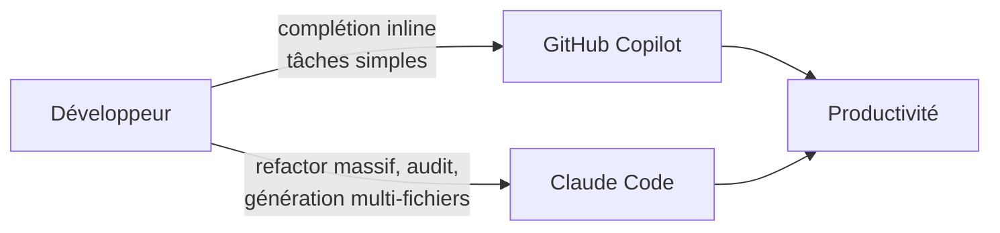

# Comparaison — GitHub Copilot vs Claude Code

Débutant Intermédiaire IntelliJ VS Code CLI

## Présentation

GitHub Copilot et Claude Code visent le même objectif — accélérer le développement — mais reposent sur des philosophies différentes. Copilot est né **dans l'IDE**, centré sur la complétion fluide et l'intégration GitHub. Claude Code est né **dans le terminal**, centré sur l'agent autonome et une configuration versionnée. Cette page les confronte point par point pour éclairer votre choix.

!!! info "Pas de « gagnant » universel"
    Le meilleur outil dépend de votre contexte : taille d'équipe, maturité de gouvernance, écosystème GitHub, besoin d'orchestration. Les deux peuvent même **cohabiter** (voir le [mode hybride](#mode-hybride)).

---

## Tableau comparatif complet

| Critère | GitHub Copilot | Claude Code |
|---------|:--------------:|:-----------:|
| Point d'entrée principal | IDE (inline + Chat) | CLI (REPL) + IDE |
| Complétion inline | ✅ Excellente, native | ⚠️ Secondaire |
| Mode agent | ✅ (Agent / Copilot Coding Agent) | ✅ Cœur du produit |
| Configuration | `.github/`, `.vscode/`, UI IDE | `.claude/` versionné + `CLAUDE.md` |
| Instructions permanentes | `copilot-instructions.md`, `.instructions.md` | `CLAUDE.md` |
| Prompts réutilisables | `.prompt.md` | `commands/` (+ injection dynamique) |
| Expertise modulaire | `SKILL.md` (récent) | `skills/<nom>/SKILL.md` |
| Agents personnalisés | `.agent.md` | `agents/<nom>.md` (subagents isolés) |
| Hooks (avant/après action) | ⚠️ Limité / expérimental | ✅ `PreToolUse` / `PostToolUse` natifs |
| Contrôle des outils | Implicite | ✅ `allowed-tools` explicite |
| Intégration GitHub / PR | ✅ Très forte (natif) | ⚠️ Dépend du setup / MCP |
| Choix du modèle | GPT, Claude, Gemini (selon offre) | Famille Claude (Sonnet/Opus/Haiku) + Bedrock/Vertex |
| Automatisation CI | ✅ Actions, Coding Agent | ✅ `claude -p` scriptable |
| Courbe d'apprentissage | Faible à modérée | Modérée (demande du cadre) |
| Gouvernance d'équipe | Bonne | Excellente si `.claude/` discipliné |

---

## Correspondance des artefacts

| Artefact Copilot | Équivalent Claude | Remarque |
|------------------|-------------------|----------|
| `README.md` (contexte) | `CLAUDE.md` | Claude le lit à **chaque** tour |
| `.github/copilot-instructions.md` | `CLAUDE.md` ou skill général | Conserver Rôle / Contexte / Contraintes / Format |
| `.instructions.md` (`applyTo`) | Skill ou command avec ciblage | Le glob devient un skill spécialisé |
| `.prompt.md` | `commands/<nom>.md` | + injection dynamique `` !`cmd` `` |
| `SKILL.md` (Copilot) | `skills/<nom>/SKILL.md` | Concept très proche |
| `.agent.md` | `agents/<nom>.md` | front-matter `name`, `description`, `tools`, `model` |
| Hooks IDE (expérimental) | `hooks/` + `settings.json` | Système officiel, codes de sortie 0/1/2 |
| `.copilotignore` | `permissions.deny` dans `settings.json` | Règles de permissions plutôt que fichier dédié |
| MCP (contexte externe) | Serveurs MCP dans `.claude/` | Même protocole (MCP) des deux côtés |

---

## Avantages et inconvénients

=== "GitHub Copilot"

    **Avantages**

    - Complétion inline de référence, très fluide dans l'IDE
    - Intégration GitHub native : PR, Actions, Coding Agent, revue
    - Adoption rapide, faible friction pour une équipe déjà sur GitHub
    - Choix de modèles (GPT, Claude, Gemini) selon l'offre
    - Écosystème mature et documentation abondante

    **Inconvénients**

    - Orchestration d'agents complexes moins flexible
    - Configuration dispersée (`.github/`, `.vscode/`, UI)
    - Hooks/automatisations limités et peu standardisés
    - Contrôle fin des outils moins explicite

=== "Claude Code"

    **Avantages**

    - Agent autonome puissant, pensé pour les tâches multi-étapes
    - Configuration **versionnée et explicite** (`.claude/`)
    - Hooks natifs (sécurité, qualité) et contrôle d'outils (`allowed-tools`)
    - Subagents isolés : contexte principal propre
    - CLI scriptable (`claude -p`) idéale pour l'automatisation

    **Inconvénients**

    - Mise en place plus exigeante (discipline documentaire)
    - Complétion inline secondaire par rapport à Copilot
    - Intégration GitHub/PR dépend du setup (MCP, scripts)
    - Modèles limités à la famille Claude (sauf Bedrock/Vertex)
    - Plugin JetBrains encore en bêta

---

## Coûts et facturation

| Modèle de coût | Copilot | Claude Code |
|----------------|---------|-------------|
| Abonnement individuel | Copilot Pro / Pro+ (forfait mensuel) | Claude Pro / Max (usage inclus, sous limites) |
| Offre équipe / entreprise | Copilot Business / Enterprise (par siège) | API à l'usage / offres équipe |
| Facturation à l'usage | Premium requests au-delà du quota | Tokens API (entrée + sortie) |
| Hébergement cloud privé | — | Amazon Bedrock, Google Vertex AI |

!!! warning "Le coût dépend de l'usage agentique"
    Les workflows d'agent (lecture de nombreux fichiers, itérations longues) consomment beaucoup de tokens. Avec Claude **comme avec Copilot**, surveillez la consommation : `/cost`, `/compact`, et un `CLAUDE.md` concis sont vos meilleurs leviers d'économie. Voir aussi le chapitre [Coûts & Gouvernance](../chapitre-12-couts-gouvernance/index.md).

---

## Recommandation selon le contexte

| Contexte d'équipe | Rester Copilot | Passer Claude | Hybride |
|-------------------|:--------------:|:-------------:|:-------:|
| Petite équipe, priorité onboarding rapide | ✅ | | ✅ |
| Environnement fortement GitHub-natif (PR, Actions) | ✅ | | ✅ |
| Équipe plateforme/infra orientée CLI | | ✅ | ✅ |
| Besoin d'agents spécialisés multi-domaines | | ✅ | ✅ |
| Gouvernance IA mature (revue de prompts, policies) | | ✅ | ✅ |
| Automatisation lourde en CI | | ✅ | ✅ |
| Budget serré, usage occasionnel | ✅ | | |

### Mode hybride

!!! success "La recommandation la plus fréquente : commencer hybride"
    Gardez **Copilot pour l'inline completion** (fluidité au quotidien) et ajoutez **Claude Code pour les tâches lourdes** (refactoring, audit de sécurité, génération structurée multi-fichiers). Mesurez sur un sprint, puis décidez de converger ou non. C'est le chemin le moins risqué pour la plupart des équipes.

### Synthèse de décision

- **Restez Copilot** si votre enjeu est l'adoption rapide, la fluidité IDE et l'ancrage GitHub.
- **Passez Claude** si vous avez besoin d'orchestration agentique avancée et d'une configuration strictement versionnée.
- **Adoptez l'hybride** si vous voulez le meilleur des deux et pouvez tolérer deux outils en parallèle.

---

## Prochaine étape

**[Coûts & quotas de Claude Code](couts-quotas.md)** : comprendre la facturation, mesurer sa consommation et appliquer les leviers d'économie avant de planifier une migration.

Concepts clés couverts :

- **Modèles de facturation** — abonnement Pro/Max, API à l'usage, Bedrock/Vertex
- **Comptage des tokens** — entrée vs sortie, accumulation de l'historique
- **Mesurer** — `/cost`, `/status` et tableau de bord Console
- **Leviers d'économie** — modèle, `CLAUDE.md` concis, `/compact`/`/clear`

---

## Sources

- [GitHub Docs — GitHub Copilot](https://docs.github.com/en/copilot) - consulté le 2026-06-20
- [GitHub Docs — Repository custom instructions](https://docs.github.com/en/copilot/customizing-copilot/adding-repository-custom-instructions-for-github-copilot) - consulté le 2026-06-20
- [Anthropic — Claude Code overview](https://docs.anthropic.com/en/docs/claude-code/overview) - consulté le 2026-06-20
- [Anthropic — Settings](https://docs.anthropic.com/en/docs/claude-code/settings) - consulté le 2026-06-20
- [Anthropic — Model Context Protocol (MCP)](https://docs.anthropic.com/en/docs/claude-code/mcp) - consulté le 2026-06-20

