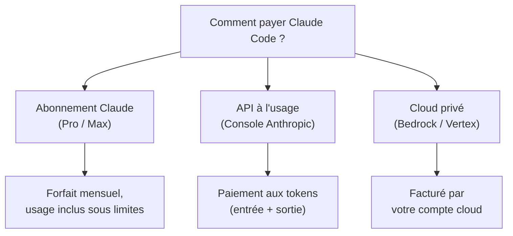
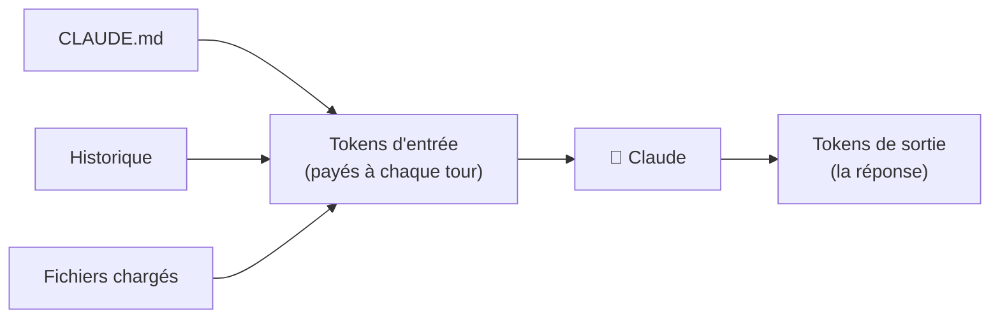
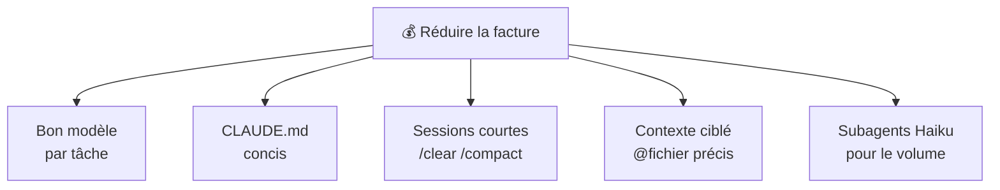

# Coûts & quotas de Claude Code

<span class="badge-intermediate">Intermédiaire</span> <span class="badge-expert">Expert</span> <span class="badge-cli">CLI</span>

Un agent autonome qui lit des dizaines de fichiers et itère sur une tâche peut consommer **beaucoup** de tokens. Comprendre la facturation, mesurer sa consommation et appliquer les bons leviers d'économie est essentiel pour adopter Claude Code sereinement — en individuel comme en équipe.

!!! info "Les tarifs évoluent"
    Les prix par token et les plans d'abonnement changent régulièrement. Cette page explique les **mécanismes** (stables) plutôt que des montants précis. Vérifiez les tarifs courants sur la page officielle [Pricing](https://www.anthropic.com/pricing). Voir la section [Sources](#sources).

---

## Deux modèles de facturation



| Modèle | Pour qui | Avantage | Limite |
|--------|----------|----------|--------|
| **Abonnement (Pro/Max)** | Développeur individuel | Coût prévisible, usage inclus | Limites d'usage par période |
| **API à l'usage** | Équipes, CI, gros volumes | Pas de plafond fonctionnel | Coût variable selon usage |
| **Bedrock / Vertex** | Entreprises cloud | Facturation centralisée, conformité | Configuration plus lourde |

!!! tip "Lequel choisir ?"
    - **Usage individuel régulier** → abonnement Pro/Max (prévisible).
    - **Pics, automatisation CI, équipe** → API à l'usage.
    - **Contraintes de conformité / cloud existant** → Bedrock ou Vertex.

---

## Comment les tokens sont comptés

Chaque échange facture **deux flux** distincts :

| Flux | Contenu | Levier de réduction |
|------|---------|---------------------|
| **Entrée (input)** | Prompt + `CLAUDE.md` + fichiers + historique | `CLAUDE.md` concis, `/compact`, `@fichier` ciblé |
| **Sortie (output)** | Réponse générée par Claude | Demander des réponses concises, format strict |



!!! warning "L'historique se cumule"
    Dans une longue session, **tout l'historique** est renvoyé à chaque message → les tokens d'entrée gonflent à chaque tour. C'est la cause n°1 des factures qui dérapent. Réflexe : `/compact` régulièrement, `/clear` entre tâches.

---

## Mesurer sa consommation

=== "Pendant la session"

    ```text
    /cost
    ```

    Affiche les tokens et le coût estimé de la session en cours.

=== "État du compte"

    ```text
    /status
    ```

    Montre le plan actif, le modèle et l'usage.

=== "Suivi détaillé (API)"

    Le tableau de bord de la **Console Anthropic** détaille la consommation par jour, modèle et clé API — utile pour la facturation d'équipe.

!!! tip "Mesurez avant d'optimiser"
    Lancez `/cost` après quelques tâches types pour identifier ce qui coûte cher (souvent : un `CLAUDE.md` trop long ou des sessions interminables). Vous saurez alors où agir.

---

## Les leviers d'économie



| Levier | Impact | Comment |
|--------|:------:|---------|
| Choisir le bon [modèle](modeles-claude.md) | ⭐⭐⭐ | Sonnet par défaut, Opus seulement si nécessaire |
| `CLAUDE.md` court | ⭐⭐⭐ | Coût payé à **chaque** tour — gardez-le < 1 page |
| `/compact` et `/clear` | ⭐⭐⭐ | Limite l'accumulation d'historique |
| `@fichier` ciblé vs `@dossier` | ⭐⭐ | Ne charger que le nécessaire |
| Subagents isolés | ⭐⭐ | L'exploration ne pollue pas le contexte principal |
| Format de sortie concis | ⭐ | Demander « réponds en 5 points max » |
| Éviter les `SessionStart` lourds | ⭐ | Coût ajouté à chaque session |

!!! example "Avant / après sur une session type"
    - **Avant** : `CLAUDE.md` de 8 pages + session de 2 h sans `/clear` → tokens d'entrée énormes à chaque message.
    - **Après** : `CLAUDE.md` de 40 lignes + `/clear` entre tâches + Sonnet → coût divisé plusieurs fois pour un résultat équivalent.

---

## Gouvernance des coûts en équipe

| Mesure | Bénéfice |
|--------|----------|
| Clés API par équipe/projet | Attribution claire des coûts |
| Tableau de bord Console suivi mensuellement | Détection précoce des dérives |
| Budget/alertes (si disponibles) | Plafonner les surprises |
| Convention `CLAUDE.md` concis | Réduit le coût fixe partout |
| Modèle par défaut = Sonnet | Évite l'usage systématique d'Opus |
| Revue des `SessionStart` et hooks coûteux | Limite les surcoûts cachés |

!!! info "À relier au chapitre Coûts & Gouvernance"
    Les principes de maîtrise des coûts IA (réduire les allers-retours, choisir le bon mode, leviers d'économie) sont détaillés de façon transverse dans le chapitre [Coûts & Gouvernance](../chapitre-12-couts-gouvernance/index.md). Ils s'appliquent à Claude comme à Copilot.

---

## Comparaison budgétaire Copilot vs Claude

| Aspect | GitHub Copilot | Claude Code |
|--------|----------------|-------------|
| Modèle de base | Abonnement par siège (Pro/Business/Enterprise) | Abonnement Pro/Max **ou** API à l'usage |
| Quotas d'usage | Limites mensuelles intégrées au forfait | Limites selon le plan, excédent payable (API) |
| Agents/Extensions | Abonnement séparé (ex: Copilot Pro pour agents) | Tokens consommés par l'agent (inclus dans l'API) |
| Prévisibilité | Élevée (forfait) | Élevée en abonnement, variable en API |
| Pic d'usage | Atteinte du quota = blocage temporaire | Coût proportionnel (API) |
| Cloud privé | — | Bedrock / Vertex (facturation cloud) |

!!! warning "Comparez à usage réel équivalent"
    Un forfait Copilot peut sembler moins cher qu'une consommation API Claude **jusqu'à** ce que les workflows agentiques intensifs entrent en jeu. Mesurez sur votre usage réel (phase pilote de la [checklist 30/60/90](migration-30-60-90.md)) avant de conclure.

---

## Checklist d'optimisation

- [ ] Modèle par défaut fixé sur Sonnet dans `settings.json`
- [ ] `CLAUDE.md` réduit à l'essentiel (< 1 page)
- [ ] Réflexe `/clear` entre tâches, `/compact` en session longue
- [ ] Contexte chargé via `@fichier` précis plutôt que dossiers entiers
- [ ] Exploration lourde déléguée à un subagent Haiku
- [ ] `/cost` consulté régulièrement
- [ ] Suivi mensuel de la Console (si API)
- [ ] Pas de `SessionStart` coûteux non justifié

---

## Prochaine étape

**[Migration depuis Copilot — guide pas à pas](migration-pas-a-pas.md)** : passer à la pratique en convertissant votre configuration Copilot existante, avec ces leviers de coûts en tête.

Concepts clés couverts :

- **Cartographie de l'existant** — inventorier vos artefacts Copilot
- **Conversion fichier par fichier** — instructions, prompts, agents, hooks
- **Flux pilote** — valider sur un seul workflow avant de généraliser
- **Industrialisation** — versionner, revoir et partager via un plugin

---

## Sources

- [Anthropic — Pricing](https://www.anthropic.com/pricing) - consulté le 2026-06-20
- [Anthropic — Manage costs and usage](https://docs.anthropic.com/en/docs/claude-code/costs) - consulté le 2026-06-20
- [Anthropic — Monitoring usage](https://docs.anthropic.com/en/docs/claude-code/monitoring-usage) - consulté le 2026-06-20
- [Anthropic — Models overview](https://docs.anthropic.com/en/docs/about-claude/models) - consulté le 2026-06-20

