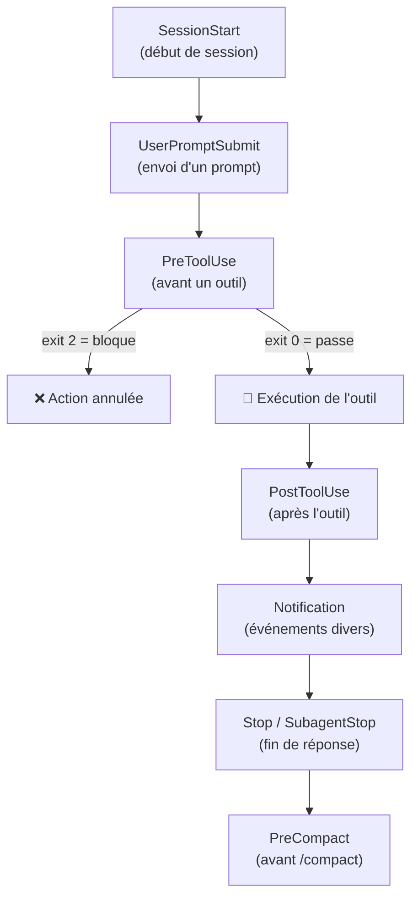
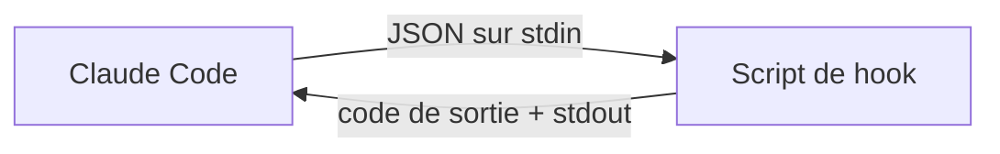

# Hooks avancés

<span class="badge-expert">Expert</span> <span class="badge-cli">CLI</span>

Les **hooks** sont le mécanisme le plus puissant pour transformer Claude Code d'un assistant en un agent **encadré et déterministe**. Là où un prompt *suggère* un comportement, un hook le *garantit* : il s'exécute automatiquement autour des actions de Claude, avec votre code, vos règles et vos droits. Cette page va bien au-delà des bases : tous les événements, des exemples complets et les patterns d'équipe.

!!! info "Pré-requis"
    Cette page approfondit les notions introduites dans [Architecture `.claude/`](architecture-claude.md#hooks-automatisation-avantapres-action) et [Sécurité & gouvernance](securite-gouvernance.md). Lisez-les d'abord si les hooks sont nouveaux pour vous.

---

## Le cycle de vie complet des hooks



| Événement | Quand il se déclenche | Usage typique |
|-----------|----------------------|---------------|
| `SessionStart` | Au démarrage d'une session | Injecter du contexte, charger l'état |
| `UserPromptSubmit` | À chaque prompt envoyé | Valider/enrichir la demande, journaliser |
| `PreToolUse` | **Avant** qu'un outil agisse | Bloquer, valider, demander confirmation |
| `PostToolUse` | **Après** l'action de l'outil | Formater, linter, tester, auditer |
| `Notification` | Sur événements (permission, idle) | Alertes, intégrations externes |
| `Stop` | Quand Claude termine sa réponse | Vérification finale, récapitulatif |
| `SubagentStop` | Quand un subagent termine | Consolider un résultat |
| `PreCompact` | Avant un `/compact` | Sauvegarder l'historique complet |

!!! tip "Les deux plus utiles"
    90 % de la valeur vient de **`PreToolUse`** (garde-fous : bloquer ce qui est dangereux) et **`PostToolUse`** (qualité : formater/linter après chaque édition). Commencez par ceux-là.

---

## Anatomie d'un hook

Un hook reçoit un **JSON sur stdin** et communique son verdict via le **code de sortie** (et éventuellement un JSON sur stdout).



### Entrée (stdin) — exemple pour `PreToolUse`

```json
{
  "session_id": "abc123",
  "hook_event_name": "PreToolUse",
  "tool_name": "Edit",
  "tool_input": {
    "file_path": "src/api/payment.ts",
    "content": "const apiKey = 'sk-ant-...';"
  }
}
```

### Sortie — deux façons de répondre

=== "Codes de sortie (simple)"

    | Code | Effet |
    |:----:|-------|
    | `0` | Autorise l'action (stdout informatif éventuel) |
    | `1` | Avertit l'utilisateur, l'action continue |
    | `2` | **Bloque** l'action, stderr renvoyé à Claude |

=== "JSON structuré (avancé)"

    ```json
    {
      "decision": "block",
      "reason": "Secret détecté dans le contenu",
      "continue": false
    }
    ```

    Le JSON permet un contrôle plus fin : message à Claude, poursuite ou non, valeur à injecter dans le contexte.

---

## Déclaration dans `settings.json`

```json
{
  "hooks": {
    "PreToolUse": [
      {
        "matcher": "Edit|Write|MultiEdit",
        "hooks": [
          { "type": "command", "command": ".claude/hooks/block-secrets.py" }
        ]
      }
    ],
    "PostToolUse": [
      {
        "matcher": "Edit|Write",
        "hooks": [
          { "type": "command", "command": ".claude/hooks/format.sh" }
        ]
      }
    ]
  }
}
```

| Champ | Rôle |
|-------|------|
| `matcher` | Regex sur le nom de l'outil (`Edit`, `Write`, `Bash`, `Read`…). Vide = tous |
| `type` | `command` pour exécuter un script |
| `command` | Chemin du script (relatif à la racine du projet) |

!!! warning "Le `matcher` est une regex"
    `Edit|Write` matche les éditions et écritures. `Bash` matche les commandes shell. `.*` ou champ absent = **tous** les outils. Ciblez précisément pour éviter d'exécuter un hook coûteux à chaque micro-action.

---

## Variables d'environnement disponibles

Claude expose des variables aux hooks pour éviter de parser le JSON quand c'est simple :

| Variable | Contenu |
|----------|---------|
| `CLAUDE_PROJECT_DIR` | Racine du projet |
| `CLAUDE_FILE_PATHS` | Fichier(s) concerné(s) par l'action |
| `CLAUDE_TOOL_NAME` | Nom de l'outil déclencheur |

```bash
#!/usr/bin/env bash
echo "Hook déclenché par $CLAUDE_TOOL_NAME sur $CLAUDE_FILE_PATHS"
```

---

## Exemples complets prêts à l'emploi

### 1. PostToolUse — Formatage automatique multi-langage

`.claude/hooks/format.sh`

```bash
#!/usr/bin/env bash
# Formate chaque fichier édité selon son extension. Ne bloque jamais.
set -euo pipefail

for file in $CLAUDE_FILE_PATHS; do
  case "$file" in
    *.ts|*.tsx|*.js|*.jsx|*.json|*.css|*.md)
      npx --no-install prettier --write "$file" 2>/dev/null || true ;;
    *.py)
      ruff format "$file" 2>/dev/null || black "$file" 2>/dev/null || true ;;
    *.java)
      google-java-format -i "$file" 2>/dev/null || true ;;
    *.go)
      gofmt -w "$file" 2>/dev/null || true ;;
    *.rs)
      rustfmt "$file" 2>/dev/null || true ;;
  esac
done
exit 0
```

### 2. PreToolUse — Bloquer les commandes destructrices

`.claude/hooks/block-dangerous-bash.py`

```python
#!/usr/bin/env python3
"""Bloque les commandes shell dangereuses avant exécution."""
import json, re, sys

DANGEROUS = [
    r"\brm\s+-rf?\s+[~/]",        # rm -rf sur racine/home
    r":\(\)\s*\{.*\};:",          # fork bomb
    r"\bdd\s+if=.*of=/dev/",      # écrasement de disque
    r"\bgit\s+push\s+.*--force",  # push forcé
    r"\bDROP\s+(TABLE|DATABASE)\b",
    r">\s*/dev/sd[a-z]",          # écriture brute disque
]

data = json.load(sys.stdin)
cmd = data.get("tool_input", {}).get("command", "")

for pat in DANGEROUS:
    if re.search(pat, cmd, re.IGNORECASE):
        print(f"Commande bloquée (motif dangereux : {pat})", file=sys.stderr)
        sys.exit(2)   # bloque et notifie Claude
sys.exit(0)
```

### 3. PreToolUse — Protéger des fichiers/branches

`.claude/hooks/protect-paths.py`

```python
#!/usr/bin/env python3
"""Refuse l'édition de fichiers protégés (lockfiles, CI, secrets)."""
import json, sys

PROTECTED = (
    "package-lock.json", "pnpm-lock.yaml", "poetry.lock",
    ".github/workflows/", "migrations/", ".env",
)

data = json.load(sys.stdin)
path = data.get("tool_input", {}).get("file_path", "")

if any(p in path for p in PROTECTED):
    print(f"Édition refusée : '{path}' est protégé. "
          f"Modifie-le manuellement après revue.", file=sys.stderr)
    sys.exit(2)
sys.exit(0)
```

### 4. PostToolUse — Lancer les tests impactés

`.claude/hooks/run-related-tests.sh`

```bash
#!/usr/bin/env bash
# Après édition d'un fichier source, lance le test associé s'il existe.
set -uo pipefail

for file in $CLAUDE_FILE_PATHS; do
  case "$file" in
    *.ts|*.tsx)
      test_file="${file%.*}.test.${file##*.}"
      [ -f "$test_file" ] && npx vitest run "$test_file" 2>&1 | tail -20 ;;
  esac
done
exit 0   # informatif : ne bloque pas l'agent
```

### 5. UserPromptSubmit — Journaliser et enrichir

`.claude/hooks/log-prompt.py`

```python
#!/usr/bin/env python3
"""Journalise chaque prompt et injecte un rappel de contexte."""
import json, sys, datetime, pathlib

data = json.load(sys.stdin)
prompt = data.get("prompt", "")

log = pathlib.Path(".claude/prompt-history.log")
with log.open("a", encoding="utf-8") as f:
    f.write(f"{datetime.datetime.now().isoformat()} | {prompt[:120]}\n")

# Injecte un rappel dans le contexte (stdout) sans bloquer
print("Rappel : respecte les conventions de CLAUDE.md et écris des tests.")
sys.exit(0)
```

### 6. PreCompact — Sauvegarder l'historique avant compaction

`.claude/hooks/backup-before-compact.sh`

```bash
#!/usr/bin/env bash
# Archive l'historique avant qu'il ne soit résumé par /compact.
ts=$(date +%Y%m%d-%H%M%S)
mkdir -p .claude/transcripts
cat > ".claude/transcripts/session-$ts.json"   # le JSON arrive sur stdin
exit 0
```

### 7. Stop — Vérification finale de cohérence

`.claude/hooks/final-check.sh`

```bash
#!/usr/bin/env bash
# À la fin de la réponse, vérifie que le projet compile encore.
if [ -f package.json ]; then
  if ! npx tsc --noEmit 2>/dev/null; then
    echo "⚠️ Le projet ne compile plus (tsc a échoué)." >&2
    exit 1   # avertit l'utilisateur sans bloquer
  fi
fi
exit 0
```

---

## Configuration combinée d'équipe

Un `settings.json` complet qui assemble plusieurs hooks :

```json
{
  "hooks": {
    "UserPromptSubmit": [
      { "hooks": [{ "type": "command", "command": ".claude/hooks/log-prompt.py" }] }
    ],
    "PreToolUse": [
      {
        "matcher": "Bash",
        "hooks": [{ "type": "command", "command": ".claude/hooks/block-dangerous-bash.py" }]
      },
      {
        "matcher": "Edit|Write|MultiEdit",
        "hooks": [
          { "type": "command", "command": ".claude/hooks/block-secrets.py" },
          { "type": "command", "command": ".claude/hooks/protect-paths.py" }
        ]
      }
    ],
    "PostToolUse": [
      {
        "matcher": "Edit|Write",
        "hooks": [{ "type": "command", "command": ".claude/hooks/format.sh" }]
      }
    ],
    "PreCompact": [
      { "hooks": [{ "type": "command", "command": ".claude/hooks/backup-before-compact.sh" }] }
    ]
  }
}
```

!!! info "Les hooks d'un même événement s'exécutent en séquence"
    Pour un même `matcher`, les hooks listés s'exécutent dans l'ordre. Si l'un sort avec le code `2`, l'action est bloquée et les suivants ne s'exécutent pas.

---

## Patterns et bonnes pratiques

| Pattern | Recommandation |
|---------|----------------|
| **Échouer en sécurité** | En cas d'erreur du script, préférez `exit 0` (ne pas bloquer le travail) **sauf** pour les hooks de sécurité où l'on bloque par défaut |
| **Rapidité** | Un hook s'exécute à chaque action ciblée : gardez-le < 1 s. Déportez le lourd en asynchrone |
| **Idempotence** | Un formateur/lint doit pouvoir tourner plusieurs fois sans effet de bord |
| **Spécificité du `matcher`** | Ne déclenchez pas un hook coûteux sur `Read` si seul `Write` compte |
| **Portabilité** | Sur Windows, privilégiez Python (multi-plateforme) plutôt que Bash, ou exigez WSL |
| **Testabilité** | Testez vos hooks en isolation : `echo '{...}' \| python hook.py; echo $?` |

```bash
# Tester un hook manuellement
echo '{"tool_input":{"command":"rm -rf /"}}' | python .claude/hooks/block-dangerous-bash.py
echo "Code de sortie : $?"   # attendu : 2
```

!!! danger "Un hook s'exécute avec vos droits, automatiquement"
    Un hook mal écrit peut bloquer tout votre travail ou, pire, exécuter une action destructrice. **Relisez chaque hook en pull request** comme du code de production et n'installez jamais de hook d'une source non fiable (y compris via un plugin).

---

## Débogage des hooks

| Symptôme | Cause probable | Solution |
|----------|----------------|----------|
| Le hook ne se déclenche pas | `matcher` trop restrictif ou mauvais événement | Tester le regex ; vérifier `hook_event_name` |
| L'action est toujours bloquée | Le script sort `2` par erreur | Tester en isolation, vérifier la logique |
| Erreur « permission denied » | Script non exécutable (Unix) | `chmod +x .claude/hooks/*.sh` |
| Rien ne se passe sur Windows | Bash indisponible | Réécrire en Python ou utiliser WSL |
| Comportement incohérent | Plusieurs hooks en conflit | Vérifier l'ordre dans `settings.json` |

!!! tip "Le mode debug"
    Lancez Claude avec le niveau de verbosité élevé (`claude --debug` selon version) pour voir quels hooks se déclenchent, leur entrée et leur code de sortie. Indispensable pour diagnostiquer un hook récalcitrant.

---

## Prochaine étape

**[Workflows CI & automatisation](workflows-ci.md)** : sortir du REPL pour intégrer Claude dans vos pipelines avec `claude -p` — revue de PR automatique, génération de notes de version, garde-fous CI.

Concepts clés couverts :

- **Mode `-p` (print)** — exécuter Claude sans interaction, dans un pipeline
- **GitHub Actions** — déclencher Claude sur une PR ou un push
- **Pré-commit** — brancher Claude (et les hooks) avant le commit
- **Sorties exploitables** — JSON et codes de sortie pour piloter la CI

---

## Sources

- [Anthropic — Hooks reference](https://docs.anthropic.com/en/docs/claude-code/hooks) - consulté le 2026-06-20
- [Anthropic — Get started with hooks (guide)](https://docs.anthropic.com/en/docs/claude-code/hooks-guide) - consulté le 2026-06-20
- [Anthropic — Settings & permissions](https://docs.anthropic.com/en/docs/claude-code/settings) - consulté le 2026-06-20
- [Anthropic — Security](https://docs.anthropic.com/en/docs/claude-code/security) - consulté le 2026-06-20

