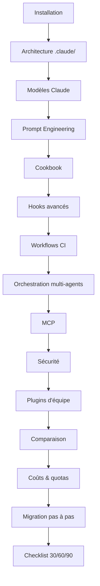

# Claude Code & Migration depuis Copilot

Débutant Intermédiaire Expert IntelliJ VS Code CLI

Ce chapitre vous accompagne pour découvrir **Claude Code**, l'agent de codage d'Anthropic, et migrer progressivement depuis GitHub Copilot — **sans perte de productivité**. De l'installation aux workflows avancés, en passant par une comparaison honnête des deux écosystèmes, vous y trouverez tout pour décider et agir.

!!! info "Claude Code, c'est quoi ?"
    Là où Copilot est né dans l'IDE (complétion fluide, intégration GitHub), Claude Code est né dans le **terminal** : un agent autonome piloté par une configuration **versionnée** (`.claude/`, `CLAUDE.md`). Les deux peuvent même cohabiter dans le même IDE — Copilot pour la complétion inline, Claude pour les tâches d'agent (refactoring, audit, génération de tests).

---

## Contenu du chapitre

- :material-download: **[Installation — CLI, VS Code, JetBrains](installation.md)**

    Débutant

    Installer la CLI (macOS, Linux, Windows), l'extension VS Code et le plugin JetBrains. Authentification, mise à jour, dépannage.

- :material-folder-cog: **[Architecture `.claude/`](architecture-claude.md)**

    Intermédiaire Expert

    Le rôle exact de `CLAUDE.md`, `commands/`, `skills/`, `agents/`, `hooks/` et `settings.json`.

- :material-chip: **[Choisir le bon modèle](modeles-claude.md)**

    Intermédiaire Expert

    Haiku, Sonnet ou Opus : grille de décision par tâche, changement de modèle et impact sur le coût.

- :material-message-processing: **[Prompt Engineering avec Claude](prompt-engineering-claude.md)**

    Intermédiaire Expert

    Référencer le contexte, role prompting durable, workflows multi-étapes et économie de tokens.

- :material-chef-hat: **[Cookbook — recettes prêtes à l'emploi](cookbook.md)**

    Intermédiaire Expert

    Commands, skills, agents et hooks prêts à copier : commit, revue de PR, tests, audit, refactoring.

- :material-hook: **[Hooks avancés](hooks-avances.md)**

    Expert

    Tous les événements, exemples complets (formatage, garde-fous, tests), configuration d'équipe et débogage.

- :material-cog-sync: **[Workflows CI & automatisation](workflows-ci.md)**

    Expert

    `claude -p` en pipeline : revue de PR, notes de version, pré-commit, GitHub Actions et GitLab CI.

- :material-account-group: **[Orchestration multi-agents](subagents-orchestration.md)**

    Expert

    Faire collaborer des subagents spécialisés : patterns d'orchestration, isolation du contexte, modèle par agent.

- :material-connection: **[MCP — sources externes](mcp-sources-externes.md)**

    Expert

    Connecter GitHub, Jira, bases de données et API internes à Claude via le Model Context Protocol.

- :material-shield-lock: **[Sécurité & gouvernance](securite-gouvernance.md)**

    Expert

    Permissions d'outils, hooks de garde, politique de sécurité à 3 niveaux et gestion des secrets.

- :material-package-variant: **[Plugins d'équipe](plugins-equipe.md)**

    Expert

    Packager et partager une configuration `.claude/` cohérente entre tous vos dépôts.

- :material-compare: **[Comparaison Copilot vs Claude](comparaison-copilot-claude.md)**

    Débutant Intermédiaire

    Tableau détaillé, avantages/inconvénients, coûts, et grille de décision (rester / passer / hybride).

- :material-cash-multiple: **[Coûts & quotas](couts-quotas.md)**

    Intermédiaire Expert

    Facturation, comptage des tokens, mesure (`/cost`) et leviers d'économie. Comparaison budgétaire.

- :material-swap-horizontal: **[Migration pas à pas](migration-pas-a-pas.md)**

    Expert

    Convertir vos fichiers Copilot (`instructions`, `prompts`, `agents`, hooks) en configuration Claude.

- :material-calendar-check: **[Checklist 30/60/90 jours](migration-30-60-90.md)**

    Intermédiaire Expert

    Un plan calendaire pour piloter la bascule en équipe avec des points de décision mesurables.

---

## Parcours de lecture recommandé

| Votre besoin | Commencez par |
|--------------|---------------|
| Installer et tester Claude vite | [Installation](installation.md) |
| Structurer un dépôt pour Claude | [Architecture `.claude/`](architecture-claude.md) |
| Choisir Haiku / Sonnet / Opus | [Modèles Claude](modeles-claude.md) |
| Écrire de meilleurs prompts | [Prompt Engineering avec Claude](prompt-engineering-claude.md) |
| Copier des recettes prêtes | [Cookbook](cookbook.md) |
| Automatiser avec des hooks | [Hooks avancés](hooks-avances.md) |
| Brancher Claude dans la CI | [Workflows CI](workflows-ci.md) |
| Orchestrer plusieurs agents | [Orchestration multi-agents](subagents-orchestration.md) |
| Brancher GitHub / Jira / BDD | [MCP — sources externes](mcp-sources-externes.md) |
| Sécuriser et gouverner l'agent | [Sécurité & gouvernance](securite-gouvernance.md) |
| Partager la config entre dépôts | [Plugins d'équipe](plugins-equipe.md) |
| Décider Copilot vs Claude | [Comparaison](comparaison-copilot-claude.md) |
| Maîtriser le budget | [Coûts & quotas](couts-quotas.md) |
| Migrer une équipe existante | [Migration pas à pas](migration-pas-a-pas.md) → [Checklist 30/60/90](migration-30-60-90.md) |

---

## Prochaine étape

**[Installer Claude Code — CLI, VS Code et JetBrains](installation.md)** : mettre en place l'outil sur votre poste avant d'explorer sa configuration et ses workflows.

Concepts clés couverts :

- **CLI native** — installeurs macOS, Linux et Windows, et authentification
- **Extensions IDE** — VS Code et JetBrains qui réutilisent la même configuration
- **Premiers pas** — commandes slash de base et mode non interactif
- **Dépannage** — `claude doctor` et résolution des problèmes courants

