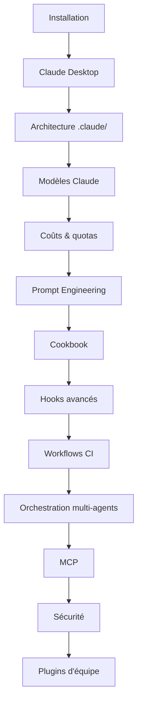

# Claude Code

Débutant Intermédiaire Expert IntelliJ VS Code CLI

Ce chapitre vous accompagne pour découvrir **Claude Code**, l'agent de codage d'Anthropic, et structurer vos usages dans le dépôt : installation, Claude Desktop, configuration du projet et workflows avancés.

---

## Contenu du chapitre

- :material-download: **[Installation — CLI, VS Code, JetBrains](installation.md)**

    Débutant

    Installer la CLI (macOS, Linux, Windows), l'extension VS Code et le plugin JetBrains. Authentification, mise à jour, dépannage.

- :material-monitor: **[Claude Desktop](claude-desktop.md)**

    Débutant Intermédiaire

    Application officielle macOS, Windows et Linux bêta : Chat, Claude Code, travail local, extensions de bureau, deep links `claude://` et articulation avec CLI/IDE.

- :material-folder-cog: **[Architecture `.claude/`](architecture-claude.md)**

    Intermédiaire Expert

    Le rôle exact de `CLAUDE.md`, `commands/`, `skills/`, `agents/`, `hooks/` et `settings.json`.

- :material-chip: **[Choisir le bon modèle](modeles-claude.md)**

    Intermédiaire Expert

    Haiku, Sonnet, Opus ou Fable : grille de décision par tâche, changement de modèle et impact sur l'usage.

- :material-cash-multiple: **[Coûts & quotas](couts-quotas.md)**

    Intermédiaire Expert

    Relier le modèle choisi aux limites d'usage, usage credits, abonnements, API/providers et leviers d'économie.

- :material-message-processing: **[Prompt Engineering avec Claude](prompt-engineering-claude.md)**

    Intermédiaire Expert

    Référencer le contexte, role prompting durable, workflows multi-étapes et économie de tokens.

- :material-chef-hat: **[Cookbook — recettes prêtes à l'emploi](cookbook.md)**

    Intermédiaire Expert

    Commands, skills, agents et hooks prêts à copier : commit, revue de PR, tests, audit, refactoring.

- :material-hook: **[Hooks avancés](hooks-avances.md)**

    Expert

    Tous les événements, exemples complets (formatage, garde-fous, tests), configuration d'équipe et débogage.

- :material-cog-sync: **[Workflows CI & automatisation](workflows-ci.md)**

    Expert

    `claude -p` en pipeline : revue de PR, notes de version, pré-commit, GitHub Actions et GitLab CI.

- :material-account-group: **[Orchestration multi-agents](subagents-orchestration.md)**

    Expert

    Faire collaborer des subagents spécialisés : patterns d'orchestration, isolation du contexte, modèle par agent.

- :material-connection: **[MCP — sources externes](mcp-sources-externes.md)**

    Expert

    Connecter GitHub, Jira, bases de données et API internes à Claude via le Model Context Protocol.

- :material-shield-lock: **[Sécurité & gouvernance](securite-gouvernance.md)**

    Expert

    Permissions d'outils, hooks de garde, politique de sécurité à 3 niveaux et gestion des secrets.

- :material-package-variant: **[Plugins d'équipe](plugins-equipe.md)**

    Expert

    Versionner et partager des skills, agents, hooks et intégrations ; distinguer le plugin des instructions et settings propres à `.claude/`.

- :material-console: **[Cheat sheet — Commandes Claude Code](commandes-claude.md)**

    Commandes `/`, terminal, options CLI, alias et différences de disponibilité.

---

## Parcours de lecture recommandé

```mermaid
graph TD
    I["Installation"] --> D["Claude Desktop"]
    D --> A["Architecture .claude/"]
    A --> MOD["Modèles Claude"]
    MOD --> CO["Coûts & quotas"]
    CO --> P["Prompt Engineering"]
    P --> CK["Cookbook"]
    CK --> HK["Hooks avancés"]
    HK --> CI["Workflows CI"]
    CI --> ORCH["Orchestration multi-agents"]
    ORCH --> MCP["MCP"]
    MCP --> SEC["Sécurité"]
    SEC --> PL["Plugins d'équipe"]
```

| Votre besoin | Commencez par |
|--------------|---------------|
| Installer et tester Claude vite | [Installation](installation.md) |
| Utiliser Claude Code dans l'application de bureau | [Claude Desktop](claude-desktop.md) |
| Structurer un dépôt pour Claude | [Architecture `.claude/`](architecture-claude.md) |
| Choisir Haiku / Sonnet / Opus / Fable | [Modèles Claude](modeles-claude.md) |
| Comprendre l'impact du modèle sur budget et limites | [Coûts & quotas](couts-quotas.md) |
| Écrire de meilleurs prompts | [Prompt Engineering avec Claude](prompt-engineering-claude.md) |
| Copier des recettes prêtes | [Cookbook](cookbook.md) |
| Automatiser avec des hooks | [Hooks avancés](hooks-avances.md) |
| Brancher Claude dans la CI | [Workflows CI](workflows-ci.md) |
| Orchestrer plusieurs agents | [Orchestration multi-agents](subagents-orchestration.md) |
| Brancher GitHub / Jira / BDD | [MCP — sources externes](mcp-sources-externes.md) |
| Sécuriser et gouverner l'agent | [Sécurité & gouvernance](securite-gouvernance.md) |
| Partager la config entre dépôts | [Plugins d'équipe](plugins-equipe.md) |
| Migrer une équipe existante | [Migration pas à pas](migration-pas-a-pas.md) → [Checklist 30/60/90](migration-30-60-90.md) |

---

## Référence en annexe

[Copilot — archive de ce chapitre](../appendices/copilot/chapitre-3b-claude-code-migration-copilot.md#page-chapitre-3b-claude-code-migration-copilot-index).

## Prochaine étape

Poursuivez avec **[Installation (CLI, VS Code, JetBrains)](installation.md)**, la page suivante dans le menu.
