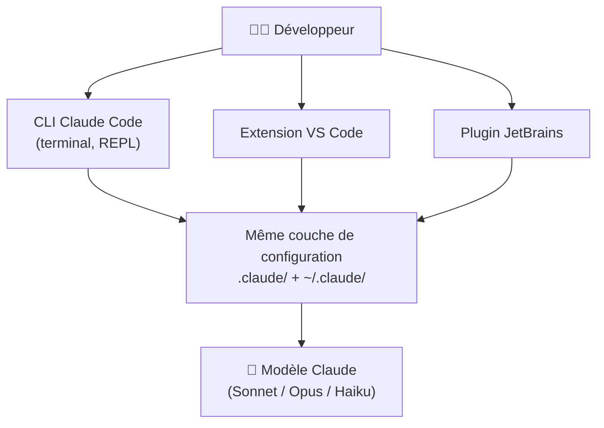

# Installer Claude Code — CLI, VS Code et JetBrains

<span class="badge-beginner">Débutant</span> <span class="badge-intellij">IntelliJ</span> <span class="badge-vscode">VS Code</span> <span class="badge-cli">CLI</span>

Cette page couvre **toutes les méthodes d'installation** de Claude Code, l'agent de codage d'Anthropic : la CLI native (macOS, Linux, Windows), l'extension Visual Studio Code et le plugin JetBrains. Vous y trouverez aussi l'authentification, la mise à jour, le dépannage et la désinstallation.

!!! warning "Vérifiez toujours la commande exacte sur la doc officielle"
    Les URL des scripts d'installation, les identifiants de paquets (WinGet, Homebrew) et les ID d'extension évoluent. Les commandes ci-dessous reflètent l'usage courant de Claude Code, mais **confirmez-les sur la page officielle** [Guide officiel d'installation de Claude Code](https://docs.anthropic.com/en/docs/claude-code/setup) avant de les diffuser en équipe. Voir la section [Sources](#sources).

---

## Vue d'ensemble des points d'entrée



!!! info "Un seul moteur, trois points d'entrée"
    Que vous lanciez Claude depuis le terminal, VS Code ou IntelliJ, **c'est la même CLI sous-jacente** qui s'exécute et lit la même configuration (`.claude/` dans le projet, `~/.claude/` pour l'utilisateur). Installer la CLI d'abord est donc la base de tout.

---

## Prérequis

| Élément | Recommandation | Remarque |
|---------|----------------|----------|
| Système | macOS, Linux, ou Windows | Sur Windows, **Git for Windows** est recommandé ; certaines fonctionnalités tirent profit de WSL |
| Git | Installé et configuré | Claude exploite l'état du dépôt (`git status`, `git diff`) |
| Terminal | PowerShell, bash ou zsh | Pour la CLI et les hooks |
| Compte | Compte Anthropic, abonnement Claude (Pro/Max) **ou** clé API | Voir la section [Authentification](#2-authentification) |
| Node.js | Uniquement pour la méthode npm (historique) | Les installeurs natifs n'en dépendent pas |

!!! tip "Ordre d'installation conseillé"
    1. Installer la **CLI** et l'authentifier.
    2. Valider un premier run sur un petit dépôt.
    3. **Ensuite seulement**, ajouter l'extension IDE. Cela évite de diagnostiquer en même temps des problèmes de CLI et d'IDE.

---

## 1. Installer la CLI

=== "macOS / Linux"

    **Installeur natif (recommandé)** — script shell officiel :

    ```bash
    curl -fsSL https://claude.ai/install.sh | bash
    ```

    **Homebrew (macOS)** — alternative pratique si vous gérez déjà vos outils avec `brew` :

    ```bash
    brew install claude-code
    ```

    Vérifiez l'installation :

    ```bash
    claude --version
    claude doctor   # diagnostic de l'environnement (PATH, auth, dépendances)
    ```

    !!! note "PATH"
        Si la commande `claude` n'est pas reconnue après installation, ouvrez un nouveau terminal ou ajoutez le dossier d'installation (souvent `~/.local/bin` ou `~/.claude/bin`) à votre `PATH`.

=== "Windows"

    **PowerShell (installeur natif)** :

    ```powershell
    irm https://claude.ai/install.ps1 | iex
    ```

    **WinGet** — pour un déploiement reproductible / scripté :

    ```powershell
    winget install Anthropic.ClaudeCode
    ```

    Vérifiez l'installation (dans un **nouveau** terminal) :

    ```powershell
    claude --version
    claude doctor
    ```

    !!! warning "Git et WSL"
        Installez **Git for Windows** pour que Claude lise correctement l'état du dépôt. Pour des workflows Unix avancés (hooks bash, outils POSIX), envisagez **WSL** : lancez alors la CLI depuis votre distribution Linux.

=== "npm (méthode historique)"

    L'installation via npm reste possible mais **n'est plus la méthode recommandée** ; préférez les installeurs natifs ci-dessus (pas de dépendance Node.js, auto-update intégré).

    ```bash
    npm install -g @anthropic-ai/claude-code
    ```

    !!! failure "À éviter en 2026 pour un nouveau poste"
        La voie npm impose de maintenir Node.js à jour et ne bénéficie pas de l'auto-update natif. Utilisez-la seulement si votre politique d'entreprise l'exige.

---

## 2. Authentification

Au **premier lancement**, `claude` déclenche le flux de connexion. Vous pouvez aussi le relancer à tout moment avec la commande slash `/login` depuis le REPL.

```bash
cd mon-projet
claude          # ouvre le mode interactif et propose la connexion
```

### Méthodes d'authentification

=== "Abonnement Claude (Pro / Max)"

    Le plus simple pour un développeur individuel : connectez-vous avec votre compte **claude.ai**. L'usage est inclus dans votre abonnement Pro ou Max (sous réserve des limites du plan).

    - Lancez `claude`, choisissez la connexion via navigateur.
    - Validez l'autorisation dans le navigateur, puis revenez au terminal.

=== "Clé API (Console Anthropic)"

    Pour une facturation à l'usage (API) ou une intégration CI :

    ```bash
    # macOS / Linux
    export ANTHROPIC_API_KEY="sk-ant-..."

    # Windows PowerShell
    $env:ANTHROPIC_API_KEY = "sk-ant-..."
    ```

    !!! danger "Ne committez jamais une clé API"
        Stockez la clé dans une variable d'environnement, un gestionnaire de secrets ou le trousseau de l'OS. **Jamais** en clair dans le dépôt, un `.env` versionné ou `CLAUDE.md`.

=== "Amazon Bedrock"

    Pour router les requêtes via votre compte AWS :

    ```bash
    export CLAUDE_CODE_USE_BEDROCK=1
    # + identifiants AWS (AWS_PROFILE / AWS_ACCESS_KEY_ID, région, etc.)
    ```

=== "Google Vertex AI"

    Pour router les requêtes via Google Cloud :

    ```bash
    export CLAUDE_CODE_USE_VERTEX=1
    # + configuration GCP (projet, région, credentials)
    ```

### Où sont stockées les credentials ?

| OS | Stockage |
|----|----------|
| macOS | Trousseau (**Keychain**) |
| Linux | Fichier dans `~/.claude/` |
| Windows | Fichier dans `%USERPROFILE%\.claude\` (équivalent de `~/.claude/`) |

!!! tip "Vérifier l'état de connexion"
    Dans le REPL, tapez `/status` pour voir le compte actif, le plan, le modèle et la version. `/login` permet de changer de compte, `/logout` de se déconnecter.

!!! info "Premier accès au REPL"
    Le REPL s'ouvre en lançant `claude` sans argument. Tapez `/help` pour voir toutes les commandes disponibles, ou posez directement votre première question en langage naturel.

---

## 3. Premier lancement et commandes de base

Lancez Claude **à la racine du projet** pour qu'il charge automatiquement `CLAUDE.md` et `.claude/settings.json` :

```bash
cd mon-projet
claude
```

Vous entrez dans un **REPL** (Read-Eval-Print Loop — boucle interactive où vous saisissez une requête, Claude l'évalue et affiche une réponse). Quelques commandes slash essentielles :

| Commande | Rôle |
|----------|------|
| `/help` | Liste les commandes disponibles |
| `/init` | Génère un `CLAUDE.md` de départ en analysant le projet |
| `/status` | État du compte, plan, modèle, version |
| `/login` · `/logout` | Gérer l'authentification |
| `/model` | Choisir le modèle (Sonnet, Opus, Haiku…) |
| `/clear` | Vider le contexte de la conversation |
| `/compact` | Résumer/compacter le contexte pour économiser des tokens |
| `/memory` | Gérer la mémoire persistante de Claude (notes entre sessions) |
| `/mcp` | Gérer les serveurs MCP connectés |
| `/cost` | Afficher le coût en tokens de la session |

### Mode non interactif (scripts, CI)

Pour exécuter une requête unique sans ouvrir le REPL :

```bash
claude -p "Résume les changements de ce diff et propose un message de commit"
```

!!! example "Idéal pour l'automatisation"
    Le mode `-p` (print) se branche dans un pipeline : pré-commit, génération de notes de version, revue automatique d'un diff. Combinez-le avec `git diff | claude -p "..."`.

---

## 4. Installer l'extension VS Code

!!! info "La CLI d'abord"
    L'extension VS Code s'appuie sur la CLI. Installez et authentifiez la CLI (sections 1 et 2) **avant** d'ajouter l'extension.

=== "Depuis l'interface"

    1. Ouvrez le **panneau Extensions** (++ctrl+shift+x++ sur Windows/Linux, ++cmd+shift+x++ sur macOS).
    2. Recherchez **« Claude Code »** (éditeur : **Anthropic**).
    3. Cliquez sur **Install**, puis rechargez la fenêtre si demandé.
    4. Une icône Claude apparaît dans la barre latérale.

=== "En ligne de commande"

    ```bash
    code --install-extension anthropic.claude-code
    ```

### Démarrer dans VS Code

- Ouvrez le panneau Claude dans la barre latérale, **ou** la palette de commandes (++ctrl+shift+p++) puis tapez `Claude`.
- L'extension prend en compte le **contexte** : fichiers ouverts, sélection, historique de conversation.
- Elle propose des actions rapides : plan d'implémentation, revue de diff, génération de tests.
- Le **terminal intégré** reste utilisable pour les workflows purement CLI (`claude`).

!!! tip "Cohabitation avec GitHub Copilot"
    Vous pouvez garder Copilot pour la complétion **inline** et utiliser Claude pour les tâches lourdes (refactor, audit). Pour éviter les suggestions concurrentes pendant l'apprentissage, désactivez temporairement l'inline de l'un des deux outils.

---

## 5. Installer le plugin JetBrains (IntelliJ, PyCharm…)

!!! note "Statut bêta"
    Le plugin JetBrains de Claude Code est diffusé en **bêta**. Les fonctionnalités et l'ergonomie évoluent rapidement — vérifiez la [page officielle des IDE JetBrains](https://docs.anthropic.com/en/docs/claude-code/ide-integrations) pour l'état courant.

1. Installez et authentifiez la **CLI** (sections 1 et 2).
2. Dans l'IDE : **Settings/Preferences → Plugins → Marketplace**.
3. Recherchez **« Claude Code »** (éditeur : Anthropic) et cliquez sur **Install**.
4. **Redémarrez** l'IDE.
5. Ouvrez la fenêtre d'outils Claude Code (icône dédiée) et connectez votre compte si demandé.

### IDEs JetBrains compatibles

IntelliJ IDEA, PyCharm, WebStorm, PhpStorm, GoLand, RubyMine, CLion, Rider, Android Studio… (toute la plateforme JetBrains récente).

!!! tip "Deux options sur JetBrains"
    - **Plugin Claude Code (stand-alone)** : terminal Claude intégré + diffs dans l'IDE, léger, orienté CLI.
    - **AI Assistant avec agent Claude** (selon disponibilité) : panneau de chat graphique proche de l'expérience Copilot Chat. Activez AI Assistant dans **Settings → Plugins** et vérifiez que les dépendances **Markdown** et **MCP Server** sont actives.

---

## 6. Mettre à jour et désinstaller

=== "Mettre à jour"

    ```bash
    claude update
    ```

    | Méthode d'installation | Auto-update |
    |------------------------|:-----------:|
    | Installeur natif (curl/PowerShell/WinGet) | ✅ en arrière-plan |
    | Homebrew | ⚠️ via `brew upgrade` |
    | npm | ⚠️ via `npm update -g @anthropic-ai/claude-code` |

=== "Désinstaller"

    ```bash
    # npm
    npm uninstall -g @anthropic-ai/claude-code

    # Homebrew
    brew uninstall claude-code

    # WinGet
    winget uninstall Anthropic.ClaudeCode
    ```

    Supprimez ensuite la configuration utilisateur (`~/.claude/`) si vous voulez repartir de zéro. **Conservez** le dossier `.claude/` de vos projets s'il contient votre configuration d'équipe versionnée.

---

## 7. Dépannage rapide

| Symptôme | Cause probable | Solution |
|----------|----------------|----------|
| `claude: command not found` | Dossier d'installation hors du `PATH` | Ouvrir un nouveau terminal ; ajouter `~/.local/bin` ou `~/.claude/bin` au `PATH` |
| Authentification en boucle | Credentials corrompues | `/logout` puis `/login` ; vérifier l'horloge système |
| L'extension IDE ne trouve pas la CLI | CLI non installée ou hors `PATH` | Réinstaller la CLI ; redémarrer l'IDE |
| `CLAUDE.md` non pris en compte | Lancement hors racine du projet | Lancer `claude` depuis le dossier contenant `.claude/` |
| Diagnostic global | — | `claude doctor` affiche PATH, auth, version et dépendances |

!!! tip "Commande de diagnostic"
    `claude doctor` est votre premier réflexe : il vérifie l'installation, l'authentification, le `PATH` et signale les problèmes courants avant que vous ne perdiez du temps.

---

## Prochaine étape

**[Architecture de configuration `.claude/`](architecture-claude.md)** : comprendre en profondeur les fichiers qui pilotent Claude Code (`CLAUDE.md`, commands, skills, agents, hooks, settings) avant de structurer votre dépôt.

Concepts clés couverts :

- **`CLAUDE.md`** — le fichier « constitution » chargé en continu par la CLI et les IDE
- **commands / skills / agents** — où placer chaque type d'instruction et pourquoi
- **hooks & settings.json** — automatiser et sécuriser les actions de Claude
- **Niveaux de configuration** — projet (`.claude/`) vs utilisateur (`~/.claude/`)

---

## Sources

- [Anthropic — Guide officiel d'installation de Claude Code](https://docs.anthropic.com/en/docs/claude-code/setup) - consulté le 2026-06-20
- [Anthropic — Quickstart](https://docs.anthropic.com/en/docs/claude-code/quickstart) - consulté le 2026-06-20
- [Anthropic — Référence CLI](https://docs.anthropic.com/en/docs/claude-code/cli-reference) - consulté le 2026-06-20
- [Anthropic — Commandes slash](https://docs.anthropic.com/en/docs/claude-code/slash-commands) - consulté le 2026-06-20
- [Anthropic — Intégrations IDE (VS Code et JetBrains)](https://docs.anthropic.com/en/docs/claude-code/ide-integrations) - consulté le 2026-06-20
- [Anthropic — Amazon Bedrock](https://docs.anthropic.com/en/docs/claude-code/amazon-bedrock) - consulté le 2026-06-20
- [Anthropic — Google Vertex AI](https://docs.anthropic.com/en/docs/claude-code/google-vertex-ai) - consulté le 2026-06-20
- [Extension VS Code dans le Marketplace](https://marketplace.visualstudio.com/items?itemName=anthropic.claude-code) - consulté le 2026-06-20
- [Claude Code — Domaine dédié](https://code.claude.com/docs/) - consulté le 2026-06-20


