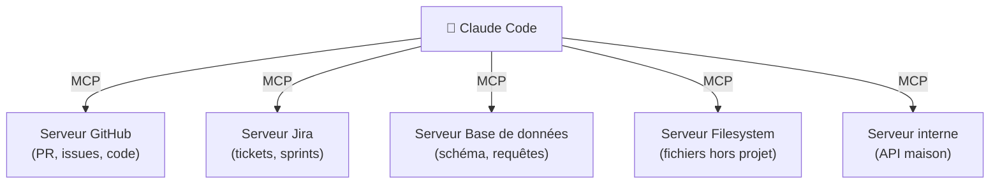
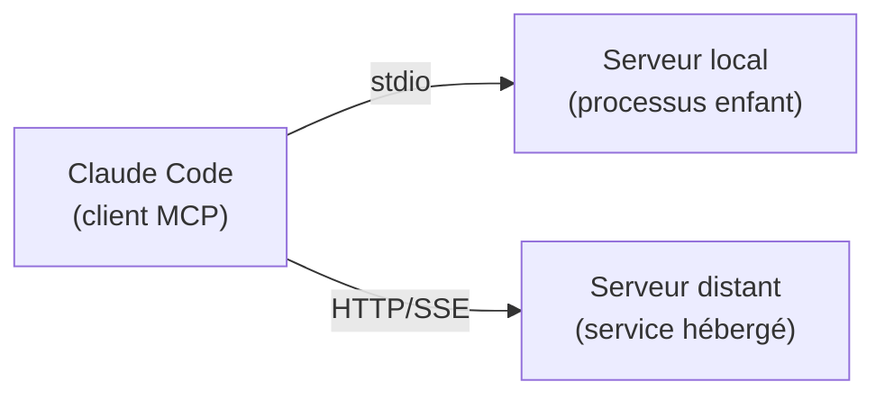
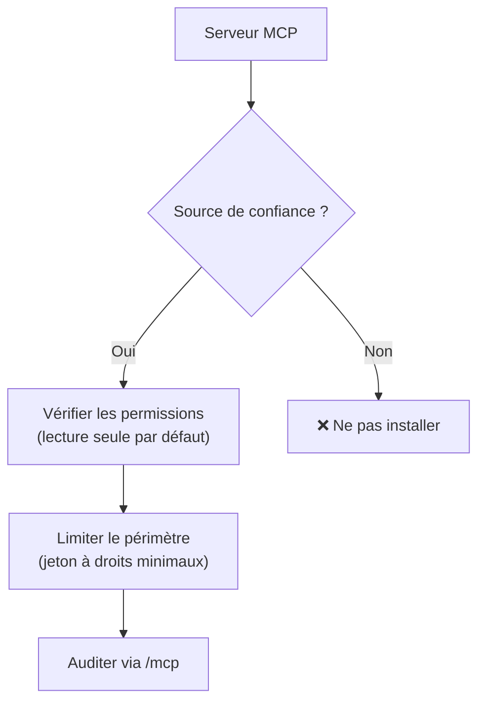

# MCP — connecter des sources externes

<span class="badge-expert">Expert</span> <span class="badge-cli">CLI</span>

Le **Model Context Protocol (MCP)** est un standard ouvert qui permet à Claude Code de dialoguer avec des outils et sources de données externes : dépôts GitHub, tickets Jira, bases de données, systèmes de fichiers, API internes… Au lieu de copier-coller du contexte, Claude **interroge directement la source**.

!!! info "MCP n'est pas propre à Claude"
    MCP est un protocole ouvert (initié par Anthropic) que d'autres outils adoptent, dont GitHub Copilot. Migrer un serveur MCP d'un écosystème à l'autre est donc souvent direct.

---

## Pourquoi MCP ?



| Sans MCP | Avec MCP |
|----------|----------|
| Copier-coller manuel du contexte | Claude interroge la source en direct |
| Contexte vite obsolète | Toujours à jour à la demande |
| Pas d'action sur les systèmes | Claude peut lire **et** agir (selon permissions) |
| Intégrations ad hoc | Protocole standard réutilisable |

!!! tip "Équivalent Copilot"
    MCP est l'équivalent fonctionnel du « contexte externe » de Copilot, mais formalisé et portable : un même serveur MCP fonctionne avec Claude Code et d'autres clients compatibles.

---

## Types de transport

| Transport | Description | Quand l'utiliser |
|-----------|-------------|------------------|
| **stdio** | Le serveur tourne en local, communication par entrée/sortie standard | Outils locaux, scripts, BDD locale |
| **HTTP / SSE** | Le serveur est distant, accessible via HTTP | Services hébergés, API d'équipe |



---

## Configurer un serveur MCP

=== "Via la CLI"

    Ajouter un serveur local (stdio) :

    ```bash
    claude mcp add github -- npx -y @modelcontextprotocol/server-github
    ```

    Ajouter un serveur distant (HTTP) :

    ```bash
    claude mcp add --transport http jira https://mcp.exemple.com/jira
    ```

    Lister / inspecter :

    ```bash
    claude mcp list
    claude mcp get github
    ```

=== "Dans le REPL"

    ```text
    /mcp
    ```

    Affiche les serveurs connectés, leur état, et permet d'autoriser/révoquer.

=== "Fichier de configuration"

    Déclaration dans la configuration MCP du projet (`.mcp.json` à la racine, partagé via Git) :

    ```json
    {
      "mcpServers": {
        "github": {
          "command": "npx",
          "args": ["-y", "@modelcontextprotocol/server-github"],
          "env": { "GITHUB_TOKEN": "${GITHUB_TOKEN}" }
        },
        "postgres": {
          "command": "npx",
          "args": ["-y", "@modelcontextprotocol/server-postgres",
                   "postgresql://localhost/mydb"]
        }
      }
    }
    ```

!!! warning "Jamais de secret en clair"
    Référencez les jetons via des **variables d'environnement** (`${GITHUB_TOKEN}`), jamais en dur dans `.mcp.json` versionné. Voir [Sécurité & gouvernance](securite-gouvernance.md).

---

## Niveaux de portée (scope)

| Portée | Emplacement | Partagé ? | Usage |
|--------|-------------|:---------:|-------|
| **local** | config utilisateur du projet | ❌ | Tests perso, serveurs expérimentaux |
| **project** | `.mcp.json` (racine, versionné) | ✅ | Serveurs communs à l'équipe |
| **user** | config globale `~/.claude/` | ❌ | Serveurs présents sur tous vos projets |

!!! tip "Partager proprement"
    Mettez les serveurs **utiles à toute l'équipe** en portée `project` (`.mcp.json` versionné). Chacun fournit ses propres jetons via variables d'environnement.

---

## Serveurs MCP courants

| Serveur | Ce qu'il apporte | Exemple d'usage |
|---------|------------------|-----------------|
| GitHub | PR, issues, code, Actions | « Résume les PR ouvertes sur ce module » |
| Filesystem | Accès à des fichiers hors projet | Lire une doc d'archi dans un autre dossier |
| PostgreSQL / SQLite | Schéma + requêtes | « Quelles colonnes ne sont jamais lues ? » |
| Jira / Linear | Tickets, sprints | « Génère le code du ticket PROJ-1234 » |
| Sentry | Erreurs en production | « Analyse l'erreur la plus fréquente cette semaine » |
| Puppeteer / Playwright | Navigation web | Tests E2E, scraping de doc |

!!! example "Workflow concret : du ticket au code"
    Avec les serveurs Jira **et** GitHub connectés :

    ```text
    Lis le ticket PROJ-1234 via Jira, propose un plan d'implémentation,
    puis ouvre une PR de brouillon sur GitHub avec le squelette de code.
    ```

---

## Sécurité des serveurs MCP



| Bonne pratique | Pourquoi |
|----------------|----------|
| Jetons à **droits minimaux** | Limiter l'impact d'une fuite |
| Préférer le **lecture seule** quand l'écriture n'est pas requise | Réduire la surface d'attaque |
| **Auditer** régulièrement avec `/mcp` | Repérer un serveur oublié |
| N'installer que des serveurs **de confiance** | Un serveur MCP peut lire/agir avec vos droits |
| Documenter chaque serveur dans `CLAUDE.md` | Traçabilité pour l'équipe |

!!! danger "Un serveur MCP exécute du code avec vos droits"
    Traitez l'ajout d'un serveur MCP comme l'ajout d'une dépendance : vérifiez la source, lisez ce qu'il fait, et accordez le **minimum de permissions** nécessaire. Un serveur malveillant peut exfiltrer des données ou exécuter des actions destructrices.

---

## Prochaine étape

**[Sécurité & gouvernance avec Claude Code](securite-gouvernance.md)** : encadrer Claude (et ses serveurs MCP) avec des politiques de sécurité, des hooks et une gestion stricte des permissions.

Concepts clés couverts :

- **Politique de sécurité à 3 niveaux** — utilisateur, projet, surcharges locales
- **Hooks de garde** — bloquer les actions dangereuses avant exécution
- **Permissions d'outils** — `allow` / `deny` dans `settings.json`
- **Gestion des secrets** — variables d'environnement et exclusions

---

## Sources

- [Anthropic — Model Context Protocol (MCP)](https://docs.anthropic.com/en/docs/claude-code/mcp) - consulté le 2026-06-20
- [Model Context Protocol — Spécification](https://modelcontextprotocol.io) - consulté le 2026-06-20
- [Model Context Protocol — Serveurs de référence](https://github.com/modelcontextprotocol/servers) - consulté le 2026-06-20
- [Anthropic — Claude Code settings](https://docs.anthropic.com/en/docs/claude-code/settings) - consulté le 2026-06-20

